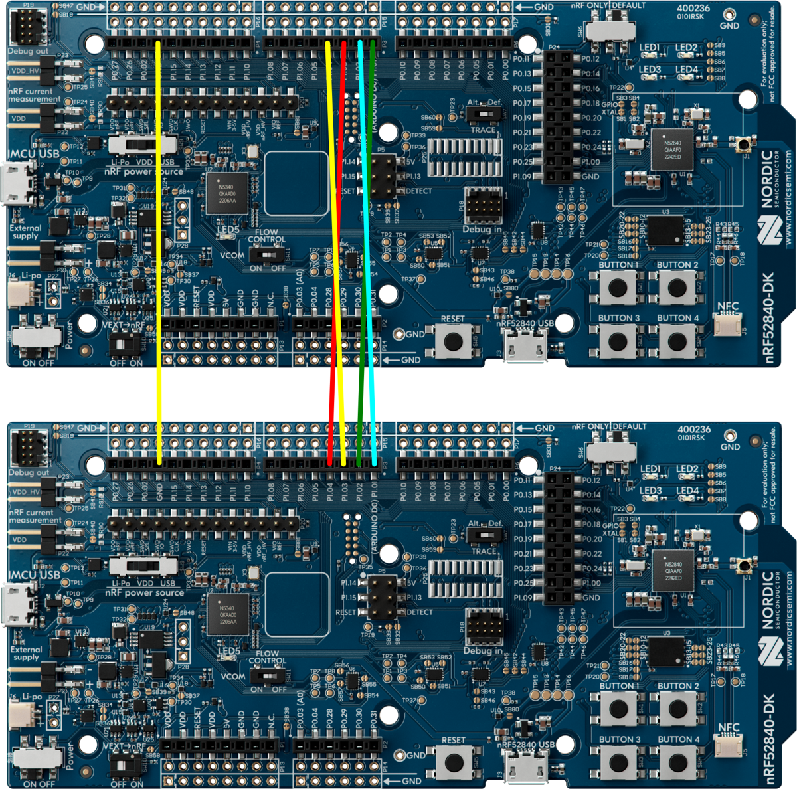
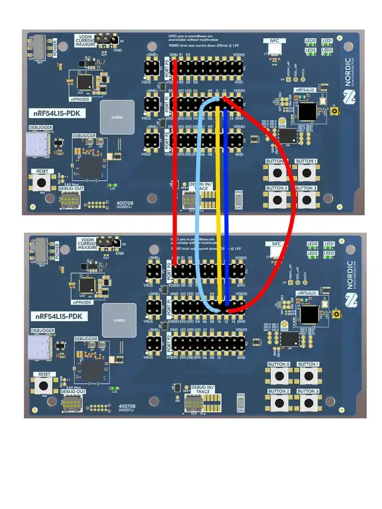
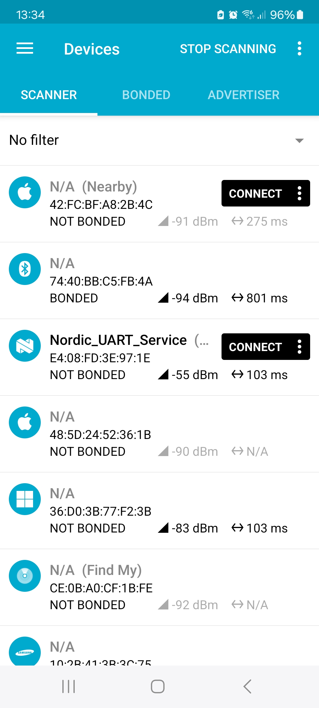
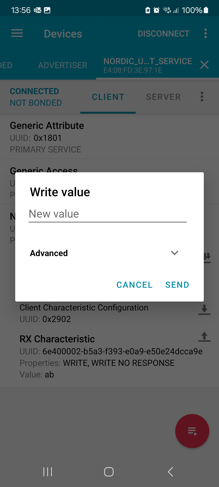

# Protocols serialization applications

- [Protocols serialization applications](#protocols-serialization-applications)
  - [Overview](#overview)
  - [Setting up nRF Connect SDK](#setting-up-nrf-connect-sdk)
  - [Building and flashing applications](#building-and-flashing-applications)
    - [Building and flashing client](#building-and-flashing-client)
    - [Building and flashing server](#building-and-flashing-server)
  - [Connecting client and server](#connecting-client-and-server)
  - [Testing](#testing)
    - [Testing BLE](#testing-ble)
    - [Testing OpenThread](#testing-openthread)


## Overview

Protocols serialization applications demonstrate serialization of OpenThread and Bluetooth LE API calls between two devices that communicate with each other using the UART interface. The applications use nRF RPC library and CBOR encoding to serialize function calls.

The protocols serialization client is a thin client that neither includes OpenThread nor Bluetooth LE stacks. Instead, it provides implementations of selected OpenThread and Bluetooth LE functions that forward the function calls over UART to the protocols serialization server. The client also includes a shell for testing the serialization.

The protocols serialization server runs full Bluetooth LE and OpenThread stacks and it exposes selected functions from these stacks over the UART.

## Setting up nRF Connect SDK

The protocols serialization functionality is currently maintained on the `collab-serial-ble-ot` branch that is based on nRF Connect SDK v2.6.0.

Complete the following steps to check out the branch:

1. Install nRF Connect SDK v2.6.0 with all prerequisites using the steps listed in the [official guide](https://developer.nordicsemi.com/nRF_Connect_SDK/doc/2.6.0/nrf/installation/install_ncs.html).

2. Open a terminal and navigate to the nRF Connect SDK installation directory.

3. Run the following commands to switch the NCS to the `collabl-serial-ble-ot` branch:

   ```
   ~/ncs/nrf$ git fetch origin collab-serial-ble-ot
   ~/ncs/nrf$ west update
   ```

## Building and flashing applications

### Building and flashing client

Complete the following steps to build and flash the client application into an nRF52840 DK:

1. Open a terminal and navigate to the nRF Connect SDK installation directory.

2. Navigate to the client application's directory:

   ```
   ~/ncs/nrf$ cd applications/protocols_serialization/client
   ```

3. Build the client application:

   ```
   ~/ncs/nrf/applications/protocols_serialization/client$ west build -b nrf52840dk/nrf52840 -S "openthread;ble;debug"
   ```

   Note that you can modify the list of enabled features, which by default includes **ble** support as well as **debug** logs.

4. Flash the client application into an nRF52840 DK:

   ```
   ~/ncs/nrf/applications/protocols_serialization/client$ west flash --erase
   ```

   Read [Programming an application](https://developer.nordicsemi.com/nRF_Connect_SDK/doc/latest/nrf/config_and_build/programming.html#programming) to learn more about programming a Nordic Semiconductor's DK.

### Building and flashing server

Complete the following steps to build and flash the server application into another nRF52840 DK:

1. Open a terminal and navigate to the nRF Connect SDK installation directory.

2. Navigate to the server application's directory:

   ```
   ~/ncs/nrf$ cd applications/protocols_serialization/server
   ```

3. Build the server application:

   ```
   ~/ncs/nrf/applications/protocols_serialization/server$ west build -b nrf52840dk/nrf52840 -S "openthread;ble;debug"
   ```

   Note that you can modify the list of enabled features, which by default includes **ble** support as well as **debug** logs.

4. Flash the server application into an nRF52840 DK:

   ```
   ~/ncs/nrf/applications/protocols_serialization/server$ west flash --erase
   ```

   Read [Programming an application](https://developer.nordicsemi.com/nRF_Connect_SDK/doc/latest/nrf/config_and_build/programming.html#programming) to learn more about programming a Nordic Semiconductor's DK.


## Connecting client and server

The nRF52840 system-on-chip includes two UART peripherals: `uart0` and `uart1`. In the protocols serialization applications, the `uart0` peripheral is used for shell and logging purposes, similarly to other applications and samples, while the `uart1` peripheral is used for sending OpenThread and Bluetooth LE remote procedure calls (RPCs).

The `uart1` peripheral is configured to use the following pins:

- **P1.1**: RX
- **P1.2**: TX
- **P1.3**: RTS (hardware flow control)
- **P1.4**: CTS (hardware flow control)

Therefore, in order to enable the communication between the client and the server device, connect the two nRF 52840 DKs using jumper wires according to the following diagram:



The nRF54l15 system-on-chip uses by default `uart21` for RPC and `uart20` is used for shell.

The `uart21` peripheral is configured to use the following pins:

- **P1.10**: RX
- **P1.11**: TX
- **P1.12**: RTS (hardware flow control)
- **P1.13**: CTS (hardware flow control)



## Testing

### Testing BLE

Complete the following steps to test Bluetooth LE API serialization:

1. Install `nRF Connect for Mobile` application on your phone:

   - IOS: https://apps.apple.com/pl/app/nrf-connect-for-mobile/id1054362403
   - Android: https://play.google.com/store/apps/details?id=no.nordicsemi.android.mcp&pcampaignid=web_share

2. Connect to the UART console of the client device using a terminal emulator of your choice.

3. Connect to the UART console of the server device using a terminal emulator of your choice.

4. Reboot **both** devices at the same time using the **IF BOOT/RESET** button on the DK.

5. Wait a few seconds until the following message on both UART consoles:

   ```
   uart:~$ [00:00:03.392,517] <dbg> NRF_RPC: nrf_rpc_init: Done initializing nRF RPC module
   ```

   This indicates that the communication between the devices has been initialized properly.

6. Run the following command on the client's console to start Bluetooth LE advertising:

   ```
   uart:~$ bt init
   uart:~$ bt advertise on
   ```

7. On mobile phone, open `nRF Connect` app and scan for `Nordic_UART_Service` as in the image below:

   

8. Tap **CONNECT** button to connect to the client device.
   Observe the following message on the client's console:

   ```
   LE conn param updated: int 0x0027 lat 0 to 42
   ```

9.  Tap the arrow next to the RX characteristic to send data:

   

   Observe the following message on the client's console:

   ```
   bt_nus: on_receive: Received data, handle 0, conn 0x200023c4
   ```


### Testing OpenThread

Complete the following steps to test OpenThread API serialization:

1. Connect to the UART console of the client device using a terminal emulator of your choice.

2. Connect to the UART console of the server device using a terminal emulator of your choice.

3. Reboot **both** devices at the same time using the **IF BOOT/RESET** button on the DK.

4. Wait a few seconds until the following message on both UART consoles:

   ```
   uart:~$ [00:00:03.392,517] <dbg> NRF_RPC: nrf_rpc_init: Done initializing nRF RPC module
   ```

   This indicates that the communication between the devices has been initialized properly.

5. Run the following command on the client's console to bring the OpenThread interface on the server device up:

   ```
   uart:~$ ot ifconfig up
   Done
   [00:02:28.980,041] <dbg> NRF_RPC: cmd_ctx_alloc: Command context 0 allocated
   [00:02:28.980,102] <dbg> NRF_RPC: nrf_rpc_cmd_common: Sending command 0x00 from group 0x01
   [00:02:28.980,133] <dbg> nrf_rpc_uart: send: Sending frame
                                          80 00 ff 01 01 f6
   ...
   ```

6. Bring the corresponding Zephyr network interface on the client device:

   ```
   uart:~$ net iface up 1
   Interface 1 is up
   ```

7. Verify that the Zephyr network interface has been automatically configured with OpenThread's link-local address:

   ```
   uart:~$ ot ipaddr
   fe80:0:0:0:6c26:956a:813:1e33
   Done
   ...

   uart:~$ net iface  show

   Interface net0 (0x200012c8) (<unknown type>) [1]
   =========================================
   MTU       : 1280
   Flags     : NO_AUTO_START,IPv6,NO_ND,NO_MLD
   Device    : ot_rpc (0x2b748)
   IPv6 unicast addresses (max 5):
           fe80::6c26:956a:813:1e33 autoconf preferred infinite
   ```

8. Start Thread and become a leader:

   ```
   uart:~$ ot thread start
   Done
   ...

   uart:~$ ot state leader
   Done
   ```

9. Verify that the Zephyr network interface has automatically received OpenThread's mesh-local addresses:

   ```
   uart:~$ net iface  show

   Interface net0 (0x200012c8) (<unknown type>) [1]
   =========================================
   MTU       : 1280
   Flags     : NO_AUTO_START,IPv6,NO_ND,NO_MLD
   Device    : ot_rpc (0x2b748)
   IPv6 unicast addresses (max 5):
           fe80::6c26:956a:813:1e33 autoconf preferred infinite
           fdde:ad00:beef:0:e503:abfd:1c8d:2664 autoconf preferred infinite meshlocal
           fdde:ad00:beef::ff:fe00:fc00 autoconf preferred infinite meshlocal
   ```

   This happens because the client registers a notification callback for OpenThread state changes at the server device and it continuously refreshes the client's IPv6 address list when that changes on the server side.

10. Retrieve the operational dataset of the Thread network:

    ```
    uart:~$ ot dataset active -x
    0e080000000000000000000300000b35060004001fffe00208dead00beef00cafe0708fddead00beef00000510f7893f15a55d8adeacad288c38bf32cc030a4f70656e546872656164010240120410d48d777a474f80e61aa5680de764bd6d0c0402a0f7f8
    Done
    ```

11. To send a UDP packet to a peer device and UDP port 5555, run the following command:

    ```
    uart:~$ net udp send fe80:0:0:0:6c26:956a:813:1e34 5555 AAAA
    Message sent
    ```

12. To open a UDP port 5555 and listen for incoming UDP datagrams from peer devices, run the following command:

    ```
    uart:~$ net udp bind fe80:0:0:0:6c26:956a:813:1e33 5555
    ```


