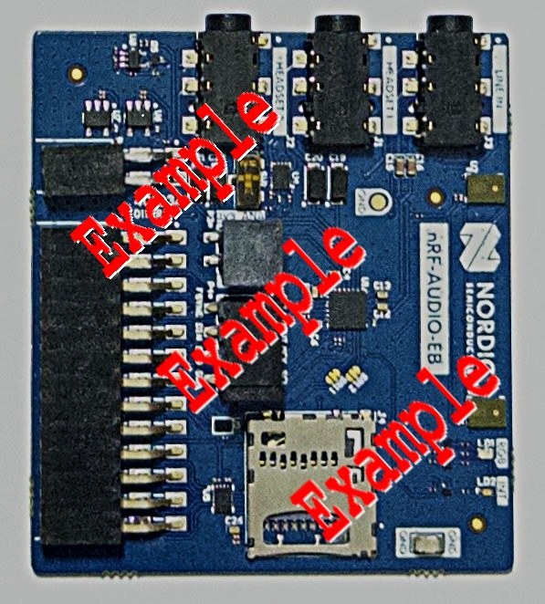

.. _nrf_audio_eb:

nRF Audio EB
##########

Overview
********

The nRF Audio Expansion Board allows you to capture and render audio to/from the host board.
In addition the nRF Audio EB supports SD card, pulse density modulation (PDM) microphone input
and control of the RGB LED.

   nRF Audio EB

Requirements
************

The nRF Audio EB board is designed to fit straight into a Nordic edge-connector and uses I2c, I2s,
SPI and GPIOs as the communication interface. Any host board that supports the Nordic edge-connector
can be used with the nRF Audio EB.

Configuration
*************

The following Kconfig options configure the nRF Audio EB:

* :kconfig:option:`CONFIG_I2S` - Sets the I2S for the TI TAC5112 hardware codec audio input and output.
* :kconfig:option:`CONFIG_I2C` - Sets the I2C for configuring the TI TAC5112 hardware codec.
* :kconfig:option:`CONFIG_SPI` - Sets the SPI for communication with the SD card slot.
* :kconfig:option:`CONFIG_DISK_ACCESS` - Enables the Zephyr Disk Access subsystem.
* :kconfig:option:`CONFIG_DISK_DRIVER_SDMMC` - Enables the Zephyr SD card driver.
* :kconfig:option:`CONFIG_AUDIO_DMIC` - Enables the digital microphone (PDM) through the Audio DMIC API.

Usage
*****

The shield can be used in any application by setting ``--shield nrf_audio_eb``
when invoking ``west build``. You can check : for a
comprehensive sample.
