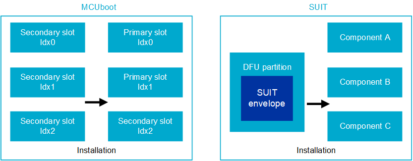

.. _app_bootloaders:
.. _ug_nrf54h20_suit_compare_other_dfu:

Bootloaders and DFU
###################

.. contents::
   :local:
   :depth: 2

Depending on the device, you need to use different bootloader and DFU solutions:

* For the nRF54H Series, use :ref:`Software Updates for Internet of Things (SUIT) <ug_nrf54h20_suit_dfu>`.
  The :ref:`SUIT procedure <ug_nrf54h20_suit_intro>` is the only supported bootloader and Device Firmware Update (DFU) procedure for this device.
* For the remaining Nordic Semiconductor devices, use :ref:`MCUboot and nRF Secure Immutable Bootloader (NSIB) <ug_bootloader_mcuboot_nsib>`.

See the following diagram and table for further comparison.

   MCUboot, SUIT, and |NSIB| architecture comparison

+--------------------------+-------------------------------------------------------------------------+-------------------------------------------------------------------------------------------------------------------+-------------------------------------------------------------------------------------------+
| Characteristic           | MCUboot                                                                 | SUIT                                                                                                              | nRF Secure Immutable Bootloader                                                           |
+==========================+=========================================================================+===================================================================================================================+===========================================================================================+
| Primary function         | Bootloader and DFU                                                      | Flexible, script-based DFU system                                                                                 | Secure Immutable Bootloader                                                               |
+--------------------------+-------------------------------------------------------------------------+-------------------------------------------------------------------------------------------------------------------+-------------------------------------------------------------------------------------------+
| Customization            | Built by users; partitions customized with Kconfig options and DTS.     | SDFW provided by Nordic, delivered in binary form.                                                                | Limited; focused on initial boot security.                                                |
|                          | Kconfig and DTS configurable with multi-image builds or sysbuild.       | Customizable with manifests and configuration.                                                                    |                                                                                           |
|                          | Becomes static post-compilation.                                        |                                                                                                                   |                                                                                           |
+--------------------------+-------------------------------------------------------------------------+-------------------------------------------------------------------------------------------------------------------+-------------------------------------------------------------------------------------------+
| Slot management          | Symmetrical primary and secondary slot style.                           | Single DFU partition; components act as slots.                                                                    | Not applicable for firmware updates.                                                      |
|                          | Primary slot is where the system is executed from (by default).         | The DFU partition size can be located anywhere in the nonvolatile memory, accessible in the application core.     |                                                                                           |
|                          | Secondary slot is the destination for the DFU (by default).             | Information about the location of the DFU is not hardcoded in the SDFW and can be changed between updates.        |                                                                                           |
+--------------------------+-------------------------------------------------------------------------+-------------------------------------------------------------------------------------------------------------------+-------------------------------------------------------------------------------------------+
| Slot characteristics     | Equal primary and secondary slot sizes lead to high memory overhead.    | Single DFU partition with customizable component sizes.                                                           | Highly efficient due to immutable design.                                                 |
+--------------------------+-------------------------------------------------------------------------+-------------------------------------------------------------------------------------------------------------------+-------------------------------------------------------------------------------------------+
| Slot definition          | Static definition; challenging to change post-deployment.               | Technical possibility to change component definitions between updates.                                            | Fixed and immutable; no post-deployment changes.                                          |
+--------------------------+-------------------------------------------------------------------------+-------------------------------------------------------------------------------------------------------------------+-------------------------------------------------------------------------------------------+
| Invocation process       | Limited customization through metadata.                                 | Flexible customization within the manifest (metadata).                                                            | Authenticated firmware execution; no update mechanism post-boot.                          |
+--------------------------+-------------------------------------------------------------------------+-------------------------------------------------------------------------------------------------------------------+-------------------------------------------------------------------------------------------+
| Flash memory layout      | Specific allocations for primary and secondary slots.                   | Single DFU partition with flexible component slots.                                                               | OTP regions for provisioned data; specific layout for boot and application partitions.    |
+--------------------------+-------------------------------------------------------------------------+-------------------------------------------------------------------------------------------------------------------+-------------------------------------------------------------------------------------------+

To learn more, refer to the following documentation pages:

.. toctree::
   :maxdepth: 2
   :caption: Subpages:

   mcuboot_nsib/bootloader_mcuboot_nsib
   qspi_xip_split_image
   dfu_tools_mcumgr_cli
   mcuboot_image_compression
   sysbuild_image_ids
