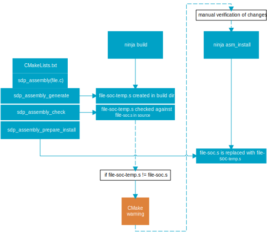

.. _hpf_assembly_management:

Assembly management
###################

.. contents::
   :local:
   :depth: 2

.. caution::

   The High-Performance Framework (HPF) support in the |NCS| is :ref:`experimental <software_maturity>` and is limited to the nRF54L15 device.

Assembly management is a critical component in the development process, particularly when meeting the modularity and testability requirements defined in the :ref:`hpf_event_handling`.

Overview
********

Emulating communication protocols requires precise timing.
To manage this, you must separate the time-sensitive parts of the code, known as Hard Real-Time (HRT) components.
These components have strict timing requirements and are stored in a pre-compiled assembly format to ensure they remain unchanged.

The assembly management CMake functions are integrated into the build process and are executed with every build.
These functions check for any modifications that could lead to the generation of different assembly files, such as changes in HRT source files or the compiler used.
Detecting these changes is essential because they can impact the timing accuracy of software peripherals.
If any changes are detected that could affect the assembly files, you must verify that these differences are within acceptable limits.
This ensures that the new code maintains the necessary timing accuracy.

To use this feature, you must include the command ``hpf_assembly_install(app "${CMAKE_SOURCE_DIR}/file.c")`` in your application's :file:`CMakeLists.txt` file, where ``file.c`` value is the C file containing only Hard Real-Time (HRT) functions.

Although the assembly management functions are called every time in build time, some of them can also be run independently by using CMake targets in VPR core's application build directory.

See the following flow of the build-time assembly management process:

.. _hpf_assembly_management_cmake:

Implementation
**************

The assembly management performed at build time uses following :ref:`CMake<cmake_options>` functions:

* :c:func:`hpf_assembly_generate`
* :c:func:`hpf_assembly_check`
* :c:func:`hpf_assembly_prepare_install`
* :c:func:`hpf_assembly_target_sources`

hpf_assembly_generate
=====================

The :c:func:`hpf_assembly_generate` function creates a build target (asm_gen) that generates a temporary assembly file from HRT source files.
This files is named :file:`file-soc-temp.s` and is located in the Fast Lightweight Peripheral Processor (FLPR) application's build directory when running ``ninja build``.
In the filename, *soc* represents the System on Chip (SoC) name used in the current build, such as ``nrf54l15``.

hpf_assembly_check
==================

The :c:func:`hpf_assembly_check` function sets up a build target (asm_check) that is triggered when executing ``ninja build``, following the :c:func:`sdk_assembly_generate` function.
The target verifies if the :file:`file-soc-temp.s` file in the build directory matches the :file:`file-soc.s` file in the source directory.
If discrepancies are found, it triggers a CMake error (in user mode) or warning (in developer mode).

hpf_assembly_prepare_install
============================

The :c:func:`hpf_assembly_prepare_install` function creates a build target (asm_install) that replaces the :file:`file-soc.s` file in the source directory with :file:`file-soc-temp.s` from the build directory.

hpf_assembly_target_sources
===========================

The :c:func:`hpf_assembly_target_sources` function includes the :file:`file-soc.s` from source directory (user mode) or the :file:`file-soc-temp.s` from build directory (developer mode) in the target sources.

Configuration
*************

You can change the mechanism of :c:func:`hpf_assembly_check` and :c:func:`hpf_assembly_target_sources` functions by switching between user and developer build modes:

* User mode - The application uses a pre-generated assembly file to construct the HRT component.
* Developer mode -  The application employs a newly generated assembly file.
  This approach not only facilitates the integration of updates but also allows for a thorough review of changes made by developers and modifications introduced by the toolchain.
  You can enable it by setting the :kconfig:option:`SB_CONFIG_HPF_DEVELOPER_MODE` Kconfig option, when building for the application core, or :kconfig:option:`CONFIG_HPF_DEVELOPER_MODE`, when building for the FLPR core only.
  If this setting is disabled, files are built in the user mode.

Verifiying assembly files and managing updates
==============================================

When working in user or developer mode, you must verify the integrity and accuracy of assembly files:

* In user mode, if you receive a CMake error from asm_check, evaluate if the differences between :file:`file-soc-temp.s` and :file:`file-soc.s` are minimal and maintain the required timing accuracy.
  Depending on the outcome, do the following:

  * If the differences are acceptable, execute the ``ninja asm_install`` command in the FLPR application's build directory to use the new assembly files.
  * If the differences are significant, investigate and adjust the code, or re-run hardware characterization tests to ensure compliance with the required specifications.

* In developer mode, if you wish to update the source directory with newly generated assembly files, invoke the ``ninja asm_install`` command in the ``build/hpf`` directory.

Running CMake targets
*********************

There are three CMake targets that can be executed:

* asm_gen - Generates new assembly files out of HRT source files.
  This target is established by the :c:func:`hpf_assembly_generate` function.
* asm_check - Checks if newly generated assembly files differ from the existing ones and prints the result to the console.
  This target is established by the :c:func:`hpf_assembly_check` function.
* asm_install - Replaces assembly files in the source directory with newly generated ones, assuming the asm_gen was called before.

You must run all assembly management CMake targets in the VPR application's build directory. They can be executed using the command ``ninja target_name``.
For example, to run the asm_install target, you would use the command ``ninja asm_install``.
