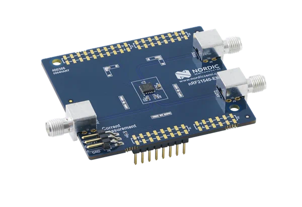

.. _ug_radio_fem_nrf21540ek:

Developing with the nRF21540 EK
###############################

.. contents::
   :local:
   :depth: 2

The nRF21540 :term:`Evaluation Kit (EK)` is an RF :term:`Front-End Module (FEM)` for Bluetooth Low Energy, Bluetooth Mesh, 2.4 GHz proprietary, Thread, and Zigbee range extension.
When combined with an nRF52 or nRF53 Series SoC, the nRF21540 RF FEM's +21 dBm TX output power and 13 dB RX gain ensure a superior link budget for up to 16x range extension.

   nRF21540 EK shield

You can learn more about the nRF21540 EK in the `nRF21540 Front-End Module`_ (including its pin layout) and `nRF21540 EK User Guide`_ hardware documentation.

.. _ug_radio_fem_nrf21540ek_programming:

Building and programming with nRF21540 EK
*****************************************

To build for the nRF21540 EK, build for the compatible :ref:`nRF52 or nRF53 board target <app_boards_names>` with the CMake ``SHIELD`` option set to ``nrf21540ek``.
See :ref:`cmake_options` for instructions on how to provide CMake options.

For example, if you build for nRF52840 DK on the command line, you can use the following command:

.. code-block:: console

   west build -b nrf52840dk/nrf52840 -- -DSHIELD=nrf21540ek

If you use the |nRFVSC|, specify ``-DSHIELD=nrf21540ek`` in the **Extra Cmake arguments** field when `setting up a build configuration <How to work with build configurations_>`_.

Alternatively, add the shield in the project's :file:`CMakeLists.txt` file:

.. code-block:: none

   set(SHIELD nrf21540ek)

Building for a multicore board
==============================

When building for a board with an additional network core, like the nRF5340, add the ``-DSHIELD`` variable with the *childImageName_* parameter between ``-D`` and ``SHIELD`` to build for the network core.
In this case, the application core is only responsible for forwarding to the network core the pins needed to control the nRF21540 EK.
The application core can be set up to forward the needed pins using the ``-DSHIELD=nrf21540ek_fwd`` setting.
For example:

.. parsed-literal::
   :class: highlight

   west build -b nrf5340dk/nrf5340/cpuapp -- -DSHIELD=nrf21540ek_fwd -Dmultiprotocol_rpmsg_SHIELD=nrf21540ek

In this command, the *childImageName_* parameter has the ``multiprotocol_rpmsg_`` value and builds a multiprotocol application with support for 802.15.4 and Bluetooth.
The *childImageName_* parameter can take the following values:

*  ``multiprotocol_rpmsg_`` for multiprotocol applications with support for 802.15.4 and Bluetooth
*  ``802154_rpmsg_`` for applications with support for 802.15.4, but without support for Bluetooth
*  ``hci_ipc_`` for application with support for Bluetooth, but without support for 802.15.4

.. note::
   On nRF53 devices, ``SPIM0`` and ``UARTE0`` are mutually exclusive AHB bus masters on the network core as described in the `Product Specification <nRF5340 Product Specification_>`_, Section 6.4.3.1, Table 22.
   As a result, they cannot be used simultaneously.
   For the SPI part of the nRF21540 interface to be functional, you must disable the ``UARTE0`` node in the network core's devicetree file.

   .. code-block:: devicetree

      &uart0 {
         status = "disabled";
      };
