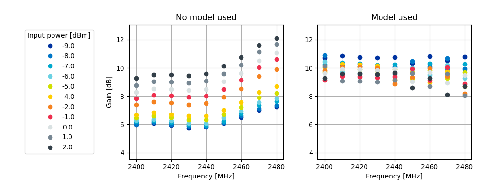
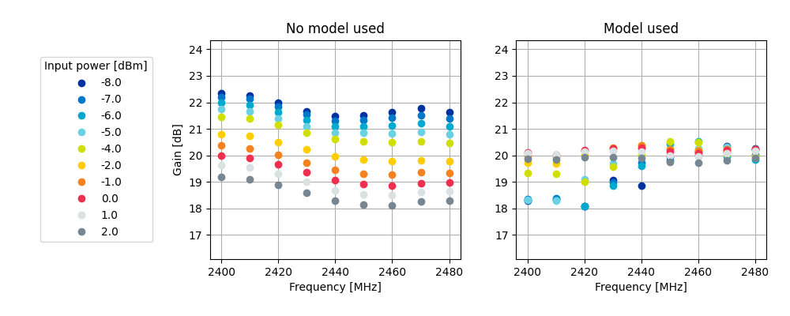
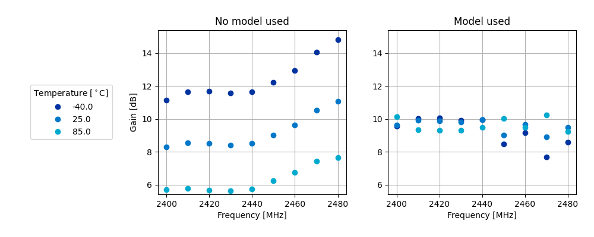
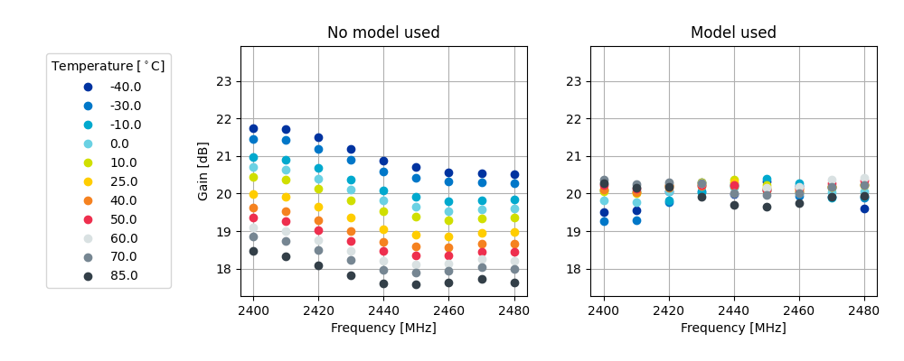
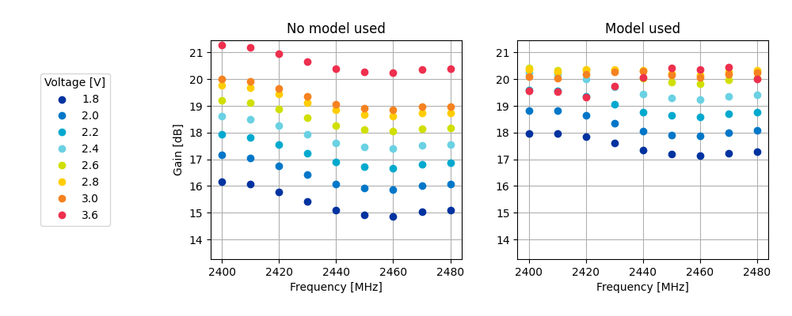

.. _ug_radio_fem_power_models:

Using FEM power models
######################

.. contents::
   :local:
   :depth: 2

When a protocol driver requests a given transmission power to be output, MPSL splits the power into the following components: the SoC Power and the FEM gain.
This gain is considered constant and accurate even if external conditions, such as temperature, might affect the effective gain achieved by the Front-End Module.

To perform the split differently (for example, to compensate for external conditions), you can use a FEM power model, either using one of the built-in ones or providing your own custom model.

To use FEM power models, set the :kconfig:option:`CONFIG_MPSL_FEM_POWER_MODEL` Kconfig option to ``y``  and either select one of the built-in models or provide a custom model, as described in the following chapters.

.. note::
   In case of nRF21540 GPIO+SPI, the :ref:`ug_radio_fem_nrf21540_gpio_spi_builtin_power_model` is enabled by default.

.. _ug_radio_fem_nrf21540_gpio_spi_builtin_power_model:

Using nRF21540 GPIO+SPI built-in power model
********************************************

The nRF21540 GPIO+SPI built-in power model attempts to keep the nRF21540's gain constant and as close to the currently selected value of gain as possible.
The model compensates varying external conditions, which results in the nRF21540 gain being independent of their changes.

.. note::
    Only the factory-precalibrated values of gain represented by the default values of :kconfig:option:`CONFIG_MPSL_FEM_NRF21540_TX_GAIN_DB_POUTA` and :kconfig:option:`CONFIG_MPSL_FEM_NRF21540_TX_GAIN_DB_POUTB` are supported.
    There are no guarantees on the correctness of the model if applied to compensate external conditions for other values of gain.

The nRF21540 built-in power model compensates for the following external conditions:

* Temperature
* FEM supply voltage
* Carrier frequency
* FEM input power.

The model assumes that the FEM supply voltage is constant.
To provide the value of this voltage to the MPSL subsystem, use the ``supply-voltage-mv`` property of nRF21540 devicetree node.

This model is enabled by default, provided that nRF21540 GPIO+SPI is enabled and selected.
To enable and select nRF21540 GPIO+SPI, see :ref:`ug_radio_fem_nrf21540_spi_gpio`.

Although the built-in model significantly improves the performance of nRF21540 in varying external conditions, in certain scenarios you might want to disable it, for example, to save memory.
To disable the model and the resulting compensation, set :kconfig:option:`CONFIG_MPSL_FEM_POWER_MODEL` to ``n``.

The figures below summarize the performance improvement of the nRF21540 when the built-in model is used.
The data points in the figures are results of nRF21540 gain measurements performed in controlled, laboratory conditions.
Each of the figures compares the gain achieved by a nRF21540 device in two cases: when the built-in model is used to control the nRF21540 gain settings, and when the model is disabled.
All the external conditions the model compensates for, like temperature, supply voltage, carrier frequency, and input power, are presented in the figures.

The figures are divided into three groups, each of the group representing performance improvement over frequency and one other external condition for the two factory-precalibrated values of gain.

   Figure 1a. nRF21540 gain vs input power over frequency sweep for 10dB setting

   Figure 1b. nRF21540 gain vs input power over frequency sweep for 20dB setting

   Figure 2a. nRF21540 gain vs temperature over frequency sweep for 10dB setting

   Figure 2b. nRF21540 gain vs temperature over frequency sweep for 20dB setting

.. figure:: images/nrf21540_builtin_model_10db_freq_volt_gain.png
   :align: center
   :alt: Figure 3a. nRF21540 gain vs supply voltage over frequency sweep for 10dB setting

   Figure 3a. nRF21540 gain vs supply voltage over frequency sweep for 10dB setting

   Figure 3b. nRF21540 gain vs supply voltage over frequency sweep for 20dB setting

Adding custom power models
**************************

If the way MPSL splits the TX power into components does not meet your requirements, or if you wish to implement a custom compensation model, you can provide one as follows:

1. Set :kconfig:option:`CONFIG_MPSL_FEM_POWER_MODEL` to ``y``.
#. Provide an implementation of the ``mpsl_fem_power_model_to_use_get()`` function.
   This function should return a pointer to a variable of the type ``mpsl_fem_power_model_t`` which contains pointers to the model's callbacks.
#. Mandatorily implement the model's ``fetch`` callback (details explained below).
#. Optionally implement the model's ``init`` callback (details explained below).
   If no ``init`` callback is provided, pass ``NULL`` as the pointer to the callback.
#. You can also optionally extend the ``MPSL_FEM_POWER_MODEL_CHOICE`` Kconfig choice with an option to select your custom model, for example, if you want to test multiple custom models.

The ``init`` callback is called by MPSL once, after FEM configuration finishes.
Calibration data (acquired from FEM internal registers, Kconfig options, and devicetree files) is passed to this function using a parameter of the ``mpsl_fem_calibration_data_t`` type.
The meaning of the calibration data stored in this parameter is implementation-specific.
For details, see the ``mpsl_fem_calibration_data_t`` type documentation.

The ``fetch`` callback is used to split the power between the SoC output power and the FEM gain.
It is called every time this split needs to be recalculated.
For 802.15.4, this happens before every transmission.
For Bluetooth® Low Energy, this happens every time the channel changes.

.. note::
   This function is called in a time-critical path.
   Please refer to the documentation of ``mpsl_fem_power_model_t`` on timing constraints.
   Any complex calculations have to be done outside this function (for example, using a look up table).
   Failing to meet the timing requirements will lead to an undefined behavior of the protocol stacks.

The ``fetch`` callback must fill out all the fields of the ``p_output`` output parameter.
For more details, see the ``mpsl_fem_power_model_output_t`` type documentation.

.. note::
   The ``soc_power`` field value must be one of the output power values supported by the given nRF SoC, otherwise the behavior is undefined.
   The user can meet this requirement by converting the requested SoC power using the ``mpsl_tx_power_radio_supported_power_adjust`` function.
