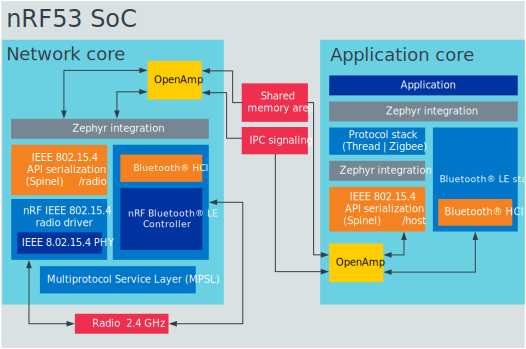

.. _features_nrf53:

Features of nRF53 Series
########################

.. contents::
   :local:
   :depth: 2

The nRF53 Series System-on-Chips (SoC) integrate a high-performance Arm® Cortex®-M33 dual-core processor with a 2.4 GHz RF transceiver, in addition to advanced security features.
All nRF53 Series SoC support Bluetooth® 5.1 and Bluetooth Mesh, in addition to multiprotocol capabilities.

For additional information, refer to the following resources:

* `nRF53 Series`_ for the technical documentation on the nRF53 Series chips and associated kits.
* :ref:`installation` and :ref:`configuration_and_build` documentation to install the |NCS| and learn more about its development environment.
* :ref:`ug_nrf5340_gs` guide for getting started with the nRF5340 DK.
* :ref:`ug_thingy53_gs` for getting started with the Thingy:53.

Dual-core architecture
**********************

The nRF53 Series introduces a dual-core Arm Cortex-M33 architecture, consisting of the following cores:

* An application core for high-performance application execution.
* A dedicated network core optimized for wireless communication efficiency.

The dual-core architecture allows for concurrent execution of application logic and wireless communication tasks.
This ensures that the application processes do not interfere with network operations, enabling IoT with higher responsiveness and reliability.
With one core dedicated to application tasks and the other to connectivity, devices can benefit from optimized performance in both areas.

The separation of application and network functionalities simplifies firmware updates, allowing modifications on one processor without affecting the other.

This architecture is ideal for devices requiring significant data processing alongside continuous wireless connectivity.

.. _ug_nrf5340_intro_net_core:

Network core
============

The network core is an Arm Cortex-M33 processor with a reduced feature set, designed for ultra-low-power operation.
Use this core for radio communication and for real-time processing tasks involving low-level radio protocol layers.

The board target for the network core in Zephyr is ``nrf5340dk/nrf5340/cpunet``.

.. _ug_nrf5340_intro_app_core:

Application core
================

The application core is a full-featured Arm Cortex-M33 processor including DSP instructions and FPU.
Use this core for tasks that require high performance and for application-level logic.

The M33 TrustZone, one of Cortex-M Security Extensions (CMSE), divides the application MCU into Secure Processing Environment (SPE) and Non-Secure Processing Environment (NSPE).
When the MCU boots, it always starts executing from the secure area.

In Zephyr, the firmware of the application core is built using one of the following board targets:

* ``nrf5340dk/nrf5340/cpuapp`` for board targets with CMSE disabled.
* ``nrf5340dk/nrf5340/cpuapp/ns`` for board targets that have CMSE enabled and have the SPE firmware alongside the NSPE firmware.

For information about CMSE and the difference between the two environments, see :ref:`app_boards_spe_nspe`.

Trusted Firmware-M (TF-M)
-------------------------

Trusted Firmware-M provides a configurable set of software components to create a Trusted Execution Environment.
It has replaced Secure Partition Manager as the solution used by |NCS| applications and samples.
This means that when you build your application with CMSE enabled, the :ref:`TF-M <ug_tfm>` is automatically included in the build.
It is a framework for functions and use cases beyond the scope of Secure Partition Manager.

For more information about the TF-M, see :ref:`ug_tfm`.
See also :ref:`tfm_hello_world` for a sample that demonstrates how to add TF-M to an application.

.. _ug_nrf5340_intro_inter_core:

Inter-core communication
========================

Interprocessor Communication (IPC) allows for inter-core communication between the two cores.
Communication between the application core and the network core happens through a shared memory area.
The application core memory is mapped to the network core memory map.
This means that the network core can access and use the application core memory for shared memory communication.
IPC is used to indicate to the other core that there is new data available to pick up.
The actual data exchange is handled by Open Asymmetric Multi-Processing (OpenAMP).

Zephyr includes the `OpenAMP`_ library, which provides a complete solution for exchanging messages between the cores.
The IPC peripheral is presented to Zephyr as an Interprocessor Mailbox (IPM) device.
The OpenAMP library uses the IPM SHIM layer, which in turn uses the IPC driver in `nrfx`_.

Enhanced security features
**************************

In addition to a :ref:`secure bootloader chain <ug_bootloader>` (as in the nRF52 Series), the nRF53 Series incorporates the following within its dual-core architecture:

* Arm TrustZone® for hardware-enforced isolation.
* CryptoCell-312 for encryption, decryption, and cryptographic operations.

These elements provide a platform for secure execution environments and secure data handling.
In addition, the compartmentalization provided by the dual-core setup enables enhanced security measures, with critical operations and sensitive data isolated from general application processes.
Utilizing Arm TrustZone technology on the application processor can further secure devices against tampering and cyber threats.

Supported protocols
*******************

The nRF53 Series supports several protocols, including the following protocols:

* Bluetooth Low Energy
* Thread and Zigbee (IEEE 802.15.4)

.. _ug_nrf5340_protocols:

Protocols and use cases for the nRF5340 DK
==========================================

nRF5340 samples usually consist of two separate images: one that runs on the network core and one that runs on the application core.
For specific use cases, you can use only one of the cores.

The following sections describe the recommended architecture for using different protocols on the nRF5340 and list the provided samples.

Bluetooth Low Energy
--------------------

.. list-table::
   :header-rows: 1

   * - Network core
     - Application core
   * - :zephyr:code-sample:`bluetooth_hci_ipc`
     - | :ref:`Bluetooth Low Energy samples <ble_samples>`
       | :ref:`Bluetooth samples in Zephyr <zephyr:bluetooth-samples>`
   * - :ref:`ble_rpc_host` (supported for development)
     - Some Bluetooth Low Energy samples, for example, :ref:`peripheral_hids_mouse`, :ref:`peripheral_uart` or :ref:`central_uart`

When using Bluetooth® Low Energy on the nRF5340, you have two options:

* Split the Bluetooth LE Controller and the host part of the Bluetooth LE stack and run them on different cores.
* Run the full Bluetooth LE stack on the network core (currently supported for development only).

Split Controller and Host
+++++++++++++++++++++++++

When splitting the Bluetooth LE Controller and the Host, run the Bluetooth LE Controller on the network core and the host part of the Bluetooth LE stack and the application logic on the application core.

For the network core, the |NCS| provides the :zephyr:code-sample:`bluetooth_hci_ipc` sample.
This Zephyr sample is designed specifically to enable the Bluetooth LE Controller functionality on a remote MCU using the `RPMsg Messaging Protocol`_ as a transport for Bluetooth HCI.
The sample implements the RPMsg transport using the `OpenAMP`_ library to communicate with a Bluetooth Host stack that runs on a separate core (in this case, the nRF5340 application core).

You can use either the SoftDevice Controller or the Zephyr Bluetooth LE Controller for this sample.
See :ref:`ug_ble_controller` for more information.

For the application core, the |NCS| provides a series of :ref:`Bluetooth Low Energy samples <ble_samples>`, in addition to the :ref:`Bluetooth samples in Zephyr <zephyr:bluetooth-samples>`.
|multi_image|

.. note::
   Most of the provided Bluetooth LE samples should run on the nRF5340 DK, but not all have been thoroughly tested.

Full Bluetooth LE stack
+++++++++++++++++++++++

To run the full Bluetooth LE stack on the network core, the |NCS| provides the :ref:`ble_rpc_host` sample.

.. note::
   The :ref:`ble_rpc_host` sample is currently supported for development only.
   It does not support all Bluetooth Host APIs yet.

For the application core, use a compatible Bluetooth LE sample, for example, the :ref:`peripheral_hids_mouse`, :ref:`peripheral_uart` or :ref:`central_uart` sample.

Bluetooth Mesh
++++++++++++++

Bluetooth Mesh operates on Bluetooth Low Energy (LE), and is implemented according to Bluetooth Mesh Profile Specification v1.0.1 and Bluetooth Mesh Model Specification v1.0.1.
For the application core, the |NCS| provides several :ref:`bt_mesh_samples`.
In addition, you can find Bluetooth Mesh samples with :ref:`Bluetooth samples in Zephyr <zephyr:bluetooth-samples>`.

IEEE 802.15.4 (Thread and Zigbee)
---------------------------------

.. list-table::
   :header-rows: 1

   * - Network core
     - Application core
   * - :zephyr:code-sample:`nrf_ieee802154_rpmsg`
     - | :ref:`Thread samples <openthread_samples>`
       | :ref:`Zigbee samples <zigbee_samples>`
       | :ref:`Matter samples <matter_samples>`

When using IEEE 802.15.4 on the nRF5340, run the IEEE 802.15.4 radio driver on the network core and the high-level radio stack (the host part of the Thread and Zigbee stacks) and the application logic on the application core.

.. figure:: images/ieee802154_nrf53_singleprot_design.svg
   :alt: IEEE 802.15.4 Protocol architecture in multicore SoC

   IEEE 802.15.4 Protocol architecture in multicore SoC

For the network core, the |NCS| provides the :zephyr:code-sample:`nrf_ieee802154_rpmsg` sample.
This Zephyr sample is designed specifically to enable the nRF IEEE 802.15.4 radio driver and its serialization library on a remote MCU using the `RPMsg Messaging Protocol`_ as a transport for the nRF 802.15.4 radio driver serialization.
The sample implements the RPMsg transport using the `OpenAMP`_ library to communicate with the nRF IEEE 802.15.4 radio driver serialization host that runs on a separate core (in this case, the nRF5340 application core).

For the application core, the |NCS| provides a series of samples for the :ref:`Thread <ug_thread>`, :ref:`Zigbee <ug_zigbee>`, and :ref:`Matter <ug_matter>` protocols.
|multi_image|

Multiprotocol support
=====================

The nRF53 Series supports simultaneous multiprotocol operation with Thread and Zigbee (IEEE 802.15.4), enabled by the dual-core setup.

.. _ug_nrf5340_protocols_multiprotocol:

Multiprotocol support for the nRF5340 DK
----------------------------------------

.. list-table::
   :header-rows: 1

   * - Network core
     - Application core
   * - :ref:`multiprotocol-rpmsg-sample`
     - | :ref:`Thread samples <openthread_samples>`
       | :ref:`Zigbee samples <zigbee_samples>`

nRF5340 supports running another protocol in parallel with the :ref:`nrfxlib:softdevice_controller`.
When using Thread or Zigbee in parallel with Bluetooth LE, run the low-level radio protocol layers (thus the IEEE 802.15.4 radio driver and the Bluetooth LE Controller) on the network core and the high-level radio stack (the host part of the Bluetooth LE, Thread, and Zigbee stacks) and the application logic on the application core.

   Bluetooth LE and IEEE 802.15.4 multiprotocol architecture in multicore SoC

For the network core, the |NCS| provides the :ref:`multiprotocol-rpmsg-sample` sample.
It is a combination of the :zephyr:code-sample:`bluetooth_hci_ipc` sample (for Bluetooth LE) and the :zephyr:code-sample:`nrf_ieee802154_rpmsg` sample (for IEEE 802.15.4).
This means that it enables both the Bluetooth LE Controller and the nRF IEEE 802.15.4 radio driver and simultaneously exposes the functionality of both stacks to the application core using the `RPMsg Messaging Protocol`_.
Separate RPMsg endpoints are used to obtain independent inter-core connections for each stack.

For the application core, the |NCS| provides a series of samples for the :ref:`Thread <ug_thread>` and :ref:`Zigbee <ug_zigbee>` protocols.
|multi_image|
See the :ref:`ug_multiprotocol_support` user guide for instructions on how to enable multiprotocol support for Thread or Zigbee in combination with Bluetooth.

Direct use of the radio peripheral
----------------------------------

.. list-table::
   :header-rows: 1

   * - Network core
     - Application core
   * - | :ref:`direct_test_mode`
       | :ref:`radio_test`
       | :ref:`timeslot_sample`
     - :ref:`nrf5340_empty_app_core`

.. note::
   The above list might not be exhaustive.

Samples that directly use the radio peripheral can run on the network core of the nRF5340.
They do not require any functionality from the application core.

However, on nRF5340, the application core is responsible for starting the network core and connecting its GPIO pins (see :kconfig:option:`CONFIG_SOC_NRF53_CPUNET_ENABLE` and the code in :file:`zephyr/boards/nordic/nrf5340dk/nrf5340_cpunet_reset.c`).
Therefore, you must always program the application core, even if the firmware is supposed to run only on the network core.

You can use the :ref:`nrf5340_empty_app_core` sample for this purpose.
Configure the network core application to automatically include this sample as a child image.
This is the default configuration for the listed network core samples.
For more information, see :kconfig:option:`CONFIG_NCS_SAMPLE_EMPTY_APP_CORE_CHILD_IMAGE` and :ref:`ug_nrf5340_multi_image`.

No radio communication
----------------------
.. list-table::
   :header-rows: 1

   * - Network core
     - Application core
   * - ---
     - | :ref:`NFC samples <nfc_samples>`
       | :ref:`Crypto samples <crypto_samples>`
       | :ref:`tfm_hello_world`
       | :ref:`lpuart_sample`

.. note::
   The above list might not be exhaustive.

Samples that do not need radio communication can run on the application core of the nRF5340.
They do not require any firmware on the network core.
Therefore, the network core can remain empty.

If you want to enable the network core anyway, set the :kconfig:option:`CONFIG_SOC_NRF53_CPUNET_ENABLE` option in the image for the application core.
