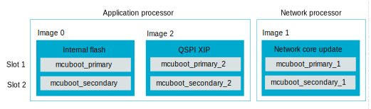

.. _qspi_xip:
.. _ug_nrf5340_intro_xip:

External execute in place (XIP) configuration on the nRF5340 SoC
################################################################

.. contents::
   :local:
   :depth: 2

This guide describes the external execute in place (XIP) support for the nRF5340 SoC.
The nRF5340 SoC is equipped with a Quad Serial Peripheral Interface (QSPI) memory interface, which is capable of exposing QSPI flash as memory for the CPU used to fetch and execute the program code.
The QSPI is available for the application core.
Therefore, it is possible to relocate a part of the application's code to an external memory.
The external flash memory supports on-the-fly encryption and decryption.
NCS supports dividing an application into an internal and external part, along with the MCUboot support.

For more information about QSPI XIP hardware support, the `Execute in place page in the nRF5340 Product Specification`_.

For placing individual source code files into defined memory regions, check the :zephyr:code-sample:`code_relocation_nocopy` sample in Zephyr.

Enabling configuration options
******************************

Application configuration must support an external XIP and image splitting.

Enable the following sysbuild options in a ``sysbuild.conf`` file:

.. tabs::

   .. group-tab:: Swap using move with network core support

      .. code-block:: cfg

         SB_CONFIG_BOOTLOADER_MCUBOOT=y
         SB_CONFIG_PM_EXTERNAL_FLASH_MCUBOOT_SECONDARY=y
         SB_CONFIG_NETCORE_APP_UPDATE=y
         SB_CONFIG_SECURE_BOOT_NETCORE=y
         SB_CONFIG_QSPI_XIP_SPLIT_IMAGE=y

         # This will enable the hci_ipc image for the network core, change to the desired image
         SB_CONFIG_NETCORE_HCI_IPC=y

   .. group-tab:: Swap using move without network core support

      .. code-block:: cfg

         SB_CONFIG_BOOTLOADER_MCUBOOT=y
         SB_CONFIG_PM_EXTERNAL_FLASH_MCUBOOT_SECONDARY=y
         SB_CONFIG_QSPI_XIP_SPLIT_IMAGE=y

Additionally, set the following application options:

* :kconfig:option:`CONFIG_CUSTOM_LINKER_SCRIPT` to ``"<linker_file_for_relocation>"``
* :kconfig:option:`CONFIG_FLASH_INIT_PRIORITY` to ``40`` - You must ensure the QSPI device initialization priority, as it makes the external XIP code accessible before it is executed.
  If any initialization code is expected to be run from the QSPI XIP, then its initialization priority value must be lower than the QSPI device initialization priority.

Setting up QSPI flash
*********************

The QSPI flash DTS must be available for the application and the MCUboot.
You must correctly set up the QSPI flash chip in the board devicetree file, including the operating mode.
The flash chip does not have to run in the QSPI mode for XIP to function, but using other modes will reduce the execution speed of the application.

See the following snippet for an example of the Nordic Thingy:53 configuration that supports DSPI:

.. code-block:: devicetree

        &qspi {
        status = "okay";
        pinctrl-0 = <&qspi_default>;
        pinctrl-1 = <&qspi_sleep>;
        pinctrl-names = "default", "sleep";
        mx25r64: mx25r6435f@0 {
            compatible = "nordic,qspi-nor";
            reg = <0>;
            writeoc = "pp2o";
            readoc = "read2io";
            sck-frequency = <8000000>;
            jedec-id = [c2 28 17];
            sfdp-bfp = [
                e5 20 f1 ff  ff ff ff 03  44 eb 08 6b  08 3b 04 bb
                ee ff ff ff  ff ff 00 ff  ff ff 00 ff  0c 20 0f 52
                10 d8 00 ff  23 72 f5 00  82 ed 04 cc  44 83 68 44
                30 b0 30 b0  f7 c4 d5 5c  00 be 29 ff  f0 d0 ff ff
            ];
            size = <67108864>;
            has-dpd;
            t-enter-dpd = <10000>;
            t-exit-dpd = <35000>;
        };
    };

.. note::
    Due to QSPI peripheral product anomaly, the QSPI peripheral must be ran with the ``HFCLK192MCTRL=0`` setting.
    Any other value may cause undefined operation of the device.

Add the following to the DTS overlay for your board:

.. code-block:: devicetree

    / {
        chosen {
                nordic,pm-ext-flash = &mx25r64;
        };
    };

Setting up static partition manager
***********************************

You need to complete the setup in order to use a static partitioning in your project.
The configuration must have 3 images with 2 slots each:

   Static partitioning slots in the nRF5340 SoC.

* The first set of slots is for the internal flash part of the application.
  These slots should be named ``mcuboot_primary`` and ``mcuboot_secondary``.
* The second set of slots is for the network core update.
  These slots should be named ``mcuboot_primary_1`` and ``mcuboot_secondary_1``.
* The third set of slots is for the QSPI XIP part of the application.
  These slots should be named ``mcuboot_primary_2`` and ``mcuboot_secondary_2``.
  There should also be ``mcuboot_primary_2_pad`` (which should be the same size as ``mcuboot_pad``) and ``mcuboot_primary_2_app``.

This means a basic dual image configuration for the nRF5340 DK needs to describe an external QSPI XIP code partition as ``mcuboot_primary_2`` partition.
Additionally, ensure that:

* The ``mcuboot_primary_2`` address is expressed as the QSPI flash physical address.
* The ``device`` field is the QSPI device name.
* The ``region`` field is set as ``external_flash``.

See the following snippet for an example of the static configuration for partition manager:

.. literalinclude:: ../../../../../samples/nrf5340/extxip_smp_svr/pm_static.yml
    :language: yaml

Configuring linker script
*************************

To relocate code to the external flash, you need to configure a linker script.
The script needs to describe the ``EXTFLASH`` flash memory block to which the code will be linked.
The ``ORIGIN`` of the area can be calculated using following elements:

* The QSPI memory starting with the 0x10000000 internal memory address.
* The offset of an external application part image within the QSPI flash.
  The external application code partition is mapped by the ``mcuboot_primary_2`` PM partition.
* The image header size of the MCUboot image (0x200).

See the following example of the calculation:

.. code-block:: console

    #include <zephyr/linker/sections.h>
    #include <zephyr/devicetree.h>
    #include <zephyr/linker/linker-defs.h>
    #include <zephyr/linker/linker-tool.h>

    MEMORY
    {
        /* This maps in mcuboot_primary_2 partition defined in pm_static.yaml
        * components for ORIGIN calculation:
        *  - 0x10000000: offset of QSPI external memory in SoC memory mapping.
        *  - 0x120000: mcuboot_primary_2 offset in QSPI external memory
        *  - 0x200: image header size.
        * The size of this region is size of mcuboot_primary_2 reduced by the
        * image header size.
        */
        EXTFLASH (wx) : ORIGIN = 0x10120200, LENGTH = 0x3FE00
    }

    #include <zephyr/arch/arm/cortex_m/scripts/linker.ld>

Setting up code relocation
**************************

Relocating code to QSPI XIP is a part of the project's :file:`CMakeLists.txt` file.
You can set up the relocation on a file or library basis using the ``zephyr_code_relocate()`` function.
For example, to relocate a file in the application, use the following configuration:

.. code-block:: console

   zephyr_code_relocate(FILES ${CMAKE_CURRENT_SOURCE_DIR}/src/bluetooth.c LOCATION EXTFLASH_TEXT NOCOPY)
   zephyr_code_relocate(FILES ${CMAKE_CURRENT_SOURCE_DIR}/src/bluetooth.c LOCATION RAM_DATA)

where the first line relocates the XIP code (.text) and the second line relocates the data initialization content section (.data).

Similarly, it is possible to relocate certain libraries, for example:

.. code-block:: console

   zephyr_code_relocate(LIBRARY subsys__mgmt__mcumgr__mgmt LOCATION EXTFLASH_TEXT NOCOPY)
   zephyr_code_relocate(LIBRARY subsys__mgmt__mcumgr__mgmt LOCATION RAM_DATA)

Building the project
********************

Use the standard :ref:`building` procedure.
The XIP QSPI sample supports and uses sysbuild by default.

Programming the project
***********************

For the nRF5340 DK and other boards equipped with flash working in the QSPI mode, use the :ref:`standard programming command <programming>` (``west flash``).
For other cases, set up a configuration file for nrfjprog, as described in the following section.

Programming to external flash in SPI/DSPI mode
==============================================

Programming an application with west triggers the nrfjprog runner.
The runner uses the default system settings that configure the application in the QSPI mode when programming the external flash.
You can change this behavior by using a custom :file:`Qspi.ini` configuration file.

.. note::
    The :file:`Qspi.ini` file is required to work on the Nordic Thingy:53.

This file can specify the mode to use when programming the QSPI flash.
For example, the following code is from the file for the Thingy:53 and uses ``PP`` for programming and ``READ2IO`` for reading:

.. literalinclude:: ../../../../../samples/nrf5340/extxip_smp_svr/Qspi_thingy53.ini
    :language: yaml

To use this file automatically in a project, update the ``CMakeLists.txt`` file by :ref:`adding the mention of the new file <modifying_files_compiler>`.
This way, the file can be applied globally for every board built with a project or applied to specific boards if a project supports multiple board targets, each with different configurations.
The following code shows how to set the configuration file used when flashing the Thingy:53 only.

.. note::
    This code must be placed before the ``find_package`` line.

.. code-block:: cmake

    cmake_minimum_required(VERSION 3.20.0)

    macro(app_set_runner_args)
      if(CONFIG_BOARD_THINGY53_NRF5340_CPUAPP)
        # Use alternative QSPI configuration file when flashing Thingy53
        board_runner_args(nrfjprog "--qspiini=${CMAKE_CURRENT_SOURCE_DIR}/Qspi_thingy53.ini")
      endif()
    endmacro()

    find_package(Zephyr REQUIRED HINTS $ENV{ZEPHYR_BASE})

    project(smp_svr_ext_xip)

.. note::
    The external flash chip must be connected to the dedicated QSPI peripheral port pins of the nRF5340 SoC.
    It is not possible to program an external flash chip that is connected to different pins using nrfjprog.

Troubleshooting
***************

Refer to the following sections for information on how to solve the most common issues.

Module does not appear to start
===============================

When using QSPI XIP, a frequent issue is the module not starting or crashing before the application runs.
This often results from a mismatch in ``init`` priorities between the code on QSPI flash and the QSPI flash device.

To debug this issue, you can use a debugger such as GNU Debugger (GDB) to single-step through the application code until a QSPI address is encountered.
The backtrace functionality can then show which part of the code is responsible for the issue, and you can adjust the ``init`` priority of that module accordingly.

Given that the QSPI flash ``init`` priority defaults to ``41`` at the ``POST_KERNEL`` level, take into account the following points:

* There should be no QSPI flash residing code that has an ``init`` priority value that is less than or equal to the ``POST_KERNEL`` level ``41``.
* No interrupt handlers in the QSPI flash should be enabled until the QSPI flash driver has been initialized.

Module does not boot after update
=================================

This issue can occur if there is a mismatch between the internal flash code and the QSPI XIP code.
Both slots must be running the same build to successfully boot.
The application will fail to boot in the following cases:

* If one of the updates is not loaded.
* If a different build is loaded to one of the slots.
* If one of the loaded updates is corrupt and deleted.

.. _ug_nrf5340_intro_xip_measurements:

Indication of XIP performance
*****************************

The XIP code execution performance measurement was conducted to evaluate the expected performance in different operating conditions.

The :ref:`nrf_machine_learning_app` application running on the nRF5340 DK was used for the testing.
This particular application was used because its application design allows to move the Edge Impulse library to external memory.
There is only one call to the library from the wrapper module, and therefore this call is used to measure the time of execution.
Additional measurements of the current allowed to compare total energy used.

The following table lists performance numbers that were measured under different operating conditions.

.. note::
   The numbers in the table refer to current consumed only by the nRF5340 SoC.
   For complete numbers, you must add the current used by external flash, which varies between manufacturers.

.. _ug_nrf5340_intro_xip_measurements_table:

+-----------------+-----------------+--------+--------------+--------+-----------+--------------------+--------------------+--------------------------+--------------------------+
| CPU frequency   | Memory          | Cache  | QSPI speed   | Mode   | Time [ms] | Current @3.0V [mA] | Current @1.8V [mA] | Total energy @3.0V [µJ]  | Total energy @1.8V [µJ]  |
+=================+=================+========+==============+========+===========+====================+====================+==========================+==========================+
| 64 MHz          | Internal flash  | Yes    | n/a          | n/a    | 63        | 3.2                | 5.1                | 605                      | 578                      |
+-----------------+-----------------+--------+--------------+--------+-----------+--------------------+--------------------+--------------------------+--------------------------+
| 64 MHz          | External flash  | Yes    | 48 MHz       | Quad   | 68.9      | 5.63               | 8.51               | 1164                     | 1055                     |
+-----------------+-----------------+--------+--------------+--------+-----------+--------------------+--------------------+--------------------------+--------------------------+
| 64 MHz          | External flash  | Yes    | 24 MHz       | Quad   | 73.7      | 5.58               | 8.44               | 1234                     | 1120                     |
+-----------------+-----------------+--------+--------------+--------+-----------+--------------------+--------------------+--------------------------+--------------------------+
| 128 MHz         | Internal flash  | Yes    | n/a          | n/a    | 31        | 7.65               | 12.24              | 711                      | 683                      |
+-----------------+-----------------+--------+--------------+--------+-----------+--------------------+--------------------+--------------------------+--------------------------+
| 128 MHz         | External flash  | Yes    | 96 MHz       | Quad   | 34.1      | 8.99               | 14.1               | 920                      | 865                      |
+-----------------+-----------------+--------+--------------+--------+-----------+--------------------+--------------------+--------------------------+--------------------------+
| 128 MHz         | External flash  | No     | 96 MHz       | Quad   | 88.5      | 9.15               | 12.95              | 2429                     | 2063                     |
+-----------------+-----------------+--------+--------------+--------+-----------+--------------------+--------------------+--------------------------+--------------------------+
| 128 MHz         | External flash  | Yes    | 48 MHz       | Quad   | 36.4      | 8.85               | 13.9               | 966                      | 911                      |
+-----------------+-----------------+--------+--------------+--------+-----------+--------------------+--------------------+--------------------------+--------------------------+

Additional information
**********************

For additional information regarding the QSPI XIP mode of |NCS| and how to use it, see :ref:`qspi_xip_split_image`.
