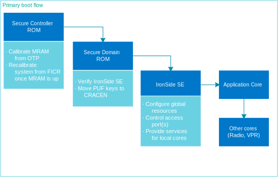
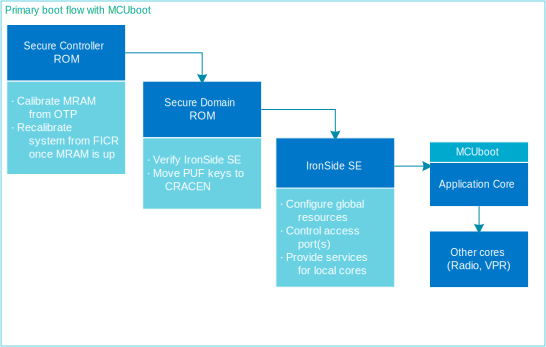
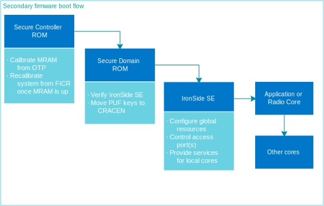

.. _ug_nrf54h20_architecture_boot:

nRF54H20 boot sequence
######################

.. contents::
   :local:
   :depth: 2

The nRF54H20 SoC performs its startup procedure from cold boot on the following events:

 * Power on reset
 * Pin reset
 * System Controller watchdog reset
 * Ctrl-AP reset (debugging Secure Domain or System Controller)
 * Secure Domain reset request
 * Secure Domain watchdog reset
 * Tamper detection

If the system was active and entered the Soft Off sleep state, the system performs the cold boot procedure on the following events:

  * GPIO event
  * LPCOMP event
  * NFC field detection
  * USB VBUS rising
  * Entering the debug interface mode
  * GRTC event

During cold boot the system has no (or little application-defined) state retained in its RAM memory or hardware registers and performs full initialization.

Cold boot features
******************

The nRF54H20 boot sequence has two key features:

* An immutable boot ROM provides the initial :term:`Root of Trust (RoT)`.
  This boot ROM is responsible for verifying the IronSide Secure Element (IronSide SE) signature before allowing the code to be executed.
* The Secure Domain acts as the boot master in the system.
  It completes the allocation of all the global resources before any other local domain is allowed to execute.
  This order of operation is needed for robustness and security of the system.
  It ensures that global resources are allocated for other local domains before any of them has opportunity to access global resources (correct access to allocated resources, or tries of malicious access to resources owned by other domains).

Boot sequence
*************

The Secure Domain boots the System Controller, the application core, and the radio core:

* VPRs (PPR, FLPR) are started by their owners when the owners decide.
* PPR and FLPR are owned by the application core in most applications, but any of them can be reassigned to the radio core.

See the following overview of the boot sequence, where the left-most block indicates what starts first from when power-on reset is applied.

   nRF54H20 default boot sequence

The following is a description of the boot sequence steps:

1. Immediately after reset, the System Controller CPU starts executing code from the ROM memory in the global domain.
   This code performs essential chip-calibration tasks, such as trimming and powering up the MRAM macro, without affecting the runtime services provided by the System Controller firmware.

#. The System Controller ROM powers up the Secure Domain and then halts.

#. The Secure Domain is taken out of reset (as the first local domain), and the Cortex-M33 CPU inside the Secure Domain automatically starts executing code from a local ROM memory.
   As the MRAM is now calibrated and working correctly, the Secure Domain ROM can perform signature verification of the |ISE| components installed into the MRAM.
   The Secure Domain ROM also configures the device according to the current life-cycle state (LCS) and extracts silicon-unique fingerprints from the physical unclonable function (PUF) in GD , retaining this inside CRACEN.

#. If the |ISE| signature is valid, the Secure Domain ROM reconfigures ROM memory as non-executable and non-readable and then branches into the firmware stored in MRAM.
   This is the first step of the primary boot stage where a user-installable firmware component is executed by any CPU in the system.

#. The |ISE| configures and restricts access to all global resources.

#. The System Controller CPU and other local domains are released from reset and in parallel start to execute their respective MRAM firmware components.

#. Each of the local domains is responsible to configure its local resources partitioning.

.. note::
   To better understand the boot process and how the |ISE| works, it is strongly suggested to read the entire :ref:`ug_nrf54h20_ironside` documentation page.

Boot sequence with MCUboot
==========================

The following is an overview of the boot sequence with MCUboot, where the left-most block indicates what starts first from when power-on reset is applied.

   nRF54H20 default boot sequence with MCUboot

Secondary firmware boot sequence
================================

The following is an overview of the boot sequence using the secondary firmware feature of the |ISE|, where the left-most block indicates what starts first from when power-on reset is applied.

   nRF54H20 boot sequence using the secondary firmware

For more information on the secondary firmware feature, see :ref:`ug_nrf54h20_ironside_se_secondary_firmware`.
