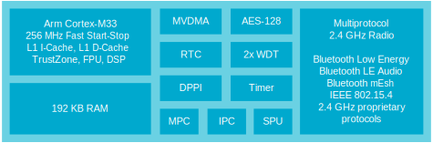

.. _ug_nrf54h20_architecture_cpu:

nRF54H20 domains
################

.. contents::
   :local:
   :depth: 2

The nRF54H20 is partitioned into functional blocks, called *Domains*.
The domains containing the user-programmable main CPUs and associated functions are called *Cores*.
Most memory and peripherals can be flexibly allocated to cores at compile time.
To make this possible, the memory and peripherals are located in a separate area called the Global Domain.
Security functions are centralized into the Secure Domain.

The following image shows the domains in the nRF54H20:

.. figure:: images/nRF54H20_Domains.svg
   :alt: nRF54H20 Domains

   nRF54h20 Domains

The CPU cores in the nRF54H20 are based on two types of CPU architectures:

* Arm Cortex-M33.
* RISC-V (VPR cores).
  The VPR (pronounced “Viper”) is a small, efficient CPU developed by Nordic Semiconductor.
  It is compatible with the RISC-V instruction set.

.. _ug_nrf54h20_architecture_cpu_appcore:

Application core
****************

The following image shows the application core:

   Application core

The application core contains the Arm Cortex-M33 CPU with the highest processing power in the system.
Its purpose is to run the main application.
It is also designed to have the highest active power efficiency, meaning it can run computing-intensive operations at an optimal power consumption.

Due to Dynamic Voltage and Frequency Scaling (DVFS) support and power efficiency optimizations, it takes some time for it to start and stop.
That is why the workloads that require frequent starting and stopping are better suited to run either on the radio core or the PPR and FLPR processors.

Moreover, the clock speed of the processor is very high compared to the low-leakage peripherals running at 16 MHz.
This means that in a code frequently accessing peripheral registers, the application core wastes multiple cycles waiting for the peripherals to respond.
Code requiring a lot of accesses to low-leakage peripherals in the Global Domain is better suited to run on the PPR processor if efficiency is a key concern.

32 kB of local RAM, which is configured like a Tightly Coupled Memory (TCM) and is accessible single-cycle, is provided.
This can be used by timing-sensitive code that cannot tolerate variable latency due to cache hits/misses when accessing memory.

.. note::
   During the initial limited sampling, the firmware to change DVFS settings will not be available, and all code will run at the maximum clock frequency.
   Dynamic switching of voltage and frequency will be enabled at a later date.
   In later versions, developers will be able to select an optimal clock frequency at run time, depending on the task at hand.

Radio core
**********

The following image shows the radio core:

   Radio core

The radio core is intended to run the radio protocol stacks, such as Bluetooth® Low Energy, IEEE 802.15.4, Thread, Enhanced ShockBurst (ESB), or other proprietary protocols.
It is also possible to implement a combination of protocols that use multiprotocol support.

.. note::
   IEEE 802.15.4 will not be supported for the initial limited sampling.

Any remaining processing power of this core can be used for tasks other than the ones required by the radio protocol stacks.

The main CPU in the Radio Domain is an Arm Cortex-M33 running at a fixed clock speed of 256 MHz and is optimized for quick starts and stops, which are frequent in protocol stack workloads.
Other workloads with similar characteristics are also well suited for running on the radio core.

.. note::
   The protocol stack software may need to run at the highest priority to meet its timing requirements.
   If that is the case, the user code needs to run at lower priority.

The radio core has 192 kB of local RAM, making single-cycle memory accesses possible.

For performance reasons, the radio core includes its own AES-128 hardware accelerator for implementing link-layer encryption.
For asymmetric cryptography, it relies on services provided by the Secure Domain.

The radio core is user-programmable, allowing you to modify or add code.
You can also leave the core running Nordic's default protocol stack software and only engage with its high-level interface.

While the Radio CPU or any peripheral in Radio's local APB2 bus (including the radio) is active, the 32 MHz crystal oscillator is enabled, and the radio itself is clocked from this clock source.

Global domain
*************

The global domain contains most of the memory and peripherals of the nRF54H20.
This offers flexibility to assign memory regions and peripherals to different cores.
If this flexibility is not needed, it is possible to use the |NCS| defaults, where most of the memory and peripherals are assigned to the application core.

The global domain includes two sets of power domains:

* The low-leakage power domains runs at a clock speed of 16 MHz and contains the peripherals that do not need a higher clock speed than this.
* The high-speed power domains contains the main memories (MRAM and RAM) and high-speed peripherals that have clock speeds higher than 16 MHz.

Peripheral Processor (PPR)
==========================

The Peripheral Processor (PPR, pronounced “Pepper”) is a VPR core running at 16 MHz located in the low-leakage area of the Global Domain.
It is designed to perform simple I/O-related operations and low-level peripheral handling with lower power and lower latency than the Arm-based processors.

This processor is suitable for the following use cases:

* Reading and aggregating data from sensors.
  Based on data, making decisions on when to wake up the rest of the system.
* Servicing serial ports.
* Coordinating several peripherals to achieve a task.

It has been optimized for using very few clock cycles to service interrupts and can start and stop quickly.
Since the PPR is running from the same clock as the low-leakage peripherals, it does not need to implement any wait cycles to access peripheral registers.

For information on how to use the PPR, see :ref:`ug_nrf54h20_ppr`.

Fast Lightweight Processor (FLPR)
=================================

The Fast Lightweight Processor (FLPR, pronounced Flipper) is a VPR core running at up to 320 MHz, located in the high-speed area of the Global Domain.
This CPU is intended to implement software-defined peripherals.

For information on how to use the FLPR, see :ref:`ug_nrf54h20_flpr`.

.. _ug_nrf54h20_secure_domain:

Secure Domain
*************

The Secure Domain (SecDom) is a dedicated domain which executes a pre-compiled and Nordic Semiconductor-signed firmware component.
It exposes security services to the other cores through an IPC interface.

The Secure Domain has its own CPU, local RAM, and local peripherals to provide background services to the other Cores.
The Secure Domain provides the initial root of trust (RoT), handles all the global resource allocation, acts as a trusted third party (TTP) between other MCU domains, and is used to secure cryptographic operations.
Since the nRF54H platform supports global resource sharing, where memory partitions and peripherals in the global domain can be assigned to different local domains, the Secure Domain Firmware controls this partitioning while also acting as the boot master for the entire system.

IronSide Secure Element (IronSide SE) is part of the nRF54H20 IronSide SE binaries.
It runs on the Secure Domain and exposes security-related services to the Cores in the system located in local domains (like Application and Radio).

For more information on IronSide SE and the nRF54H20 IronSide SE binaries, see :ref:`abi_compatibility` and :ref:`ug_nrf54h20_ironside`.

.. _ug_nrf54h20_secure_domain_cracen:

CRACEN hardware peripheral
==========================

The CRACEN hardware peripheral is a hardware accelerator for cryptographic operations.

On nRF54H20, the CRACEN hardware peripheral is tightly integrated with the Secure Domain.
This means that only the CPU in the Secure Domain can access the CRACEN hardware peripheral and there is no RNG peripheral available to other Cores.

The :ref:`CRACEN cryptographic driver <crypto_drivers_cracen>` uses the hardware peripheral to perform cryptographic operations.
The driver implements the PSA Crypto driver API and then relies on :ref:`Oberon PSA Crypto <ug_crypto_architecture_implementation_standards_oberon>` to implement the :ref:`PSA Crypto API <ug_psa_certified_api_overview_crypto>`.
The :ref:`IronSide Secure Element firmware <ug_nrf54h20_ironside>` relies on the CRACEN driver.

The seed for CRACEN's Isolated Key Generator (IKG) is generated by a Physically Unclonable Function (PUF).
The PUF seed is controlled by the Secure Domain ROM and neither firmware nor applications can read or modify it.
Keys derived by this mechanism are never exposed outside the Secure Domain.

.. _ug_nrf54h20_sys_ctrl:

System Controller
*****************

System Controller is a VPR that implements system startup and power management functionalities that in the past would have been implemented in hardware.
The System Controller Firmware (SCFW) is a component of the IronSide Secure Element (IronSide SE), and it is included in the nRF54H20 IronSide SE binaries.

For more information on the nRF54H20 IronSide SE binaries, see :ref:`abi_compatibility`.

Cores management
****************

In the nRF54H20, the cores can be divided into the following groups: cores that are programmable by the user, by Nordic, or by both.

Cores managed by Nordic Semiconductor
   Secure Domain and System Controller are cores that are exclusively managed by Nordic Semiconductor.

   The firmware for cores managed by Nordic will come as part of the |NCS|.
   This means that the components can be modified by Nordic Semiconductor only.

Cores managed by the user and Nordic Semiconductor
   Firmware for the radio core will come as part of the |NCS|.
   You can either use the default Nordic’s radio core firmware, modify it, or provide a custom implementation.
   If you rely on Nordic to provide the firmware, the default correct controller library will be used depending on the short-range protocol selected in the software configuration.

Cores managed by the user
   Although there are multiple distinctive cores in the system, you will be responsible mostly for preparing the firmware for the application core.
   If the application firmware is executed in non-secure mode, the secure firmware (TF-M) is delivered as part of the |NCS|.

   You can choose to move some of the processing from the application core to the Peripheral Processor (PPR) or to the Fast Lightweight Processor (FLPR).
