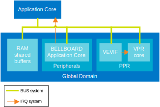

.. _ug_nrf54h20_architecture_ipc:

Interprocessor Communication in nRF54H20
########################################

.. contents::
   :local:
   :depth: 2

Interprocessor communication (IPC) is the communication between different CPUs (and domains).
The nRF54H20 includes several types of CPUs that are optimized for different types of workloads.
This provides an asymmetric multiprocessing environment where you can freely select the CPU that is best suited to the workloads that compose your application.

Interprocessor Communication is required in asymmetric multiprocessing environments to share services' requests, responses, and data between processors.

The following sections describe the communication protocol used for IPC in |NCS| for the nRF54H20 SoC.
They also include an overview of the connection scheme between the cores available in the system.

Technical solution
******************

A single Interprocessor Communication instance used in the nRF54H20 SoC allows full-duplex communication between two cores.
It support only unicast messages.

To communicate with multiple peers, a core requires multiple IPC instances, at least as many as the number of peers.
It is possible to create multiple IPC instances towards a single peer to separate messages with different priority levels.
The number of IPC instances which might be created is limited by the available hardware resources (numbers of channels in the signaling peripherals).

The Interprocessor Communication can be described using the OSI model.
See the following figure:

Physical layer
==============

The physical layer used by IPC in the nRF54H20 SoC consists of shared RAM and signaling peripherals.

The shared RAM must be accessible (both for reads and writes) by both cores using this RAM region for communication.
See :ref:`General-purpose shared RAM (RAM0x)<ug_nrf54h20_architecture_memory_gp_shared_ram>` for a description of shared RAM and its placement in the memory map.

Signaling peripherals are the hardware peripherals which can be used by one core to trigger an IRQ in another core.
Each ARM Cortex-M33 core in nRF54H20 has an associated BELLBOARD signaling peripheral.
Each VPR core in nRF54H20 has an associated VEVIF signaling peripheral:

* When a core signals an IRQ to its ARM Cortex-M33 peer, it uses the BELLBOARD associated with the peer.
* When a core signals an IRQ to a VPR peer, it uses the VEVIF associated with the peer.
* When a core receives an IRQ signal, it uses the BELLBOARD or the VEVIF associated with it, regardless which peer originated the signal.

Each VEVIF and BELLBOARD has multiple channels.
The peer originating the signal is recognized with a channel number associated with the peer.
The channel numbers association is presented in the following table:

============================  ==========
Signal originator             Channel id
============================  ==========
SecDom                        0
SecDom: signal to a debugger  1
System Controller             6
Application                   12
Radio                         18
============================  ==========

Some of the channels in BELLBOARDs and VEVIFs are interpreted differently by other receivers.

The following tables show signals received only by specified cores.

   Secure Domain core:

      ============================  ==========
      Signal originator             Channel id
      ============================  ==========
      System Controller's debugger  7
      Application's debugger        13
      Radio's debugger              19
      ============================  ==========

   Application core:

      This assignment applies only when PPR and FLPR owner is set to the Application.

      =================  ==========
      Signal originator  Channel id
      =================  ==========
      PPR                12
      FLPR               13
      =================  ==========

   Radio core:

      This assignment applies only when BBPROC owner is set to the Radio.

      =================  ==========
      Signal originator  Channel id
      =================  ==========
      BBPROC             18
      =================  ==========

Some of the channels in BELLBOARDs and VEVIFs are reserved for functions different from IPC.

MAC, Network, Transport
=======================

The layers responsible for maintaining a stable full-duplex stream of data between two cores (MAC, Network, Transport) are implemented in an IPC transport library.
The default IPC transport library for nRF54H20 is :ref:`ICMsg <zephyr:ipc_service_backend_icmsg>`.
This lightweight library maintains the connection between a pair of cores for each IPC instance with minimal memory overhead.
Each IPC instance between the application core and the PPR core requires an instance of the ICMsg library.
Each IPC instance between the application core and cores other than PPR (like the radio core) requires an instance of the ICBMsg library.

Each ICMsg library instance requires the following:

   * One memory buffer for A->B messages.
   * One memory buffer for B->A messages.
   * A pair of signaling channels (one for A->B, one for B->A).

The ICMsg library is designed to efficiently send short messages to a peer.
Its buffer allocation is not optimized for bulk transfer of long messages and it does not provide a zero-copy model.
To transfer bigger amount of data (like network packets) between two cores, ICMsg can be used as control plane.
However, you must use as data plane memory allocation mechanisms optimized for bigger data and supporting flexible memory allocation and a zero-copy model (like Zephyr's :ref:`zephyr:net_buf_interface`).

.. note::
   The memory allocation mechanism for the data plane is a single-core memory allocation working on shared memory buffers.
   It does not have to involve another IPC transport.
   The ownership of the shared buffers is passed between the cores using the control plane, but only one of the cores is responsible for managing (allocating, resizing, freeing) the buffers.

For more information on ICMsg, consult the :ref:`ICMsg <zephyr:ipc_service_backend_icmsg>` backend documentation.
For more information on ICBMsg, consult the :zephyr:code-sample:`ipc_multi_endpoint` page.

Session
=======

The IPC session establishment in the nRF54H20 SoC is performed by the :ref:`IPC service <zephyr:ipc_service>` library.
This library provides a unified API for IPC transports and it integrates specific transports as its backends.
ICMsg is integrated as one of the available IPC service backends.
The library is responsible for creating IPC instances based on the system configuration described in the devicetree.

It is recommended to use the ipc_service API to perform inter-processor communication in the nRF54H20 SoC.

For more information, consult the :ref:`IPC service <zephyr:ipc_service>` library documentation.

Presentation and Application layers
===================================

The presentation and application layers are connection specific.
Each connection has other requirements regarding the type and the nature of the exchanged messages.

The solutions selected for each connection are listed in the following table:

======================  =====================
Connection              Communication library
======================  =====================
System Controller       nrfs
Secure Domain           RPC (:ref:`nrfxlib:nrf_rpc`)
Radio Bluetooth         HCI or :ref:`nrfxlib:nrf_rpc`
Radio 802.15.4          Spinel
PPR with event_manager  :ref:`event_manager_proxy`
======================  =====================

IPC connections scheme
**********************

The following figures show the IPC connection schemes in the nRF54H20 SoC:

Radio core
==========

The Radio core exposes radio communication services to the application core through IPC.
These services include:

   * Bluetooth® (HCI or host API)
   * IEEE 802.15.4 radio driver API

These services are hidden behind Zephyr APIs available in the application core, like the Bluetooth host API or the IEEE 802.15.4 driver API.
All services can be enabled simultaneously using separated endpoints in a shared IPC instance.
You can implement other services running in the radio core and expose them to the application core using more endpoints from the shared IPC instance.

Secure Domain core
==================

The Secure Domain core exposes security-related services to the other local cores in the system (Application, Radio).
The list of services also includes:

   * Key management
   * Secure storage
   * Cryptography

     * Cryptographically Secure Pseudo Random Number Generator

   * Device Firmware Upgrade
   * Debugger access management
   * Reset notifications
   * Encrypted core dumps

System Controller
=================

The System Controller exposes the following services to local cores (Application, Radio, Secure Domain) through IPC:

   * Clocks accuracy notification and calibration requests
   * MRAM latency management (related to power management)
   * CPU frequency management (using Dynamic Voltage and Frequency Scaling)
   * Die temperature service
   * L2CACHE performance
   * Power output service

Fast Lightweight Processor (FLPR)
=================================

The Fast Lightweight Processor (FLPR) exposes IPC communication for its owner to manage its operations.
The communication details depends on the FLPR role in the system.

Peripheral Processor (PPR)
==========================

The Peripheral Processor (PPR) exposes IPC communication for its owner to manage its operations.
The communication details depends on the PPR role in the system.

In the :ref:`nrf_machine_learning_app` application, PPR uses an :ref:`event_manager_proxy` through IPC to extend the Event Manager framework running in the application core.
