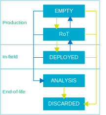

.. _ug_nrf54h20_architecture_lifecycle:

nRF54H20 SoC lifecycle states
#############################

.. contents::
   :local:
   :depth: 2

:term:`Lifecycle states (LCS)` control device security features and debug access.
Each state specifies when and how the device allows the following operations:

* Provision or replace security assets, for example, root keys, certificates, and configuration
* Enable or disable debug access (open, authenticated, or permanently disabled)
* Enforce secure boot and prevent rollback
* Perform failure analysis (RMA) handling
* Sanitize the device before disposal

Available LCS
*************

The Secure Domain ROM implements lifecycle states for the nRF54H20 SoC.
The states are based on the Arm PSA Security Model and enable safe programming and erasure of device assets.

The LCS available are the following:

.. list-table:: nRF54H20 lifecycle states
   :header-rows: 1
   :align: center
   :widths: auto

   * - LCS
     - Supply chain stage
     - Description
   * - EMPTY
     - Production
     - RAM empty and Secure Domain Firmware unprogrammed.
   * - Root of Trust
     - Production
     - Secure Domain Firmware and certificates provisioned.
   * - DEPLOYED
     - In-field
     - Secure Domain debug access port is locked, and unlock is only possible using an authenticated operation.
   * - ANALYSIS
     - End-of-life
     - All device assets in MRAM are erased to allow for Nordic RMA procedures.
   * - DISCARDED
     - End-of-life
     - All device assets in MRAM are erased.

See the following diagram:

   nRF54H20 lifecycle states and transitions available on the nRF54H20 SoC.

Transitioning LCS
*****************

You can change the SoC lifecycle state to streamline development and testing:

* During application development, set the SoC to the ``Root of Trust`` (RoT) state.
* To validate behavior in a production environment, use the ``DEPLOYED`` state.

If the device is in LCS ``EMPTY``, transition it to LCS ``RoT`` by following the :ref:`nRF54H20 DK bring-up <ug_nrf54h20_gs_bringup>` procedure.

.. caution::
   You can only progress forward through lifecycle states.
   This means that the transition from ``EMPTY`` to ``RoT`` is permanent and cannot be reversed.
   Each forward transition increases protection and reduces invasive debug options.

Additional information
**********************

For more information, see the following pages:

* :ref:`ug_nrf54h20_gs` - nRF54H20 DK bring-up and initial setup guide
* :ref:`ug_nrf54h20_custom_pcb` - Guidelines for designing a custom PCB
* :ref:`ug_nrf54h20_keys` - Provisioning and managing security keys
* :ref:`ug_nrf54h20_ironside` - |ISE| how-to guide, specifically the :ref:`ug_nrf54h20_ironside_se_update` section containing instructions for updating the |ISE| firmware
