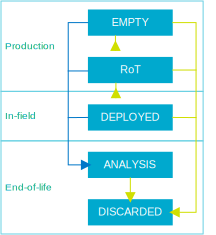

.. _ug_nrf54h20_architecture_lifecycle:

nRF54H20 SoC lifecycle states
#############################

.. contents::
   :local:
   :depth: 2

:term:`Lifecycle states (LCS)` are persistent configurations, enforced by the Secure Domain ROM, that control device security features and access-port control.
Each LCS specifies when and how the device allows the following operations:

* Provision or replace security assets, for example, root keys, certificates, and configuration.
* Enable or disable access-port permissions (open, authenticated, or permanently disabled).
* Enforce secure boot and prevent rollback.
* Perform failure analysis (RMA) handling.
* Sanitize the device before disposal.

Available LCS
*************

The Secure Domain ROM implements lifecycle states for the nRF54H20 SoC.
The states are based on the Arm PSA Security Model and enable safe programming and erasure of device assets.

In the following table, *Standard product path* indicates whether the LCS is part of the normal nRF54H20 product deployment path (``Yes``) or is used only for end-of-life (EoL) or other special handling (``No``).

.. list-table:: nRF54H20 lifecycle states
   :header-rows: 1
   :align: center
   :widths: auto

   * - LCS
     - Standard product path
     - Summary
   * - ``EMPTY``
     - ``Yes``
     - MRAM is empty. The Secure Domain access port is open for programming the device.
   * - Root of trust (``RoT``)
     - ``Yes``
     - The Secure Domain access port is closed, and the Secure Domain ROM verifies the SDFW before booting. Local domain access ports are open unless closed by UICR configuration.
   * - ``DEPLOYED``
     - ``Yes``
     - Secure domain access ports closed. The Secure Domain operates as in ``RoT``. Typical shipping state.
   * - ``ANALYSIS``
     - ``No``
     - Allows Nordic to perform RMA procedures on field returns. All device assets in MRAM are erased on transition to this state.
   * - ``DISCARDED``
     - ``No``
     - Terminal LCS. Allows safely discarding the device. All device assets in MRAM are erased on transition to this LCS.

PSA and Secure Domain LCS mapping
=================================

The following table maps Arm PSA lifecycle terms to the nRF54H20 SoC lifecycle states:

.. list-table:: Arm PSA and Secure Domain lifecycle mapping table
   :header-rows: 1
   :align: left
   :widths: auto

   * - Arm PSA LCS
     - Secure Domain LCS
   * - ``ASSEMBLY_AND_TEST``
     - ``EMPTY``
   * - ``PSA_ROT_PROVISIONING``
     - ``RoT``
   * - ``SECURED``
     - ``DEPLOYED``
   * - ``NORDIC_ANALYSIS``
     - ``ANALYSIS``
   * - ``DECOMMISSIONED``
     - ``DISCARDED``

LCS transitions
***************

The following diagram shows the available LCS transitions:

   nRF54H20 lifecycle states and transitions available on the nRF54H20 SoC.
   Blue arrows indicate authenticated transitions.

Lifecycle state details
***********************

The following sections describe the behavior and transition use of each LCS in more detail.

Using the nRF54H20 SoC on the intended secure path requires forward LCS progression: you must provision your device by transitioning from LCS ``EMPTY`` to LCS ``RoT``, and you typically use LCS ``DEPLOYED`` for products that ship with production locking.

.. caution::

   You can only progress forward through lifecycle states.
   The transition from ``EMPTY`` to ``RoT`` is permanent and cannot be reversed.
   Each forward transition increases protection and reduces invasive access options.
   Re-running initial provisioning and policy configuration after you reach ``DEPLOYED`` is not supported.

.. _ug_nrf54h20_lcs_empty:

``EMPTY``
=========

In this state, all MRAM contents are empty, and the Secure Domain access port is open for programming the device.
LCS ``EMPTY`` is a provisioning state, not a long-term operating mode: remain there only as long as needed to provision the device and perform the one-way transition to ``RoT``.

Before you can move from LCS ``EMPTY`` to LCS ``RoT``, the signed SDFW must already be installed on the device: use the :ref:`IronSide SE provisioning step <ug_nrf54h20_gs_bringup_soc_bin>` while the part is still in LCS ``EMPTY``.
If you request the LCS change to ``RoT`` without a valid, provisioned SDFW, the request fails and the device stays in LCS ``EMPTY``.

.. _ug_nrf54h20_lcs_rot:

``RoT``
=======

In this state, the Secure Domain access port is closed, and the Secure Domain ROM verifies the SDFW and only boots the device when verification succeeds.
Local domain access ports are open unless closed by UICR configuration.

.. _ug_nrf54h20_lcs_deployed:

``DEPLOYED``
============

In this state, the Secure Domain operates as in ``RoT``.
Transition to ``DEPLOYED`` before deploying the device in production.

.. note::
   Factory and production tests often rely on local domain access ports.
   Keep the local domain access ports open in the UICR until you have finished all the necessary testing.
   Only then lock the local domain access paths as part of the production-hardening flow.

   For more information on UICR and access-port hardening, see :ref:`ug_nrf54h20_ironside_se_production_ready_protection`.

.. _ug_nrf54h20_lcs_analysis:

``ANALYSIS``
============

This state allows Nordic to perform RMA and failure-analysis procedures on field returns.
All device assets in MRAM are erased on transition to this state.

.. _ug_nrf54h20_lcs_discarded:

``DISCARDED``
=============

This is a terminal lifecycle state.
It allows the device to be discarded safely.
After the transition, the device is irreversibly disabled and no longer usable in normal product operation.
All device assets in MRAM are erased on transition to this state.

Additional information
**********************

For more information, see the following pages:

* :ref:`ug_nrf54h20_gs` - nRF54H20 DK bring-up and initial setup guide
* :ref:`ug_nrf54h20_custom_pcb` - Guidelines for designing a custom PCB
* :ref:`ug_nrf54h20_keys` - Provisioning and managing security keys
* :ref:`ug_nrf54h20_ironside` - |ISE| how-to guide, specifically the :ref:`ug_nrf54h20_ironside_se_update` section containing instructions for updating the |ISE| firmware
