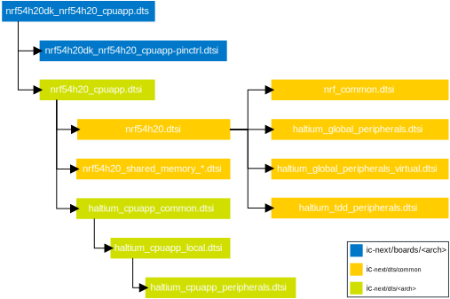

.. _ug_nrf54h20_configuration:

Configuring the nRF54H20 DK
###########################

.. contents::
   :local:
   :depth: 2

The nRF54H20 DK uses both devicetree and Kconfig for its hardware and software configuration.

You can find the basics of both devicetree and Kconfig in Zephyr in the :ref:`zephyr:application` section of the Zephyr documentation.
You can also read the :ref:`app_build_system` section describing the |NCS| additions to the Zephyr configuration system.

However, the multicore nature of the nRF54H20 DK required some changes to the way devicetree files are organized.

DTS file scheme
***************

.. to review

.. note::
   This file scheme is valid only for the nRF54H20 initial limited sampling version of |NCS|.
   It is subject to changes or improvements in future releases.

The following is the DTS file structure implemented for all the SoCs of the 54H family:

* Arch-specific DTS files, located in the :file:`../dts/arm/nordic_nrf_next/` and :file:`dts/riscv/nordic_nrf_next folder​` directories:

    * Project-wide files (:file:`haltium_cpu.dtsi` and :file:`haltium_global_*.dtsi`)​
    * Core-specific files per product (:file:`nrf54h20_cpu*.dtsi`)​

* Common directory, located in the :file:`../common/nordic_nrf_next` folder​:

    * Arch-independent configurations​
    * Common platform overlays
    * Common memory and peripherals overlay applicable across products​
    * Product-specific overlays applicable to all cores​
    * Project-wide overlays

The following is the include tree for the application core of the nRF54H20 (cpuapp):

The files shown in the figure are currently hosted in the ``ic-next`` repository.

Customizing the DTS configuration
*********************************

.. to review

The output files created in your application build directory are documented in :ref:`zephyr:devicetree-in-out-files`.
You can use overlay files to customize this configuration.

To see and test how to use overlays for changing nodes, see the *Lesson 3* of the `nRF Connect SDK Fundamentals course`_ on the Nordic Developer Academy website.

Generated HEX files
*******************

.. to review

When building an application for the nRF54H20 DK, you are building all domain images at once.
During this process, the following :file:`zephyr.hex` images are built:

* Application core application
* PPR core application
* Radio core firmware

Additionally, the following user information configuration registers (UICR) contents (:file:`uicr.hex`) are generated for setup access for domains:

* System Controller UICR
* Application UICR
* Radio UICR

.. note::
   ``west flash`` uses :file:`uicr_merged.hex` files that are pre-merged HEX files combining the relevant :file:`zephyr.hex` + :file:`uicr.hex` for a domain that has UICRs.
   Flashing both :file:`zephyr.hex` + :file:`uicr.hex` will result in the same configuration.

All of the HEX files need to be flashed into the device.
For more information on building images for the nRF54H20 DK, see :ref:`ug_nrf54h20_gs`.
For additional information on multi-image builds see :ref:`ug_multi_image`.
