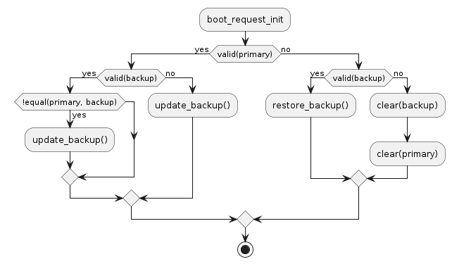
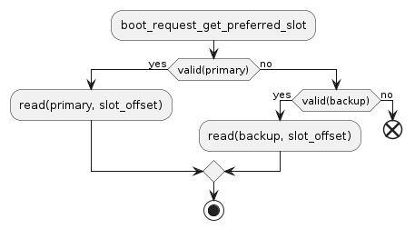
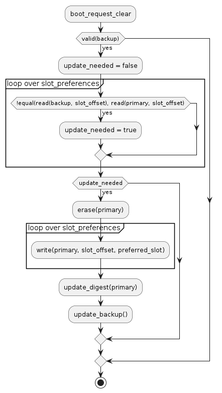
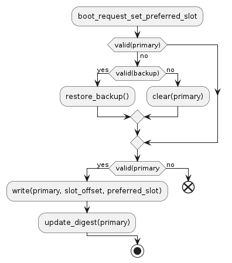

.. _ug_nrf54h20_mcuboot_requests:

Configuring bootloader requests on the nRF54H20 SoC
###################################################

.. contents::
   :local:
   :depth: 2

If you must pass information from the application to the bootloader to affect its behavior during the next boot, you can use a retained memory area that survives resets and is accessible to both the application and the bootloader after reboot.
If retained memory is not available, use the *bootloader requests* module.
This module provides a common API on the nRF54H20 SoC that abstracts the underlying storage.

Overview
********

The bootloader requests module provides APIs for the following:

* Confirm an image after a successful update.

  This functionality is used to mark an updated image as valid from the bootloader context, allowing to set the whole application partition as non-updatable before executing.
  In such case, the application simply requests the bootloader to confirm the image during the next boot instead of modifying the active image partition directly.
  The bootloader handles these requests before entering the main boot logic, ensuring that the image selection and update logic acts as if the image was confirmed by the application itself.
  The bootloader always erases the confirm requests after processing them, ensuring that the image is confirmed only once.
  The number of erase cycles on the NVM storage while processing confirm requests is comparable to the number of image updates, thus there is no need for special care when using this functionality.

* Request a specific slot preference for the next boot (primary or secondary).

  This functionality allows the application to influence the bootloader image selection logic during the next boot.
  By default, the bootloader prefers the slot with the highest version number.
  By using this request, the application can override this behavior and force the bootloader to select a specific slot for the next boot.
  This is especially useful in combination with Direct-XIP mode, where there are two copies of the application image present in the flash memory.
  This module uses the :kconfig:option:`CONFIG_FIND_NEXT_SLOT_HOOKS` option to hook into the slot selection logic.
  Depending on the value of :kconfig:option:`CONFIG_NRF_MCUBOOT_BOOT_REQUEST_PREFERENCE_KEEP`, the bootloader either keeps the requested slot preference for subsequent boots or erases it after processing.

  If the application sets a slot preference to the same value as it is currently requested, the bootloader ignores the request, thus avoiding unnecessary erase cycles on the NVM storage.
  Despite this optimization, the application should avoid sending frequent slot preference requests to minimize wear on the NVM storage.

  .. caution::

     The default dependency resolution logic assumes that the slot with the highest version number is checked first.
     If the application requests a slot preference that contradicts this assumption, it must use this functionality in combination with manifest-based dependency management (see: :ref:`ug_nrf54h20_mcuboot_manifest`) or by merging all images (see :ref:`ug_nrf54h20_partitioning_merged`).

* Request to enter a special mode, such as recovery firmware or a firmware loader.

  This functionality support devices that do not have a retained memory area.
  In such cases, the application can request the bootloader to enter a specific mode during the next boot through NVM storage.
  The bootloader always erases the boot mode requests after processing them, ensuring that the special mode is entered only once.
  The application must ensure that those requests are not sent frequently, as each request causes an erase cycle on the NVM storage.

Memory backends
***************

This module supports two memory backends:

1. A retained RAM area (default, if available).

   This backend is a thin wrapper around the regular retention driver and provides the same functionality as the default mechanism used in MCUboot.

   .. note::
      When using this backend, configure the retention driver to use a checksum to ensure data integrity.
      See :ref:`zephyr:retention_api` for details.

#. A dedicated NVM area (usually a single erase block).

   In addition to passing data, the NVM backend can preserve the slot preference across power cycles.
   It achieves this by extending the NVM area with a second copy of the data, which allows recovery after a power loss during an update operation.
   The backend verifies the data using a CRC32 checksum to ensure the integrity and validity of the returned values.

You can select the memory backend by setting the ``nrf,bootloader-request`` chosen property in the devicetree.

.. code-block:: dts

   / {
           chosen {
                   nrf,bootloader-request = &boot_request;
           };
   };

If the chosen node points to an area compatible with the ``zephyr,retention`` driver, the retention backend is used.
Otherwise, the area is treated as a NVM storage, implementing the Zephyr flash API.

You can also select the backend manually using :kconfig:option:`CONFIG_NRF_MCUBOOT_BOOT_REQUEST_IMPL_RETENTION` or :kconfig:option:`CONFIG_NRF_MCUBOOT_BOOT_REQUEST_IMPL_FLASH`.

If you want to preserve the slot preference across power cycles, the application must use the NVM backend and you must define the ``nrf,bootloader-request-backup`` chosen property accordingly.

.. code-block:: dts

   / {
           chosen {
                   nrf,bootloader-request-backup = &boot_request_backup;
           };
   };

Memory layout
*************

The memory managed by the bootloader requests module is divided into five sections, one for each request type:

* A section holding the intended boot mode for the next boot.
* A section holding the slot preference for image 0 (application core).
* A section holding the confirm request for image 0 (application core).
* A section holding the slot preference for image 1 (radio core).
* A section holding the confirm request for image 1 (radio core).

Each section has a fixed size of a single byte.
Additionally, there are two extra sections:

* A 2-byte prefix at the beginning of the memory area, used to identify valid data.
* A 4-byte checksum at the end of the memory area, used to validate the integrity of the data.

In total, the memory area managed by the bootloader requests module has a minimum size of 11 bytes.

There is no easy way to change the number of sections, as they must be kept in sync between the application and the bootloader.
By default, the MCUboot is immutable on the nRF54H20 SoC, thus the number of sections as well as their purpose and location is fixed.

The following are devicetree definitions for the retention backend and the NVM backend:

* Retention backend devicetree definition:

  .. code-block:: dts

     retainedmem {
             compatible = "zephyr,retained-ram";
             status = "okay";
             #address-cells = <1>;
             #size-cells = <1>;

             boot_request: boot_request@0 {
                     compatible = "zephyr,retention";
                     status = "okay";
                     reg = <0x0 0x10>;
                     prefix = [0B 01];
                     checksum = <4>;
             };
     };

* NVM backend devicetree definition:

  .. code-block:: dts

     partitions {
             boot_request: partition@1ad000 {
                     reg = <0x1ad000 16>;
             };

             boot_request_backup: partition@1ad010 {
                     reg = <0x1ad010 16>;
             };
     };

When you use either backend, the memory layout is as follows:

+-----------------+-------------+------------------------+-------------------------+-------------------------+-------------------------+-------------------------+-------------+-------------+
|                 | Prefix      | Boot mode              | Image 0 slot preference | Image 0 confirm request | Image 1 slot preference | Image 1 confirm request | Unused      | Checksum    |
+=================+=============+========================+=========================+=========================+=========================+=========================+=============+=============+
| Address offsets | 0x00 - 0x01 | 0x02                   | 0x03                    | 0x04                    | 0x05                    | 0x06                    | 0x07 - 0x0B | 0x0C - 0x0F |
+-----------------+-------------+------------------------+-------------------------+-------------------------+-------------------------+-------------------------+-------------+-------------+
| Values          | Fixed:      | 0x00 - regular boot    | 0x00 - no preference    | 0x00 - no request       | 0x00 - no preference    | 0x00 - no request       |             | Calculated  |
|                 |             |                        |                         |                         |                         |                         |             | from data   |
|                 | 0x0B, 0x01  | 0x01 - recovery mode   | 0x01 - prefer slot 0    | 0x01 - confirm slot 0   | 0x01 - prefer slot 0    | 0x01 - confirm slot 0   |             |             |
|                 |             |                        |                         |                         |                         |                         |             |             |
|                 |             | 0x02 - firmware loader | 0x02 - prefer slot 1    | 0x02 - confirm slot 1   | 0x02 - prefer slot 1    | 0x02 - confirm slot 1   |             |             |
+-----------------+-------------+------------------------+-------------------------+-------------------------+-------------------------+-------------------------+-------------+-------------+

Slot preference updates with power-loss protection
**************************************************

When you use the NVM backend, you can configure the bootloader requests module to protect slot preference updates against power loss.
This mechanism ensures that a power loss during an update operation cannot be used to manipulate the slot preference.

This mechanism maintains two identical copies of the boot requests data: a primary copy and a backup copy.
The bootloader creates the backup copy as part of bootloader request initialization.
The application can update only the primary copy.
Write access is restricted to the backup copy to reduce NVM wear in the backup area.

The bootloader always starts with the initialization procedure.
During initialization, it copies the primary copy to the backup copy if the primary copy is valid.

When the bootloader processes a slot preference request, it first checks the validity of the primary copy.
If the primary copy is valid, it uses it as the source for the requested slot preference.
If the primary copy is invalid and the backup copy is valid, it uses the backup copy.
If neither copy is valid, it does not request a slot preference.

When the bootloader successfully processes boot mode or image confirm requests (that is, any requests other than slot preference requests), it erases the primary area, copies the slot preference values from the backup area to the primary area, and then updates the checksum of the primary area.
After the primary area becomes valid and contains the backed-up slot preference values, the bootloader copies the primary area to the backup area.
This ensures that both areas stay in sync after the bootloader processes requests.

When the application creates a request, it first checks the validity of the primary copy.
If the primary copy is invalid and the backup copy is valid, it restores the backup copy to the primary copy before proceeding.
If neither copy is valid, it erases the primary area and processes the request as usual.
If the primary copy is valid and already matches the requested value, it ignores the request to avoid unnecessary erase cycles.
If the primary area initialization fails or the backup copy cannot be restored, the request fails with an error code.

This mechanism ensures that even in the event of a power loss during an update operation, the bootloader can always recover a valid slot preference from the backup copy, maintaining the integrity of the boot process.
