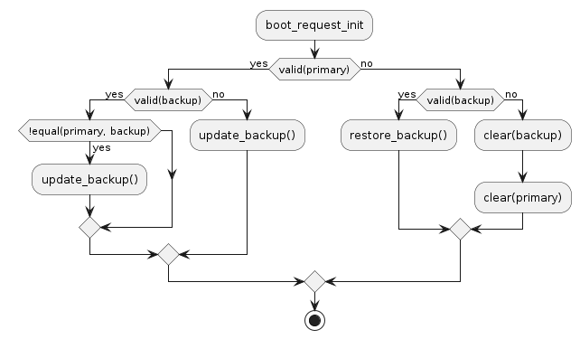
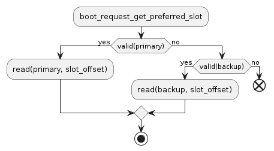
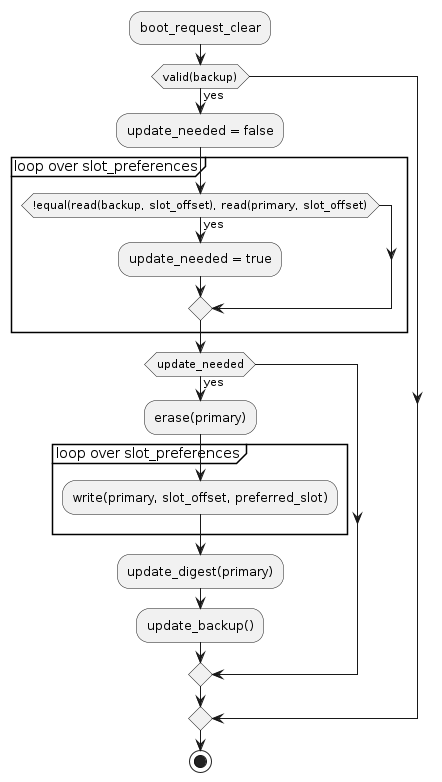
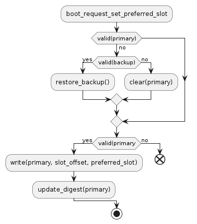

.. _ug_nrf54h20_mcuboot_requests:

Configuring bootloader requests on nRF54H20
###########################################

.. contents::
   :local:
   :depth: 2

In some cases, there is a need to pass additional information from the application to the bootloader to influence its behavior during the next boot.
The default mechanism to achieve this is to use a retained memory area, which is preserved across resets and can be accessed by both the application and the bootloader after a reboot.
Unfortunately, this mechanism is not always available, thus a new module was introduced to wrap the underlaying memory storage with a common API.
This module is called *bootloader requests* and currently is available only on nRF54H20 platform.

Overview
********

The bootloader requests module provides APIs to:

1. Confirm an image after a successful update.

   This functionality is used to mark an updated image as valid from the bootloader context, allowing to configure the whole application partition as non-updateable before executing.
   In such case, the application simply requests the bootloader to confirm the image during the next boot instead of modifying the active image partition directly.
   The bootloader handles these requests before entering the main boot logic, ensuring that the image selection and update logic acts as if the image was confirmed by the application itself.
   The bootloader always erases the confirm requests after processing them, ensuring that the image is confirmed only once.
   The number of erase cycles on the NVM storage while processing confirm requests is comparable to the number of image updates, thus there is no need for special care when using this functionality.

#. Request a specific slot preference for the next boot (primary or secondary).

   This is a new functionality, allowing the application to influence the bootloader's image selection logic during the next boot.
   By default, the bootloader prefers the slot with the highest version number, but using this request, the application can override this behavior and force the bootloader to select a specific slot for the next boot.
   This is especially useful in combination with Direct XIP mode, where there are two copies of the application image present in the flash memory.
   This module uses the :kconfig:option:`CONFIG_FIND_NEXT_SLOT_HOOKS` option to hook into the slot selection logic.
   Depending on the value of :kconfig:option:`CONFIG_NRF_MCUBOOT_BOOT_REQUEST_PREFERENCE_KEEP`, the bootloader either keeps the requested slot preference for subsequent boots or erases it after processing.
   If the application sets a slot preference to the same value as it is currently requested, the bootloader ignores the request, thus avoiding unnecessary erase cycles on the NVM storage.
   Despite this optimization, the application should avoid sending frequent slot preference requests to minimize wear on the NVM storage.

   .. warning::

      The default dependency resolution logic assumes that the slot with the highest version number is checked first.
      If the application requests a slot preference that contradicts this assumption, thus usage of this functionality must be done in combination with Manifest-based dependency management (see: :ref:`ug_nrf54h20_mcuboot_manifest`) or by merging all images (see :ref:`ug_nrf54h20_partitioning_merged`).
      
#. Request to enter a special mode, such as recovery firmware or a firmware loader.

   The main reason for including this functionality is to support devices, that do not have a retained memory area.
   In such cases, the application can request the bootloader to enter a specific mode during the next boot through NVM storage.
   The bootloader always erases the boot mode requests after processing them, ensuring that the special mode is entered only once.
   The application must ensure that those requests are not sent frequently, as each request causes an erase cycle on the NVM storage.

Memory backends
***************

This module supports two memory backends:

1. A retained RAM area (default, if available).

   This backend is a thin wrapper around the regular retention driver, providing the same set of functionalities as the default mechanism used in the MCUboot.
   It is highly advised to configure the retention driver to use a checksum to ensure data integrity.

#. A dedicated NVM area (usually a single erase block).

   Apart from passing the data, the NVM backand is capable of preserving the slot preference across power cycles.
   This is acheived by extending the NVM area with a second copy of the data, allowing to recover the data after a power loss during an update of the NVM area.
   The data is checked using a CRC32 checksum, ensuring integrity and validity of the returned values.

The memory backend is selected by setting the ``nrf,bootloader-request`` chosen property in the Device Tree.

.. code-block:: dts

   / {
       chosen {
           nrf,bootloader-request = &boot_request;
       };
   };
		
If the chosen node points to an area compatible with the ``zephyr,retention`` driver, the retention backend is used.

Otherwise, the area is treated as a NVM storage, implementing the Zephyr flash API.
The backend can be also manually configured using the :kconfig:option:`CONFIG_NRF_MCUBOOT_BOOT_REQUEST_IMPL_RETENTION` and :kconfig:option:`CONFIG_NRF_MCUBOOT_BOOT_REQUEST_IMPL_FLASH` options respectively.

If the application wants to preserve the slot preference across power cycles, it must use the NVM backend and define the ``nrf,bootloader-request-backup`` chosen property accordingly.

.. code-block:: dts

   / {
       chosen {
           nrf,bootloader-request-backup = &boot_request_backup;
       };
   };

Memory layout
*************

The memory, managed by the bootloader requests module, is divided into five sections, one for each request type:

1. A section holding the intended boot mode for the next boot.
#. A section holding the slot preference for image 0 (application core).
#. A section holding the confirm request for image 0 (application core).
#. A section holding the slot preference for image 1 (radio core).
#. A section holding the confirm request for image 1 (radio core).

Each section has a fixed size of a single byte.
Additionally, there are two extra sections:
* A 2-byte prefix at the beginning of the memory area, used to identify valid data.
* A 4-byte checksum at the end of the memory area, used to validate the integrity of the data.

In total, the memory area managed by the bootloader requests module has a minimum size of 11 bytes.

There is no easy way to change the number of sections, as they must be kept in sync between the application and the bootloader.
By default, the MCUboot is immutable on nRF54H20 platform, thus the number of sections as well as their puprose and location is fixed.

If the retention backend is used with the following definition inside the Device Tree:

.. code-block:: dts
		retainedmem {
			compatible = "zephyr,retained-ram";
			status = "okay";
			#address-cells = <1>;
			#size-cells = <1>;

			boot_request: boot_request@0 {
				compatible = "zephyr,retention";
				status = "okay";
				reg = <0x0 0x10>;
				prefix = [0B 01];
				checksum = <4>;
			};
		};

Or the NVM backend is used with the following definition inside the Device Tree:

.. code-block:: dts
	partitions {
		boot_request: partition@1ad000 {
			reg = <0x1ad000 16>;
		};

		boot_request_backup: partition@1ad010 {
			reg = <0x1ad010 16>;
		};
	};

The memory layout will be as follows:

+-----------------+-------------+------------------------+-------------------------+-------------------------+-------------------------+-------------------------+-------------+-------------+
|                 | Prefix      | Boot mode              | Image 0 slot preference | Image 0 confirm request | Image 1 slot preference | Image 1 confirm request | Unused      | Checksum    |
+=================+=============+========================+=========================+=========================+=========================+=========================+=============+=============+
| Address offsets | 0x00 - 0x01 | 0x02                   | 0x03                    | 0x04                    | 0x05                    | 0x06                    | 0x07 - 0x0B | 0x0C - 0x0F |
+-----------------+-------------+------------------------+-------------------------+-------------------------+-------------------------+-------------------------+-------------+-------------+
| Values          | Fixed:      | 0x00 - regular boot    | 0x00 - no preference    | 0x00 - no request       | 0x00 - no preference    | 0x00 - no request       |             | Calculated  |
|                 | 0x0B, 0x01  | 0x01 - recovery mode   | 0x01 - prefer slot 0    | 0x01 - confirm slot 0   | 0x01 - prefer slot 0    | 0x01 - confirm slot 0   |             | from data   |
|                 |             | 0x02 - firmware loader | 0x02 - prefer slot 1    | 0x02 - confirm slot 1   | 0x02 - prefer slot 1    | 0x02 - confirm slot 1   |             |             |
+-----------------+-------------+------------------------+-------------------------+-------------------------+-------------------------+-------------------------+-------------+-------------+

Slot preference updates with power-loss protection
**************************************************

When using the NVM backend, the bootloader requests module supports power-loss protection for slot preference updates.
The main objective of this mechanism is to ensure that the slot preference cannot be manipulated by a power loss during an update operation.

This is achieved by maintaining two identical copies of the boot requests data: the primary copy and a backup copy.
The backup copy is created only by the bootloader, as part of the bootloader request initialization.
The application is allowed to update only the primary copy.
The access to the backup copy is restricted to reduce the NVM wear of the backup area.

The bootloader always starts from initialization procedure, which copies the primary copy into the backup copy if the primary copy is valid.

When the bootloader processes a slot preference request, it first checks the validity of the primary copy.
If the primary copy is valid, it is used as the requested slot preference.
If the primary copy is invalid but the backup copy is valid, the backup copy is used.
If neither copy is valid, no slot preference is requested.

When the bootloader successfully processes other requests, it erases the primary area, copies the slot preference values from the backup area to the primary area, and then updates the checksum of the primary area.
Once primary area is valid and contains the slot preference values, the primary area is copied into the backup area.
This ensures that both areas are always in sync after processing requests.

When the application creates a request, first the validity of the primary copy is checked.
If the primary copy is invalid but the backup copy is valid, the backup copy is restored to the primary copy before proceeding.
If neither copy is valid, the main area is erased and the request is processed as usual.
If the primary copy is valid and matches the requested value, the request is ignored to avoid unnecessary erase cycles.
If the primary area initialization fails or the backup copy cannot be restored, the request fails with an error code.

This mechanism ensures that even in the event of a power loss during an update operation, the bootloader can always recover a valid slot preference from the backup copy, maintaining the integrity of the boot process.
