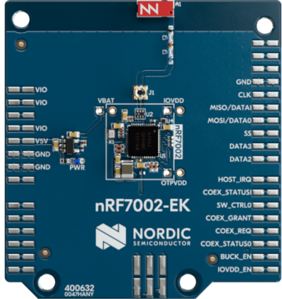

:orphan:

.. _ug_nrf54h20_nrf7002ek:

Working with the nRF54H20 DK and the nRF7002 EK
###############################################

.. contents::
   :local:
   :depth: 2

The nRF7002 EK is an evaluation kit featuring the nRF7002 Wi-Fi® 6 companion IC.
The kit can be used to provide Wi-Fi connectivity to the nRF54H20 DK.

Pin assignment for the nRF54H20 DK GPIO
=======================================

The interface connector of the nRF7002 EK can be connected to the nRF54H20 DK GPIO as described in the following table:

+--------------------------------+-------------------------+----------------------+----------------------------------+
| nRF7002 EK signal              | nRF54H20 DK GPIO signal | EK connector and pin |             Function             |
+================================+=========================+======================+==================================+
| BUCK_EN                        | **P0.08**               | **P9.2**             | Enable power to nRF7002          |
+--------------------------------+-------------------------+----------------------+----------------------------------+
| IOVDDEN                        | **P0.09**               | **P9.1**             | Enable power to I/O interface    |
+--------------------------------+-------------------------+----------------------+----------------------------------+
| COEX STATUS0                   | **P0.02**               | **P9.3**             | Coexistence status 0             |
+--------------------------------+-------------------------+----------------------+----------------------------------+
| COEX REQUEST                   | **P0.03**               | **P9.4**             | Coexistence request from host    |
+--------------------------------+-------------------------+----------------------+----------------------------------+
| COEX GRANT                     | **P0.04**               | **P9.5**             | Coexistence grant to host        |
+--------------------------------+-------------------------+----------------------+----------------------------------+
| SWITCH CONTROL0                | **P0.05**               | **P9.6**             | Switch control 0                 |
+--------------------------------+-------------------------+----------------------+----------------------------------+
| SWITCH CONTROL1 / COEX STATUS1 | **P0.06**               | **P9.7**             | Switch control 1 / Coex status 1 |
+--------------------------------+-------------------------+----------------------+----------------------------------+
| HOST IRQ                       | **P0.10**               | **P9.8**             | Interrupt request to host        |
+--------------------------------+-------------------------+----------------------+----------------------------------+
| SPI CS                         | **P2.09**               | **P10.3**            | SPI Slave select                 |
+--------------------------------+-------------------------+----------------------+----------------------------------+
| SPI MOSI                       | **P2.07**               | **P10.4**            | SPI Slave IN                     |
+--------------------------------+-------------------------+----------------------+----------------------------------+
| SPI MISO                       | **P2.08**               | **P10.5**            | SPI Slave OUT                    |
+--------------------------------+-------------------------+----------------------+----------------------------------+
| SPI CLK                        | **P2.00**               | **P10.6**            | SPI Clock                        |
+--------------------------------+-------------------------+----------------------+----------------------------------+
| 5V                             | **P5.3**                | **P7.5**             | 5 V to nRF7002 EK                |
+--------------------------------+-------------------------+----------------------+----------------------------------+
| GND                            | **P5.1**                | **P7.6**             | GND                              |
+--------------------------------+-------------------------+----------------------+----------------------------------+
| VDD                            | **P5.4**                | **P7.1**             | 1.8 V to nRF7002 EK              |
+--------------------------------+-------------------------+----------------------+----------------------------------+

These connectors are on the bottom side of the nRF7002 EK.
You can make the connections with a flyer wire between the headers **P2**, **P0**, and **P5** on nRF54H20 DK and **P9**, **P10**, and **P7** on nRF7002 EK.

Supported samples
=================

The :ref:`wifi_shell_sample` sample provides support for the nRF54H20 DK used with the nRF7002 EK.
For more information, visit its :ref:`documentation <wifi_shell_sample>`.
