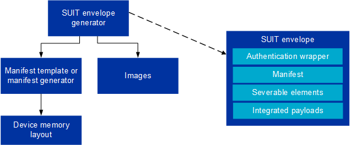

.. _ug_nrf54h20_suit_customize_dfu_qsg:

Customize SUIT DFU quick start guide
####################################

.. contents::
   :local:
   :depth: 2

This quick start guide explains how to customize the Software Update for Internet of Things (SUIT) Device Firmware Update (DFU) to target your specific nRF54H20 System-on-Chip (SoC).
It is aimed at users new to the SUIT DFU process.

Overview
********

The following are basic SUIT concepts you need to understand to be able to customize SUIT DFU for your device:

* SUIT uses envelopes that serve as a secure transport container, and the SUIT manifest contains crucial deployment metadata.
* SUIT envelopes are generated from manifest templates.
* The SUIT manifest is like a blueprint that tells the system how to create a SUIT envelope, and contains instructions and metadata for the DFU procedure.
* Default SUIT manifest templates are provided, but customization, especially for UUIDs, is recommended.

   Overview of the SUIT DFU procedure

See the :ref:`ug_nrf54h20_suit_intro` for more information about SUIT-specific concepts.

SUIT DFU process
================

The SUIT DFU process involves creating a SUIT envelope, which includes a manifest outlining the steps for the update.
By default, manifests templates provided in :file:`nrf/config/suit/templates` are used to create the envelopes.
These templates can be copied and customized according to your project's requirements.

This guide will walk you through how to customize the SUIT DFU process to target your specific device.

For a complete guide on all customizable aspects of the SUIT DFU procedure, see the :ref:`ug_nrf54h20_suit_customize_dfu` user guide.

Detailed reading
================

If you want to learn more about SUIT DFU topics and terminology mentioned in this guide, read the following pages:

* :ref:`ug_nrf54h20_suit_intro` page to learn more about SUIT-specific concepts, and an overview of the SUIT DFU procedure
* :ref:`ug_nrf54h20_suit_manifest_overview` page for more information on how the SUIT manifest works
* :ref:`ug_nrf54h20_suit_hierarchical_manifests` to learn more about the structure of the SUIT manifests implemented by Nordic Semiconductor

Requirements
************

For this quick start guide, you need the following development kit:

+------------------------+----------+--------------------------------+-------------------------------+
| **Hardware platforms** | **PCA**  | **Board name**                 | **Board target**              |
+========================+==========+================================+===============================+
| nRF54H20 DK            | PCA10175 | ``nrf54h20dk``                 | ``nrf54h20dk/nrf54h20/cpuapp``|
+------------------------+----------+--------------------------------+-------------------------------+

Software requirements
=====================

For this quick start guide, we will install the following software:

* Toolchain Manager - An application for installing the full |NCS| toolchain.
* Microsoft's |VSC| - The recommended IDE for the |NCS|.
* |nRFVSC| - An add-on for |VSC| that allows you to develop applications for the |NCS|.
* nRF Command Line Tools - A set of mandatory tools for working with the |NCS|.
* Any additional requirements described in the :ref:`nrf54h_suit_sample` sample.

Building the SUIT sample
************************

Start by building the :ref:`nrf54h_suit_sample` sample:

.. code-block:: console

   west build -b nrf54h20dk/nrf54h20/cpuapp nrf/samples/suit/smp_transfer

This command builds the :ref:`nrf54h_suit_sample` sample for the nRF54H20 SoC.

Modifying class and vendor identifiers
**************************************

Replacing and using the correct class and vendor UUIDs prevents conflicts in the DFU process.
The UUIDs allow to ensure that the firmware is compatible with a given device.

This can be done by changing the class and vendor names using Kconfig options (for example in the :file:`prj.conf` file):

.. code-block::

   CONFIG_SUIT_MPI_ROOT_VENDOR_NAME="ACME Corp"
   CONFIG_SUIT_MPI_ROOT_CLASS_NAME="Light bulb root"
   CONFIG_SUIT_MPI_APP_LOCAL_1_VENDOR_NAME="ACME Corp"
   CONFIG_SUIT_MPI_APP_LOCAL_1_CLASS_NAME="Light bulb"

After rebuilding you can find the following part in the :file:`./build/DFU/application.yaml` file.

.. code-block::

  - suit-directive-override-parameters:
      suit-parameter-vendor-identifier:
         RFC4122_UUID: ACME Corp              # Changed vendor-identifier value
      suit-parameter-class-identifier:
         RFC4122_UUID:                        # Changed class-identifier values
           namespace: ACME Corp
           name: Light bulb

With the sample built and identifiers customized, your SUIT DFU process is now specifically configured for your nRF54H20 SoC.

Next steps
**********

The SUIT DFU procedure can further be customized by:

* Creating and modifying your own manifests
* Generating raw UUID values

Instructions for these actions and further customization are described in the :ref:`ug_nrf54h20_suit_customize_dfu` page.
Additionally, you can modify SUIT components within the manifest (see the :ref:`ug_nrf54h20_suit_components` page for more information).

If an update to the *nRF54H20 SoC binaries* (precompiled binaries provided by Nordic Semiconductor) is required, refer to the :ref:`ug_nrf54h20_suit_soc_binaries` page.
