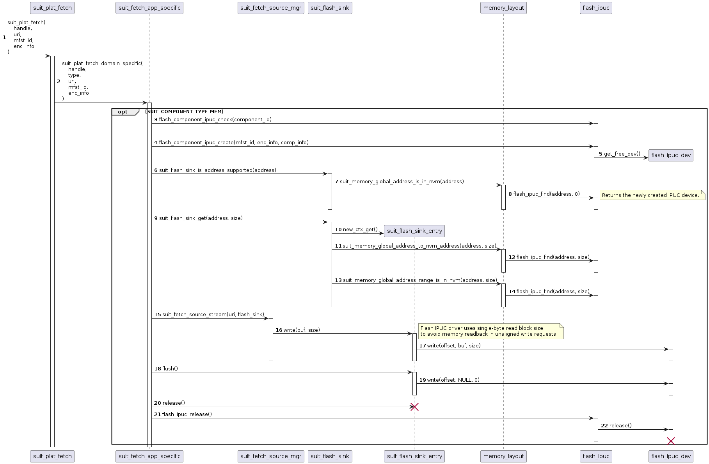
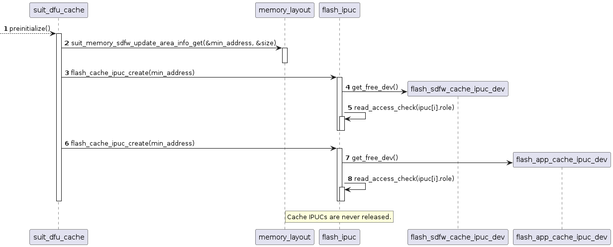

.. _ug_nrf54h20_suit_ipuc:

In-place update mechanism
#########################

.. contents::
   :local:
   :depth: 2

The goal of this document is to provide an in-depth description of the in-place update mechanisms implemented using SUIT manifests on Lilium devices.
The first section shortly describes the types of update methods that are supported.
Afterwards, all necessary extensions that allows to cross memory privilege restrictions are documented.
Lastly, all types of integrations within SUIT platform as well as other DFU libraries are presented, allowing a developer to understand the relation between the application and update logic.

In-place updates methods
************************

Background download, foreground update
======================================

The primary method for updating a device using SUIT consists of:

* background download of an update candidate into the staging area (DFU partition and optionally into DFU cache partitions)
* foreground installation, based in the manifest contents, executed by the Secure Domain Firmware (SDFW).

The background download process, performed by the main application, can be implemented using both "push" and "pull" methods.
This allows to optimize either the application complexity (push) or the amount of data that is required to be transferred (pull).

By default, while SDFW is executing the validation and update logic, all other functionalities (including the main application) remains unavailable.

Background download, foreground in-place update
===============================================

There is a possibility to extend the installation logic by adding a companion application, that will be executed during the update process.
This option allows to provide additional data sources to the SDFW (i.e. external memory).
The companion application can also be extended to open a data channel to other sources, effectively transforming the primary method into the foreground in-place update:

* The main application in the background downloads SUIT envelopes as well as companion application binary.
* The device is reset and SDFW executes manifest (update) logic.
* The manifest instructs SDFW to boot the companion application.
* The manifest instructs SDFW to fetch missing part of the update candidate using the companion application.
* The companion application provides data through IPC to the SDFW.
* The SDFW stores the data directly into the internal memory, replacing the main application (performing the "foreground in-place update").
* The manifest instructs SDFW to verify that the digest of the new application matches the expected value.

Background in-place download, foreground update
===============================================

Up to this point, the purpose of each memory region remains the same.
The main application code cannot be modified directly by itself, the companion application must be executed from an executable region, defined by the main application.
The executable code is modified only through requests made by the SDFW over IPC.

Unfortunately, this assumption does not allow to perform the "background in-place updates", where the new version of the application is transferred while the main application is operable.
This foreground in-place download is a desired option to implement for the so-called "A/B" update scheme, in which:

* Every part of the main application is stored inside the internal memory in two variants ("A" and "B").
* Each executable part (variant) is bootable from its own memory region, allowing to boot either of the variants without additional copy/swap operations.
* The alternative variant (i.e. "B") remains inactive, while the primary variant is being executed (i.e. "A"), providing a possibility to overwrite the inactive variant while the main application is operable.

The "A/B" scheme has a few distinct advantages:

* The update time is reduced, because the new variant of the (previously inactive) application is already in its final destination after download.
  In such case the update process is limited to the final integrity check and manifest update, making the update procedure barely noticeable by the end user.
* As long as there are no new update candidates, the device contains two copies of the firmware, providing an additional level of redundancy.
  In such case, it also adds a possibility to switch between two variants of the application at each boot.

To achieve this type of updates, there are a couple of challenges to be addressed:

* Providing a write access to the memory regions assigned to the alternative variant, even though it is unaccessible by the main application.
* Providing a possibility to verify the integrity of the newly downloaded application part, even if it belongs to a different domain.
* Repurposing the alternative image as a staging area for Nordic-controlled firmware (i.e. SDFW, SCFW) updates.

Crossing memory restrictions using SUIT manifests
*************************************************

Providing a write access
========================

The "A/B" update scenario assumes that for each part of the firmware, a usable variant (copy) is assigned.
Due to fact that image digest is encoded as part of SUIT manifest, update of an image also forces the need to update respective manifest.
If there is a need to support two unrelated images (image A, image B), then there is a need to introduce two distinct SUIT manifests variants (manifest A, manifest B).

Whenever a variant is executed, it will be referred as an "active" and the corresponding second variant as an "inactive" variant.
Both of the variants may contain a valid set of instructions to start an application, so an additional control mechanism, facilitating one of the manifest variables is introduced.
Based on it's value, the root manifest will select the order, in which it will attempt to process variant manifests, thus it will be referred as the "boot preference" variable.

The in-place update method assumes that the inctive variant will be overwritten by the logic inside the main application code.
Looking from the memory permission perspective, both the active and inactive variant shares the same memory configuration,
so allowing one variant to write directly into the inactive memory will result in a configuration that allows both variants to overwrite themself.
This is not acceptable, so memory accesses have to be proxied to the SDFW, which has unlimited access to both of the memory regions.
This proxy is provided as a :ref:`pseudo-flash driver<flash_ipuc>`.
Instances of this driver can be created dynamically, depending on the available inactive regions as well as needs of the application.

The SDFW must asses if the request is valid, thus there needs to be a mechanism, through which the owner of the memory region will open such access in a trusted (i.e. authenticated) way.
The easiest way to provide such mechanism is to reuse manifests, because:

* The list of allowed components (and as a result - memory regions) inside a manifest is already verified by the assignment of the manifest to the role using Manifest Provisioning Information (MPI) configuration.
* Manifest contents (including sequences of commands) are cryptographically authenticated.

For Lilium devices, a convention was created, that whenever a manifest sets the component size to zero, it declares the component us unused and allows to modify it through the IPC by other domains.
Any modification of the component contents (directives: fetch, copy, write) or another override of component size other than zero executed by the manifest logic revokes this permission.

Based on the extensions described above, the background "in-place" update procedure will have the following steps:

* The root manifest decides, based on the boot preference setting, which variant is going to be the active one.
* The active variant manifest contains both memory regions described as components.
* The active variant manifest verifies the state of the firmware and prepares to boot the active component.
* Right before booting the firmware, it marks the inactive component as updateable by setting its size to zero.
* The application boots and downloads update candidate manifest(s) into the staging area (DFU partition).
* The application starts SUIT processor locally to authenticate and execute the process-dependency and payload-fetch sequences from the update candidate root manifest.
* The update candidate root manifest checks which variant of the application/manifest is the active one.
* The update candidate root manifest executes payload-fetch sequence from the inactive variant of update candidate manifest.
* The update logic of inactive manifest variant downloads data into its own executable component (requesting the "in-place" update).
* The SUIT platform identifies a request for direct memory write and forwards all such write requests to the SDFW over IPC.
* The SDFW verifies if the component ID from the request is declared as updateable.
* If writing to the component is allowed, SDFW modifies the memory.
* Once inactive variant memory region is updated, the application passes the update candidate information to the SDFW and reboots the system.
* The SDFW authenticates the update candidate and verifies if the in-place update was completed by executing commands inside the candidate-verification sequence.
* If all of the checks passes, the manifest changes boot preference setting to start the new variant of the application.
* The root manifest as well as the previously inactive variant manifest is updated and the system is rebooted.
* During the next boot, the root manifest decides, based on the updated boot preference setting, which variant is going to be the active one.
* The previously inactive variant is booted, becoming the new active variant and the cycle repeats.

Providing an integrity check mechanisms
=======================================

Although the capability to write the downloaded firmware into its final destination is sufficient to perform the "in-place" update,
the application still should verify that the downloaded contents matches the expected payload before restting and triggering the update procedure on the SDFW side.
In SUIT manifest, this operation is usually implemented by calling ``suit-condition-image-match`` command on the updated component.

Since the application executing the manifest, assigned to a different role (i.e. radio mnifest) is not allowed to read the contents of the memory directly, it needs to call another SDFW service to perform this check.
The SDFW must not provide a simple read API for all updateable memory regions, because it would allow to read-out any payload, including the one that was delivered as encrypted to the device.
The service should verify the contents against a specified digest, as well as implement the following limitations:

* The digest check of decrypted image is allowed to be performed if and only if the encryption algorithm with authentication was used and the authentication was successful.
* The digest check must not be performed on memory regions, that were not modified as part of the "in-place" update.
* The digest check must be the last operation on the memory region.

Since the write API of the flash driver allows to write data in a non-cotiguous way (seek before write), the SDFW must erase all unmodified data, that can be accessed/checked for digest.

Apart from updating obsolete firmware, the "in-place" mechanism can be used to fix a damaged firmware.
In such case, the application must have an ability to check if the digest of the other variant is correct, before attempting to overwrite it.
This cannot be achieved through the previously mentioned IPC service (because it would erase the whole memory region), so yet another one has been created, this time limited only to the currently installed (both active and inactive) firmware memory regions.
Similarly the second service does not provide a raw read access, but allows to check if the digest is correct.

This time there is no context (set of writes) for the operation, thus another mechanism must be used to specify, when and which memory regions are allowed to be checked.
To provide such list, a digest cache was introduced, so all successful digest checks on selected components during the invocation procedure are saved for the future use:

* Any successful digest verification will cache both address, size and the digest value.
* Any further updates of the memory region (directives: fetch, copy, write) will evict the corresponding entry.
* All digest check requests will be successful if and only if an exact match in the digest cache entries is found.

That approach eliminates a need to specify the memory region size, eliminating security risk of reading out the memory contents.
Unfortunately, it introduces a few inconveniences:

* In case if installed and candidate manifests use different digest algorithms, service exposed via IPC will return failure even if the verified image is correct.
  Impact of this inconvenience is limited, in the worst case image will be unnecessarily downloaded to the device.
* The cache includes only digests for checks that were performed during the boot process, so if the digest of the inactive component should be verifiable,
  the root manifest must execute the ``suit-validate`` sequence for both manifest variants.

  It is up to Root manifest creator to decide whether:

  * Initial digest for inactive image should be available, at a cost of longer lasting system boot-up time.
  * System boot-up time should be reduced, at a cost of lack of information about the digest of inactive images.

Repurposing inactive memory as staging area
===========================================

A definition of the DFU partition (location and size) is controlled by the main application developer.
Size of this partition shall be sufficient to hold at least all candidate manifests, describing the update logic.
With the ability to do the "in-place" updates, candidate images can be written directly into the respoective destination location.

Taking into account envisioned amount of SUIT manifests supported by the device (~10) and the size of a single manifest (~ 2kB),
it is safe to assume that the total size of memory occupied by the candidate manifests should not exceed 32 kB.

Unfortunately, the in-place update cannot be applied to the Nordic-controlled images (SDFW, SDFW_Recovery, System Controller).
Any update of those must be started from MRAM-based staging area.
Size of that area shall be calculated based on the maximum size of the Nordic images:

+--------------------------------+-----------+
| Nordic image                   | Size (kB) |
+================================+===========+
| Secure Domain Firmware         | 272       |
+--------------------------------+-----------+
| Secure Domain Recovery         | 36        |
+--------------------------------+-----------+
| System Controller Firmware     | 56        |
+--------------------------------+-----------+
| TOTAL                          | 364       |
+--------------------------------+-----------+

Since the size of the Nordic images is not negligible (~18% of NVM), a separate mechanism for extending the staging area was created.
If the application enables pseudo-flash driver for the "in-place" updates, the DFU cache partition "1" is defined (or replaced) in such a way that:

* It is placed in one of the memory regions, belonging to the application core, that are currently marked as "updateable".
* The start address of the cache partition is adjusted, so any addresses within it is a valid address of the Nordic component update candidate binary.
* The memory contents of this component is erased only if the application writes data into the dedicated flash partition.

This special DFU partition can also be enabled or disabled using the :kconfig:option:`CONFIG_SUIT_CACHE_SDFW_IPUC` Kconfig option.

To facilitate the Nordic updates through cache partitions, all Nordic manifests were extended by the payload-fetch sequences,
that will attempt to download and verify the missing binaries into the DFU cache pool "1".
If the application does not implement the "pull" method, a dedicated raw cache pool binary is generated by the build system,
so it can be "pushed" to the device.

The main disadvantege of such approach is the number of update packages that the device needs to receive to perform the full system update:

* a package updating Nordic artifacts
* a package updating the main Application
* optionally, a package updating Radio firmware
* optionally, a package updating recovery images

It also has a few limitations:

* Due to address restrictions, the Nordic components update is allowed only if the "A" variant (the one that is placed on the lower address range) is active.
  That said, if the "B" variant is active, the device must update to the variant "A" first, and only then can proceed with the Nordic components update.
* The size of the main Application "B" must not be less than the sum of the Nordic components (~364 kB).
* Downloading the Nordic components update temporarily damages the "B" variant of the application, making it less resilient to random memory corruptions.

Integrations of the "in-place" updates in NCS
*********************************************

The functionality of IPUCs can be used directly from the manifest logic.

Fetching data into component, declared as IPUC
==============================================

In the most basic scenario, it can be allow to fetch data into component IDs, that are not accessible to the application domain.

   IPUC usage: fetching into MEM component

Fetching data into cache pool, created on IPUC memory region
============================================================

The application may also create a DFU cache partition, that will be based on IPUC memory region.
To do so, the application must enable the :kconfig:option:`CONFIG_SUIT_CACHE_SDFW_IPUC` or the :kconfig:option:`CONFIG_SUIT_CACHE_APP_IPUC` Kconfig options.
The DFU cache pool ID, that will use IPUCs is configured by the :kconfig:option:`CONFIG_SUIT_CACHE_SDFW_IPUC_ID` or the :kconfig:option:`CONFIG_SUIT_CACHE_APP_IPUC_ID` Kconfig options.
Enabling them extends the SUIT DFU cache initialization sequence, by allocating flash IPUC instances, required by the cache pool implementation.

   IPUC usage: IPUC-based cache partition initialization

Once enabled, it is possible to fetch data into the cache pool from the manifest logic.

Writing raw binaries into IPUC memory
=====================================

There are also two other use cases for IPUCs, where manifest logic is not involved.
Those are the "push" scenarios:

* Raw cache partition transfer

   .. figure:: images/suit_ipuc/ipuc_push_raw_cache.png
      :alt: IPUC usage: raw cache partition transfer

      IPUC usage: raw cache partition transfer

* Raw firmware image transfer

   .. figure:: images/suit_ipuc/ipuc_push_raw_img.png
      :alt: IPUC usage: raw firmware image transfer

      IPUC usage: raw firmware image transfer
