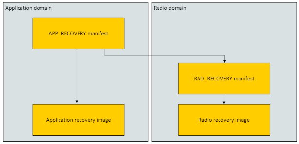

.. _ug_nrf54h20_suit_recovery:

SUIT Recovery
#############

.. contents::
   :local:
   :depth: 2

During the device lifetime, the device can encounter various issues that lead to boot failure.
In such cases, the device must have a mechanism to recover from the failure and continue operating.

In SUIT, this requirement is addressed by running a specially prepared recovery firmware.
While the recovery firmware requires some additional space on the device, it is a highly recommended feature for all devices utilizing SUIT.

This document describes scenarios in which an nRF54H20 device using SUIT can enter recovery mode, as well as the recovery process.

Entering recovery mode
**********************

When booting the device, the Secure Domain verifies the currently installed manifests and firmware images.
If the verification fails, the device enters recovery mode.
The reasons for validation failure can include, but are not limited to, the following:

* An invalid manifest signature.
* A mismatch between the digest of the installed firmware image and the digest in the manifest.
* The manifest attempting to perform unauthorized operations.

These issues can occur in the following scenarios:

* Tampering by an attacker.
* Bitflips in the MRAM memory caused by radiation or other external conditions.
* Hardware failures in advanced cases where an in-place update is performed, resulting in a partially overwritten firmware image.
* An incorrectly constructed manifest, leading to a successful update but a failure during boot.

.. caution::
  The last case must never occur in a production environment, but it is possible during development.
  The manufacturer must always ensure that the manifest is correctly constructed and that all images managed by SUIT are compatible with each other after the update.
  If any bugs are overlooked during the development phase, this could result in inconsistencies in the firmware.

Recovery Mode and Recovery Manifests
*************************************************

The recovery manifests form a separate hierarchy from the normal manifests.
In this hierarchy, the application recovery (``APP_RECOVERY``) manifest is responsible for managing both the application core image and other manifests, such as the radio recovery manifest.

The following image shows the recovery manifest topology for the nRF54H20 SoC:

If a failure during a boot process occurred, the Secure Domain sets the recovery flag and reboots the device.
Upon each boot the Secure Domain checks if the recovery flag is set.
If it is set, the device enters recovery mode.
If it isn't booting proceeds normally by running the root manifest.

After entering the recovery mode it is verified if MPI configuration for the APP_RECOVERY is present.
If it is, the APP_RECOVERY manifest is processed.
It no MPI configuration is found the Secure Domain performs an attempt to process the normal manufacturer root manifest.
This is needed, as the device might enter recovery mode if it is empty.
The recovery flag is not cleared after flashing the firmware, but the device should proceed as if it would boot normally.

This flow is shown in the following diagram:

.. figure:: images/nrf54h20_suit_recovery_boot_path .png
   :alt: Booting in recovery mode

The role of the recovery application is to perform an update of the main application firmware, which does not differ from the normal SUIT update process.
As soon as the update finishes successfully, the recovery flag is cleared and the device proceeds with normal operation.

.. note::
    The recovery application itself can only be updated from the main application - not when running the recovery application.

.. _ug_nrf54h20_suit_recovery_default_fw:

Using the default recovery firmware
***********************************

Nordic provides a default recovery firmware that can be used in the recovery process.
This firmware uses Bluetooth LE and SMP as a transport.
It is optimized for memory usage, currently using around 164 kB of MRAM (72 kB of application core and 92 kB radio core).

.. caution::
   The default recovery firmware does not support :ref:`updating from external flash memory <ug_nrf54h20_suit_external_memory>`.
   This also means that the recovery firmware is not compatible with a main application that uses external flash for updates.

To use the firmware:

1. Create :file:`recovery.overlay` and :file:`recovery_hci_ipc.ovelay` files in the main application's :ref:`configuration_system_overview_sysbuild` directory.
   These files must define the ``cpuapp_recovery_partition`` and ``cpurad_recovery_partition`` nodes respectively.
   These partitions specify where the images for the recovery firmware are stored and cannot overlap with the main application partitions.
   For reference, see the files in the :ref:`SUIT DFU on the nRF54H20 SoC <nrf54h_suit_sample>` sample located in :file:`samples/suit/smp_transfer`.

#. Set the :kconfig:option:`SB_CONFIG_SUIT_BUILD_RECOVERY` sysbuild configuration option in the main application.
   This will cause the recovery firmware to be built automatically as part of the main application build.

#. :ref:`Program the main application firmware to the device <programming>`.
This will automatically program both the main application and the recovery firmware to the device.

#. To update the recovery firmware perform an update in the same way as described in :ref:`nrf54h_suit_sample`, however using the recovery firmware envelope.
   The envelopes needed for the update are located in the build directory of the main application, by default found in :file:`build/DFU/app_recovery.suit` and :file:`build/DFU/rad_recovery.suit`.

Further information about the default recovery firmware can be found in :ref:`suit_recovery`.
The code for the default recovery firmware can be found in the :file:`samples/suit/recovery` directory.

.. _ug_nrf54h20_suit_recovery_update_fw:

Updating the recovery firmware
******************************

To update the recovery firmware you can either use:

* The APP_RECOVERY envelope, found in :file:`<main_application_build_directory>/build/DFU/app_recovery.suit`
* The zip file, found in :file:`<main_application_build_directory>/build/zephyr/dfu_suit_recovery.zip``

These can be used to update the recovery application the same as :file:`root.suit` or :file:`dfu_suit.zip` are used to update the main application - see :ref:`nrf54h_suit_sample` as an example.

.. note::
   The recovery application can only be updated from the main application - not when running the recovery application itself.

.. _ug_nrf54h20_suit_recovery_create_images:

Creating custom recovery images
*******************************

To turn an application into a recovery application, the following steps have to be performed:

1. For each of the images defined by the custom recovery application, ensure the following configuration is present:

   * :kconfig:option:`CONFIG_SUIT_RECOVERY` set to ``y``
   * :kconfig:option:`CONFIG_SUIT_MPI_GENERATE` set to ``n``
   * :kconfig:option:`CONFIG_SUIT_ENVELOPE_OUTPUT_MPI_MERGE` set to ``n``
   * :kconfig:option:`CONFIG_NRF_REGTOOL_GENERATE_UICR` set to ``n``
   * :kconfig:option:`CONFIG_NRF_REGTOOL_GENERATE_BICR` set to ``n``

   To do that you can simply paste the following code snippet into your configuration files:

      .. code-block:: cfg

         CONFIG_SUIT_RECOVERY=y
         CONFIG_SUIT_MPI_GENERATE=n
         CONFIG_SUIT_ENVELOPE_OUTPUT_MPI_MERGE=n
         CONFIG_NRF_REGTOOL_GENERATE_UICR=n
         CONFIG_NRF_REGTOOL_GENERATE_BICR=n

#. Create the overlay files to be used by the recovery application.
   In this guide it is assumed that for the application core they are placed in the custom recovery application directory in the :file:`boards/nrf54h20dk_nrf54h20_cpuapp.overlay` file.

   The application core recovery image overlay should contain the following code:

      .. code-block:: dts

         / {
            chosen {
               zephyr,code-partition = &cpuapp_recovery_partition;
               nrf,tz-secure-image = &cpuapp_recovery_partition;
            };
         };

         &cpusec_cpuapp_ipc {
            status = "okay";
         };

         &cpusec_bellboard {
            status = "okay";
         };

   Optionally, if using the radio core recovery image, the radio core recovery image overlay should contain the following code:

      .. code-block:: dts

         / {
            chosen {
               zephyr,code-partition = &cpurad_recovery_partition;
               nrf,tz-secure-image = &cpurad_recovery_partition;
            };
         };

#. Add :file:`sysbuild.cmake` to the custom recovery application directory.
   In this file add the following code:

      .. code-block:: cmake

         add_overlay_dts(recovery ${CMAKE_CURRENT_LIST_DIR}/boards/nrf54h20dk_nrf54h20_cpuapp.overlay)

   This will ensure that when building from the main application directory the overlay file is attached to and not overwritten by the configuration coming from the main application.

#. If you want to add additional images to the recovery image, you can add it with code similar to the one from the default recovery firmware image:

      .. code-block:: cmake

         ExternalZephyrProject_Add(
            APPLICATION recovery_hci_ipc
            SOURCE_DIR  "${ZEPHYR_BASE}/samples/bluetooth/hci_ipc"
            BOARD       ${BOARD}/${SB_CONFIG_SOC}/${SB_CONFIG_NETCORE_REMOTE_BOARD_TARGET_CPUCLUSTER}
            BOARD_REVISION ${BOARD_REVISION}
         )

         add_overlay_config(recovery_hci_ipc ${CMAKE_CURRENT_LIST_DIR}/sysbuild/hci_ipc.conf)
         add_overlay_dts(recovery_hci_ipc ${CMAKE_CURRENT_LIST_DIR}/sysbuild/hci_ipc.overlay)

   Replace recovery_hci_ipc, hci_ipc and ``SOURCE_DIR`` with the appropriate values for your application.

#. Optionally - you can modify the recovery manifest templates.
   The manifest template defined by the ``CONFIG_SUIT_ENVELOPE_TEMPLATE_FILENAME`` is first searched for in :file:`suit/<soc>` in the main application directory.
   If it is not found, :file:`suit/<soc>` in the recovery app is checked.
   If the manifest template is still not found, the default template directory in |NCS| is checked (:file:`config/suit/templates`).

#. Extend the ``SUIT_RECOVERY_APPLICATION`` choice with an option for attaching the custom recovery application.
   Then, make the ``SB_CONFIG_SUIT_RECOVERY_APPLICATION_PATH`` point to the custom application path.
   This is done by adding the following code to a sysbuild Kconfig file visible by the build system - this can be the :file:`Kconfig.sysbuild` file in the main application directory:

   .. code-block:: kconfig

      if SUIT_BUILD_RECOVERY

      choice SUIT_RECOVERY_APPLICATION
         prompt "Select SUIT recovery application"

      config SUIT_RECOVERY_APPLICATION_CUSTOM
         bool "Use the custom recovery application"

      endchoice

      config SUIT_RECOVERY_APPLICATION_PATH
         string
         default "<custom_recovery path>" if SUIT_RECOVERY_APPLICATION_CUSTOM

      endif # SUIT_BUILD_RECOVERY

.. note::
    ``SUIT_RECOVERY_APPLICATION_CUSTOM`` can be changed to any name that is appropriate for the given application.

.. note::
    The value of ``SUIT_RECOVERY_APPLICATION_PATH`` can contain variables like ``${ZEPHYR_NRF_MODULE_DIR}``

#. When building the main application, set ``SB_CONFIG_SUIT_RECOVERY_APPLICATION_CUSTOM`` (or the Kconfig option name if a different one was chosen) to ``y``.
