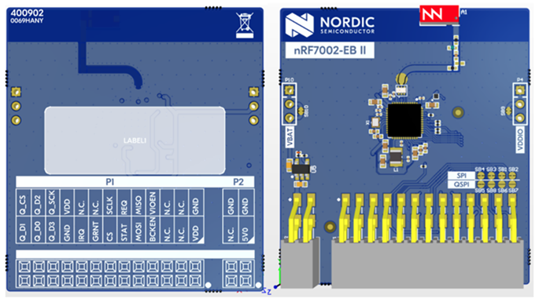

.. _ug_nrf7002eb2_gs:

Developing with nRF7002-EB II
#############################

.. contents::
   :local:
   :depth: 2

The nRF7002 :term:`Expansion Board (EB)` II (PCA63571), part of the `nRF70 Series Family <nRF70 Series product page_>`_, can be used to provide Wi-Fi® connectivity to compatible development or evaluation boards through the nRF7002 Wi-Fi 6 companion IC.

You can use the nRF7002-EB II to provide Wi-Fi connectivity to the :zephyr:board:`nrf54h20dk` and :zephyr:board:`nrf54l15dk` board targets.

   nRF7002-EB II

Pin mapping for the nRF54H20 DK and the nRF54L15 DK
***************************************************

For nRF54H20 DK and nRF54L15 DK, refer to the following tables for the pin mapping for these kits.
The board is mounted on the **P1** connector of these DKs

.. tabs::

   .. group-tab:: nRF54L15 DK

      +-----------------------------------+-------------------+-----------------------------------------------+
      | nRF70 Series pin name (EB name)   | nRF54L15 DK pins  | Function                                      |
      +===================================+===================+===============================================+
      | CLK (CLK)                         | P1.04             | SPI Clock                                     |
      +-----------------------------------+-------------------+-----------------------------------------------+
      | CS (CS)                           | P1.07             | SPI Chip Select                               |
      +-----------------------------------+-------------------+-----------------------------------------------+
      | MOSI (D0)                         | P1.06             | SPI MOSI                                      |
      +-----------------------------------+-------------------+-----------------------------------------------+
      | MISO (D1)                         | P1.05             | SPI MISO                                      |
      +-----------------------------------+-------------------+-----------------------------------------------+
      | BUCKEN (EN)                       | P1.12             | Enable Buck regulator                         |
      +-----------------------------------+-------------------+-----------------------------------------------+
      | IOVDDEN                           | P1.11             | Enable IOVDD regulator                        |
      +-----------------------------------+-------------------+-----------------------------------------------+
      | IRQ (IRQ)                         | P1.10             | Interrupt from nRF7002                        |
      +-----------------------------------+-------------------+-----------------------------------------------+
      | GRANT (GRT)                       | P1.13             | Coexistence grant from nRF7002                |
      +-----------------------------------+-------------------+-----------------------------------------------+
      | REQ (REQ)                         | P1.09             | Coexistence request to nRF7002                |
      +-----------------------------------+-------------------+-----------------------------------------------+
      | STATUS (ST0)                      | P1.08             | Coexistence status from nRF7002               |
      +-----------------------------------+-------------------+-----------------------------------------------+

   .. group-tab:: nRF54H20 DK

      +-----------------------------------+-------------------+-----------------------------------------------+
      | nRF70 Series pin name (EB name)   | nRF54H20 DK pins  | Function                                      |
      +===================================+===================+===============================================+
      | CLK (CLK)                         | P1.01             | SPI Clock                                     |
      +-----------------------------------+-------------------+-----------------------------------------------+
      | CS (CS)                           | P1.07             | SPI Chip Select                               |
      +-----------------------------------+-------------------+-----------------------------------------------+
      | MOSI (D0)                         | P1.06             | SPI MOSI                                      |
      +-----------------------------------+-------------------+-----------------------------------------------+
      | MISO (D1)                         | P1.05             | SPI MISO                                      |
      +-----------------------------------+-------------------+-----------------------------------------------+
      | BUCKEN (EN)                       | P1.02             | Enable Buck regulator                         |
      +-----------------------------------+-------------------+-----------------------------------------------+
      | IOVDDEN                           | P1.04             | Enable IOVDD regulator                        |
      +-----------------------------------+-------------------+-----------------------------------------------+
      | IRQ (IRQ)                         | P1.10             | Interrupt from nRF7002                        |
      +-----------------------------------+-------------------+-----------------------------------------------+
      | GRANT (GRT)                       | P1.03             | Coexistence grant from nRF7002                |
      +-----------------------------------+-------------------+-----------------------------------------------+
      | REQ (REQ)                         | P1.09             | Coexistence request to nRF7002                |
      +-----------------------------------+-------------------+-----------------------------------------------+
      | STATUS (ST0)                      | P1.08             | Coexistence status from nRF7002               |
      +-----------------------------------+-------------------+-----------------------------------------------+

DIP switch settings for nRF54L15 DK and nRF54H20 DK
***************************************************

The **GPIO MAP SEL** switch on the nRF7002-EB II can be used to select the GPIO mapping for the nRF54H20 DK and the nRF54L15 DK.

* **nRF54L15 DK**: Set the switch towards MAP1 (the LED will glow at the **MAP1** end).
* **nRF54H20 DK**: Set the switch towards MAP2 (the LED will glow at the **MAP2** end).

.. _nrf7002eb2_building_programming:

Building and programming with nRF7002-EB II
*******************************************

To build for the nRF7002-EB II, use a compatible :ref:`board target <app_boards_names>` with the CMake ``SHIELD`` option set to the corresponding shield name.
See :ref:`cmake_options` for instructions on how to provide CMake options.

For example, if you build the :ref:`wifi_shell_sample` sample for nRF54L15 DK on the command line, use the following command:

.. code-block:: console

   west build -p -b nrf54l15dk/nrf54l15/cpuapp -- -Dshell_SHIELD="nrf7002eb2" -Dshell_SNIPPET=nrf70-wifi

If you use |nRFVSC|, specify ``-DSHIELD=nrf7002eb2`` in the **Extra Cmake arguments** field when `setting up a build configuration <How to work with build configurations_>`_.

Alternatively, add the shield in the project's :file:`CMakeLists.txt` file by using the following command:

.. code-block:: console

   set(SHIELD nrf7002eb2)

To build for the nRF7002-EB II with nRF54H20 DK, use the ``nrf54h20dk/nrf54h20/cpuapp`` board target with the CMake ``SHIELD`` variable set to ``nrf7002eb2``.
To build for a custom target, set ``-DSHIELD="nrf7002eb2"`` when you invoke ``west build`` or ``cmake`` in your |NCS| application.

Alternatively, you can add the shield in the project's :file:`CMakeLists.txt` file by using the ``set(SHIELD nrf7002eb2)`` command.

To build for the nRF7002-EB II with the nRF54L15 DK, use the ``nrf54l15dk/nrf54l15/cpuapp`` board target with the CMake ``SHIELD`` variable set to ``nrf7002eb2``.
To build for a custom target, set ``-DSHIELD="nrf7002eb2"`` when you invoke ``west build`` or ``cmake`` in your |NCS| application.

Alternatively, you can add the shield in the project's :file:`CMakeLists.txt` file by using the ``set(SHIELD  nrf7002eb2)`` command.

To build with coexistence mode enabled, set ``-DSHIELD="nrf7002eb2;nrf7002eb2_coex"`` when you invoke ``west build`` or ``cmake`` in your |NCS| application.
For optimal build configuration, use the ``nrf70-wifi`` snippet.

Limitations when building with nRF54H20 DK and nRF54L15 DK
**********************************************************

The Wi-Fi support is experimental and has the following limitations:

* It is suitable only for low-throughput applications.
* The Wi-Fi performance is not optimized.
* Limited number of Wi-Fi samples are supported on nRF54H20 DK.
  Refer to the :ref:`wifi_samples` documentation for the supported samples.
