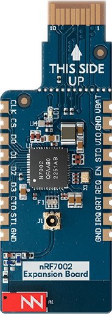

.. _ug_nrf7002eb_gs:
.. _ug_nrf7002eb_nrf54l15pdk_gs:
.. _ug_nrf7002eb_nrf54h20dk_gs:

Developing with nRF7002 EB
##########################

.. contents::
   :local:
   :depth: 2

The nRF7002 :term:`Expansion Board (EB)` (PCA63561), part of the `nRF70 Series Family <nRF70 Series product page_>`_, can be used to provide Wi-Fi® connectivity to compatible development or evaluation boards through the nRF7002 Wi-Fi 6 companion IC.
For example, you can use it with the :ref:`Nordic Thingy:53 <ug_thingy53>`, an IoT prototyping platform from Nordic Semiconductor.

You can also use the nRF7002 EB to provide Wi-Fi connectivity to the :ref:`zephyr:nrf54h20dk_nrf54h20` and :ref:`zephyr:nrf54l15pdk_nrf54l15`.

   nRF7002 EB

The nRF7002 EB features a :term:`Printed Circuit Board (PCB)` edge connector and castellated holes to provide Wi-Fi connectivity through the nRF7002 companion IC.

In case of the Nordic Thingy:53, the PCB edge connector connects nRF7002 to nRF5340, which acts as a host.
For the pinout of the PCB edge connector, see `nRF7002 EB PCB edge connector`_ in the board's `Hardware User Guide <nRF7002 EB User Guide_>`_.
For information about how to connect to the Nordic Thingy:53, see `Using nRF7002 EB with the Nordic Thingy:53`_, also in the hardware guide.

The castellated holes on the side of the board allow the EB to be used as a breakout board that can be soldered to other PCB assemblies.
This way, you can provide Wi-Fi capabilities to develop Wi-Fi applications with another System on Chip (SoC), MPU, or MCU host.
For the pinout of the castellated holes, see `nRF7002 EB castellated edge holes`_ in the board's `Hardware User Guide <nRF7002 EB User Guide_>`_.

Pin mapping for the nRF54H20 DK and the nRF54L15 PDK
****************************************************

For nRF54H20 DK and nRF54L15 PDK, refer to the following tables for the pin mapping for these kits:

.. tabs::

   .. group-tab:: nRF54H20 DK

      +-----------------------------------+-------------------+-----------------------------------------------+
      | nRF70 Series pin name (EB name)   | nRF54H20 DK pins  | Function                                      |
      +===================================+===================+===============================================+
      | CLK (CLK)                         | P1.01             | SPI Clock                                     |
      +-----------------------------------+-------------------+-----------------------------------------------+
      | CS (CS)                           | P1.04             | SPI Chip Select                               |
      +-----------------------------------+-------------------+-----------------------------------------------+
      | MOSI (D0)                         | P1.05             | SPI MOSI                                      |
      +-----------------------------------+-------------------+-----------------------------------------------+
      | MISO (D1)                         | P1.06             | SPI MISO                                      |
      +-----------------------------------+-------------------+-----------------------------------------------+
      | BUCKEN (EN)                       | P1.00             | Enable Buck regulator                         |
      +-----------------------------------+-------------------+-----------------------------------------------+
      | IOVDDEN (Not used)                | P1.00             | Enable IOVDD regulator                        |
      +-----------------------------------+-------------------+-----------------------------------------------+
      | IRQ (IRQ)                         | P1.02             | Interrupt from nRF7002                        |
      +-----------------------------------+-------------------+-----------------------------------------------+
      | GRANT (GRT)                       | P1.03             | Coexistence grant from nRF7002                |
      +-----------------------------------+-------------------+-----------------------------------------------+
      | REQ (REQ)                         | P1.08             | Coexistence request to nRF7002                |
      +-----------------------------------+-------------------+-----------------------------------------------+
      | STATUS (ST0)                      | P1.07             | Coexistence status from nRF7002               |
      +-----------------------------------+-------------------+-----------------------------------------------+

      .. note::
         Connect ``VIO`` to 1.8 V and ``VBAT`` to 3.6 V and ``GND``.

   .. group-tab:: nRF54L15 PDK

      +-----------------------------------+-------------------+-----------------------------------------------+
      | nRF70 Series pin name (EB name)   | nRF54L15 PDK pins | Function                                      |
      +===================================+===================+===============================================+
      | CLK (CLK)                         | P1.11             | SPI Clock                                     |
      +-----------------------------------+-------------------+-----------------------------------------------+
      | CS (CS)                           | P1.08             | SPI Chip Select                               |
      +-----------------------------------+-------------------+-----------------------------------------------+
      | MOSI (D0)                         | P1.10             | SPI MOSI                                      |
      +-----------------------------------+-------------------+-----------------------------------------------+
      | MISO (D1)                         | P1.09             | SPI MISO                                      |
      +-----------------------------------+-------------------+-----------------------------------------------+
      | BUCKEN (EN)                       | P1.13             | Enable Buck regulator                         |
      +-----------------------------------+-------------------+-----------------------------------------------+
      | IOVDDEN (Not used)                | P1.13             | Enable IOVDD regulator                        |
      +-----------------------------------+-------------------+-----------------------------------------------+
      | IRQ (IRQ)                         | P1.14             | Interrupt from nRF7002                        |
      +-----------------------------------+-------------------+-----------------------------------------------+
      | GRANT (GRT)                       | P1.12             | Coexistence grant from nRF7002                |
      +-----------------------------------+-------------------+-----------------------------------------------+
      | REQ (REQ)                         | P1.06             | Coexistence request to nRF7002                |
      +-----------------------------------+-------------------+-----------------------------------------------+
      | STATUS (ST0)                      | P1.07             | Coexistence status from nRF7002               |
      +-----------------------------------+-------------------+-----------------------------------------------+

      .. note::
         Connect ``VIO`` to 1.8 V and ``VBAT`` to 3.6 V and ``GND``.

.. _nrf7002eb_building_programming:

Building and programming with nRF7002 EB
****************************************

To build for the nRF7002 EB, build for the compatible :ref:`board target <app_boards_names>` with the CMake ``SHIELD`` option set to the corresponding shield name.
See :ref:`cmake_options` for instructions on how to provide CMake options.

For example, if you build for Thingy:53 on the command line, you can use the following command:

.. code-block:: console

   west build -b thingy53/nrf5340/cpuapp -- -DSHIELD=nrf7002eb

If you use the |nRFVSC|, specify ``-DSHIELD=nrf7002eb`` in the **Extra Cmake arguments** field when `setting up a build configuration <How to work with build configurations_>`_.

Alternatively, add the shield in the project's :file:`CMakeLists.txt` file by using the following command:

.. code-block:: console

   set(SHIELD nrf7002eb)

To build for the nRF7002 EB with nRF54H20 DK, use the ``nrf54h20dk/nrf54h20/cpuapp`` board target with the CMake ``SHIELD`` variable set to ``nrf700x_nrf54h20dk``.
To build for a custom target, set ``-DSHIELD=nrf700x_nrf54h20dk`` when you invoke ``west build`` or ``cmake`` in your |NCS| application.
Alternatively, you can add the shield in the project's :file:`CMakeLists.txt` file by using the ``set(SHIELD nrf700x_nrf54h20dk)`` command.

To build for the nRF7002 EB with the nRF54L15 PDK, use the ``nrf54l15pdk/nrf54l15/cpuapp`` board target with the CMake ``SHIELD`` variable set to ``nrf700x_nrf54l15pdk``.
To build for a custom target, set ``-DSHIELD=nrf700x_nrf54l15pdk`` when you invoke ``west build`` or ``cmake`` in your |NCS| application.
Alternatively, you can add the shield in the project's :file:`CMakeLists.txt` file by using the ``set(SHIELD nrf700x_nrf54l15pdk)`` command.

Limitations when building with nRF54H20 DK and nRF54L15 PDK
***********************************************************

The Wi-Fi support is experimental and has the following limitations:

* It only supports STA mode.
* It is only suitable for low-throughput applications.
* For nRF54L15 PDK, WPA3 security mode is not supported.
