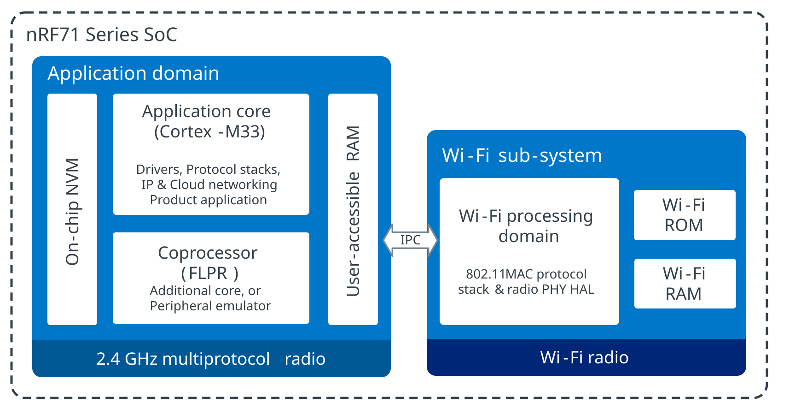

.. _ug_nrf71_features:

Features of nRF71 Series
########################

.. contents::
   :local:
   :depth: 2

The nRF71 Series devices are ultra-low power System-on-Chips (SoCs) integrating a tri-band Wi-Fi® 6E radio with a 20 MHz channel bandwidth, and a multiprotocol 2.4 GHz transceiver supporting Bluetooth® Low Energy, IEEE 802.15.4 for Thread and Zigbee, and proprietary 2.4 GHz protocols.
The nRF71 Series is based on the nRF54L Series system architecture and inherits key features such as hardware security, the coprocessor framework, the 2.4 GHz multiprotocol radio, and the core peripheral set.
The nRF71 Series SoCs are designed to support a wide range of wireless networking and cloud IoT applications.

Multi-core architecture
***********************

The nRF71 Series devices are built around a multi-core architecture and consist of the following processing domains:

* A 256 MHz Arm® Cortex®-M33 application core (MCU) for application execution and networking stack processing.
* A 256 MHz RISC-V Fast Lightweight Peripheral Processor (FLPR) core, used as a coprocessor.
* A dedicated Wi-Fi sub-system for offloading and running the Wi-Fi (IEEE 802.11) MAC layer.

This architecture allows application logic to run on the main MCU while tasks can be offloaded to the FLPR coprocessor.

Communication and data exchange between the application core, the FLPR coprocessor, and the Wi-Fi sub-system occur through an Interprocessor Communication (IPC) Service, through a shared memory area.

   nRF71 Series top-level application architecture

.. _ug_nrf71_intro_app_core:

Application core
================

The application core is intended to run the main application on the device, the Wi-Fi host driver and the IP networking stack, as well as the 2.4 GHz multi-protocol radio stacks, such as Bluetooth® Low Energy, Thread, Enhanced ShockBurst (ESB), and other proprietary protocols.

The application core includes several hardware security features:

* Arm TrustZone® for hardware-enforced isolation between secure and non-secure processing environments.
* A CRACEN cryptographic accelerator for encryption, decryption, and cryptographic operations.
* A Key Management Unit (KMU) for the secure storage of cryptographic keys.

These elements provide a platform for secure execution environments and secure data handling.

You can use :ref:`security by separation <ug_tfm_security_by_separation>` with the Cortex-M33 TrustZone® on the application core.
When enabled, :ref:`Trusted Firmware-M (TF-M) <ug_tfm>` configures part of the memory and peripherals as non-secure and then jumps to the user application located in the non-secure area.

For example, on the nRF7120 DK, the firmware on the application core is built using one of the following board targets:

* ``nrf7120dk/nrf7120/cpuapp`` for board targets with security by separation disabled.
* ``nrf7120dk/nrf7120/cpuapp/ns`` for board targets with security by separation enabled.

.. _ug_nrf71_intro_flpr_core:

FLPR coprocessor
================

The Fast Lightweight Peripheral Processor (FLPR) is a RISC-V core that operates as a coprocessor to the application core.
Use this core to offload processing tasks from the application core.

For example, on the nRF7120 DK, the firmware on the FLPR core is built using the ``nrf7120dk/nrf7120/cpuflpr`` board target.

Supported protocols
*******************

The nRF71 Series supports several protocols, including the following:

* Wi-Fi
* Bluetooth Low Energy
* Thread (IEEE 802.15.4)
