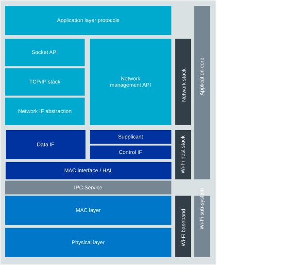

.. _ug_nrf71_stack_partitioning:

Networking stack partitioning in Wi-Fi applications
###################################################

.. contents::
   :local:
   :depth: 2

In the nRF71 Series SoCs, the Physical (PHY) and Medium Access Control (MAC) layers of the IEEE 802.11 protocol stack run on the Wi-Fi sub-system, a dedicated processing domain.
The higher layers of the networking stack, namely the :ref:`nRF71 Series Wi-Fi driver <nrf71_wifi_fw_if>` and supplicant, the TCP/IP stack, and the networking application layers, run on the nRF71 Series application core.

The following figure illustrates the partitioning of the Wi-Fi stack between the application core and the Wi-Fi sub-system of the nRF71 Series SoC:

   Overview of nRF71 Series Wi-Fi application architecture
