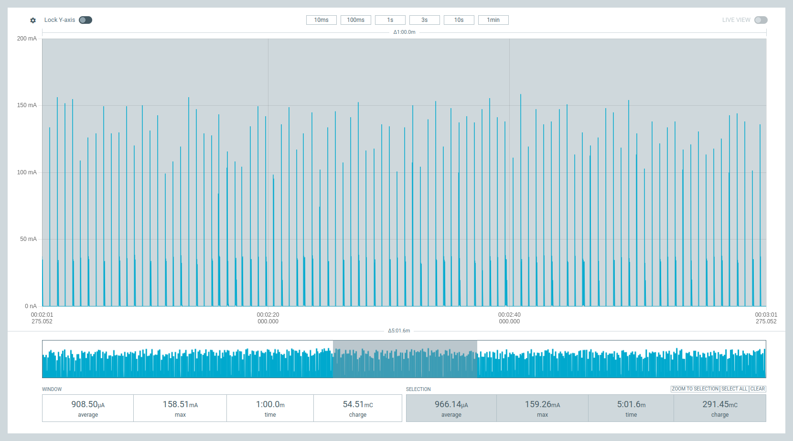
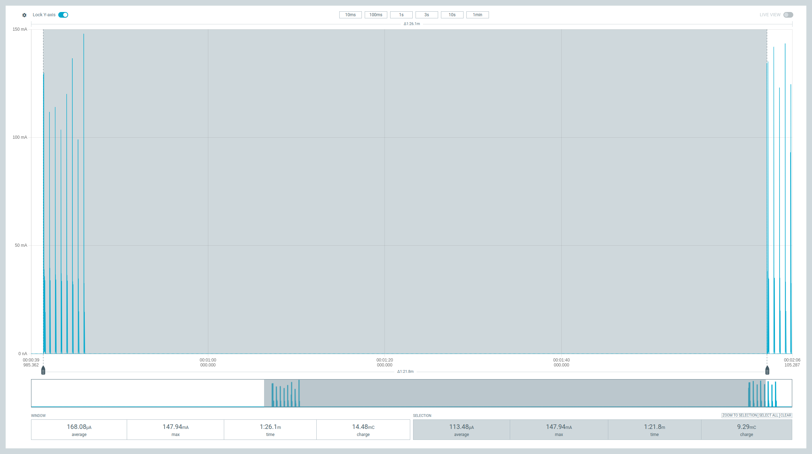
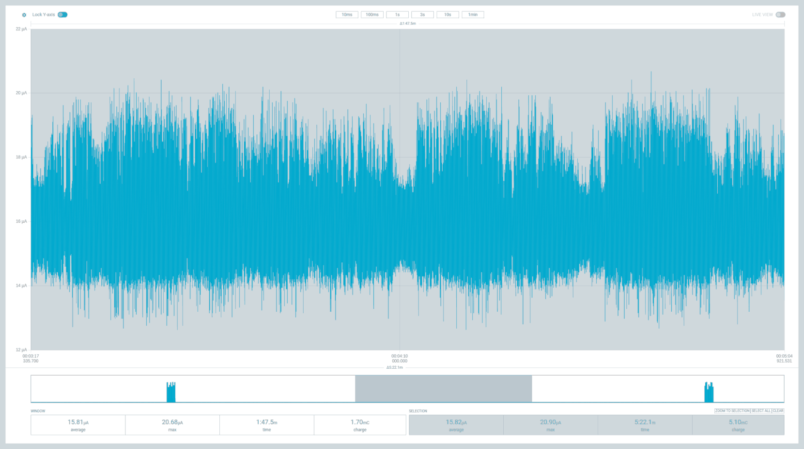
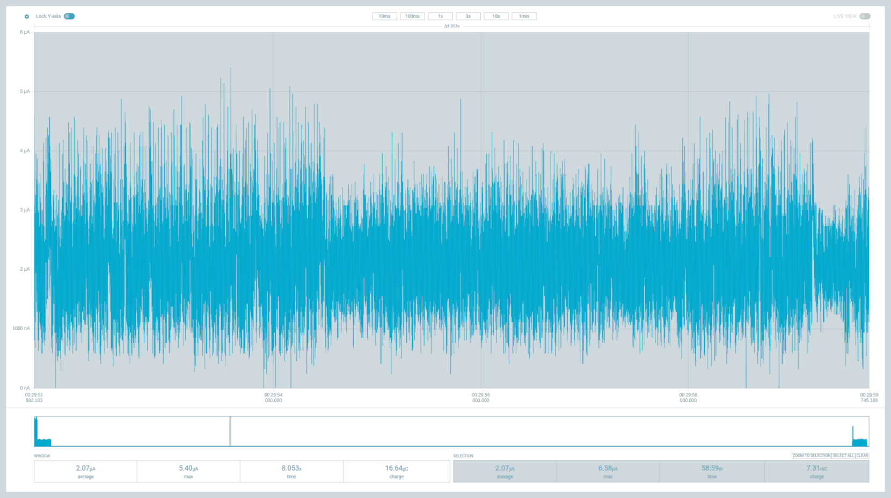
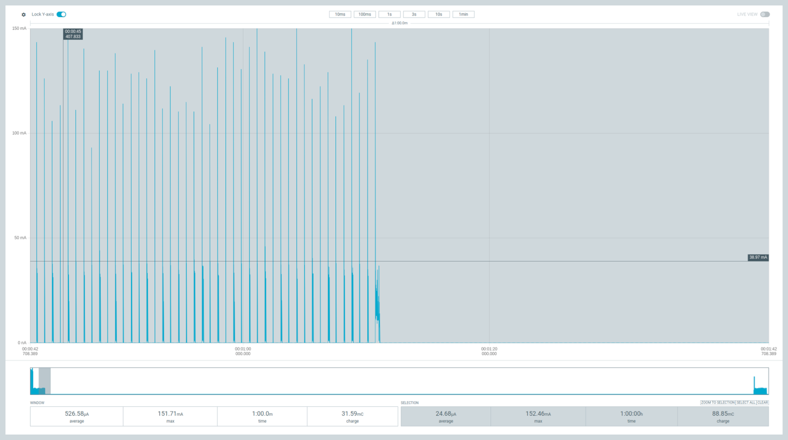

.. _ug_nrf93m1_power_optimization:

Optimizing power consumption
############################

.. contents::
   :local:
   :depth: 2

The module manages its own power consumption.
It continuously selects the most efficient internal configuration compatible with the current modem state, the configured power-saving parameters, and host interface activity.

Your host application does not select a sleep level, and the module does not expose one for configuration.

For current consumption figures, see the current consumption section of the `nRF93M1 Datasheet`_.

.. _ug_nrf93m1_power_optimization_modes:

System power modes
******************

The module has three system-wide power modes.

.. list-table::
   :header-rows: 1

   * - Mode
     - What is retained
     - Entry
     - Exit
   * - System ON
     - Everything, including sockets, TLS and DTLS sessions, and network registration
     - ``POWERKEY`` low for at least 10 ms from System Disabled
     - Automatic sleep and wake within the mode
   * - System OFF
     - Network registration and configured wake sources. SRAM is not retained and ongoing tasks are
       terminated.
     - ``AT%SYSOFF=1``
     - Any configured wake source, or ``AT%SYSOFF=0``
   * - System Disabled
     - Nothing. The module is deregistered from the network.
     - Default after VDD is applied, ``AT%POWD``, or ``POWERKEY`` low for at least 650 ms
     - ``POWERKEY`` low for at least 10 ms, followed by a full boot and network attach

.. note::
   System OFF is opt-in.
   The module does not enter it automatically as part of normal power saving.
   Enable it with ``AT%SYSOFF=1``, which requires UART1 at a fixed baud rate of 9600 or lower.
   Automatic baud rate detection, or any higher rate, returns ``+CME ERROR: operation not allowed``.

Read both the configured setting and the current state:

.. code-block:: console

   AT%SYSOFF?
   %SYSOFF: 1,0
   OK

The first value is the configured mode.
The second value indicates whether the module has just woken from System OFF.
Because the configuration survives a reset, a host can check the first value at startup to detect that a previous session left System OFF enabled.

.. note::
   ``AT%POWD`` and ``AT%SYSOFF`` are not interchangeable.
   ``AT%POWD`` enters System Disabled, which retains nothing, deregisters from the network, and can only be woken with ``POWERKEY`` followed by a full boot and attach.
   ``AT%SYSOFF=1`` enters System OFF, which retains network registration and has several wake sources.
   Using ``AT%POWD`` where you intended System OFF produces a device that appears to have failed, because nothing except ``POWERKEY`` will bring it back.

.. important::
   The System OFF configuration set by ``AT%SYSOFF=1`` survives ``nRESET`` and a ``POWERKEY`` power cycle.
   After a reset the module returns to System OFF rather than to normal operation.
   Disable System OFF with ``AT%SYSOFF=0`` before you change the UART configuration.

.. _ug_nrf93m1_power_optimization_config:

Configuring power saving
************************

This section describes how to configure the power mode for power saving.

Enabling automatic power saving
===============================

Use the following AT command to enable automatic power saving on the device:

.. code-block:: console

   AT%MODULECFG="autoPowerSave",1
   OK

There are following important constraints:

* The setting can be changed only while the current sleep mode is System ON IDLE, so not while the module is already in power-saving sleep.
* It takes effect when the radio is activated.
* It is not retained across a reset, so your host must re-apply it after every restart.

Power saving is disabled at boot.
Disabled is the correct configuration for RF testing, for provisioning, and for any period in which peripheral or general-purpose I/O functionality must stay available.

.. note::
   Power saving does not engage before the modem attaches.
   During network search, registration, and attach retries the module draws its full System ON current.
   Budget for this if your device operates in marginal coverage, because repeated attach attempts can dominate the energy budget.

Tuning the wake window
======================

.. code-block:: console

   AT%MODULECFG="slpWaitTime",<ms>
   OK

This command sets how long the module stays awake after each wake-up.
The default is 1000 ms.
Reducing it lowers the average current on short duty cycles.

PSM
===

.. code-block:: console

   AT+CPSMS=1,,,"<T3412-ext>","<T3324>"
   OK

The network sets the granted timer values and can reject PSM entirely.
Operator-specific minimums apply.
For example, some networks enforce a minimum T3412 of 190 minutes.
Always read back the granted values instead of assuming your requested values were applied.

eDRX
====

.. code-block:: console

   AT+CEDRXS=2,4,"<eDRX value>"
   OK
   AT%PTWEDRXS=<paging time window settings>
   OK
   AT+CEDRXRDP
   OK

``%PTWEDRXS`` configures the Paging Time Window (PTW) together with the requested eDRX parameters.
You can request a PTW from 1.28 s to 20.48 s.
Operator minimums apply here as well.
For example, some networks enforce a minimum of 5.12 s.

``AT+CEDRXRDP`` reads back the negotiated parameters.

eDRX and PSM are complementary and can be enabled together.

Connected DRX
=============

.. code-block:: console

   AT%MODULECFG="pmuInCdrx",1
   OK

``1`` allows deep sleep during connected DRX and is the default.
``0`` inhibits it.

Idle-mode DRX parameters are set by the network, and no host command changes them.

.. _ug_nrf93m1_power_optimization_wake:

Designing the host wake path
****************************

``UART1_DTR`` and ``UART1_RI`` let the host MCU and the module sleep and wake independently, with no data loss and without spending an extra GPIO.

DTR is the host wake signal
   Assert DTR to bring the module out of power-saving sleep before the host transmits.

RI is the module's data-ready signal
   The module asserts RI when it has data for the host, and de-asserts it once it is ready to receive.
   RI can therefore serve as the host MCU's own wake source, which lets the host sleep during idle
   periods.

The module buffers incoming network data while the host wakes, so nothing is lost even if the host is waking from a deep sleep state of its own.

With hardware flow control, the host watches its CTS pin, driven by the module's UART1 RTS, to know when the module can accept data.
A pull-up on the host CTS pin is required.
Without hardware flow control, the host monitors RI, or waits at least the module wake latency between asserting DTR and its first transmit.

.. important::
   DTR is the only host wake path that is independent of baud rate.
   Wake on incoming UART data requires UART1 at a fixed 9600 baud or lower before sleep is entered.
   A design that must keep UART1 at 115200 bps has to use DTR to wake the module.

.. _ug_nrf93m1_power_optimization_recommended:

Recommended configuration
*************************

The commands mentioned in the :ref:`ug_nrf93m1_power_optimization_config` section select the power mode.
The following settings reduce current further by disabling functions a deployed device does not need.
Apply them once during provisioning, and check that each returns ``OK`` before continuing.

.. code-block:: console

   AT+IPR=9600
   OK
   <change the host or terminal UART to 9600 bps>
   AT%MODULECFG="ledMode",0
   OK
   AT%MODULECFG="logCtrl",0
   OK
   AT%MODULECFG="usbCtrl",2
   OK
   AT%MODULECFG="usbSlpMask",1
   OK
   AT%SIMCFG="SimPowerSave",1
   OK
   AT%SIMCFG="SimPresenceDetect",0
   OK

Order matters for the first command.
``AT+IPR=9600`` takes effect immediately, so the host UART must change to 9600 bps before the remaining commands are sent.

The following settings remove wake sources:

* ``SimPresenceDetect",0`` disables SIM hot-swap detection, so SIM presence transitions no longer wake the module.
   Leave presence detection enabled on designs with a user-accessible SIM slot that must react to a card being inserted or removed.

* ``usbCtrl",2`` disables the USB device interface.
   Designs that rely on USB ``VBUS`` detect as a wake source, or that use USB for AT control, network data, or trace, should leave USB enabled and use ``usbSlpMask`` alone to stop USB from holding the module awake.

.. note::
   Disabling trace output with ``logCtrl",0`` also disables the diagnostic stream Nordic technical support uses.
   Re-enable it before capturing a trace for a support case.

.. _ug_nrf93m1_power_optimization_verify:

Verifying behavior
******************

A successful configuration command does not guarantee that the module sleeps.
To check the actual behavior, use the ``%SLEEPMODE`` URC, which the module emits on every sleep transition without requiring a subscription.
The URC reports the following modes:

.. list-table::
   :header-rows: 1

   * - ``%SLEEPMODE: <mode>``
     - Meaning
   * - 0
     - Entering or returning to System ON Active
   * - 2
     - Entering System ON Idle with power saving
   * - 3
     - Entering System ON Idle with deep power saving
   * - 4
     - Entering System OFF

Mode ``4`` confirms that the module entered System OFF.
Repeated ``0`` transitions indicate that the host is waking the module more often than intended.

If the module does not appear to sleep, check the following in order:

#. ``autoPowerSave`` is enabled and was reapplied after the last reset.
#. The modem has attached to the network.
   Power saving does not engage before attach.
#. The network granted the PSM or eDRX parameters you requested.
#. USB is not holding the module awake.
   See ``usbSlpMask`` in :ref:`ug_nrf93m1_power_optimization_measure`.
#. The host is not holding ``UART1_DTR`` asserted.
#. The host is not polling the module or enabling URCs that wake it.
   Polling on a timer raises the average current above the level the configured cycle would otherwise achieve.
#. The idle gaps are long enough for the module to enter a power-saving state.
   Very short gaps do not trigger a transition.

.. _ug_nrf93m1_power_optimization_measure:

Power consumption measurements
******************************

The nRF93M1 achieves low power consumption through its System Disabled, System OFF, and System ON Idle operating states.

To measure each state in a simple, predictable, and repeatable way, the module provides two proprietary commands, ``%MODULECFG="autoPowerSave"`` and ``%SYSOFF``, that place it in a known state on demand.
Do not use these commands in a final product, where power management is automated based on the host and LTE modem state.

The plots in the following sections were captured with the `Power Profiler Kit II (PPK2)`_.
For details on connecting the PPK2 to the nRF93M1 DK, see section 4 in the `nRF93M1 DK Hardware User Guide`_.

.. note::
   Set UART1 to 9600 baud or lower with ``AT+IPR`` before the module enters System OFF.
   At higher baud rates, UART data cannot wake the module and recovery requires ``POWERKEY`` or a power cycle.
   Use DTR if the design must stay at 115200 bps.

Before you start any power measurements or use the power management commands, complete the following steps:

#. Set the module UART to 9600 bps, which enables the low-power UART mode that can wake the module from System OFF:

   .. code-block:: console

      AT+IPR=9600
      OK

#. Set your serial terminal software to 9600 bps.

   .. figure:: images/nrf93m1_serial_terminal.png
      :alt: Serial Terminal with 9600 baud configurations

      Serial Terminal with 9600 baud configurations

#. Configure the module for optimal power usage:

   .. code-block:: console

      AT%MODULECFG="ledMode",0 // power off LED
      OK
      AT%MODULECFG="logCtrl",0 // disable log output
      OK
      AT%MODULECFG="usbCtrl",2 // disable USB
      OK
      AT%MODULECFG="usbSlpMask",1 // mask voting
      OK
      AT%SIMCFG="SimPowerSave",1 // enable SIM power save
      OK
      AT%SIMCFG="SimPresenceDetect",0 // disable SIM detection
      OK
      AT%MODULECFG="autoPowerSave",1  // Enable System ON Idle with power saving
      OK
      AT%MUCFG=1,4 // Enter System OFF mode
      OK

Guidelines for exiting sleep
============================

The ``AT+IPR command`` must set the UART to baud rate 9600 bps for the nRF93M1 to be able to wake-up from UART during deep sleep such as System OFF.
If the baud rate is set higher and the device enters deep sleep, the UART will not be able to wake up the module.
In such cases, you must use the POWERKEY pin or power cycle the device.

Before changing baud rate to values above 9600, make sure ``%SYSOFF`` is disabled or in System ON IDLE mode.

.. code-block:: console

   AT%SYSOFF?
   %SYSOFF: 1,0
   OK
   AT%SYSOFF=0 // Disable System OFF mode
   OK
   AT+IPR=115200 // Baudrate now can be set to any value
   OK

To reset the module completely, use ``AT%FACTORYRESET``:

.. code-block:: console

   AT%FACTORYRESET
   OK

A factory reset will also set the UART baud rate to the default value of 115200 bps.

Current measurements
====================

To reproduce these results, set the UART to 9600 bps or lower, then enter System OFF as described in the :ref:`ug_nrf93m1_power_optimization_measure` section.

In the first measurement, the modem is set to minimal functionality:

.. code-block:: console

   AT+CFUN=0 // Modem set to minimal functionality
   OK

The following plot is generated using the nRF Connect for Desktop Power Profiler app in source meter mode:

The average current in offline or flight mode is 2.03 µA.

The nRF93M1 is set in full functionality mode.
During this measurement, the network configured the nRF93M1 to enter RCC Idle with a 640 ms DRX cycle.

.. code-block:: console

   AT+CFUN=1 // Modem set to full functionality
   OK

The average current in RCC Idle with 640 ms DRX cycle is 345 µA.

The nRF93M1 is configured to enter eDRX sleep mode and is granted 81.92 seconds eDRX intervals with 5.12 seconds Paging Time Window (PTW) and 640ms Paging Occasion.

.. note::
   Most mobile networks have not yet rolled out eDRX support for LTE Cat 1 bis devices.

.. code-block:: console

   AT+CPSMS=0 // Disable PSM
   OK
   AT+CEDRXS=1,4,0101 // request eDRX interval of 81.92 seconds
   OK
   AT+CEDRXRDP // (optional) read eDRX dynamic parameters
   +CEDRXRDP: 4,"0101","0101","0011"
   OK

The average eDRX floor current is around 15.82 µA.
The complete eDRX cycle average is 100 µA, including the 5.12 s PTW and 640 ms PO interval where the nRF93M1 will have 8 RX events with around 100 mA peak current.

The nRF93M1 is now configured for PSM sleep, requesting a periodic update interval of 3600 seconds (1 hour) with an active time of 60 seconds.

.. code-block:: console

   AT+CEDRXS=0 // Disable eDRX
   OK
   AT+CPSMS=1,,,"00000110","00100001" // Request PSM 3600 seconds
   OK

The average PSM floor current is around 2 µA.

   nRF93M1 PSM sleep current measurement

The following is the complete cycle that includes the Tracking Area Update (TAU) of 60 minutes and 60 seconds of active time, where the modem monitors for paging occasions (DRX) to receive any pending data for the network.

   nRF93M1 PSM cycle with active time

The average current for the complete cycle is 24.68 µA.

Interpreting results
====================

Differentiate the two numbers to avoid common confusion:

Sleep current
   The current drawn while the module is in a sleep state with nothing else happening.
   Useful for comparing states, but it does not predict battery life.

Cycle average
   The average current over a complete duty cycle, including wake, paging, transmit, and sleep.
   This is the number that determines battery life.

A sleep current figure quoted on its own overstates expected battery life, sometimes by an order of magnitude, because real duty cycles include periodic paging, transmission, and attach retries.
Size batteries from a cycle average measured with your own traffic pattern, in coverage representative of your deployment.

.. _ug_nrf93m1_power_optimization_monitoring:

Supply and temperature monitoring
*********************************

The module exposes battery voltage and internal temperature:

.. code-block:: console

   AT%ADC="vbat"
   AT%ADC="temp"
   AT%ADC="all"

Threshold events arrive as ``%PALARM`` unsolicited result codes, covering a low-voltage alarm and a die-temperature alarm.

.. important::
   ``%ADC`` and ``%PALARM`` monitoring work in System ON active operation only.
   These domains are powered down during power-saving sleep.

.. _ug_nrf93m1_power_optimization_checklist:

Design guidance
***************

Apply the following guidance when you design a battery-powered product around the nRF93M1.

Choose the AT command model for battery designs
   Running PPP on the host keeps the host IP stack alive and limits how deeply the host can sleep.
   See :ref:`ug_nrf93m1_architecture`.

Avoid USB as the data interface in battery designs
   USB votes to keep the module awake. Use UART, and use ``usbSlpMask`` if USB must remain enabled.

Design wake around DTR, RI, USB ``VBUS``, or a 9600 baud UART
   General-purpose GPIO is not a wake path.

Batch transmissions
   Each wake and paging cycle costs energy. One larger message costs less than several small ones.

Re-apply ``autoPowerSave`` after every reset
   It is not retained. A device that silently stopped sleeping after a watchdog reset is a common field failure.
