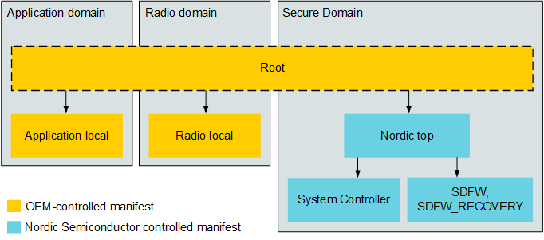

.. _ug_nrf54h20_suit_hierarchical_manifests:

Hierarchical manifests
######################

.. contents::
   :local:
   :depth: 2

The Software Updates for the Internet of Things (SUIT) procedure provides the option to employ a hierarchical manifest system.
The SUIT DFU procedure could be executed with a single manifest; however, this approach would lead to certain limitations as multiple manifests offer more tailored-control of the DFU process.
Having multiple, unrelated manifest in the system raises the risk of system inconsistency.
To mitigate this risk, a specific manifest hierarchy has been introduced.

Additionally, splitting the system into more than one part (each described by a separated manifest) allows for:

* Assigning different signing authorities per system parts, (a single part is represented by a single SUIT manifest).
* Assigning different access rights to certain memory locations on the device.
  (Due to security reasons, you cannot use the manifest representing the radio domain to install, alter, read-out images or memory locations assigned to the application domain.)
* Possibility to assign different downgrade prevention or signing verification policies per single domain.

Manifest topology
*****************

Manifest are organized in a hierarchy-tree structure consisting of a single root manifest and several dependency manifests:

.. figure:: images/nrf54h20_suit_manifest_topology.png
   :alt: Hierarchical manifest topology

   Hierarchical manifest topology

Default manifest topology for the nRF54H20 SoC
**********************************************

The following image shows the default manifest topology for the nRF54H20 SoC:

   Default manifest topology for the nRF54H20 SoC

Manifest located in the lowest positions of the hierarchy (such as the application local, radio local, System Controller, SDFW, and SDFW_Recovery manifests) contain a specific updatable image for a specific core/domain of the device.
The Nordic Top manifest coordinates update and invocation logic for its dependencies (System Controller and SDFW).
The root manifest bundles all other manifests together and coordinates the entire DFU process.

By default, using SUIT’s hierarchical manifest involves using your own generated manifests (OEM-controlled) in combination with manifests provided by Nordic Semiconductor (particularly for the Secure Domain (SecDom) and System Controller).
An example of how this would be implemented includes:

* OEM-controlled manifests:

   * A root manifest that coordinates update and invocation processes on its dependency manifests.
     It does not belong to any domain or control any local domain resources.

   * A dependency manifest for each of the domains, such as the application and radio domains.

* Nordic Semiconductor controlled manifests - For the SecDom, including the System Controller.
  They will be released by Nordic Semiconductor and can be incorporated into the firmware update package prepared by the OEM.

To perform a DFU procedure on the nRF54H20 SoC, you can use manifest templates provided by Nordic Semiconductor and the **suit-generator** to create an update package.
See the :ref:`ug_nrf54h20_suit_customize_dfu` user guide for instructions and example use cases.

If the manifest templates provided by Nordic Semiconductor do not address your specific needs, you can modify them.
Read the :ref:`ug_suit_use_own_manifest` section of the :ref:`ug_nrf54h20_suit_customize_dfu` user guide for instructions.

Alternatively, you can use the manifest generator (**suit-generator**) to create your own manifests from scratch.
See the :ref:`ug_suit_use_own_manifest` section of the :ref:`ug_nrf54h20_suit_customize_dfu` user guide for instructions.
