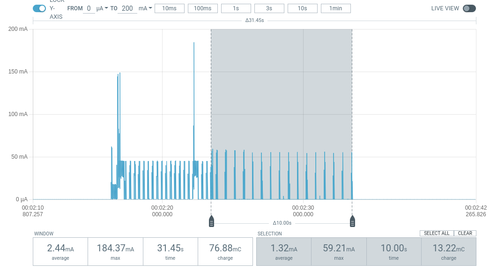

.. _app_power_opt_nRF9160:

Power optimization for nRF9160
##############################

.. contents::
   :local:
   :depth: 2

In addition to the :ref:`general power optimization recommendations <app_power_opt_general>`, you can use the `Online Power Profiler (OPP)`_ when optimizing the power consumption of your nRF9160 application.

Online Power Profiler for LTE is a tool to estimate the current consumption of the nRF9160 LTE modem.
See the `Online Power Profiler user guide`_ for a basic overview of the tool and explanation of different parameters.

The following sections describe how you can use Online Power Profiler and other power profiling tools to optimize the power consumption in your nRF9160-based design.

Cellular applications
*********************

An nRF9160 DK can draw current ranging from a few micro amperes (in sleep mode) to hundreds of milli amperes (when the radio is active).
To achieve long battery life, it is crucial that the application is optimized in the use of the radio.

PSM usage
=========

Power Saving Mode (PSM) enables the modem to enter deep sleep when it does not need to communicate with the network.
The modem can spend most of the time in deep sleep, only waking up when data needs to be sent or received.
When implementing an application that uses PSM, keep in mind that requesting PSM does not mean that the modem can always enter PSM.

Possible cases when PSM cannot be used:

* Network does not support PSM.
* Roaming network supports PSM, but does not allow the roaming subscription to use it.
* Modem does not find a suitable cell (a cell that provides normal service for the device).

You can detect the first two cases by checking the ``+CEREG`` notification or ``AT%XMONITOR`` command output for Active-Time granted by the network.
If the Active-Time is ``11100000``, the timer is deactivated and PSM cannot be used.
Using the :ref:`lte_lc_readme` library, the Active-Time is notified with the :c:enum:`LTE_LC_EVT_PSM_UPDATE` event and can be queried using the :c:func:`lte_lc_psm_get` function.
Depending on the use case, it may be preferable to set the modem to offline mode during long periods of inactivity to save power when PSM is not available.

The third case can happen when cellular network coverage is poor.
After the modem has entered PSM, it stays in deep sleep regardless of cellular network availability.
When the modem wakes up from PSM to transmit data or to do a periodic Tracking Area Update (TAU), it starts searching for a suitable cell.
If a suitable cell is not found during the initial search, the modem will continue periodic cell searches until a suitable cell is found.
Because modem can only enter PSM when it’s in registered state and camped on suitable cell, the modem cannot enter PSM until a suitable cell has been found.

The following sections introduce ways to mitigate the increased power consumption caused by poor cellular coverage.

Making periodic cell searches less frequent
-------------------------------------------

You can modify the periodic cell search configuration to perform periodic searches less frequently.
Use the ``AT%XDATAPRFL`` command to set the data profile to "ultra-low power" or modify the cell search configuration directly using ``AT%PERIODICSEARCHCONF`` or the :c:func:`lte_lc_periodic_search_set` function.
For example, you can configure periodic searches to be performed infrequently and when data connectivity is needed, trigger an extra search immediately using ``AT%PERIODICSEARCHCONF=3`` or the :c:func:`lte_lc_periodic_search_request` function.
In addition to periodic cell searches, the modem may remain in limited service on a cell that does not provide normal service for the device.
This prevents the modem from going to deep sleep between periodic cell searches.

Setting modem to offline mode when it cannot enter PSM
------------------------------------------------------

If the modem does not enter PSM as expected, the application can set the modem to offline mode to prevent excessive current consumption when it cannot find a suitable cell.
To detect this, monitor the modem sleep notifications.

Preconditions:

* PSM has been negotiated with the network.
* ``+CSCON`` RRC connection status notifications have been subscribed.
* ``%XMODEMSLEEP`` modem sleep notifications have been subscribed.
* User data communication has been completed.

To check whether the modem is able to activate PSM after RRC connection release, complete the following steps:

1. Wait for AT notification indicating that RRC connection was released (``+CSCON: 0`` or :c:enum:`LTE_LC_EVT_RRC_UPDATE` event with RRC mode set to :c:enum:`LTE_LC_RRC_MODE_IDLE`).
#. Read PSM active time using ``AT%XMONITOR`` or the :c:func:`lte_lc_psm_get` function.
   The active time is used in Step 3.
#. Wait for ``%XMODEMSLEEP: 1`` notification or :c:enum:`LTE_LC_EVT_MODEM_SLEEP_ENTER` event with type :c:enum:`LTE_LC_MODEM_SLEEP_PSM` indicating that modem has entered PSM.
   If this notification is not received within PSM active time (allow for some margin), the modem was not able to enter PSM.

   If ``%XMODEMSLEEP: 3`` notification or :c:enum:`LTE_LC_EVT_MODEM_SLEEP_ENTER` event with type :c:enum:`LTE_LC_MODEM_SLEEP_LIMITED_SERVICE` is received while waiting for PSM, the cell has been lost and the modem cannot enter PSM.
   You can use this as a trigger to set the modem to offline mode quicker in this case, but it is not mandatory.
#. If RRC connection is activated again (``+CSCON: 1`` or :c:enum:`LTE_LC_EVT_RRC_UPDATE` event with RRC mode set to :c:enum:`LTE_LC_RRC_MODE_CONNECTED`) while waiting for PSM, go back to Step 1.

Power profiling example use case
================================

To optimize the power, perform the following steps:

1. Simulate your use case with Online Power Profiler.
#. Perform real-time current measurements using Power Profiler Kit II with the configuration obtained from Online Power Profiler.
#. Use the results from the Power Profiler Kit II measurements to tune the simulation results in Online Power Profiler.

Specifications for the example use case:

* Application - A battery driven sensor application
* Battery life - Two years battery life on 1000 mAh 3.7V battery
* Measurement characteristics:

  * Measurements every ten minutes
  * Each measurement equals 20 bytes of payload
  * Frequency of payload transfer aligned with the expected 2-year battery life

* Transport - UDP
* Network - LTE-M with PSM support

Assumptions:

* Data is sent on a regular basis.
* The network is not present in the drop-down list corresponding to :guilabel:`Preset network parameters` in Online Power Profiler.

.. note::
   All measurements and calculations in the example use case are based on nRF9160 Revision 2.

Simulation using Online Power Profiler
--------------------------------------

To simulate the use case with Online Power Profiler, complete the following steps:

1. Start the simulation in Online Power Profiler with the default settings and add the following changes to the default configuration:

   A. In the **PSM** section on the left, set **Active time (sec)** to ``0`` (indicating that the device does not need to be active after sending the payload).
   #. In the **Data transfer** section on the left, select :guilabel:`Upload` from the **Enable** drop-down menu. The **Data size (bytes)** and **Data transfer interval (sec)** options are now visible. Set the options to the following values:

     a. Set **Data size (bytes)** to ``20``.
     #. Set **Data transfer interval (sec)** to ``600`` (10 minutes).

	The following image shows the result of the power profile simulation using Online Power Profiler:

	.. figure:: images/app_power_opt_opp_default_20byte_10min.png
	   :width: 100 %
	   :alt: Online Power Profiler simulation for 20 bytes payload with 10 minutes interval

	The total average current is now 82.84 µA.
	However, the battery charge is 1000 mAh.
	If you are targeting the application to run for two years on a single battery, the maximum average current that can be allowed for the use case is 57 µA (1000 mAh/two years).
	Hence, the estimation must target in bringing down the average current to or below 57 µA.

#. Tune the current estimation:

	a. Set **Data size(bytes)** to 40.
	#. Set **Data transfer interval (sec)** to 1200 (20 minutes).

	The tuning of parameters results in the following output in Online Power Profiler:

	.. figure:: images/app_power_opt_opp_default_40_byte_20min.png
	   :width: 100 %
	   :alt: Online Power Profiler simulation for 40-byte payload with 20 minutes interval

	The average current is now 42.96 µA, which is below the calculated maximum limit of 57 µA.

#. Export the settings from the Online Power Profiler tool and compare them with the measurements in real networks.
   Complete the following sub-steps to export the settings from Online Power Profiler:

   a. Click :guilabel:`Export settings` to store current Online Power Profiler settings to a :file:`.json` file.
   #. Click :guilabel:`Export NCS project config` to export the configuration parameters in an :file:`opp.conf` file that you can use when building the firmware.

Real-time power measurement using Power Profiler Kit II
-------------------------------------------------------

After exporting the settings from Online Power Profiler, use the settings while measuring current on an nRF9160 DK.
To measure current on an nRF9160 DK using the Power Profiler Kit II, while it is connected to a live network, complete the following steps:

1. Connect Power Profiler Kit II to an nRF9160 DK as described in `Power Profiler Kit II user guide <Power Profiler Kit II (PPK2)_>`_.
#. Navigate to the :ref:`udp` sample in |NCS| and copy the contents of the :file:`opp.conf` file that you exported from Online Power Profiler into the :file:`prj.conf` file in the UDP sample folder (``samples\\nrf9160\\udp``).
#. :ref:`Build and program the sample onto the nRF9160 DK <gs_programming>`.
#. If PSM is available in your network, the power measurement using Power Profiler Kit II produces the following results:

   .. figure:: images/app_power_opt_ppk_psm.png
      :width: 100 %
      :alt: Power Profiler Kit II sample output with PSM

   If PSM is activated, you can see that the current value drops to a few µA.
   As long as the PSM mode is activated and no other activity occurs, the current value remains in the PSM floor as shown in the above image until a transmission occurs or until the PSM timer times out.
   Even though the requested time-out value in the use case is 60 minutes, it is decided by the network.
   The PSM floor current is now 3.44 µA.

#. Since the data transfer interval is 20 minutes, you can increase the frequency of transmission. Set :ref:`CONFIG_UDP_DATA_UPLOAD_FREQUENCY_SECONDS <CONFIG_UDP_DATA_UPLOAD_FREQUENCY_SECONDS>` to ``120`` in :file:`prj.conf`.
#. Rebuild and program the sample.
#. A 40-byte data packet is now sent every two minutes. Make sure that the frequency is sufficiently higher than the duration of RRC inactivity present in the network.

   RRC inactivity timer is a parameter that defines the duration of time, the device is required to stay in RRC connected mode before it can enter RRC idle mode (eDRX idle) or PSM.
   RRC inactivity timer value can be over one minute in some networks, and to get correct measurements, you must ensure that the device has gone into PSM before the new data packet is sent.
   After a duration of two minutes, observe the following results in the Power Profiler Kit II interface:

   .. figure:: images/app_power_opt_ppk_40_byte.png
      :width: 100 %
      :alt: Power Profiler Kit II sample output for 40-byte payload

   The whole sequence of data transmission spans now 12.32 seconds and the process consumes a total battery charge of 115.06 mC.
   According to the Online Power Profiler estimation, the time duration available for the data transmission sequence is 7.9 seconds with a battery charge of 48.33 mC.
   The longer data transmission duration in the real-time measurement using Power Profiler Kit II might be due to the RRC inactivity timer network parameter.
   Hence, tune the parameters to match the network environment.
#. Before tuning, calculate the payload sending frequency, with the targeted battery life of two years:

   .. code-block:: none

      115.06 mC / (48.33-3.44) µA = 44.89 minutes (3.44 µA is the measured PSM floor)

   It is recommended to send a batch of six measurements for every 60 minutes to have some margin.
   Hence, you can change the payload size to a value of 120 bytes in the :file:`prj.conf` to observe how it affects the charge in a single transmission.

#. To change the payload size, set :ref:`CONFIG_UDP_DATA_UPLOAD_SIZE_BYTES <CONFIG_UDP_DATA_UPLOAD_SIZE_BYTES>` to ``120`` in :file:`prj.conf`
#. Rebuild and program the sample.

   Observe the results in the Power Profiler Kit II interface:

   .. figure:: images/app_power_opt_ppk_120_byte.png
      :width: 100 %
      :alt: Power Profiler Kit II sample output for 120-byte payload

  The overall charge is now 116.57 mC.
  However, in a real network, the values are bound to deviate.
  Therefore, it is recommended to do multiple measurements to understand the extent of deviations.

  .. code-block:: none

     1000 mAh / ((116.57 mC/60 minutes) + 3.44 uA) = 3.18 years

  With the above network conditions and the reporting interval, you can achieve two years of battery life.

Tuning of network parameters
----------------------------

To make the Online Power Profiler estimation closer to live network measurements, tune the network parameters.

Important network parameters that contribute to the current consumption:

* PSM active timer
* RRC inactivity timer
* cDRX interval
* cDRX on duration

.. note::
   The PSM active timer is set to zero in both simulation and the measurements and it does not contribute to the use case.

To tune the network parameters for the example use case, complete the following steps:

1. Measure the RRC inactivity timer value using Power Profiler Kit II.

   The image shows how you can measure the RRC inactivity timer with Power Profiler Kit II:

   .. figure:: images/app_power_opt_ppk_inactivity_timer.png
      :width: 100 %
      :alt: Power Profiler Kit II RRC inactivity timer measurement

   For the example use case, the RRC inactivity timer is 11 seconds.
   The charge during the interval is 93.82 mC (cDRX charge in Online Power Profiler).
   A closer inspection of the highlighted time duration shows that the `cDRX Interval` is 0.32 seconds:

   .. figure:: images/app_power_opt_ppk_cdrx_interval.png
      :width: 100 %
      :alt: Power Profiler Kit II cDRX interval

   The parameter ``cDRX on duration`` varies as shown in the following image, but the baseline (lowest value) is 40 milliseconds:

   .. figure:: images/app_power_opt_ppk_cdrx_duration_40ms.png
      :width: 100 %
      :alt: Power Profiler Kit II cDRX duration

#. Provide the measurements from the previous step to Online Power Profiler:

   .. figure:: images/app_power_opt_opp_tuned_with_measurements.png
      :width: 100 %
      :alt: Tuning in Online Power Profiler

   The total charge is now 99.59 mC.
   There is still a difference of around 17 mC compared to the measurements with Power Profiler Kit II.
   The cDRX charge in Online Power Profiler is 68.89 mC, but the measured cDRX charge in Power Profiler Kit II is 93.82 mC.

   After comparing the measurements, it can be concluded that the energy in the cDRX is the main contributor to the difference in measurements of Power Profiler Kit II and Online Power Profiler.

   Observe that the charge values associated with the cDRX events varies a lot.
   The battery charge value of 1.92 mC in the baseline case fits well with the Online Power Profiler value:

   .. figure:: images/app_power_opp_cdrx_normal.png
      :width: 100 %
      :alt: Normal cDRX

   However, in one of the worst case cDRX events, you can see a total charge of 7.96 mC, which is more than three times the charge in the baseline case:

   .. figure:: images/app_power_opt_drx_long.png
      :width: 100 %
      :alt: Long cDRX

.. note::
   To match the cDRX behavior in real networks, a rule of thumb is to multiply the cDRX charge in Online Power Profiler with a factor of 1.5 after you have tuned it for the baseline network parameters.
   It helps in obtaining an estimate that is within the range of the actual measurement.
   The recommended factor may not be suitable for some networks and you must confirm it with the Power Profiler Kit II measurements in the actual network.

For the example use case, an estimate (based on the values from Online Power Profiler) calculated with the recommended factor is:

   .. code-block:: none

     (Total charge - cDRX charge) + cDRX charge * 1.5 = (99.59 mC - 68.89 mC) + 68.89 mC * 1.5 = 134.04 mC (which is close to the 116.57 mC from the Power Profiler Kit II measurements).

PSM active timer
++++++++++++++++

PSM active timer, also known as the T3324 timer, defines the duration of time the device must stay in RRC idle mode before entering the PSM mode.
In RRC idle mode, the device is reachable by the network in case it needs to receive more data.
The PSM active timer can be requested by the device.
However, the requested value might not be supported by the network.

In the example use case, PSM active timer is zero.
Below is a measurement from Power Profiler Kit II with the PSM active timer set to 10 seconds.
The rest of the parameters are identical to the previous measurements.

LTE activity is now extended by 10 seconds with a lower duty cycle operation (RRC Idle) compared to the previous measurements.

For additional information on power optimization for nRF52-based devices, see `Optimizing Power on nRF52 Designs`_.

Cellular power saving features
******************************

The following section lists some features you can use to fine-tune cellular power consumption.

Reduced mobility
================

If the device in your application is mostly stationary, you can request the modem to reduce mobility.
This feature is designed to reduce power consumption by reducing swapping between cells.
You can use the :ref:`lte_lc_readme` to configure this feature.
The following code shows how to configure this feature:

.. code-block:: c

	err = int lte_lc_reduced_mobility_set(LTE_LC_REDUCED_MOBILITY_NORDIC);
	if (err) {
		printk("lte_lc_reduced_mobility_set, error: %d\n", err);
		return;
	 }

You can also enable this feature using the ``AT%REDMOB=1`` command.

Country-specific search optimization
====================================

The initial search for a network in a new location can take several minutes and might therefore draw a considerable amount of power.
This phase is not covered by the Online Power Profiler but might become a relevant factor if the device frequently travels long distances.

To speed up network selection, you can provide country-specific search parameters for up to 70 countries.
This list can be set using the ``AT%XCOUNTRYDATA`` command.

Abort network search early
==========================

For weak radio conditions, the application can subscribe to :c:enum:`LTE_LC_MODEM_EVT_LIGHT_SEARCH_DONE` events.
These occur when the modem finishes an initial search without connecting to a network.
If the connection can wait some more time, the application can decide to abort the search and try again later.
Without intervention, the modem continues with a more thorough search.

Connection evaluation or Energy estimation
==========================================

Before sending data, the application can request the modem to estimate energy efficiency of the cell that it connects to.
The :ref:`lte_lc_readme` can be used to query this information.
The following code shows how to query this information:

.. code-block:: c

   struct lte_lc_conn_eval_params params = {0};
   int err = lte_lc_conn_eval_params_get(&params);
   if (err) {
      printk("lte_lc_conn_eval_params_get, error: %d\n", err);
      return;
    }

The following code block yields a high-level measure that can be used to delay network operations:

.. code-block:: c

   if (params.energy_estimate < LTE_LC_ENERGY_CONSUMPTION_NORMAL) {
      /* start delay timer */
    } else {
      /* do network operation immediately */
    }

Synchronizing application with modem sleep
==========================================

Depending on network configuration, the modem wakes up at certain intervals.
For example, it will have to do a Tracking Area Update (TAU) periodically to avoid reconnecting to the network.
It is possible to subscribe to :c:enum:`LTE_LC_EVT_TAU_PRE_WARNING` or :c:enum:`LTE_LC_EVT_MODEM_SLEEP_EXIT_PRE_WARNING` events and then send application data whenever the modem wakes up.
Use the pre-warning notifications to avoid having to wake up twice.

Release Assistance Indication (RAI)
===================================

If you have low-level control over the protocol your IOT device uses, you might know when you should not expect more data.
In that case, you can request to skip the RRC idle mode using :term:`Release Assistance Indication (RAI)`.
The recommended way to do this is using setsockopt with an option like ``SO_RAI_LAST``.

Low battery behavior
====================

You can configure low battery level warnings using the ``AT%XVBATLOWLVL`` command and subscribe using the ``AT%XVBATLVL`` command.
There is also a power-off feature that notifies the application when the modem has shut down because of low power.
It can be configured using the ``AT%XPOFWARN`` command.
