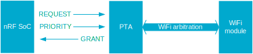

.. _ug_radio_coex:

Adding Wi-Fi Coexistence support to short-range radio applications
##################################################################

.. contents::
   :local:
   :depth: 2

This guide describes how to add Wi-Fi Coexistence (CX) support to your short-range radio application in |NCS|.

Short-range RF technologies (here referred to as SR), such as Bluetooth LE or 802.15.4, use different radios than Wi-Fi.
However, if both SR and Wi-Fi attempt to transmit simultaneously, the radio frequency (RF) waves interfere with each other, causing decreased performance and unneeded higher power consumption.
Also, in cases like receiving an acknowledgment (ACK), radios should not transmit to ensure correct reception.

These issues are defined as coexistence issues.
To mitigate these issues and to improve performance, a Packet Traffic Arbiter (PTA) is used.
When both SR and Wi-Fi request access to RF, the Packet Traffic Arbiter grants or denies that access.

.. _ug_radio_cx_software_support:

Requirements
************

If your application uses SR protocols and requires coexistence with Wi-Fi, you must enable :ref:`nrfxlib:mpsl_cx` in the :ref:`nrfxlib:mpsl` (MPSL) library.

Wi-Fi Coexistence and MPSL
==========================

The MPSL library provides an implementation of the Wi-Fi Coexistence for SR applications.
To use this implementation, your application must use a protocol driver that enables the Wi-Fi Coexistence (CX) feature.
The library provides multiprotocol support, but you can also use it in applications that require only one protocol.

Currently, the following protocols use the Wi-Fi Coexistence support provided by MPSL:

   * :ref:`Bluetooth LE <ug_ble_controller>` if implementation used is :ref:`SoftDevice Controller <nrfxlib:softdevice_controller>`
   * Protocols based on :ref:`nrfxlib:nrf_802154` such as :ref:`ug_thread` and :ref:`ug_zigbee`.

.. _ug_radio_cx_requirements:

Enabling MPSL
-------------

The MPSL library provides an API to handle signals coming from the PTA and to control requests sent to PTA.
See the :ref:`nrfxlib:mpsl_lib` in the nrfxlib documentation for details.

Enable support for the MPSL implementation in |NCS| by setting the :kconfig:option:`CONFIG_MPSL` Kconfig option to ``y``.

.. note::
   When using the nRF5340, add the :kconfig:option:`CONFIG_MPSL` option only for the NET core.

Enabling Wi-Fi Coexistence
--------------------------

To enable Wi-Fi Coexistence, do as follows:

1. Set the :kconfig:option:`CONFIG_MPSL_CX` Kconfig option to ``y``.
2. Select the specific Coexistence implementation.
   See :ref:`ug_radio_cx_wifi_coex_impls` for details about the implementations currently supported.
#. On the nRF5340, you must apply the settings to the Kconfig options mentioned in steps 1 and 2 also to the network core.
   See :ref:`ug_multi_image`.

.. note::
   When using the :ref:`ug_radio_cx_nrf700x_impl`, you do not need to select the :kconfig:option:`CONFIG_MPSL_CX_NRF700X` Kconfig option manually.
   If a ``nordic,nrf700x-coex`` compatible node is present in the device tree and :kconfig:option:`CONFIG_MPSL_CX` is set to ``y``, :kconfig:option:`MPSL_CX_NRF700X` will be selected by default.

.. _ug_radio_cx_hardware_description:

Hardware description
********************

The |NCS| provides a wrapper that configures Wi-Fi Coexistence based on devicetree (DTS) and Kconfig information.

To enable CX support for the currently supported CX implementation, you must add an ``nrf_radio_coex`` node in the devicetree source file.
You can also provide the node using the devicetree source file of the target board or an overlay file.
See :ref:`zephyr:dt-guide` for more information about the DTS data structure, and :ref:`zephyr:dt_vs_kconfig` for information about differences between DTS and Kconfig.

The following CX hardware interfaces are currently supported:

* :ref:`ug_radio_cx_nrf700x_hw_if`
* :ref:`ug_radio_cx_generic_3_wire_hw_if`

Both supported hardware interfaces can be used when a three-wire interface to the PTA is provided (like the one shown in the following image).
However, the role of each of the pins is dependent on the Wi-Fi Coexistence implementation used.

.. note::
   * When using one of the supported implementations, you must use the ``nrf_radio_coex`` name for the node.
     However, if you add a custom user implementation, you can also use a different name.
   * You can add a new device binding and use it as the ``compatible`` property for the node, if the provided hardware interfaces are unsuitable.

.. _ug_radio_cx_nrf700x_hw_if:

nRF700x Coexistence hardware interface
======================================

To configure the hardware for a PTA inside the nRF700x series chips:

1. Add the following node in the devicetree source file:

   .. code-block::

      / {
            nrf_radio_coex: nrf7002-coex {
               status = "okay";
               compatible = "nordic,nrf700x-coex";
               req-gpios =     <&gpio0 24 (GPIO_ACTIVE_HIGH)>;
               status0-gpios = <&gpio0 14 (GPIO_ACTIVE_HIGH)>;
               grant-gpios =   <&gpio0 25 (GPIO_ACTIVE_HIGH | GPIO_PULL_UP)>;
         };
      };

#. Optionally replace the node name ``nrf7002-coex`` with a custom one.
#. Replace the pin numbers provided for each of the required properties:

   * ``req-gpios`` - GPIO characteristic of the device that controls the ``REQUEST`` signal of the PTA.
   * ``status0-gpios`` - GPIO characteristic of the device that controls the ``PRIORITY`` signal of the PTA.
   * ``grant-gpios`` - GPIO characteristic of the device that controls the ``GRANT`` signal of the PTA (RF medium access granted).
     Note that ``GPIO_PULL_UP`` is added to avoid a floating input pin and is required on some boards only.
     If the target board is designed to avoid this signal being left floating, you can remove ``GPIO_PULL_UP`` to save power.

   The ``phandle-array`` type is used, as it is commonly used in Zephyr's devicetree to describe GPIO signals.
   The first element ``&gpio0`` indicates the GPIO port (``port 0`` has been selected in the example shown).
   The second element is the pin number on that port.

#. On the nRF5340, you must also apply the same devicetree node mentioned in step 1 to the network core.
   To do so, apply the overlay to the correct network-core child image by creating an overlay file named :file:`child_image/*childImageName*.overlay` in your application directory, for example :file:`child_image/multiprotocol_rpmsg.overlay`.

   The ``*childImageName*`` string must assume one of the following values:

   *  ``multiprotocol_rpmsg`` for multiprotocol applications having support for both 802.15.4 and Bluetooth.
   *  ``802154_rpmsg`` for applications having support for 802.15.4, but not for Bluetooth.
   *  ``hci_rpmsg`` for application having support for Bluetooth, but not for 802.15.4.

.. _ug_radio_cx_generic_3_wire_hw_if:

Generic three wire Coexistence hardware interface
=================================================

To configure the hardware for a PTA using a 3-wire interface:

1. Add the following node in the devicetree source file:

   .. code-block::

      / {
            nrf_radio_coex: radio_coex_three_wire {
               status = "okay";
               compatible = "generic-radio-coex-three-wire";
               req-gpios =     <&gpio0 24 (GPIO_ACTIVE_HIGH)>;
               pri-dir-gpios = <&gpio0 14 (GPIO_ACTIVE_HIGH)>;
               grant-gpios =   <&gpio0 25 (GPIO_ACTIVE_HIGH | GPIO_PULL_UP)>;
         };
      };

#. Optionally replace the node name ``radio_coex_three_wire`` with a custom one.
#. Replace the pin numbers provided for each of the required properties:

   * ``req-gpios`` - GPIO characteristic of the device that controls the ``REQUEST`` signal of the PTA.
   * ``pri-dir-gpios`` - GPIO characteristic of the device that controls the ``PRIORITY`` signal of the PTA.
   * ``grant-gpios`` - GPIO characteristic of the device that controls the ``GRANT`` signal of the PTA (RF medium access granted).
     Note that ``GPIO_PULL_UP`` is added to avoid a floating input pin and is required on some boards only.
     If the target board is designed to avoid this signal being left floating, you can remove ``GPIO_PULL_UP`` to save power.

   The ``phandle-array`` type is used, as it is commonly used in Zephyr's devicetree to describe GPIO signals.
   The first element ``&gpio0`` indicates the GPIO port (``port 0`` has been selected in the example shown).
   The second element is the pin number on that port.

#. On the nRF5340, you must also apply the same devicetree node mentioned in step 1 to the network core.
   To do so, apply the overlay to the correct network-core child image by creating an overlay file named :file:`child_image/*childImageName*.overlay` in your application directory, for example :file:`child_image/multiprotocol_rpmsg.overlay`.

   The ``*childImageName*`` string must assume one of the following values:

   *  ``multiprotocol_rpmsg`` for multiprotocol applications having support for both 802.15.4 and Bluetooth.
   *  ``802154_rpmsg`` for applications having support for 802.15.4, but not for Bluetooth.
   *  ``hci_rpmsg`` for application having support for Bluetooth, but not for 802.15.4.

.. _ug_radio_cx_wifi_coex_impls:

Wi-Fi Coexistence implementations
*********************************

The following CX implementations are available:

* :ref:`ug_radio_cx_nrf700x_impl`
* :ref:`ug_radio_cx_thread_impl`

Each implementation is a plugin composed of one or more C source files interfacing with the MPSL API, which, in turn, communicates with the SR protocol drivers.

When one of the CX variants is enabled, the driver requests access to the RF medium from the PTA and informs it about the operation it is about to perform.
It also reacts properly to the information from the PTA that access to the RF medium was either granted or denied.

.. _ug_radio_cx_nrf700x_impl:

nRF700x interface implementation
================================

This implementation uses the following pins to communicate with the PTA:

* REQUEST pin - It is the output controlled by the protocol driver.
  It is asserted to request RF access from the PTA.
  It can be configured by setting the ``req-gpios`` property of the ``nrf_radio_coex`` devicetree node.
* PRIORITY pin - It is the output controlled by the protocol driver.
  It contains information about the type of operation (either RX or TX) to perform.
  It can be configured by setting the ``status0-gpios`` property of the ``nrf_radio_coex`` devicetree node.
* GRANT pin - It is the input of the SoC controlled by the PTA.
  It asserts when PTA grants access to the RF to the 802.15.4 and deasserts when it denies the access.
  It can be configured by setting the ``grant-gpios`` property of the ``nrf_radio_coex`` devicetree node.

The support for this interface is provided in a single-file plugin located in the sdk-nrf repo, in the :file:`subsys/mpsl/cx` directory.

Adding support for the CX nRF700x interface
-------------------------------------------

The nRF700x interface is supported out of the box.
To use it, complete the following steps:

1. Add the devicetree `nrf_radio_coex` node as described in :ref:`ug_radio_cx_nrf700x_hw_if`.
#. Set the :kconfig:option:`CONFIG_MPSL_CX` Kconfig option to ``y``.
   On the nRF5340, you must apply the Kconfig option also to the network core.

.. _ug_radio_cx_thread_impl:

*Thread* implementation
=======================

This implementation uses the following pins to communicate with the PTA:

* REQUEST pin - it is the output controlled by the protocol driver.
  It is asserted to request RF access from the PTA.
  It can be configured by setting the ``req-gpios`` property of the ``nrf_radio_coex`` devicetree node.
* PRIORITY pin - it is the output controlled by the protocol driver.
  It is asserted if the operation priority is high and deasserted if it is low.
  It can be configured by setting the ``pri-dir-gpios`` property of the ``nrf_radio_coex`` devicetree node.
* GRANT pin - it is the input of the SoC controlled by the PTA.
  It asserts when PTA grants access to the RF to the 802.15.4 and deasserts when it denies the access.
  It can be configured by setting the ``grant-gpios`` property of the ``nrf_radio_coex`` devicetree node.

The support for this interface is provided in a single-file plugin located in the sdk-nrf repo, in the :file:`subsys/mpsl/cx` directory.

Adding support for the CX *Thread* interface
--------------------------------------------

To use the *Thread* interface PTA, complete the following steps:

1. Set the :kconfig:option:`CONFIG_MPSL_CX_THREAD` Kconfig option to ``y``.
2. Add the devicetree `nrf_radio_coex` node as described in :ref:`ug_radio_cx_hardware_description`.

Custom user implementations
===========================

Implementing a custom user CX implementation is described in :ref:`nrfxlib:mpsl_cx`.
If the ``nrf_radio_coex`` devicetree node is not sufficient for the implementation, you must add a custom devicetree node.
