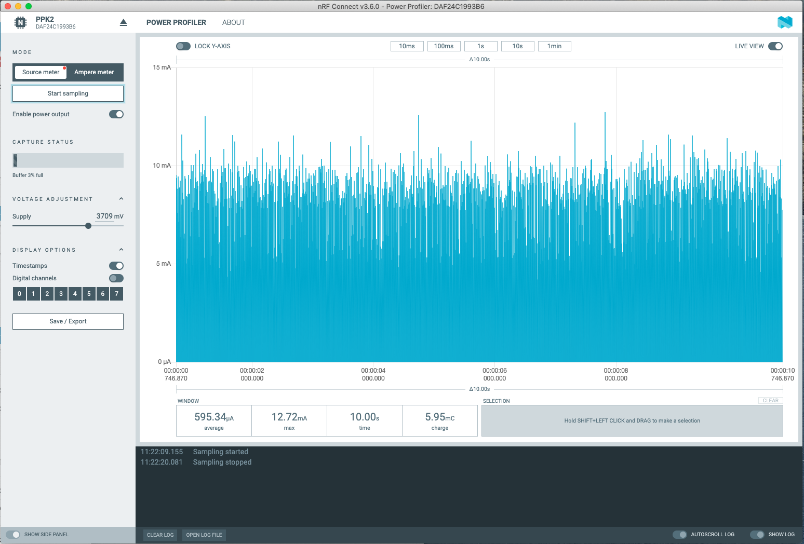
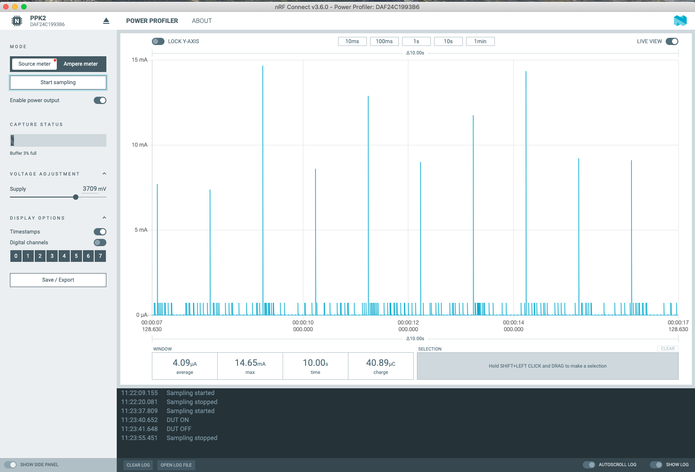
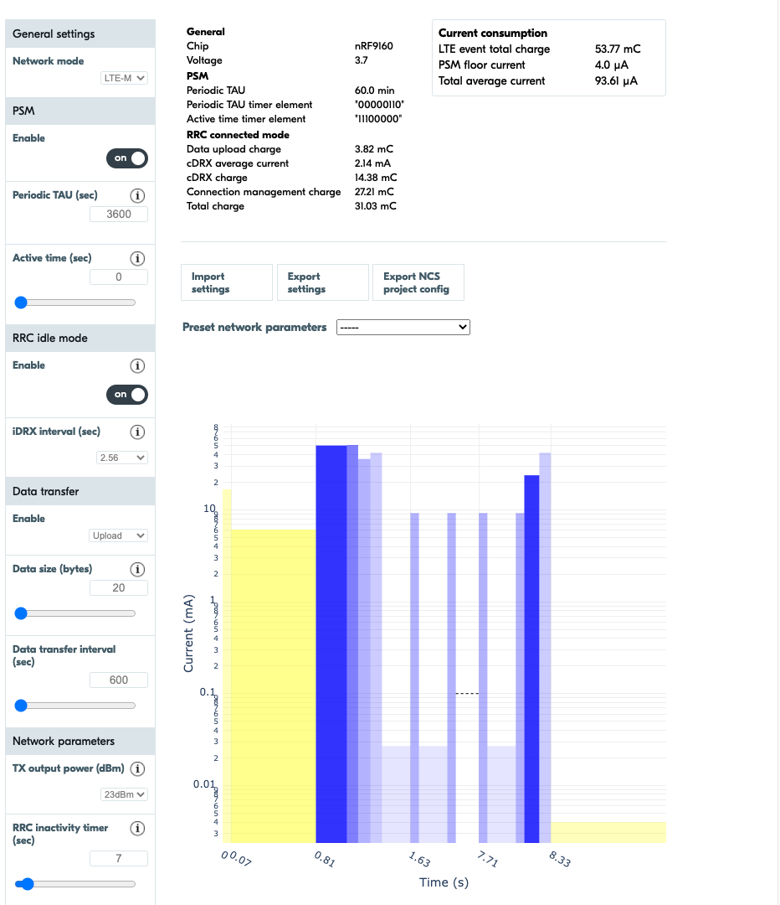
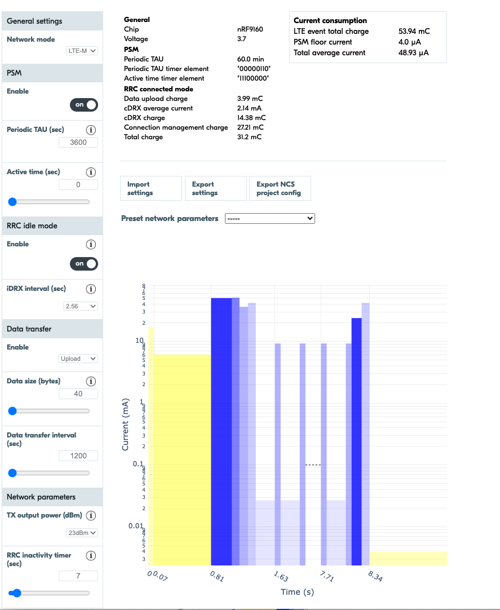
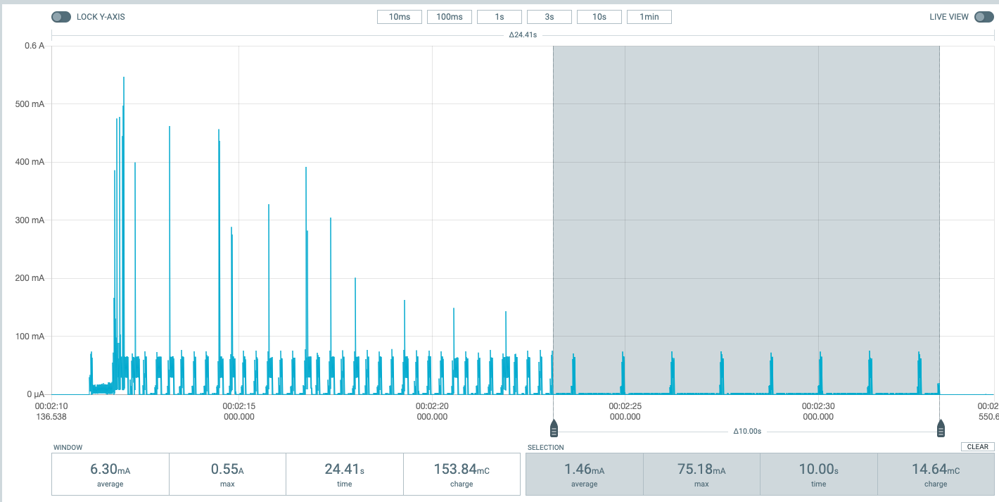

.. _app_power_opt:

Power optimization
##################

.. contents::
   :local:
   :depth: 2

Nordic System-on-Chip (SoC) designs are aimed at ease of use and ultra-low power consumption.
The eco system consisting of developer tools like |NCS|, the development kits, the `Online Power Profiler (OPP)`_ and the `Power Profiler Kit II (PPK2)`_ provides a unified solution to the developers to evaluate, develop and characterize ultra-low power designs with ease.
See :ref:`getting_started` for more information on |NCS| and the development environment.

Online Power Profiler for LTE is a tool to estimate the current consumption of the nRF9160 LTE modem.
See the `Online Power Profiler user guide`_ for a basic overview of the tool and explanation of different parameters.

Power Profiler Kit II is a flexible, low-cost tool that can be used for real-time power measurement of your design.
The tool can be used to measure power on a connected development kit or any external board.

The following subsections demonstrate how the power profiling tools can be used to optimize the power consumption in your design.

Disabling serial logging
************************

Current measurements on devices that have the |NCS| samples or applications programmed with the default configuration, might show elevated current values, when compared to the expected current values from  Nordic ultra-low power SoCs.
It is because most of the samples and applications in |NCS| are configured to perform logging over serial port (associated with UART(E) peripheral) by default.

Below is the power measurement output on Power Profiler Kit II for an nRF9160 DK with the :ref:`zephyr:blinky-sample` sample compiled for the ``nrf9160dk_nrf9160`` build target without modifications in the sample configuration.

      Current measurement for the Blinky sample with serial logging enabled

In the image, you can see that the average current is close to 600 µA, which drains a 500 mAh lithium polymer battery in a month approximately.
Hence it is recommended to disable serial logging to reduce current consumption.

To disable serial output, you must change the project configuration associated with the sample or application.
|config|

1. Set the project configuration ``CONFIG_SERIAL`` to ``n`` irrespective of whether you are building the sample for the secure or non-secure build targets.
2. For the non-secure build target (``nrf9160dk_nrf9160ns``), you must ensure that serial logging is disabled in :ref:`secure_partition_manager` also. To disable serial logging in Secure Partition Manager, complete the following steps:

   a. Add a :file:`spm.conf` file in the project directory with the following content:

      .. code-block:: console

	      CONFIG_IS_SPM=y
	      CONFIG_FW_INFO=y
	      CONFIG_GPIO=y
	      CONFIG_SERIAL=n

   #. Add the entry ``set(spm_CONF_FILE ${CMAKE_CURRENT_SOURCE_DIR}/spm.conf)`` below the ``cmake_minimum_required(<VERSION x.x.x>)`` entry in the :file:`CMakeLists.txt` file.

The following output on Power Profiler Kit II shows the power consumption on an nRF9160 DK with the sample compiled for the ``nrf9160dk_nrf9160`` build target with ``CONFIG_SERIAL=n``.

      Current measurement on the Blinky sample with serial logging disabled

Observe that the average current reduces to 4 µA, which implies 14 years of battery life on a 500 mAh lithium polymer battery compared to the 30-day battery life of the previous measurement.

For a similar configuration, see the :ref:`udp` sample, which is a simple sample that is used to transmit UDP packets to an LTE network using an nRF9160 DK.
The sample can be used to characterize the current consumption of the nRF9160 SiP and it is optimized for low power operation on the ``nrf9160dk_nrf9160ns`` build target without any modifications.

Idle current due to other peripherals
*************************************

Elevated currents can be caused by peripherals other than the serial ports.

The power management of the Nordic SoCs automatically switches in and out the resources that are needed by the active peripherals.
Peripherals that need a high frequency clock like UART, PWM, PDM or high frequency timers will show similar currents if enabled.
See `Electrical specification of nrf9160`_ for an overview of the current consumption in peripherals for the nRF9160 SoC.

.. note::
   It is recommended to be careful with the use of pull-up resistors when designing the hardware for ultra-low power operation.
   An I/O pin with a 10kΩ pull-up resistor that is set to ``GND`` will result in a current consumption of 300 µA at 3V.

Cellular applications
*********************

An nRF9160 DK can draw current ranging from a few micro amperes (in sleep mode) to hundreds of milli amperes (when the radio is active).
To achieve long battery life, it is crucial that the application is optimized in the use of the radio.
Power optimization can be achieved by performing the following steps:

1. Simulation of your use case with Online Power Profiler
#. Real-time current measurements using Power Profiler Kit II with the configuration obtained from Online Power Profiler
#. Use of results from the Power Profiler Kit II measurements to tune the simulation results in Online Power Profiler

Example use case
================

Listed below are the specifications for an example use case in power profiling:

* Application - A battery driven sensor application
* Battery life - Two years battery life on 1000 mAh 3.7V battery
* Measurement characteristics:

  * Measurements per ten minutes
  * Each measurement equals 20 bytes of payload
  * Frequency of payload transfer aligned with the expected 2-year battery life

* Transport - UDP
* Network - LTE-M with PSM support

Assumptions:

* Data is assumed to be sent on a regular basis.
* The network is not assumed to be present in the drop-down list corresponding to :guilabel:`Preset network parameters` in Online Power Profiler.

.. note::
   All the measurements and calculations in the example use case are based on nRF9160 Revision 1.

Simulation using Online Power Profiler
--------------------------------------

To simulate the use case with Online Power Profiler, complete the following steps:

1. Start the simulation in Online Power Profiler with the default settings and add the following changes to the default configuration:

   A. In the :guilabel:`PSM` tab on the left, set Active time (sec) to ``0`` (indicating that the device need not be active after sending the payload).
   #. In the :guilabel:`Data transfer` tab on the left, in the drop-down menu for :guilabel:`Enable`, select ``Upload``. Observe that the :guilabel:`Data size` and :guilabel:`Data transfer` options are now visible. Set the options to the following values:

     a. Set :guilabel:`Data size (bytes)` to ``20``
     #. Set :guilabel:`Data transfer interval (sec)` to ``600`` (10 minutes)

Below is the result of the power profile simulation using Online Power Profiler:

You can see that the total average current is 93.61 µA.
However, the battery charge is 1000 mAh.
If you are targeting the application to run for 2 years on a single battery, the maximum average current that can be allowed for the use case is 57 µA (1000 mAh / 2 years).
Hence the estimation must target in bringing down the average current to or below 57 µA.

2. Perform tuning of the current estimation by making the following changes:

	a. Set Data size(bytes) to 40
	#. Set Data transfer interval (sec) to 1200 (20 minutes)

The tuning of parameters results in the following output in Online Power Profiler:

Observe that the average current is 48.93 µA, which is below the calculated maximum limit of 57 µA.

3. As the next step, export the settings from the Online Power Profiler tool and compare it with the measurements in real networks. Complete the following sub-steps to export the settings from Online Power Profiler:

   a. Click :guilabel:`Export settings` to store current Online Power Profiler settings to a :file:`.json` file.
   #. Click :guilabel:`Export NCS project config` to export the configuration parameters in a :file:`opp.conf` file that can be used when building the firmware.

Real-time power measurement using Power Profiler Kit II
-------------------------------------------------------

After exporting the settings from Online Power Profiler, the next step is to use the settings while measuring current on an nRF9160 DK.
To measure current on an nRF9160 DK using the Power Profiler Kit II, while is connected to a live network , complete the following steps:

1. Connect Power Profiler Kit II to an nRF9160 DK as described in `Power Profiler Kit II user guide <Power Profiler Kit II (PPK2)_>`_.
#. Navigate to the :ref:`udp` sample in |NCS| and copy the contents of the :file:`opp.conf` file that was exported from Online Power Profiler into the :file:`prj.conf` file in the UDP sample folder (samples\\nrf9160\\udp).
#. :ref:`Build and program the sample onto the nRF9160 DK <gs_programming>`.
#. If PSM is available in your network, observe that the power measurement using Power Profiler Kit II produces the following results:

   .. figure:: images/app_power_opt_ppk_psm.png
      :scale: 50 %
      :alt: Power Profiler Kit II sample output with PSM

   If PSM is activated, you can see that the current value drops to a few µA.
   As long as the PSM mode is activated and no other activity occurs, the current value remains in the PSM floor as shown in the above image until a transmission occurs or until the PSM timer times out. Even though the requested time out value in the use case is 60 minutes, it is decided by the network.
   The PSM floor current is 4.69 µA as seen in the above image.

#. Since the data transfer interval is 20 minutes, you can increase the frequency of transmission. Set :option:`CONFIG_UDP_DATA_UPLOAD_FREQUENCY_SECONDS` to ``120`` in :file:`prj.conf`.
#. Re-build and program the sample.
#. Observe that a 40-byte data packet is sent every two minutes. Make sure that the frequency is sufficiently higher than the duration of RRC inactivity present in the network. RRC inactivity timer is a parameter that defines the duration of time, the device is required to stay in RRC connected mode before it can enter RRC idle mode (eDRX idle) or PSM. RRC inactivity timer value can be over one minute in some networks, and to get correct measurements, you must ensure that the device has gone into PSM before the new data packet is sent. After a duration of two minutes, observe the following results in the Power Profiler Kit II interface:

   .. figure:: images/app_power_opt_ppk_40_byte.png
      :scale: 50 %
      :alt: Power Profiler Kit II sample output for 40-byte payload

   Observe that the whole sequence of data transmission spans 12.32 seconds and the process consumes a total battery charge of 139.9 mC.
   According to the Online Power Profiler estimation, the time duration available for the data transmission sequence is 8.34 seconds with a battery charge of 53.94 mC.
   The longer data transmission duration in the real-time measurement using Power Profiler Kit II might be due to the RRC inactivity timer network parameter.
   Hence it is recommended to tune the parameters to match the network environment.
#. Before performing the tuning, you must calculate the frequency with which the payload can be sent, with the targeted battery life of two years.

   .. code-block:: none

      139.9 mC / (57-4.6) µA = 44.5 minutes (4.6 µA is the measured PSM floor)

   It is recommended to send a batch of six measurements for every 60 minutes to have some margin.
   Hence the payload size can be changed to a value of 120 bytes in the :file:`prj.conf` to observe how it affects the charge in a single transmission.

#. To change the payload size, set :option:`CONFIG_UDP_DATA_UPLOAD_SIZE_BYTES` to ``120`` in :file:`prj.conf`
#. Re-build and program the sample.
   Observe the following results in the Power Profiler Kit II interface:

   .. figure:: images/app_power_opt_ppk_120_byte.png
      :scale: 50 %
      :alt: Power Profiler Kit II sample output for 120-byte payload

  In the above image, you can see that the overall charge is 142 mC.
  However, in a real network, the values are bound to deviate, and it is recommended to do multiple measurements to understand the extent of deviations.

  .. code-block:: none

     1000 mAh / ((142 mC/60 minutes) + 4.6 uA) = 2.59 years

  With the above network conditions and the reporting interval, two years of battery life can be achieved.

Tuning of network parameters
----------------------------

As the final step, the network parameters are tuned to make the Online Power Profiler estimation closer to live network measurements.
Listed below are the important network parameters that contribute to the current consumption:

* PSM active timer
* RRC inactivity timer
* cDRX interval
* cDRX on duration

.. note::
   The PSM active timer is set to zero in both simulation and the measurements and it does not contribute in the use case.

To perform tuning of network parameters for the example use case, complete the following steps:

1. Measure the RRC inactivity timer value using Power Profiler Kit II.

   Below image shows how the RRC inactivity timer can be measured with Power Profiler Kit II:

   .. figure:: images/app_power_opt_ppk_inactivity_timer.png
      :scale: 50 %
      :alt: Power Profiler Kit II RRC inactivity timer measurement

   For the example use case, the RRC inactivity timer is 11 seconds as shown in the above image.
   Also, see that the charge during the interval is 111.48 mC (cDRX charge in Online Power Profiler).
   A closer inspection of the highlighted time duration shows that the `cDRX Interval` is 0.32 seconds:

   .. figure:: images/app_power_opt_ppk_cdrx_interval.png
      :scale: 50 %
      :alt: Power Profiler Kit II cDRX interval

   The parameter `cDRX on duration` varies as shown in the following image, but the baseline (lowest value) is 40 milliseconds:

   .. figure:: images/app_power_opt_ppk_cdrx_duration_40ms.png
      :scale: 50 %
      :alt: Power Profiler Kit II cDRX duration

#. As a next step, the measurements from the previous step can be provided to the Online Power Profiler.

   .. figure:: images/app_power_opt_opp_tuned_with_measurements.png
      :scale: 50 %
      :alt: Tuning in Online Power Profiler

   Observe that the total charge is 108.9 mC as shown in Online Power Profiler.
   There is still a difference of around 33 mC compared to the measurements with Power Profiler Kit II.
   Note that the cDRX charge in Online Power Profiler is 68.73 mC, but the measured cDRX charge in Power Profiler Kit II is 111.48 mC.
   After comparing the measurements, it can be concluded that the energy in the cDRX is the main contributor to the difference in measurements of Power Profiler Kit II and Online Power Profiler.
   Also, in the following image, observe that the charge values associated with the cDRX events varies a lot.
   The battery charge value of 2.16 mC in the baseline case fits well with the Online Power Profiler value.

   .. figure:: images/app_power_opp_cdrx_normal.png
      :scale: 50 %
      :alt: Normal cDRX

   However, in one of the worst case cDRX events, you can see a total charge of 7.22 mC, which is more than 3 times the charge in the baseline case.

   .. figure:: images/app_power_opt_drx_long.png
      :scale: 50 %
      :alt: Long cDRX

.. note::
   To match the cDRX behaviour in real networks, a rule of thumb is to multiply the cDRX charge in Online Power Profiler with a factor of 1.5 after you have tuned it for the baseline network parameters.
   It helps in obtaining an estimate that is within the range of actual measurement.
   The recommended factor may not be suitable for some networks and it must be confirmed with the Power Profiler Kit II measurements in the actual network.

For the example use case, an estimate (based on the values from Online Power Profiler) calculated with the recommended factor is shown below:

   .. code-block:: none

      (Total charge - cDRX charge) + cDRX charge * 1.5 = (108.91 mC - 68.73 mC) + 68.73 mC * 1.5 = 143.28 mC (which is close to the 142 mC from the Power Profiler Kit II measurements).

PSM active timer
++++++++++++++++

PSM active timer, also known as the T3324 timer, defines the duration of time the UE is required to stay in RRC idle mode before entering the PSM mode.
In RRC idle mode, the UE is reachable by the network in case it needs to receive more data.
The PSM active timer can be requested by the UE, however the requested value might not be supported by the network.

In the example use case, PSM active timer is zero.
Below is a measurement from Power Profiler Kit II with the PSM active timer having a value of 10 seconds, and the rest of the parameters identical to the previous measurements.

As seen in the above image, LTE activity is extended by 10 seconds with a lower duty cycle operation (RRC Idle)  compared to the previous measurements.

For additional information on power optimization for nRF52-based devices, see `Optimizing Power on nRF52 Designs`_.
