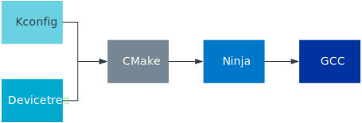

.. _ug_app_dev:
.. _configuration_and_build:

Configuration and building
##########################

The |NCS| build and configuration system is based on the one from :ref:`Zephyr project <zephyr:getting_started>`, with some additions.

The figure below visualizes the tools and configuration methods in the |NCS|.
All of them have a role in the creation of an application, from configuring the libraries or applications to building them.

   |NCS| tools and configuration methods

* CMake generates build files based on the provided :file:`CMakeLists.txt` files, which use information from Kconfig and devicetree.
  See the `CMake documentation`_.
* :ref:`Devicetree <zephyr:dt-guide>` describes the hardware.
* :ref:`zephyr:kconfig` generates definitions that configure the software.
* Ninja (comparable to Make) uses the build files to build the program, see the `Ninja documentation`_.
* The compiler (for example, `GCC compiler`_) creates the executables.

Read the guides in this section to learn how to use these tools and configuration methods in areas valid for :ref:`all supported boards <app_boards>`.
Depending on the board you are working with, check also its :ref:`hardware guide <device_guides>`, as some nRF Series families have specific exceptions and rules to be applied on top of the general configuration procedures.

Make sure to consider :ref:`app_bootloaders` already at this stage of the application development.

.. toctree::
   :maxdepth: 1
   :caption: Subpages:

   config_and_build/config_and_build_system
   config_and_build/board_support
   config_and_build/pin_control
   config_and_build/programming
   config_and_build/output_build_files
   config_and_build/modifying
   config_and_build/multi_image
   config_and_build/bootloaders_and_dfu/index
   config_and_build/use_gpio_pin_directly
