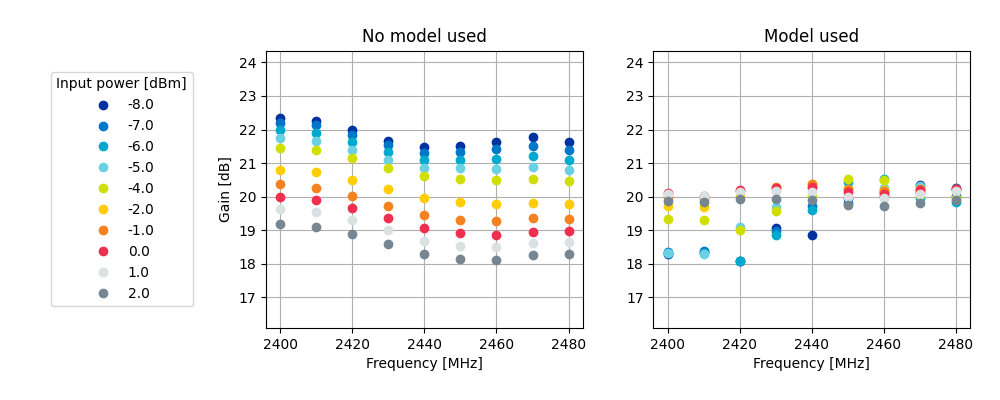

.. _ug_radio_fem:

Working with RF front-end modules
#################################

.. contents::
   :local:
   :depth: 4

An RF front-end module (FEM) is a device that amplifies the RF signal, to increase the range distance, the strength, and the robustness of a link connection.
A more robust link reduces packet loss, causing fewer retransmissions and increasing the probability of successfully receiving the first packet, resulting in a lower link latency.

FEMs provide a power amplifier (PA) that increases the TX power and a low-noise amplifier (LNA) that increases the RX sensitivity.
Some FEMs, like the nRF21540, also provide a power down (PDN) control that powers down the FEM internal circuits, to reduce energy consumption.

For testing purposes, a FEM is usually integrated in either a development kit or a shield that you can connect to a development kit.

This guide describes how to add support for 2 different front-end module (FEM) implementations to your application in |NCS|.

.. _ug_radio_fem_sw_support:

Software support
****************

To use radio protocols and a FEM with your application, enable :ref:`nrfxlib:mpsl_fem` in the :ref:`nrfxlib:mpsl` (MPSL) library.

The following test samples support FEM control:

* :ref:`radio_test`
* :ref:`direct_test_mode`

You can also use your own FEM driver when required.

.. _ug_radio_fem_sw_support_mpsl:

Using MPSL
==========

The MPSL library provides the following GPIO interface implementations:

* :ref:`ug_radio_fem_nrf21540_spi_gpio` - For the nRF21540 GPIO+SPI implementation that uses a 3-pin interface and an SPI interface with the nRF21540.
* :ref:`ug_radio_fem_nrf21540_gpio` - For the nRF21540 GPIO implementation that uses a 3-pin interface with the nRF21540.
* :ref:`ug_radio_fem_skyworks` - For the Simple GPIO implementation that uses a 2-pin interface with the SKY66112-11 device.

To use these implementations, your application must use a protocol driver that enables the FEM feature.

The library provides multiprotocol support, but you can also use it in applications that require only one protocol.
To avoid conflicts, check the protocol documentation to see if the protocol uses the FEM support provided by MPSL.

.. note::
   Currently, the following protocols use the FEM support provided by MPSL:

   * :ref:`ug_thread`
   * :ref:`ug_zigbee`
   * :ref:`ug_ble_controller`
   * :ref:`ug_multiprotocol_support`

.. _ug_radio_fem_requirements:

Enabling FEM and MPSL
---------------------

Before you add the devicetree node in your application, complete the following steps:

1. Add support for the MPSL library in your application.
   The MPSL library provides API to configure FEM.
   See :ref:`nrfxlib:mpsl_lib` in the nrfxlib documentation for details.
#. Enable support for MPSL implementation in |NCS| by setting the :kconfig:option:`CONFIG_MPSL` Kconfig option to ``y``.
#. Enable support for the FEM subsystem in |NCS| by setting the :kconfig:option:`CONFIG_MPSL_FEM` Kconfig option to ``y``.
#. Choose the used FEM implementation by selecting the appropriate Kconfig option.

The following FEM implementations are supported:

* The nRF21540 GPIO implementation, see :ref:`ug_radio_fem_nrf21540_gpio`.
  To use it, set the :kconfig:option:`CONFIG_MPSL_FEM_NRF21540_GPIO` Kconfig option to ``y``.
* The nRF21540 GPIO+SPI implementation, see :ref:`ug_radio_fem_nrf21540_spi_gpio`.
  To use it, set the :kconfig:option:`CONFIG_MPSL_FEM_NRF21540_GPIO_SPI` Kconfig option to ``y``.
* The 2-pin simple GPIO implementation.
  To use it, set the :kconfig:option:`CONFIG_MPSL_FEM_SIMPLE_GPIO` Kconfig option to ``y``.

It is possible to only use the :ref:`nrfxlib:mpsl_fem` API if your application does not require other MPSL features.
This could be useful when you want to run simple radio protocols that are not intended to be used concurrently with other protocols.
You can do that by setting the :kconfig:option:`CONFIG_MPSL_FEM_ONLY` Kconfig option to ``y``.

Some applications can perform calls to the :ref:`nrfxlib:mpsl_fem` API even though no RF Front-End module is physically connected to the device and the :kconfig:option:`CONFIG_MPSL_FEM` Kconfig option is set to ``n``.
In that case, ensure that the :kconfig:option:`CONFIG_MPSL_FEM_API_AVAILABLE` Kconfig option is set to ``y``.

.. _ug_radio_fem_sw_support_mpsl_fem_output:

Setting the FEM output power
----------------------------

The ``tx_gain_db`` property in devicetree provides the FEM gain value to use with the simple GPIO FEM implementation.
The property must represent the real gain of the FEM.
This implementation does not support controlling the gain value during runtime.

nRF21540 implementations have the gain set to ``10`` by default.
You can set a different gain value to use through the :kconfig:option:`CONFIG_MPSL_FEM_NRF21540_TX_GAIN_DB`  option, but it has to match the value of one of the POUTA (:kconfig:option:`CONFIG_MPSL_FEM_NRF21540_TX_GAIN_DB_POUTA` ) or POUTB (:kconfig:option:`CONFIG_MPSL_FEM_NRF21540_TX_GAIN_DB_POUTB`) gains.

.. caution::
   :kconfig:option:`CONFIG_MPSL_FEM_NRF21540_TX_GAIN_DB_POUTA` and :kconfig:option:`CONFIG_MPSL_FEM_NRF21540_TX_GAIN_DB_POUTB` are by default set to ``20`` and ``10`` and these are factory-precalibrated gain values.
   Do not change these values, unless POUTA and POUTB were calibrated to different values on specific request.

To enable runtime control of the gain, set the :kconfig:option:`CONFIG_MPSL_FEM_NRF21540_RUNTIME_PA_GAIN_CONTROL` to ``y``.
This option makes the gain of the FEM to be adjusted dynamically during runtime, depending on the power requested by the protocol driver for each transmission.
For the nRF21540 GPIO implementation, you must enable the **MODE** pin in devicetree.
For the nRF21540 GPIO+SPI implementation, no additional configuration is needed as the gain setting is transmitted over the SPI bus to the nRF21540.

Using FEM power models
----------------------

When a protocol driver requests a given transmission power to be output, MPSL splits the power into the following components: the SoC Power and the FEM gain.
This gain is considered constant and accurate even if external conditions, such as temperature, might affect the effective gain achieved by the Front-End Module.

To perform the split differently (for example, to compensate for external conditions), you can use a FEM power model, either using one of the built-in ones or providing your own custom model.

To use FEM power models, set the :kconfig:option:`CONFIG_MPSL_FEM_POWER_MODEL` Kconfig option to ``y``  and either select one of the built-in models or provide a custom model, as described in the following chapters.

.. note::
   In case of nRF21540 GPIO+SPI, the :ref:`ug_radio_fem_nrf21540_gpio_spi_builtin_power_model` is enabled by default.

.. _ug_radio_fem_nrf21540_gpio_spi_builtin_power_model:

Using nRF21540 GPIO+SPI built-in power model
^^^^^^^^^^^^^^^^^^^^^^^^^^^^^^^^^^^^^^^^^^^^

The nRF21540 GPIO+SPI built-in power model attempts to keep the nRF21540's gain constant and as close to the currently selected value of gain as possible.
The model compensates varying external conditions, which results in the nRF21540 gain being independent of their changes.

.. note::
    Only the factory-precalibrated values of gain represented by the default values of :kconfig:option:`CONFIG_MPSL_FEM_NRF21540_TX_GAIN_DB_POUTA` and :kconfig:option:`CONFIG_MPSL_FEM_NRF21540_TX_GAIN_DB_POUTB` are supported.
    There are no guarantees on the correctness of the model if applied to compensate external conditions for other values of gain.

The nRF21540 built-in power model compensates for the following external conditions:

* Temperature
* FEM supply voltage
* Carrier frequency
* FEM input power.

The model assumes that the FEM supply voltage is constant.
To provide the value of this voltage to the MPSL subsystem, use the ``supply-voltage-mv`` property of nRF21540 devicetree node.

This model is enabled by default, provided that nRF21540 GPIO+SPI is enabled and selected.
To enable and select nRF21540 GPIO+SPI, see :ref:`ug_radio_fem_nrf21540_spi_gpio`.

Although the built-in model significantly improves the performance of nRF21540 in varying external conditions, in certain scenarios you might want to disable it, for example, to save memory.
To disable the model and the resulting compensation, set :kconfig:option:`CONFIG_MPSL_FEM_POWER_MODEL` to ``n``.

The figures below summarize the performance improvement of the nRF21540 when the built-in model is used.
The data points in the figures are results of nRF21540 gain measurements performed in controlled, laboratory conditions.
Each of the figures compares the gain achieved by a nRF21540 device in two cases: when the built-in model is used to control the nRF21540 gain settings, and when the model is disabled.
All the external conditions the model compensates for, like temperature, supply voltage, carrier frequency, and input power, are presented in the figures.

The figures are divided into three groups, each of the group representing performance improvement over frequency and one other external condition for the two factory-precalibrated values of gain.

.. figure:: images/nrf21540_builtin_model_10db_freq_input_gain.png
   :align: center
   :alt: Figure 1a. nRF21540 gain vs input power over frequency sweep for 10dB setting

   Figure 1a. nRF21540 gain vs input power over frequency sweep for 10dB setting

   Figure 1b. nRF21540 gain vs input power over frequency sweep for 20dB setting

.. figure:: images/nrf21540_builtin_model_10db_freq_temp_gain.png
   :align: center
   :alt: Figure 2a. nRF21540 gain vs temperature over frequency sweep for 10dB setting

   Figure 2a. nRF21540 gain vs temperature over frequency sweep for 10dB setting

.. figure:: images/nrf21540_builtin_model_20db_freq_temp_gain.png
   :align: center
   :alt: Figure 2b. nRF21540 gain vs temperature over frequency sweep for 20dB setting

   Figure 2b. nRF21540 gain vs temperature over frequency sweep for 20dB setting

.. figure:: images/nrf21540_builtin_model_10db_freq_volt_gain.png
   :align: center
   :alt: Figure 3a. nRF21540 gain vs supply voltage over frequency sweep for 10dB setting

   Figure 3a. nRF21540 gain vs supply voltage over frequency sweep for 10dB setting

.. figure:: images/nrf21540_builtin_model_20db_freq_volt_gain.png
   :align: center
   :alt: Figure 3b. nRF21540 gain vs supply voltage over frequency sweep for 20dB setting

   Figure 3b. nRF21540 gain vs supply voltage over frequency sweep for 20dB setting

Adding custom power models
^^^^^^^^^^^^^^^^^^^^^^^^^^

If the way MPSL splits the TX power into components does not meet your requirements, or if you wish to implement a custom compensation model, you can provide one as follows:

1. Set :kconfig:option:`CONFIG_MPSL_FEM_POWER_MODEL` to ``y``.
#. Provide an implementation of the ``mpsl_fem_power_model_to_use_get()`` function.
   This function should return a pointer to a variable of the type ``mpsl_fem_power_model_t`` which contains pointers to the model's callbacks.
#. Mandatorily implement the model's ``fetch`` callback (details explained below).
#. Optionally implement the model's ``init`` callback (details explained below).
   If no ``init`` callback is provided, pass ``NULL`` as the pointer to the callback.
#. You can also optionally extend the ``MPSL_FEM_POWER_MODEL_CHOICE`` Kconfig choice with an option to select your custom model, for example, if you want to test multiple custom models.

The ``init`` callback is called by MPSL once, after FEM configuration finishes.
Calibration data (acquired from FEM internal registers, Kconfig options, and devicetree files) is passed to this function using a parameter of the ``mpsl_fem_calibration_data_t`` type.
The meaning of the calibration data stored in this parameter is implementation-specific.
For details, see the ``mpsl_fem_calibration_data_t`` type documentation.

The ``fetch`` callback is used to split the power between the SoC output power and the FEM gain.
It is called every time this split needs to be recalculated.
For 802.15.4, this happens before every transmission.
For Bluetooth® Low Energy, this happens every time the channel changes.

.. note::
   This function is called in a time-critical path.
   Please refer to the documentation of ``mpsl_fem_power_model_t`` on timing constraints.
   Any complex calculations have to be done outside this function (for example, using a look up table).
   Failing to meet the timing requirements will lead to an undefined behavior of the protocol stacks.

The ``fetch`` callback must fill out all the fields of the ``p_output`` output parameter.
For more details, see the ``mpsl_fem_power_model_output_t`` type documentation.

.. note::
   The ``soc_power`` field value must be one of the output power values supported by the given nRF SoC, otherwise the behavior is undefined.
   The user can meet this requirement by converting the requested SoC power using the ``mpsl_tx_power_radio_supported_power_adjust`` function.

.. _ug_radio_fem_direct_support:

Direct support
==============

If your application cannot use MPSL or if the FEM driver in MPSL does not support all features you need, you can implement your own driver for the nRF21540.
The other solution is to use only the :ref:`nrfxlib:mpsl_fem` API from the MPSL.
Enable the following Kconfig options:

* :kconfig:option:`CONFIG_MPSL`
* :kconfig:option:`CONFIG_MPSL_FEM_ONLY`

See the :ref:`direct_test_mode` sample for an example use case.

Hardware description
********************

The |NCS| provides a wrapper that configures FEM based on devicetree (DTS) and Kconfig information.
To enable FEM support, you must add an ``nrf_radio_fem`` node in the devicetree file.
The node can also be provided by the devicetree file of the target development kit or by an overlay file.
See :ref:`zephyr:dt-guide` for more information about the DTS data structure, and :ref:`zephyr:dt_vs_kconfig` for information about differences between DTS and Kconfig.

Adding support for nRF21540
===========================

The nRF21540 device is a range extender that you can use with nRF52 and nRF53 Series devices.
For more information about nRF21540, see the `nRF21540`_ documentation.

.. _ug_radio_fem_nrf21540_gpio:

GPIO mode
---------

The nRF21540 GPIO mode implementation of FEM is compatible with this device and implements the 3-pin PA/LNA interface.

.. note::
  In the naming convention used in the API of the MPSL library, the functionalities designated as ``PA`` and ``LNA`` apply to the ``tx-en-gpios`` and ``rx-en-gpios`` pins listed below, respectively.

To use nRF21540 in GPIO mode, complete the following steps:

1. Add the following node in the devicetree file:

   .. code-block::

      / {
            nrf_radio_fem: name_of_fem_node {
               compatible  = "nordic,nrf21540-fem";
               tx-en-gpios = <&gpio0 13 GPIO_ACTIVE_HIGH>;
               rx-en-gpios = <&gpio0 14 GPIO_ACTIVE_HIGH>;
               pdn-gpios   = <&gpio0 15 GPIO_ACTIVE_HIGH>;
         };
      };

#. Optionally replace the node name ``name_of_fem_node``.
#. Replace the pin numbers provided for each of the required properties:

   * ``tx-en-gpios`` - GPIO characteristic of the device that controls the ``TX_EN`` signal of nRF21540.
   * ``rx-en-gpios`` - GPIO characteristic of the device that controls the ``RX_EN`` signal of nRF21540.
   * ``pdn-gpios`` - GPIO characteristic of the device that controls the ``PDN`` signal of nRF21540.

   These properties correspond to ``TX_EN``, ``RX_EN``, and ``PDN`` pins of nRF21540 that are supported by software FEM.

   Type ``phandle-array`` is used here, which is common in Zephyr's devicetree to describe GPIO signals.
   The first element ``&gpio0`` refers to the GPIO port ("port 0" has been selected in the example shown).
   The second element is the pin number on that port.
   The last element must be ``GPIO_ACTIVE_HIGH`` for nRF21540, but for a different FEM module you can use ``GPIO_ACTIVE_LOW``.

   The state of the remaining control pins should be set in other ways and according to `nRF21540 Product Specification`_.

#. On nRF53 devices, you must also apply the same devicetree node mentioned in step 1 to the network core.
   To do so, apply the overlay to the correct network core child image by creating an overlay file named :file:`child_image/*childImageName*.overlay` in your application directory, for example :file:`child_image/multiprotocol_rpmsg.overlay`.

   The ``*childImageName*`` string must be one of the following values:

   *  ``multiprotocol_rpmsg`` for multiprotocol applications having support for both 802.15.4 and Bluetooth.
   *  ``802154_rpmsg`` for applications having support for 802.15.4, but not for Bluetooth.
   *  ``hci_rpmsg`` for application having support for Bluetooth, but not for 802.15.4.

   .. note::
       This step is not needed when testing with :ref:`direct_test_mode` and :ref:`radio_test` on the nRF53 Series devices.

.. _ug_radio_fem_nrf21540_spi_gpio:

SPI/GPIO mode
-------------

The nRF21540 features an SPI interface.
You can use it to fully control your front-end module or you can use a combination of SPI and GPIO interface.
The SPI interface enables you, for example, to set the output power of the nRF21540.

To use nRF21540 in SPI or mixed mode, complete the following steps:

1. Add the following node in the devicetree file:

   .. code-block::

      / {
            nrf_radio_fem: name_of_fem_node {
               compatible  = "nordic,nrf21540-fem";
               tx-en-gpios = <&gpio0 13 GPIO_ACTIVE_HIGH>;
               rx-en-gpios = <&gpio0 14 GPIO_ACTIVE_HIGH>;
               pdn-gpios   = <&gpio0 15 GPIO_ACTIVE_HIGH>;
               spi-if = <&nrf_radio_fem_spi>
         };
      };
#. Optionally replace the device name ``name_of_fem_node``.
#. Replace the pin numbers provided for each of the required properties:

   * ``tx-en-gpios`` - GPIO characteristic of the device that controls the ``TX_EN`` signal of nRF21540.
   * ``rx-en-gpios`` - GPIO characteristic of the device that controls the ``RX_EN`` signal of nRF21540.
   * ``pdn-gpios`` - GPIO characteristic of the device that controls the ``PDN`` signal of nRF21540.

   These properties correspond to ``TX_EN``, ``RX_EN``, and ``PDN`` pins of nRF21540 that are supported by software FEM.

   The``phandle-array`` type is commonly used for describing GPIO signals in Zephyr's devicetree.
   The first element ``&gpio0`` refers to the GPIO port ("port 0" has been selected in the example shown).
   The second element is the pin number on that port.
   The last element must be ``GPIO_ACTIVE_HIGH`` for nRF21540, but for a different FEM module you can use ``GPIO_ACTIVE_LOW``.

   Set the state of the remaining control pins according to the `nRF21540 Product Specification`_.
#. Add a following SPI bus device node on the devicetree file:

   .. code-block:: devicetree

      &pinctrl {
         spi3_default_alt: spi3_default_alt {
            group1 {
               psels = <NRF_PSEL(SPI_SCK, 1, 15)>,
                       <NRF_PSEL(SPI_MISO, 1, 14)>,
                       <NRF_PSEL(SPI_MOSI, 1, 13)>;
            };
         };

         spi3_sleep_alt: spi3_sleep_alt {
            group1 {
               psels = <NRF_PSEL(SPI_SCK, 1, 15)>,
                       <NRF_PSEL(SPI_MISO, 1, 14)>,
                       <NRF_PSEL(SPI_MOSI, 1, 13)>;
               low-power-enable;
            };
         };
      };

      fem_spi: &spi3 {
         status = "okay";
         pinctrl-0 = <&spi3_default_alt>;
         pinctrl-1 = <&spi3_sleep_alt>;
         pinctrl-names = "default", "sleep";
         cs-gpios = <&gpio0 21 GPIO_ACTIVE_LOW>;

         nrf_radio_fem_spi: nrf21540_fem_spi@0 {
            compatible = "nordic,nrf21540-fem-spi";
            status = "okay";
            reg = <0>;
            spi-max-frequency = <8000000>;
         };
      };

   In this example, the nRF21540 is controlled by the ``spi3`` bus.
   Replace the SPI bus according to your hardware design.

#. Create alternative pinctrl entries for SPI3 and replace the ``pinctrl-N`` and ``pinctrl-names`` properties.

Optional properties
-------------------

The following properties are optional and you can add them to the devicetree node if needed.

* Properties that control the other pins:

  * ``ant-sel-gpios`` - GPIO characteristic of the device that controls the ``ANT_SEL`` signal of the nRF21540.
  * ``mode-gpios`` - GPIO characteristic of the device that controls the ``MODE`` signal of the nRF21540.

    The ``MODE`` signal of the nRF21540 switches between two values of PA gain.
    The pin can either be set to a fixed state on initialization, which results in a constant PA gain, or it can be switched in run-time by the protocol drivers to match the transmission power requested by the application.

    To enable run-time ``MODE`` pin switching, you must enable :kconfig:option:`CONFIG_MPSL_FEM_NRF21540_RUNTIME_PA_GAIN_CONTROL`.

    .. note::
       The state of the ``MODE`` pin is selected based on the available PA gains and the required transmission power.
       To achieve reliable performance, :kconfig:option:`CONFIG_MPSL_FEM_NRF21540_TX_GAIN_DB_POUTA` and :kconfig:option:`CONFIG_MPSL_FEM_NRF21540_TX_GAIN_DB_POUTB` must reflect the content of the nRF21540 registers.
       Their default values match chip production defaults.
       For details, see the `nRF21540 Product Specification`_.

    If the run-time ``MODE`` pin switching is disabled, the PA gain is constant and equal to :kconfig:option:`CONFIG_MPSL_FEM_NRF21540_TX_GAIN_DB`.

* Properties that control the timing of interface signals:

  * ``tx-en-settle-time-us`` - Minimal time interval between asserting the ``TX_EN`` signal and starting the radio transmission, in microseconds.
  * ``rx-en-settle-time-us`` - Minimal time interval between asserting the ``RX_EN`` signal and starting the radio transmission, in microseconds.

    .. note::
        Values for these two properties cannot be higher than the Radio Ramp-Up time defined by :c:macro:`TX_RAMP_UP_TIME` and :c:macro:`RX_RAMP_UP_TIME`.
        If the value is too high, the radio driver will not work properly and will not control FEM.
        Moreover, setting a value that is lower than the default value can cause disturbances in the radio transmission, because FEM may be triggered too late.

  * ``pdn-settle-time-us`` - Time interval before the PA or LNA activation reserved for the FEM ramp-up, in microseconds.
  * ``trx-hold-time-us`` - Time interval for which the FEM is kept powered up after the event that triggers the PDN deactivation, in microseconds.

  The default values of these properties are appropriate for default hardware and most use cases.
  You can override them if you need additional capacitors, for example when using custom hardware.
  In such cases, add the property name under the required properties in the devicetree node and set a new custom value.

  .. note::
    These values have some constraints.
    For details, see `nRF21540 Product Specification`_.

.. _ug_radio_fem_skyworks:

Adding support for Skyworks front-end module
============================================

You can use the Skyworks range extenders with nRF52 and nRF53 Series devices.
SKY66112-11 is one of many FEM devices that support the 2-pin PA/LNA interface.
The |NCS| provides also devicetree bindings for the SKY66114-11 and SKY66403-11.
You can use SKY66112-11 as an example on how to create bindings for different devices that support the 2-pin PA/LNA interface.
For more details about devicetree binding, see: :ref:`Zephyr documentation <zephyr:dt-bindings>`.

.. note::
  In the naming convention used in the API of the MPSL library, the functionalities designated as ``PA`` and ``LNA`` apply to the ``ctx-gpios`` and ``crx-gpios`` pins listed below, respectively.

To use the Simple GPIO implementation of FEM with SKY66112-11, complete the following steps:

1. Add the following node in the devicetree file:

   .. code-block::

      / {
         nrf_radio_fem: name_of_fem_node {
            compatible = "skyworks,sky66112-11", "generic-fem-two-ctrl-pins";
            ctx-gpios = <&gpio0 13 GPIO_ACTIVE_HIGH>;
            crx-gpios = <&gpio0 14 GPIO_ACTIVE_HIGH>;
         };
      };

#. Optionally replace the node name ``name_of_fem_node``.
#. Replace the pin numbers provided for each of the required properties:

   * ``ctx-gpios`` - GPIO characteristic of the device that controls the ``CTX`` signal of SKY66112-11.
   * ``crx-gpios`` - GPIO characteristic of the device that controls the ``CRX`` signal of SKY66112-11.

   These properties correspond to ``CTX`` and ``CRX`` pins of SKY66112-11 that are supported by software FEM.

   Type ``phandle-array`` is used here, which is common in Zephyr's devicetree to describe GPIO signals.
   The first element ``&gpio0`` refers to the GPIO port ("port 0" has been selected in the example shown).
   The second element is the pin number on that port.
   The last element must be ``GPIO_ACTIVE_HIGH`` for SKY66112-11, but for a different FEM module you can use ``GPIO_ACTIVE_LOW``.

   The state of the other control pins should be set according to the SKY66112-11 documentation.
   See the official `SKY66112-11 page`_ for more information.

Optional properties
-------------------

The following properties are optional and   you can add them to the devicetree node if needed.

* Properties that control the other pins:

   * csd-gpios - GPIO characteristic of the device that controls the CSD signal of SKY66112-11.
   * cps-gpios - GPIO characteristic of the device that controls the CPS signal of SKY66112-11.
   * chl-gpios - GPIO characteristic of the device that controls the CHL signal of SKY66112-11.
   * ant-sel-gpios - GPIO characteristic of the device that controls the ANT_SEL signal of devices that support antenna diversity, for example SKY66403-11.

* Properties that control the timing of interface signals:

  * ``ctx-settle-time-us`` - Minimal time interval between asserting the ``CTX`` signal and starting the radio transmission, in microseconds.
  * ``crx-settle-time-us`` - Minimal time interval between asserting the ``CRX`` signal and starting the radio transmission, in microseconds.

  The default values of these properties are appropriate for default hardware and most use cases.
  You can override them if you need additional capacitors, for example when using custom hardware.
  In such cases, add the property name under the required properties in the devicetree node and set a new custom value.

  .. note::
    These values have some constraints.
    For details, see the official documentation at the `SKY66112-11 page`_.

* Properties that inform protocol drivers about gains provided by SKY66112-11:

  * ``tx-gain-db`` - Transmission gain value in dB.
  * ``rx-gain-db`` - Reception gain value in dB.

  The default values are accurate for SKY66112-11 but can be overridden when using a similar device with a different gain.

.. _ug_radio_fem_incomplete_connections:

Use case of incomplete physical connections to the FEM module
=============================================================

The method of configuring FEM using the devicetree file allows you to opt out of using some pins.
For example, if power consumption is not critical, the nRF21540 module PDN pin can be connected to a fixed logic level.
Then there is no need to define a GPIO to control the PDN signal. The line ``pdn-gpios = < .. >;`` can then be removed from the devicetree file.

Generally, if pin ``X`` is not used, the ``X-gpios = < .. >;`` property can be removed.
This applies to all properties with a ``-gpios`` suffix, for both nRF21540 and SKY66112-11.

.. _ug_radio_fem_boards:

Hardware support
****************

Two nRF21540 boards are available, showcasing the possibilities of the nRF21540 FEM:

* :ref:`nRF21540 DK <nrf21540dk_nrf52840>`
* :ref:`ug_radio_fem_nrf21540ek`

Also, various Skyworks front-end modules are supported.
For example, SKY66112-11EK has a 2-pin PA/LNA interface.

The front-end module feature is supported on the nRF52 and nRF53 Series devices.

nRF21540 DK
===========

The nRF21540 DK is a development kit that features the nRF52840 device combined with the additional nRF21540 front-end module.
You can use it the same way as :ref:`zephyr:nrf52840dk_nrf52840`.
It is an easy way to start testing front-end modules.
For more details, see :ref:`nRF21540 DK <nrf21540dk_nrf52840>`.

Shields
=======

Shields are add-ons that you can attach to the development kit to extend its feature and functionalities.

.. _ug_radio_fem_nrf21540ek:

nRF21540 EK
-----------

The nRF21540 EK (Evaluation Kit) is an RF front-end module (FEM) for Bluetooth Low Energy, Bluetooth mesh, 2.4 GHz proprietary, Thread, and Zigbee range extension.
When combined with an nRF52 or nRF53 Series SoC, the nRF21540 RF FEM’s +21 dBm TX output power and 13 dB RX gain ensure a superior link budget for up to 16x range extension.

Overview
^^^^^^^^

The nRF21540 complementary device has a 50 Ω SMA transceiver interface and 2x 50 Ω SMA antenna interfaces.
This enables connecting an SoC or a signal generator to the input.
It also enables connecting the outputs to measurement tools or to antennas directly.
The FEM can be configured through the pins available on the Arduino headers.

The nRF21540's gain control, antenna switching, and modes are controlled using GPIO or SPI, or a combination of both.
GPIO and SPI are accessible through the Arduino Uno Rev3 compatible headers.
The shield also features two additional SMA connectors hooked to the dual antenna ports from the RF FEM, to monitor the performance of the RF FEM using any equipment desired.
The FEM SMA input can be connected to the nRF52 or nRF53 Series SoC RF output with a coaxial RF cable with SMA\SWF connectors.

.. figure:: images/nrf21540ek.png
   :width: 350px
   :align: center
   :alt: nRF21540EK

   nRF21540 EK shield

Pin assignment
^^^^^^^^^^^^^^

+-----------------------+----------+-----------------+
| Shield connector pin  | SIGNAL   | FEM function    |
+=======================+==========+=================+
| D2                    | GPIO     | Mode Select     |
+-----------------------+----------+-----------------+
| D3                    | GPIO     | RX Enable       |
+-----------------------+----------+-----------------+
| D4                    | GPIO     | Antenna Select  |
+-----------------------+----------+-----------------+
| D5                    | GPIO     | TX Enable       |
+-----------------------+----------+-----------------+
| D9                    | GPIO     | Power Down      |
+-----------------------+----------+-----------------+
| D10                   | SPI CS   | Chip Select     |
+-----------------------+----------+-----------------+
| D11                   | SPI MOSI | Serial Data In  |
+-----------------------+----------+-----------------+
| D12                   | SPI MISO | Serial Data Out |
+-----------------------+----------+-----------------+
| D13                   | SPI SCK  | Serial Clock    |
+-----------------------+----------+-----------------+

.. _ug_radio_fem_nrf21540ek_programming:

Programming
^^^^^^^^^^^

Set ``-DSHIELD=nrf21540ek`` when you invoke ``west build`` or ``cmake`` in your Zephyr application.

Alternatively, add the shield in the project's :file:`CMakeLists.txt` file:

.. code-block:: none

   set(SHIELD nrf21540ek)

To build with the |nRFVSC|, specify ``-DSHIELD=nrf21540ek`` in the **Extra Cmake arguments** field.
See :ref:`cmake_options`.

When building for a board with an additional network core, like the nRF5340, add the ``-DSHIELD`` variable with the *childImageName_* parameter between ``-D`` and ``SHIELD`` to build for the network core.
In this case, the application core is only responsible for forwarding to the network core the pins needed to control the nRF21540 .
The application core can be set up to forward the needed pins using the ``-DSHIELD=nrf21540ek_fwd`` setting.
For example:

.. parsed-literal::
   :class: highlight

   west build -b nrf5340dk_nrf5340_cpuapp -- -DSHIELD=nrf21540ek_fwd -Dmultiprotocol_rpmsg_SHIELD=nrf21540ek

In this command, the *childImageName_* parameter has the ``multiprotocol_rpmsg_`` value and builds a multiprotocol application with support for 802.15.4 and Bluetooth.
The *childImageName_* parameter can take the following values:

*  ``multiprotocol_rpmsg_`` for multiprotocol applications with support for 802.15.4 and Bluetooth
*  ``802154_rpmsg_`` for applications with support for 802.15.4, but without support for Bluetooth
*  ``hci_rpmsg_`` for application with support for Bluetooth, but without support for 802.15.4

References
^^^^^^^^^^

* `nRF21540 DK product page`_
* `nRF21540 Product Specification`_
* `nRF21540`_

Shields with 2-pin PA/LNA interface
-----------------------------------

The SKY66112-11EK is an example of a shield with the 2-pin PA/LNA interface.

Perform the following steps to use it:

1. Connect the shield to the development kit.
#. Follow the steps in the :ref:`ug_radio_fem_skyworks` to add a FEM node in the devicetree.
#. Build your project.
#. Program the development kit with the created binary file.
