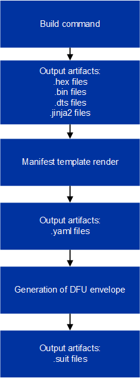

:orphan:

.. _ug_nrf54h20_suit_customize_dfu:

How to customize the SUIT DFU process
#####################################

.. contents::
   :local:
   :depth: 2

Nordic Semiconductor provides a SUIT sample (``nrf54h_suit_sample``) in which the build system uses predefined configuration.
The specified Kconfig options in the sample can be used to modify the artifacts produced by the build system, customize the DFU process, and integrate the DFU solution with external build systems.

.. note::
    In order to customize the SUIT DFU process, we strongly recommend that you modify the values in the manifest that are associated with the ID values that are configured into the device.
    This includes both the ``class-identifier`` and ``vendor-identifier`` values found in manifest(s).

    For additional modifications mentioned in this guide, see the :ref:`ug_nrf54h20_suit_components` page.

This guide provides a range of instructions and details for how to modify values in the SUIT manifest.
See the :ref:`ug_suit_customize_manifest_quick` section of this document for brief instructions on how to make modifications.

Build system configuration
==========================

SUIT envelopes are created by processing the input manifest templates, which are filled in with the appropriate values by the build system as one of the last steps of the build command.
Nordic Semiconductor provides a set of default manifest templates that can be used out-of-the-box for development and demonstration purposes, although some customization for UUIDs used in the manifest templates is highly recommended.
For more information about adding custom UUID values, see the :ref:`ug_suit_using_manifest_gen` section of this document.

.. note::
    The manifest templates are automatically copied to the sample directory upon the first build.

To demonstrate this, we can look at the ``nrf54h_suit_sample``.
After the first build, among others, three additional files are created in the :file:`nrf/samples/suit/smp_transfer` directory (alternatively, two levels above the build directory when the ``west -d`` parameter is used):

* The root manifest - :file:`root_hierarchical_envelope.yaml.jinja2`

* The Application Domain manifest - :file:`app_envelope.yaml.jinja2`

* The Radio Domain manifest - :file:`rad_envelope.yaml.jinja2`

The destination directory into which the :file:`jinja2` file templates are copied to can be changed from the sample root directory (:file:`nrf/samples/suit/smp_transfer`) to another directory by setting the :kconfig:option:`CONFIG_SUIT_ENVELOPE_EDITABLE_TEMPLATES_LOCATION` Kconfig option.

.. note::

   The Radio Domain manifest template is only available for the Bluetooth® Low Energy version of the ``nrf54h_suit_sample`` sample, and not the UART version.

.. _ug_suit_change_manifest_location:

How to change the location of the manifest templates
----------------------------------------------------

Let us assume that you would like to store the editable manifest templates in the ``C:\my_templates\`` directory for a Windows machine, or in ``/home/my_user/my_templates`` for Linux.

.. tabs::

   .. group-tab:: Windows

      Enter the following command to change the location where the editable manifest templates are stored:

      .. code-block:: console

         west build -d C:/ncs-lcs/work_dir/build/ -b nrf54h20dk_nrf54h20_cpuapp@soc1 -p -- -DCONFIG_SUIT_ENVELOPE_EDITABLE_TEMPLATES_LOCATION="C:/my_templates"

   .. group-tab:: Linux

      Enter the following command to change the location where the editable manifest templates are stored:

      .. code-block:: console

         west build -b nrf54h20dk_nrf54h20_cpuapp@soc1 -p -- -DCONFIG_SUIT_ENVELOPE_EDITABLE_TEMPLATES_LOCATION="/home/my_user/my_templates"

The source of the manifest templates can be configured by setting the following Kconfig options:

* :kconfig:option:`CONFIG_SUIT_ENVELOPE_ROOT_TEMPLATE`

* :kconfig:option:`CONFIG_SUIT_ENVELOPE_APP_TEMPLATE`

* :kconfig:option:`CONFIG_SUIT_ENVELOPE_HCI_RPMSG_SUBIMAGE_TEMPLATE`

Changing the source of manifest templates allows you to create manifest files on your own, without relying on the templates provided by Nordic Semiconductor.

.. _ug_suit_use_own_manifest:

How to use your own manifest
----------------------------

Let us analyze the case where you would like to:

* Use your own created manifest template

* Store editable manifest templates in a custom directory

.. tabs::

    .. group-tab:: Windows

        The provided manifest templates are stored in ``C:\my_default_templates``.
        Editable manifests should be stored in ``C:\my_templates``.

    .. group-tab:: Linux

        The provided manifest templates are stored in ``/home/my_user/my_default_templates``.
        Editable manifests should be stored in ``/home/my_user/my_templates``.

The following files should be used to create DFU envelope:

* Root envelope - :file:`root.yaml.jinja2`

* Application Domain - :file:`app.yaml.jinja2`

* Radio Domain - :file:`radio.yaml.jinja2`

.. figure:: images/nrf54h20_suit_example_update_process.png
   :alt: Example update process

   Example update process

To build the described example with the provided manifest templates taken from your customized source folder, and to store it in your customized destination folder:

.. tabs::

    .. group-tab:: Windows

        Run the following command:

        .. code-block:: console

            west build -d C:/ncs-lcs/work_dir/build/ -b nrf54h20dk_nrf54h20_cpuapp@soc1 -p -- -DCONFIG_SUIT_ENVELOPE_EDITABLE_TEMPLATES_LOCATION="c:/my_templates" -DCONFIG_SUIT_ENVELOPE_ROOT_TEMPLATE="c:/my_default_templates/root.yaml.jinja2" -DCONFIG_SUIT_ENVELOPE_APP_TEMPLATE="c:/my_default_templates/app.yaml.jinja2" -DCONFIG_SUIT_ENVELOPE_HCI_RPMSG_SUBIMAGE_TEMPLATE="c:/my_default_templates/radio.yaml.jinja2"

    .. group-tab:: Linux

        Run the following command:

        .. code-block:: console

            west build -b nrf54h20dk_nrf54h20_cpuapp@soc1 -p -- -DCONFIG_SUIT_ENVELOPE_EDITABLE_TEMPLATES_LOCATION="/home/my_user/my_templates" -DCONFIG_SUIT_ENVELOPE_ROOT_TEMPLATE="/home/my_user/my_default_templates/root.yaml.jinja2" -DCONFIG_SUIT_ENVELOPE_APP_TEMPLATE="/home/my_user/my_default_templates/app.yaml.jinja2" -DCONFIG_SUIT_ENVELOPE_HCI_RPMSG_SUBIMAGE_TEMPLATE="/home/my_user/my_default_templates/radio.yaml.jinja2"

Editable manifest copied into the sample directory (or in the directory configured using the :kconfig:option:`CONFIG_SUIT_ENVELOPE_EDITABLE_TEMPLATES_LOCATION` Kconfig option) can be modified to edit the contents of the envelopes and modify the DFU process.
These files will not be overwritten by the build system during the next builds or in consecutive SDK releases.

For more information about the Kconfig options used in this example, see the `SUIT Kconfig options <https://res.developer.nordicsemi.com/ncs/doc/latest/kconfig/index.html#!suit_envelope>`__.

.. _ug_suit_modify_manifest_temps:

Modify the manifest templates
=============================

It is recommended to modify the manifest templates with your own UUIDs, which involves modifying the values for ``class-identifier`` and ``vendor-identifier``.

The whole process of building a DFU envelope (which contains the manifests) can be summarized with the following diagram:

   Modifying manifest templates workflow

Manifest templates (``.jinja2``) files are rendered to YAML files.
These YAML files are used as a representation of the output binary SUIT envelopes.

The provided manifest templates (``.jinja2``) files contain variables (represented as components), such as memory ranges, names, and paths to binaries.
The component values are filled out automatically by the build system during the manifest rendering.
However, there are some values which should be customized manually such as ``class-identifier`` and ``vendor-identifier``

An example of values that stay static the same are UUIDs used in the device or values (``class-identifier`` and ``vendor-identifier``) that are used to generate these UUIDs.

.. _ug_suit_example_yaml:

An example of a YAML representation for a basic installation and invoke-process of the Application firmware could look like the following:

.. code-block::

   SUIT_Envelope_Tagged:
    suit-authentication-wrapper:
        SuitDigest:
            suit-digest-algorithm-id: cose-alg-sha-256
    suit-manifest:
        suit-manifest-version: 1
        suit-manifest-sequence-number: 1
        suit-common:
            suit-components:
            - - MEM
              - 0x02
              - 0x0E0AA000
              - 0x0007f800
            suit-shared-sequence:
               - suit-directive-override-parameters:
                   suit-parameter-vendor-identifier:
                    RFC4122_UUID: nordicsemi.com                     # Vendor identifier value
                   suit-parameter-class-identifier:
                    RFC4122_UUID:                                    # Class identifier values
                        namespace: nordicsemi.com
                        name: nRF54H20_sample_app
                   suit-parameter-image-digest:
                    suit-digest-algorithm-id: cose-alg-sha-256
                    suit-digest-bytes:
                        file: ``/path/to/application_fw.bin``
                   suit-parameter-image-size:
                    file: ``/path/to/application_fw.bin``
               - suit-condition-vendor-identifier:
                 - suit-send-record-success
                 - suit-send-record-failure
                 - suit-send-sysinfo-success
                 - suit-send-sysinfo-failure
               - suit-condition-class-identifier:
                 - suit-send-record-success
                 - suit-send-record-failure
                 - suit-send-sysinfo-success
                 - suit-send-sysinfo-failure
            suit-install:
            - suit-directive-override-parameters:
                suit-parameter-uri: '#app'
            - suit-directive-fetch:
              - suit-send-record-failure
    suit-integrated-payloads:
        '#app': ``/path/to/application_fw.bin``

The ``class-identifier`` expresses the manifest class.
In other words, it expresses the manifest's intended usage.
For example, it expresses which manifest is meant to control the firmware images associated with the Application Domain.

The ``vendor-identifier`` expresses which vendor the manifest belongs to.
For example "Nordic Semiconductor", or "ACME Corp" used in the examples provided in this document.

The storing and processing of these variable-length strings would be impractical, therefore the ``RFC4122 uuid5`` is used.

.. note::
    Default values of OEM-controlled manifests (related to the Application and Radio Domains) are hardcoded in the SDFW, but you can overwrite these values and this is strongly recommended.

.. _ug_suit_modify_class_vend_id:

Modify ``class-identifier`` and ``vendor-identifier``
-----------------------------------------------------

To update the ``class-identifier`` and ``vendor-identifier`` values in the :file:`app_envelope_yam.jinja2` file, edit the following lines as shown in this example:

Before modification:

.. code-block::

  - suit-directive-override-parameters:
      suit-parameter-vendor-identifier:
         RFC4122_UUID: nordicsemi.com         # Original vendor-identifier value
      suit-parameter-class-identifier:
         RFC4122_UUID:
           namespace: nordicsemi.com          # Original class-identifier values
           name: nrf54H20_sample_app

After modification:

.. code-block::

  - suit-directive-override-parameters:
      suit-parameter-vendor-identifier:
         RFC4122_UUID: ACME Corp              # Changed vendor-identifier value
      suit-parameter-class-identifier:
         RFC4122_UUID:                        # Changed class-identifier values
           namespace: ACME Corp
           name: Light bulb

Alternatively, you can also define raw values like so:

Before modification:

.. code-block::

  - suit-directive-override-parameters:
      suit-parameter-vendor-identifier:
         raw: 7617daa571fd5a858f94e28d735ce9f4     # Original raw value
      suit-parameter-class-identifier:
         raw: 08c1b59955e85fbc9e767bc29ce1b04d     # Original raw value

After modification:

.. code-block::

  - suit-directive-override-parameters:
      suit-parameter-vendor-identifier:
         raw: bf42bd2ea9895f22933b352cda1730d3     # Changed raw value
      suit-parameter-class-identifier:
         raw: e0f94076c46a5a1e80a18d3e674bdfe0     # Changed raw value

Python to generate UUIDs
^^^^^^^^^^^^^^^^^^^^^^^^

Note that the UUID raw values in the previous example have been calculated using following Python commands:

.. code-block:: python

   from uuid import uuid5
   vid = uuid5(uuid.NAMESPACE_DNS, 'ACME Corp')
   print(vid)  # Result being bf42bd2ea9895f22933b352cda1730d3
   cid = uuid5(vid, 'Light bulb')
   print(cid)  # Result being e0f94076c46a5a1e80a18d3e674bdfe0

.. note::
    For the development releases (CS 0.2.0 and 0.3.0) only the predefined, presented values are supported.

.. _ug_suit_var_methods_in_manifest:

Variables and methods available in the manifest templates
=========================================================

The manifest templates have access to the following:

* Devicetree values (`edtlib object <https://python-devicetree.readthedocs.io/en/latest/edtlib.html>`__)

* Target names

* Paths to binary artifacts

* Application version

Some of these values are stored in the Python dictionaries that are named after the target name.
(Therefore, Python is used within the ``.jinja2`` files to fill in the necessary values in the manifest(s).)
For example, for the ``nrf54h_suit_sample`` there will be two variables available: ``app`` and ``hci_rpmsg_subimage``.
Each variable is a Python dictionary type (``dict``) containing the following keys:

* ``name`` - name of the target

* ``dt`` -  Devicetree representation (`edtlib object <https://python-devicetree.readthedocs.io/en/latest/edtlib.html>`__)

* ``binary`` - path to the binary, which holds the firmware for the target

Additionally, the Python dictionary holds a variable called ``version`` that holds the application version.
With the Python dictionary you are able to, for example:

* Extract the CPU ID by using ``app['dt'].label2node['cpu'].unit_addr``

* Obtain the partition address with ``app['dt'].chosen_nodes['zephyr,code-partition']``

* Obtain the size of partition with ``app['dt'].chosen_nodes['zephyr,code-partition'].regs[0].size``

* Get the pair of URI name and the binary path by using ``'#{{ app['name'] }}': {{ app['binary'] }}``

* Get the application version with ``suit-manifest-sequence-number: {{ version }}``

Additionally, the **get_absolute_address** method is available to recalculate the absolute address of the partition.
With these variables and methods, you can define templates which will next be filled out by the build system and use them to prepare the output binary SUIT envelope.
The examples below demonstrate the use of these variables and methods.

.. _ug_suit_suit_set_comp_def_mem_range:

Set component definition and memory ranges
------------------------------------------

In the :file:`app_envelope_yaml.jinja2` (found `here <https://github.com/nrfconnect/suit-generator/blob/main/ncs/app_envelope.yaml.jinja2>`__), the component definition and memory ranges are filled out by using the ``edtlib`` object like so:

.. code-block::

    suit-components:
    - - MEM
    - ``{{ app['dt'].label2node['cpu'].unit_addr }}``
    - ``{{ get_absolute_address(app['dt'].chosen_nodes['zephyr,code-partition']) }}``
    - ``{{ app['dt'].chosen_nodes['zephyr,code-partition'].regs[0].size }}``

Set integrated payload
----------------------

In the :file:`app_envelope_yaml.jinja2` (found `here <https://github.com/nrfconnect/suit-generator/blob/main/ncs/app_envelope.yaml.jinja2>`__, the integrated payload definition is done using the target name and binary location:

.. code-block::

    suit-integrated-payloads:
    ``'#{{ app['name'] }}': {{ app['binary'] }}``

.. _ug_suit_root_manifest_temp:

Root manifest template
----------------------

The :file:`root_hierarchical_envelope.yaml.jinja2` (found `here <https://github.com/nrfconnect/suit-generator/blob/main/ncs/root_hierarchical_envelope.yaml.jinja2>`__) contains content that is dynamically created, depending on how many targets are built.
The following example only shows a selected portion of the root manifest file.
For more information, see the file available in the sample and `Jinja <https://jinja.palletsprojects.com/en/3.1.x/>`__ documentation:

.. code-block::

                                                     # Initialize the `component_index variable`.
                                                                                   # This variable will be used to assign component indexes dynamically depending on
                                                                                   # how many cores have been built.

                                                     # Initialize the `component_list variable`.
                                                                                   # This variable will be used to execute `suit-directive-set-component-index` over
                                                                                   # all components, except the first one with index 0.

   SUIT_Envelope_Tagged:
      suit-authentication-wrapper:
         SuitDigest:
           suit-digest-algorithm-id: cose-alg-sha-256
      suit-manifest:
         suit-manifest-version: 1
         suit-manifest-sequence-number: {{ version }}                              # Assign value defined in the `CONFIG_APP_VERSION` Kconfig option.
         suit-common:
            suit-components:
            - - CAND_MFST
            - 0
                                            # Add section below only, in case the Radio Core has been already been built.
                                   # Increment `component_index`.
                    # Store the current component index for further use.
      {{- component_list.append( hci_rpmsg_subimage_component_index ) or ""}}      # Append the current component index to the common list.
        - - INSTLD_MFST
          - RFC4122_UUID:
              namespace: nordicsemi.com
              name: nRF54H20_sample_rad
   
   
   
   
   {{- component_list.append( app_component_index ) or ""}}
       - - INSTLD_MFST
         - RFC4122_UUID:
             namespace: nordicsemi.com
             name: nRF54H20_sample_app
   

.. _ug_suit_ref_for_edit_manifest:

Reference for editing manifest values
-------------------------------------

Some entries in the YAML file will filled in automatically, (upon first build of the sample) by the build system in the final binary DFU envelope.

+---------------------------------------------------------+------------------------------+------------------------------------------------+
| Operation                                               | YAML entry                   | Value in the output binary envelope            |
+=========================================================+==============================+================================================+
| UUID calculation                                        | RFC4122_UUID:                | ``3f6a3a4dcdfa58c5accef9f584c41124``           |
|                                                         |    namespace:                |                                                |
|                                                         |      nordicsemi.com          |                                                |
|                                                         |    name:                     |                                                |
|                                                         |      nRF54H20_sample_root    |                                                |
+---------------------------------------------------------+------------------------------+------------------------------------------------+
| Digest calculation for provided file                    | suit-digest-bytes:           | ``<digest value created for app.bin content>`` |
|                                                         |    file: app.bin             |                                                |
+---------------------------------------------------------+------------------------------+------------------------------------------------+
| Image size calculation for provided file                | suit-parameter-image-size:   | ``<size calculated for app.bin content>``      |
|                                                         |    file: app.bin             |                                                |
+---------------------------------------------------------+------------------------------+------------------------------------------------+
| Attaching data to the envelope as an integrated payload | suit-integrated-payloads:    | ``<app.bin binary content>``                   |
|                                                         |    '#application':           |                                                |
|                                                         |       app.bin                |                                                |
+---------------------------------------------------------+------------------------------+------------------------------------------------+

For more information, see the example YAML files available in the `suit-generator repository <https://github.com/nrfconnect/suit-generator/tree/main/examples/input_files>`__.

.. _ug_suit_using_manifest_gen:

How to use the manifest generator
=================================

The build system uses `suit-generator <https://github.com/nrfconnect/suit-generator>`__ to generate manifests.
**suit_generator** is a Python-powered tool that creates and parses SUIT envelopes.
If needed, the **suit-generator** can be used as a command line application, Python module, or script.

To use **suit_generator** from the command line, run the following:

.. code-block::

   pip install <workspace>/modules/lib/suit-generator
   suit-generator --help
   suit-generator create --input-file input.yaml --output-file envelope.suit
   suit-generator parse --input-file envelope.suit

To use **suit_generator** as a Python module, add the following to your Python script:

.. code-block:: python

   from suit_generator import envelope
   envelope = SuitEnvelope()
   envelope.load('input.yaml')
   envelope.dump('output.suit')

To execute the Python script from the command line, run the following:

.. code-block::

   python <workspace>/modules/lib/suit-generator/cli.py create --input-file input.yaml --output-file envelope.suit

.. _ug_suit_edit_build_artifacts:

Edit build artifacts
--------------------

To take an example of how to edit the build artifacts, we can look at the ``nrf54h_suit_sample`` :file:`/build` directory.
Among other artifacts, there are the following:

* :file:`./build/hci_rpmsg/zephyr/hci_rpmsg_subimage.yaml`

* :file:`./build/zephyr/app.yaml`

* :file:`./build/zephyr/root.yaml`

* :file:`./build/hci_rpmsg/zephyr/hci_rpmsg_subimage.suit`

* :file:`./build/zephyr/app.suit`

* :file:`./build/zephyr/root.suit`

.. note::
    You must build the sample at least once to make these artifacts available.

With these files and the **suit-generator**, you can:

* recreate SUIT files.

* restore YAML files from a binary SUIT envelope.

* debug a SUIT envelope, by printing out their parsed content.

* convert back-and-forth between different SUIT-related file types.

Recreate SUIT files
-------------------

To recreate SUIT files, run the following:

.. code-block::

   suit-generator create --input-file ./build/zephyr/root.yaml --output-file my_new_root.suit

Restore YAML files from a binary SUIT envelope
----------------------------------------------

To restore a YAML file from a binary SUIT envelope, run the following:

.. code-block::

   suit-generator parse --input-file ./build/zephyr/root.suit --output-file my_new_root.yaml

Debug a SUIT envelope
---------------------

To debug the a SUIT envelope, by printing their parsed content to the ``stdout``, run the following:

.. code-block::

   suit-generator parse --input-file ./build/zephyr/root.suit

.. note::
   The previous command can be extended by parsing the dependent manifests by calling:

   .. code-block::

      suit-generator parse --input-file ./build/zephyr/root.suit --parse-hierarchy

Convert between file types
--------------------------

All mentioned artifacts can be converted back-and-forth, remembering that calculated and resolved YAML entries like UUIDs or files will be presented as a RAW value in the form of HEX strings.

For example, if you have an input entry like the following:

.. code-block::

   suit-parameter-class-identifier:
      RFC4122_UUID:
         namespace: nordicsemi.com
         name: nRF54H20_sample_app

This entry will be presented, after parsing, as the following:

.. code-block::

   suit-parameter-class-identifier:
      raw: 08c1b59955e85fbc9e767bc29ce1b04d

Reference
=========

More information about the `suit-generator <https://github.com/nrfconnect/suit-generator>`__ can be found in the `README.md <https://github.com/nrfconnect/suit-generator/blob/main/README.md>`__ file and in the **suit-generator** documentation.

To build the **suit-generator** documentation run the following:

.. code-block::

   cd <workspace>/modules/lib/suit-generator
   pip install ./
   pip install -r doc/requirements-doc.txt
   sphinx-build -b html doc/source/ doc/build/html

.. _ug_suit_customize_manifest_quick:

Tips
====

1. How to change the UUID

    Update ``RFC4122_UUID entries`` in the manifest templates
    For more information see the :ref:`ug_suit_modify_class_vend_id` section of this document.

#. How to change the location of the editable manifest templates

    Modify the :kconfig:option:`CONFIG_SUIT_ENVELOPE_EDITABLE_TEMPLATES_LOCATION` Kconfig option.
    For more information see the :ref:`ug_suit_change_manifest_location` section.

#. How to update the manifests

    Build the ``nrf54h_suit_sample`` by calling the ``west build`` command to copy the default Nordic Semiconductor manifest templates and edit editable ``.jinja2`` files stored in the directory configured using :kconfig:option:`CONFIG_SUIT_ENVELOPE_EDITABLE_TEMPLATES_LOCATION`.
    For more information, see the example YAML :ref:`file <ug_suit_example_yaml>` in this document.
