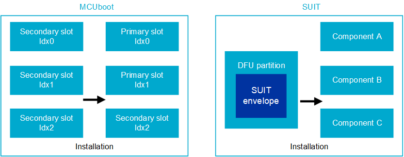

:orphan:

.. _ug_nrf54h20_suit_intro:

Introduction to SUIT
####################

.. contents::
   :local:
   :depth: 2

This document explains why the SUIT procedure was selected, gives an overview of SUIT and its characteristics, and gives a comparison to the MCUboot DFU procedure.
See the ``nrf54h_suit_sample`` if you want to try using the SUIT procedure on the nRF54H20 SoC.

Why SUIT was selected as a DFU procedure
****************************************

The nRF54H Series contains multiple CPU cores and images as opposed to other products by Nordic Semiconductor, such as the nRF52 Series.
Multiple CPU cores add more possibilities for development and complexity for operations such as performing a DFU.
This requires a DFU procedure that can address the needs of a single device containing multiple cores and multiple images.

Therefore, the SUIT procedure was selected due to its features:

* Script-based systems that allow you to customize the instructions for installation and invocation

* Dependency management between multiple executable images

* Support for multiple signing authorities that will be required for each dependency

* Customization for the allocation of upgradeable elements

.. note::

   The term "invocation" is used in this document to mean "booting procedure".

Script-based systems
====================

SUIT features a script-based system.
This contains high-level instructions collected into *command sequences*.
SUIT's command sequences allow you to express certain sequences for installation and invocation in an imperative way.
This offers flexibility in cases where, for example, you want to minimize the size of a download within the DFU lifecycle to increase flash efficiency.

This allows for extensive management of dependencies between components, meaning you can execute different logic on different groups of components.
For example, the location of a slot or component does not have to be static and can be changed within the manifest.

The script-based system also allows you to direct the manifest to download only the necessary, specified data.
You can do this, for example, by checking what is already in the device receiving the DFU or by checking the version number of the existing firmware.
This saves on both transfer cost and memory on the device.

SUIT topology
=============

SUIT features a topology which allows for dependency management between multiple executable images.
Additionally, the SUIT topology allows you to provide multiple signing authorities that will be required for each dependency.

For information on the SUIT topology used by Nordic Semiconductor's implementation of SUIT, see the :ref:`ug_nrf54h20_suit_hierarchical_manifests` page.

Allocation of components
========================

SUIT itself does not decide the component allocation, rather it can be defined in the manifest.
This is because their location is flexible and there are some options available to change the location of a specific image within the manifest.

See the :ref:`mcuboot_comparison` section for further information on why SUIT was selected for DFU procedures for the nRF54H Series of SoC.

SUIT overview
*************

SUIT uses a serialization format based on Concise Binary Object Representation (CBOR), and CBOR object signing and encryption (COSE) to ensure security.
The SUIT procedure features a flexible, script-based system that allows the DFU implementation to be customized, particularly for devices with multiple CPU cores.

It also features a root manifest that contains the main instructions of the SUIT procedure, as well as local manifests for each of its required dependencies.
The SUIT manifests control the invocation procedure at the same level of detail as the update procedure.
See :ref:`ug_how_suit_manifest_works` to read more about the contents of the manifests.

The nRF54H Series contains multiple CPUs with one dedicated CPU for the Secure Domain.
The Secure Domain CPU firmware is validated and started by the Secure Domain ROM.
When it starts execution, it continues the SoC boot sequence according to the manifest(s).
The local domain CPU firmware images are validated and started by the Secure Domain as instructed by the manifest.

Once the invocation process is complete, the SDFW is still active and may serve specific requests from specified domains.
Therefore, unlike in MCUboot, the Application Core and other cores may use the SDFW services.
(See the :ref:`mcuboot_comparison` section for more details and further comparison of the two DFU procedures.)
The bootloader SDFW image provided by Nordic Semiconductor is offered in binary form.
Along with this, you can compose a final image with your own application image that is signed by your own keys.

.. figure:: images/nrf54h20_suit_example_update_workflow.png
   :alt: Example of the anticipated workflow for an Application Domain update using SUIT

.. _ug_suit_dfu_suit_concepts:

SUIT-specific concepts
**********************

Below is a description of SUIT-specific concepts.

Component
=========

An updatable logical block of firmware, software, configuration, or data structure.
Components are the elements that SUIT operates on.
They are identified by the ``Component_ID`` in the manifest and are abstractions that map to memory locations on the device.
For example, a memory slot on a device that contains one firmware image is a typical example of a component, though components can be of any size.

Command sequence
================

A set of commands.
Commands include both directives and conditions.
Most commands operate on components.

Directive
---------

An action for the recipient device to perform.
For example, to copy code or a data payload from the source component to the specified destination.

Condition
---------

A test that passes or fails for a specific property of the recipient device or its component(s).
For example, to ensure that the digest of the code or data in a specific component is equal to the expected value.

Envelope
========

An outer container for the manifest that may also contain code or data payloads.
Code or data payloads are optional in the envelope because the manifest can be created so that payload fetching is encoded within the command sequences.

The SUIT envelope includes: an authentication wrapper, the manifest, severable elements, integrated payloads, and the integrated dependencies.
Below is a description of the contents of the SUIT envelope structure that have not yet been described.

Authentication wrapper
----------------------

Every SUIT envelope contains an authentication wrapper.
The wrapper contains cryptographic information that protects the manifest, and includes one or more authentication blocks.

The authentication wrapper is important because it checks the authenticity of the manifest, but it is not involved in executing command sequences.

.. figure:: images/nrf54h20_suit_envelope_structure.png
   :alt: SUIT envelope structure

   SUIT envelope structure

Manifest
--------

A bundle of metadata describing one or more pieces of code or data payloads.
This includes instructions on how to obtain those payloads, as well as how to install, verify, and invoke them.
These instructions are encoded in the manifest in the form of command sequences.
See the :ref:`ug_how_suit_manifest_works` for more details about the contents of a manifest.
Each manifest, either the root or dependency manifest, is encased in its own envelope.

.. note::

   The manifest is the most important concept within SUIT.
   The manifest is represented in a file, as either a YAML or JSON file based on Nordic Semiconductor's implementation, that can be edited to control aspects of the DFU.

Severable elements
------------------

Severable elements are elements that belong to the manifest but are held outside of the manifest.
They can later be deleted when they are no longer needed to save storage space.
To maintain integrity, a digest of the severable element is kept inside the manifest.
These are optional for SUIT envelopes.

Integrated payloads
-------------------

Integrated payloads are payloads that are integrated within the envelope of the manifest.
This allows for a one-step update, where everything needed for the update is in one image (the envelope).
These are optional for SUIT envelopes.

Integrated dependencies
-----------------------

Integrated dependencies contain the manifests needed for any required dependencies and are encased in their own SUIT envelope structure.
These are optional for SUIT envelopes and only necessary if there are dependencies needed for the DFU.

.. _ug_suit_dfu_suit_procedure:

SUIT procedure
**************

The SUIT procedure contains a SUIT envelope.
This envelope is a container to transport an update package.

An update package contains an authentication wrapper, one root manifest within an envelope, severable elements, one or more payloads as well as integrated dependencies.
Payloads can be either:

* Images

* Dependency manifests (each in their own envelope)

* Other data

Payloads can be distributed individually or embedded in the envelope of the manifest where it is used.
This means that an update package or invocation process can be distributed in one large package or as several small packages.

.. figure:: images/nrf54h20_suit_example_update_package.png
   :alt: Example of an update package

   Example of an update package

SUIT workflows
==============

There are two anticipated workflows for the recipient device that is receiving the update: the update procedure and the invocation procedure.

The update procedure contains the following steps:

.. figure:: images/nrf54h20_suit_update_workflow.png
   :alt: Update procedure workflow

   Update procedure workflow

The invocation procedure contains the following steps:

.. figure:: images/nrf54h20_suit_invocation_workflow.png
   :alt: Invocation procedure workflow

   Invocation procedure workflow

To follow these workflows, there are six main sequences in the SUIT procedure that belong to either the update or the invocation procedure.

The update procedure has three sequences:

* ``dependency-resolution`` - prepares the system for the update by identifying any missing dependency manifests.

* ``payload-fetch`` - all non-integrated payloads are requested over the network.

* ``install`` - the downloaded payloads are copied to their final location.

The following is an example of `Diagnostic Notation <https://www.rfc-editor.org/rfc/rfc8949>`__ (decoded CBOR) that features the update procedure's ``payload-fetch``:

.. code-block::

   / payload-fetch / 16:<< [
         / directive-set-component-index / 12,1 ,
         / directive-override-parameters / 20,{
            / image-digest / 3:<< [
               / algorithm-id / -16 / "sha256" /,
               / digest-bytes / h'0011…76543210'

         ] >>,
         / uri / 21:'http://example.com/file.bin',

      } ,
      / directive-fetch / 21,2 ,
      / condition-image-match / 3,15
   ] >>,

   / install / 17:<< [
      / directive-set-component-index / 12,0 ,

      / directive-override-parameters / 20,{
         / source-component / 22:1 / [h'02'] /,

      } ,
      / directive-copy / 22,2 ,
      / condition-image-match / 3,15
   ] >>,

The invocation procedure has three sequences, although not all of them are needed for every use case.
They are as follows:

* ``validate`` - calculates the digest and checks that it matches the expected digest to ensure that a secure invocation process can take place.

* ``load`` - is used in special cases when the firmware needs to be moved before invoking it.

* ``invoke`` - hands over execution to the firmware.

.. _mcuboot_comparison:

MCUboot and SUIT comparison
***************************

The Nordic Semiconductor implementation of the SUIT procedure provides a more flexible and tailored DFU experience compared to the MCUboot procedure to better fit the needs of the SoC's multiple cores and transports.
See the diagram and comparison table below for further comparison.

   MCUboot and SUIT architecture comparison

+----------------------+-------------------------------------------------------------------------------------------------------------------------------------------------------+-------------------------------------------------------------------------------------------------------------------------------------------+
| Action               |  MCUboot characteristics                                                                                                                              | SUIT characteristics                                                                                                                      |
+======================+=======================================================================================================================================================+===========================================================================================================================================+
| Customization        | Built by users, where partitions are customized using Kconfig in the source code and becomes static.                                                  | SDFW built by Nordic Semiconductor and will be delivered in binary form.                                                                  |
|                      |                                                                                                                                                       | SDFW behavior can be customized by users by using configuration data written to the IC register (xICR) and logic in the SUIT manifest(s). |
+----------------------+-------------------------------------------------------------------------------------------------------------------------------------------------------+-------------------------------------------------------------------------------------------------------------------------------------------+
| Slot management      | Follows a "symmetrical" primary and secondary slot style, where there is a secondary slot for each update candidate and a corresponding primary slot. | Contains a single DFU partition, where components act as slots and the DFU partition copies images to the designated component(s).        |
|                      | The DFU is copied and swapped between the slots accordingly:                                                                                          | Additionally:                                                                                                                             |
|                      |                                                                                                                                                       |                                                                                                                                           |
|                      | * Primary slot is where the system is executed from.                                                                                                  | * The DFU partition size can be located anywhere in the non-volatile memory, accessible in the application core                           |
|                      | * Secondary slot is the destination for the DFU.                                                                                                      | * Information about location of the DFU is thus not hardcoded in the SDFW and can be changed between updates in the system                |
|                      |                                                                                                                                                       | * The DFU partition is where the update candidate is stored for the purpose of a system update                                            |
+----------------------+-------------------------------------------------------------------------------------------------------------------------------------------------------+-------------------------------------------------------------------------------------------------------------------------------------------+
| Slot characteristics | Has the same amount and size of primary and secondary slots (a one-to-one match).                                                                     | Has a single DFU partition and multiple components where their sizes can be customized.                                                   |
|                      | This leads to high non-volatile memory overhead due to the secondary slots.                                                                           | This allows for non-volatile memory overhead to be minimized (especially for multi-component devices, such as IP-connected devices).      |
+----------------------+-------------------------------------------------------------------------------------------------------------------------------------------------------+-------------------------------------------------------------------------------------------------------------------------------------------+
| Slot definition      | Definition of slots (their location and size) is statically compiled into MCUboot, making it difficult to change for devices deployed to the field.   | There is a technical possibility to change the definition of components (the location and size) between each update.                      |
+----------------------+-------------------------------------------------------------------------------------------------------------------------------------------------------+-------------------------------------------------------------------------------------------------------------------------------------------+
| Invocation process   | Behavior of the invocation process instrumentation abilities are limited through the image's metadata.                                                | Behavior of the invocation process can be relatively deeply instrumented within the manifest.                                             |
+----------------------+-------------------------------------------------------------------------------------------------------------------------------------------------------+-------------------------------------------------------------------------------------------------------------------------------------------+
