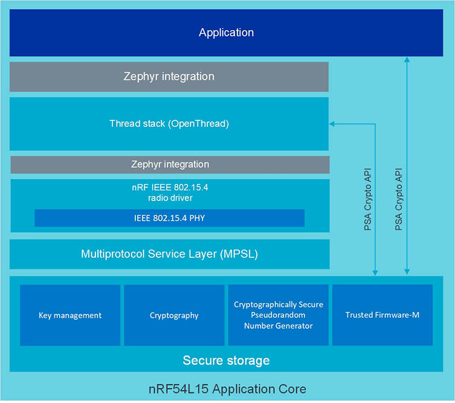
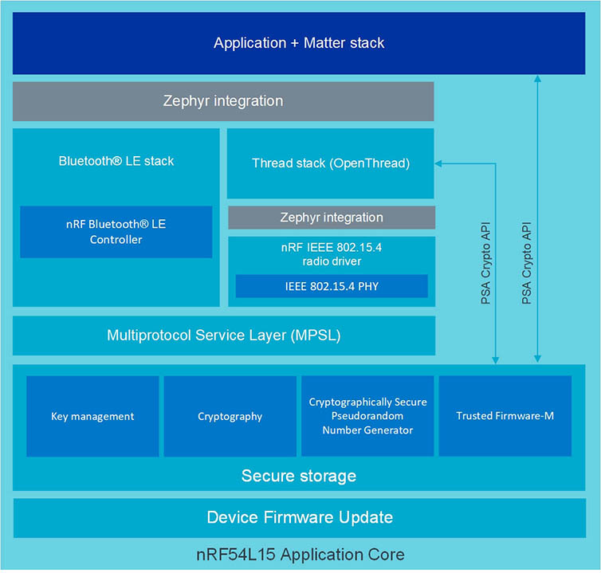

:orphan:

.. _ug_nrf54l15_matter_thread:

Working with nRF54L15 and Matter and Thread
###########################################

.. contents::
   :local:
   :depth: 2

Starting with the ``v2.4.99-cs3`` limited customer sampling tag, the nRF54L15 PDK supports the following Matter and Thread samples:

* :ref:`Matter template sample <matter_template_sample>`
* :ref:`Matter light bulb sample <matter_light_bulb_sample>`
* :ref:`Matter light switch sample <matter_light_switch_sample>`
* :ref:`Matter window covering sample <matter_window_covering_sample>`
* :ref:`Thread CLI sample <ot_cli_sample>`
* :ref:`Thread coprocessor sample <ot_coprocessor_sample>`

The Matter support is currently limited to Matter over Thread, and support for both Matter and Thread is currently :ref:`experimental <software_maturity>`.
Read the following sections for more information about support in the nRF54L15 PDK and the platform design for the nRF54L15 SoC.

For more information about Matter and Thread in the |NCS|, read the documentation in the :ref:`ug_matter` and :ref:`ug_thread` protocol sections.

Platform designs for the nRF54L15 SoC
*************************************

Matter in the |NCS| supports the *System-on-Chip, multiprotocol* platform design for the nRF54L15 SoC using Matter over Thread.
You can read more about other available platform designs for Matter on the :ref:`Matter platform design page<ug_matter_overview_architecture_integration_designs>`.

Thread in the |NCS| supports the *System-on-Chip, single protocol* and *System-on-Chip, multiprotocol* platform designs for the nRF54L15 SoC.
You can read more about other available platform designs for Thread on the :ref:`OpenThread architectures page<ug_thread_architectures>`.

For more information about the multiprotocol feature, see :ref:`ug_multiprotocol_support`.

System-on-Chip, single protocol
===============================

In this design, the OpenThread stack runs on single core of a single nRF54L15 SoC.

This platform designs is suitable for the following development kit:

.. TO DO: /includes/sample_board_rows.txt for nrf54l15dk_nrf54l15_cpuapp@soc1 to be added

In this design the Application Core runs the OpenThread stack and the component that is related to the 802.15.4 IEEE Radio Driver.

  .. note::
     The PSA crypto API level 3 for storing security components is not yet implemented.

The following figure demonstrates the architecture.

.. _nrf54l15_platform_single_figure:

   Single protocol Thread architecture on the nRF54L15 SoC

System-on-Chip, multiprotocol
=============================

In this design, the OpenThread stack and the Bluetooth® Low Energy (LE) stack run on single core of a single nRF54L15 SoC.

This platform design is suitable for the following development kit:

.. TO DO: /includes/sample_board_rows.txt for nrf54l15dk_nrf54l15_cpuapp@soc1 to be added

In this design the Application Core runs the OpenThread stack, the component of the OpenThread stack that is related to the 802.15.4 IEEE Radio Driver, and a part of the Bluetooth LE Controller.
Device Firmware Update component (DFU) is available only in the Matter solution.

  .. note::
      The PSA crypto API level 3 for storing security components is not yet implemented.

The following figure demonstrates the architecture.

.. _nrf54l15_platform_multi_figure:

   Multiprotocol Thread and Bluetooth LE architecture on the nRF54L15 SoC

Matter over Thread
==================

In this design, the Matter stack, the OpenThread stack, and the Bluetooth LE stack run on single core of a single nRF54L15 SoC.

This platform design is suitable for the following development kit:

.. TO DO: /includes/sample_board_rows.txt for nrf54l15dk_nrf54l15_cpuapp@soc1 to be added

In this design:

* The Application Core runs the Matter stack, the OpenThread stack, the component of the OpenThread stack that is related to the 802.15.4 IEEE Radio Driver and a part of the Bluetooth LE Controller.

  .. note::
      The PSA crypto API level 3 for storing security components is not yet implemented on the Secure Domain.

Refer to the :ref:`nrf54l15_platform_multi_figure` figure to see the architecture of the SoC.
The Global Domain is not included.

Additional requirements on the nRF54L15 PDK
*******************************************

In addition to the standard requirements for the |NCS|, such as the :ref:`ug_matter_gs_tools_gn` for Matter, you need the following to run Matter-enabled or Thread-enabled applications on the nRF54L15 PDK:

* For DFU - J-Link and a USB cable.
* The compatible version of the nrfjprog tool, included in the :ref:`nRF Command Line Tools version specific to the limited customer sampling<nRF54L15_install_commandline>`.

Configuring Matter and Thread on the nRF54L15 PDK
*************************************************

Currently, only the configuration for Matter over Thread is supported for Matter.
Follow the configuration steps on the :ref:`ug_matter_gs_testing` page to configure the Matter environment for the supported Matter samples.

Currently, only the :ref:`ot_cli_sample` sample is supported for Thread.
See the sample documentation for how to configure it.

The Matter and Thread samples included in the limited customer sampling can work on the corresponding networks with standard devices of the same protocol.

Programming Matter and Thread samples on the nRF54L15 PDK
=========================================================

To program the compatible Matter or Thread samples on the nRF54L15 PDK, follow the :ref:`ug_nRF54l15_gs_sample` steps.
Read also programming guides prepared for specific Matter samples:

   * :ref:`Matter template sample <matter_template_sample>`
   * :ref:`Matter light bulb sample <matter_light_bulb_sample>`
   * :ref:`Matter light switch sample <matter_light_switch_sample>`
   * :ref:`Matter window covering sample <matter_window_covering_sample>`

Logging for Matter and Thread samples on the nRF54L15 PDK
=========================================================

To read logs for Matter samples on the nRF54L15 PDK, complete the following steps:

1. Connect to the nRF54L15 PDK using a USB cable.
#. Select the first available port to read the logs from.

To read more about the logging see the :ref:`nrf54l15_sample_reading_logs` section.

.. _ug_nRF54l15_matter_thread_limitations:

Limitations for Matter and Thread on the nRF54L15 PDK
*****************************************************

Matter and Thread support has the following limitations on the nRF54L15 PDK:

* Button 4 does not work on nRF54L15 PDK.
  Bluetooth LE advertising for Matter commissioning starts automatically after the reboot.
* PWM driver module is not implemented and LED dimming does not work.
  All PWM functions are replaced by constant LED states (:ref:`Matter window covering sample <matter_window_covering_sample>` and :ref:`Matter light bulb sample <matter_light_bulb_sample>`).
* Matter samples requires the nRF54L15 PDK to be at least revision ES3.
  NRF54L15 PDK in revision ES2, which has been delivered within the v2.4.99-cs2 release, does not work with Matter samples.
* DFU over Bluetooth LE, Matter, or Serial Link is not yet implemented.
* The current implementation is not power-optimized.
* The PSA crypto API level 3 for storing security components is not yet implemented on the Secure Domain.
