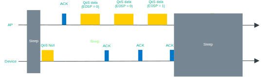

.. _ug_nrf70_developing_powersave:

Operating in power save modes
#############################

.. contents::
   :local:
   :depth: 2

The nRF70 Series device supports multiple power save modes, enabling the device to minimize power consumption by shutting down most of the digital logic and RF circuits.

.. _ug_nrf70_developing_powersave_device_states:

nRF70 Series device states
**************************

The power save state of the nRF70 Series device is described through a combination of the physical power state of the logic or circuits and the logical functional state as observed by the access point (AP).

Power state
===========

The nRF70 Series device can be in one of the following power states:

* **Active:** The device is **ON** constantly so that it can receive and transmit the data.
* **Sleep:** The device is **OFF** to the majority of the blocks that cannot receive and transmit the data.
  In this state, the device consumes low power (~15 µA).
  Real-time Clock (RTC) domain, RF retention memory, and firmware retention memory are powered **ON** to retain the state information.
* **Shutdown:** The device is completely powered **OFF**.
  In this state, the device consumes very low power (~2 µA) and does not retain any state information (apart from the values in the OTP memory).
  The device will only respond to a BUCKEN assertion to wake from the Shutdown state.

Functional state
================

The functional state information of the nRF70 Series device at the AP database can be either Active or Power Save.
The device is automatically in the Active state after the connection to a network.

The state change information must be given to an AP by a successful frame exchange.
The two functional states are described as follows:

* **Active:** The device is in the Active state permanently.
  If the data exists, the AP can schedule transmission of the data to the device immediately.
* **Power Save:** The device is in the sleep state most of the time, but can also be woken up to transmit and receive data.
  In this state, the AP buffers the required frames intended for the device.
  The device can make a transition between the active and sleep states according to the IEEE 802.11 power save protocol.

.. _ug_nrf70_developing_powersave_power_save_mode:

Power Save mode
***************

The nRF70 Series device can operate in Active mode or Power Save mode.
When the device changes from Active mode to Power Save mode, it informs the AP through a successful frame exchange.

Once the frame exchange completes, the AP buffers all the frames (multicast and broadcast) that are addressed to the device.
The device wakes up to receive buffered traffic for every Delivery Traffic Indication Message (DTIM) beacon and goes back to the sleep state for the remaining period.

The following Power Save modes are supported and can be configured by the user or application:

* **Dynamic Power Save:** The device switches between Active and Power Save mode depending on the activity.
  It enters the Power Save mode due to inactivity (timer expiry) and returns to the Active mode due to application traffic.
  The nRF70 Series devices operate in this mode by default with several additional submodes (see :ref:`ug_nrf70_developing_powersave_dynamic_power_save`).
* **Permanent Active:** The device is always in the Active mode.
  The power consumption is high, but the performance is best in this mode.
* **Static Power Save:** The device is in the Power Save mode.
  This mode saves the most power but provides the lowest throughput.
  This mode is not supported in the current release.

.. note::

  Even when the device is in the Dynamic Power Save mode, you or the application can set the device to the Permanent Active mode using the ``NET_REQUEST_WIFI_PS`` network management API.

.. _ug_nrf70_developing_powersave_dynamic_power_save:

Dynamic Power Save mode
=======================

Additionally, the Wi-Fi® interface can be configured in one of the following Dynamic Power Save modes:

* **Normal Power Save:** DTIM-based power save.
  This is the default configuration and enabled by the application based on the traffic profile.
* **Extended Power Save:** Listen interval-based Power Save mode.
  The Listen interval-based Power Save mode is supported to enable devices to sleep longer than the DTIM period.
* **Deep sleep:** Target Wake Time (TWT) power save.
  TWT can be enabled if the connected AP is Wi-Fi 6 capable.

.. _ug_nrf70_developing_powersave_dtim:

Delivery Traffic Indication Message (DTIM)
******************************************

The nRF70 Series devices use DTIM-based power save by default.
Devices in DTIM-based power save (Normal Power Save) can wake at any time to transmit uplink traffic.
However, they can only receive downlink traffic (broadcast, multicast, or unicast) immediately after receiving a DTIM beacon.
To make the device in Power Save mode aware that the AP has buffered downlink traffic, the AP uses the Traffic Indication Map (TIM) element present in the beacon frames.
The device then wakes up to receive the DTIM beacon and checks the status of the TIM element.
This element indicates whether there are any buffered group frames or unicast frames that need to be retrieved from the AP.

.. _ug_nrf70_developing_powersave_dtim_group:

Group frames
============

Group addressed frames are directed to all connected devices.
When there is at least one device in Power Save mode in the Basic Service Set (BSS), the AP buffers the broadcast and multicast traffic and transmits at a specific time to ensure that all associated devices can receive it.

The buffered group traffic is delivered immediately after a DTIM beacon.
The following figure illustrates the group frame data retrieval mechanism in DTIM-based Power Save (Normal Power Save) mode:

.. figure:: images/nRF70_ug_group_frames.svg
   :alt: Group frames

   Group frames

.. _ug_nrf70_developing_powersave_dtim_unicast:

Unicast frames
==============

Unicast frames are directed to a single intended device.
When a device in the Power Save mode parses a TIM element indicating any individually addressed buffered frames, retrieving the buffered frames depends on the IEEE power save operation modes.
There are two types of Power Save modes that use unicast frames, Legacy Power Save mode and Wireless Multimedia (WMM) Power Save mode.

Legacy Power Save mode
----------------------

The Legacy Power Save mode is the default option in the nRF70 Series devices.
The mechanism of this mode is based on the Power Save-Poll frame retrieving the buffered frames from the AP.
The Power Save-Poll frame is a short Control Frame containing the Association Identifier (AID) value of the device.

In the Legacy Power Save mode, when the device receives a beacon with its AID in the TIM element, it initiates the frame delivery by transmitting a Power Save-Poll control frame to the AP.
The AP acknowledges the Power Save-Poll frame and responds with a single buffered frame.
The device stays active and retrieves the buffered frame.

The AP also indicates that there are buffered frames for the device using the **More Data** subfield.
The device continues to retrieve buffered frames using Power Save-Poll frames until there are no more frames and the **More Data** subfield is set to ``0``.
It then goes back into the sleep state after retrieving all the buffered frames.

The following figure illustrates the unicast frame data retrieval mechanism in Legacy Power Save mode:

.. figure:: images/nRF70_ug_legacy_power_save.svg
   :alt: Legacy Power Save mode

   Legacy Power Save mode

Wireless Multimedia (WMM) Power Save mode
-----------------------------------------

The WMM Power Save mode uses the Automatic Power Save Delivery (APSD) mechanism to retrieve the individual unicast-buffered traffic.
A device in the Power Save mode starts the Service Period (SP) by sending a trigger frame that is a QoS Data/QoS Null frame.

When the device receives a beacon with its AID in the TIM element, it initiates the SP by transmitting the trigger frame to the AP.
The AP sends one or more individually addressed buffered frames to the device.
The device remains active until the AP ends the SP by setting the End Of Service Period (EOSP) bit to ``1`` in the **QoS Control** field of the last QoS Data frame sent to the device.

The following figure illustrates the unicast frame data retrieval mechanism in WMM Power Save mode:

   WMM Power Save mode

To change from the default Legacy Power Save mode to the WMM Power Save mode, you or the application can configure this by using the ``NET_REQUEST_WIFI_PS`` network management API.

The WMM Power Save mode does not deliver a significant performance or power difference when compared to Legacy Power Save mode in Dynamic power save operation.
The average power consumption of the device is affected by the DTIM period.
For example, if the beacon interval is 100 time units, then the DTIM will be 307 ms.
The higher DTIM period results in increased power saving and higher latency to the application data.

.. _ug_nrf70_developing_powersave_extended_ps:

Extended Power Save
*******************

This feature helps legacy connections to go into an extended power save, similar to the TWT feature in Wi-Fi 6.
The device wakeup interval is adjusted to the nearest multiple of the DTIM period.
For example, when the Listen interval is 10, the device wakes up for every 9th beacon if the DTIM is 3, and wakes up to the 8th beacon if the DTIM is 4.
The device wakes up for the configured Listen interval instead of the DTIM beacon.
Therefore, it will miss the chance of receiving broadcast and multicast frames which get scheduled after the DTIM beacon.

.. caution::
    The Listen interval-based power save should only be enabled if the application can handle lost broadcast frames.
    This is because chances of losing broadcast frames increases with higher listen intervals.

The Listen interval and wakeup mode parameters control the functionality of the Extended Power Save mode.

Listen interval
===============

The Listen interval is a field that is present in an association request frame.
It indicates how frequently the device will wake up to check for any buffered traffic by checking TIM IE in the beacon.
A larger value enables the devices to save more power by sleeping for longer periods.
However, larger listen intervals add burden to the AP, as the AP will need to buffer frames for much longer to the device and this may force the AP to decline connection.

.. caution::
  If the buffered frames exceed the MPDU/MSDU lifetime then they will be silently discarded by the AP which causes frame loss.

Additionally, the Listen interval:

* is typically 10 beacons.
* can be set using the ``NET_REQUEST_WIFI_PS`` API and should be called before connecting to the AP.

Wakeup mode
===========

The device can be configured to wake up for the DTIM or Listen interval by using the ``NET_REQUEST_WIFI_PS`` API.
The device can switch from the DTIM to the Listen interval-based power save at runtime seamlessly.

The following figure illustrates the change in wakeup mode from the DTIM to the Listen interval.

.. figure:: images/nRF70_ug_change_wakeup_mode_from_dtim_to_li.png
   :alt: Change Power Save wakeup mode from DTIM to Listen interval

   Change Power Save wakeup mode form DTIM to Listen interval

The following figure illustrates the change in wakeup mode from the Listen interval to DTIM.

.. figure:: images/nRF70_ug_change_wakeup_mode_from_li_to_dtim.png
   :alt: Change Power Save wakeup mode from Listen interval to DTIM

   Change Power Save wakeup mode from Listen interval to DTIM

.. _ug_nrf70_developing_powersave_twt:

Target Wake Time (TWT)
**********************

TWT is a feature in Wi-Fi 6 that allows the device to be configured to the :ref:`Deep sleep <ug_nrf70_developing_powersave_dynamic_power_save>` Power Save mode.
It allows devices to wake up at the negotiated times to transmit and receive data.
The AP and devices reach a TWT agreement that defines when a station is active, and ready to receive and transmit data.

Devices can now remain in the sleep state for longer periods of time, if required.
Before Wi-Fi 6, a device would sleep for a DTIM period, wake up, exchange data, and then return to the sleep state for another DTIM period, repeating continuously.
With the introduction of TWT in Wi-Fi 6, a device can sleep for seconds, minutes, or even hours.
Some devices can be configured to communicate once a day to perform a transmission and sleep for the rest of the day.

The TWT mechanism allows each device to negotiate its wake-up period with the AP to transmit and receive data packets.
Stations will only receive and transmit during the TWT SP and remain in the sleep state for the rest of the time.

.. note::
   The device follows the TWT wake schedule to save power and does not wake up for DTIM beacons.
   It is not able to receive broadcast or multicast frames, which are scheduled after the DTIM beacon.
   Applications are expected to keep note of this and set up TWT sessions based on their traffic profile.

An AP has more control over the network in TWT mode and decides which device is going to transmit and when.
The AP decides how many and which Resource Units (RU; a contiguous set of subcarriers) are to be used.
Therefore, TWT offers more efficient scheduling of transmissions.

The figure below illustrates the initiation of two independent TWT sessions.
The TWT session starts with a trigger frame from the AP at a time determined during the TWT establishment frame exchange (TWT1 and TWT2 for devices 1 and 2 respectively).

.. figure:: images/nRF70_ug_twt.svg
   :alt: TWT wakeup sequence

   TWT wakeup sequence

Modes of operation in TWT mode
==============================

When the device is in the TWT mode, there are two modes of operation:

* **Individual:** The device can choose when to wake up and sleep.
  It can negotiate an agreement with the AP to wake up for receiving or transmitting the data.
* **Broadcast:** The AP provides the schedule to all devices that support broadcast TWT.
  This mode is not supported in the current release.

Here is an example of a typical sequence of states in a TWT use case:

1. Scan the network.
#. Connect to an AP.
#. Complete the application-level handshake.
#. Set up a TWT session using the following Wi-Fi shell command:

   .. code-block:: console

      wifi twt setup

#. Tear down the TWT session using the following Wi-Fi shell commands:

   .. code-block:: console

      wifi twt teardown
      wifi twt teardown_all

   .. note::
    An application can tear down an ongoing TWT session and enter DTIM-based Power Save mode, if it is expecting group addressed frames, and set up a TWT session again as applicable.

    Devices are not expected to schedule transmission outside the TWT SP.
    An application can tear down an ongoing TWT session and schedule, if there is a requirement, for immediate transmission.

Key parameters
==============

The two key parameters of TWT are TWT Wake Duration and TWT Wake Interval.

TWT Wake Duration
-----------------

TWT Wake Duration is the amount of time that the TWT-requesting device needs to be active to complete the frame exchanges during the TWT Wake interval.
The valid range for duration is 1 ms to 256 ms.

.. caution::
  Lower values for duration times result in more power saving, but at the cost of potential loss of data.
  Therefore it is not recommended to go lower than 8 ms.
  The application can choose a value lower than 8 ms, but at the cost of losing application data in the network.

The application must choose the right duration based on the traffic pattern.
Applications must also take appropriate action if the uplink or downlink traffic is more than anticipated.
Otherwise it could terminate the ongoing TWT session and negotiate a new session, based on new requirements.

As mentioned, the TWT Wake Duration has two types of traffic: downlink and uplink traffic.

Downlink traffic
^^^^^^^^^^^^^^^^

Downlink traffic relies on predictability as the key for choosing the correct wake duration.
The wake duration must be sufficient for the AP to schedule all the incoming traffic to devices.
The AP also needs to contend the channel for scheduling frames, and frames will be dropped if the duration is aggressive in busy channels.

.. caution::
  The AP will drop the device data if it cannot finish all transmission in the wake duration, and it may buffer traffic until the next interval if sleep duration is in the order of 100 ms.
  It will not buffer the device data if the sleep duration is in the order of minutes, and data will be lost.

With downlink traffic, devices are allowed to sleep after the wake duration and there is no mechanism to extend the wake duration based on downlink traffic.
The device must be active during the wake duration even if there is no downlink traffic.

Uplink traffic
^^^^^^^^^^^^^^

Uplink traffic can be set to be either Trigger Enabled or Non-trigger Enabled mode.

When operating in Trigger Enabled mode, the nRF70 Series device:

* schedules uplink traffic as a response to trigger frames from the AP.
* expects the AP to schedule trigger frames in the wake duration.

When operating in Non-trigger Enabled mode, the nRF70 Series device:

* schedules uplink traffic using the legacy channel contention.
* tries to schedule all uplink traffic in the wake duration and discard pending frames.

.. note::
  Both types of uplink traffic discard all pending uplink frames after wake-time expiry before entering the sleep state.

TWT Wake Interval
-----------------

TWT Wake Interval is the interval between successive TWT wake periods.
The valid range for duration is one millisecond to a few days.
The application must choose the right interval based on the expected traffic.

The following figure illustrates the two key parameters of TWT:

.. figure:: images/nRF70_ug_twt_wake_interval.svg
   :alt: TWT Wake Duration and Interval

   TWT Wake Duration and Interval

.. _ug_nrf70_developing_powersave_usage:

Usage
*****

DTIM-based power save (:ref:`Normal Power Save <ug_nrf70_developing_powersave_dynamic_power_save>` mode) is the default configuration of the device after connection to an AP.
The wake-up and sleep period of the device is aligned to the DTIM period advertised in the AP beacon.
The AP is in control of the DTIM period and can be configured while setting up the network.
Stations connected to the AP cannot set or request a change in this value.

A higher DTIM period provides higher power saving in devices, but it adds latency to the downlink traffic.
The latency of the DTIM period is seen in the device for the initial downlink traffic.
A device can wake up and schedule uplink traffic at any time, with a latency of a few milliseconds observed.

When operating in DTIM-based Power Save mode, the nRF70 Series device:

* wakes up to receive DTIM beacons and decode TIM.
* receives all broadcast or multicast frames after the DTIM beacon.
* retrieves all unicast frames using either Power Save-POLL or Trigger frames.
* maintains the Wi-Fi connection by responding to the keep alive packet exchange at any point of time.

DTIM-based power save is more efficient for sleep intervals that are in the range of milliseconds to a few seconds.
However, TWT-based power save will perform better if the sleep interval is in the 10s of seconds and above range.
This is why DTIM-based power save performs better in high throughput applications compared to TWT.

TWT-based power save allows devices to sleep for longer intervals than the DTIM-based power save.
It is suitable for devices that have predictable periodic uplink or downlink traffic, and do not have low latency requirements.

As the device sleeps longer and does not wake up to receive DTIM beacons, it misses all multicast or broadcast frames.
The TWT session is expected to be set up by the application after the network level negotiation, after which it is not expected to receive any multicast or broadcast frames.

Additionally, by using the ``NET_EVENT_WIFI_TWT_SLEEP_STATE`` API, the application layer can subscribe to TWT events to be notified of the beginning and end of a service period to be able to send or receive data.

.. _ug_nrf70_developing_powersave_api:

Power Save API
**************

The following shell commands and network management APIs are provided for Power Save operations:

.. list-table:: Wi-Fi Power Save network management APIs
   :header-rows: 1

   * - Network management APIs
     - Wi-Fi shell command
     - Description
     - Expected output
   * - net_mgmt(NET_REQUEST_WIFI_PS)
     - wifi ps on
     - Turn on Power Save mode feature
     - Power Save mode enabled
   * - net_mgmt(NET_REQUEST_WIFI_PS)
     - wifi ps off
     - Turn off Power Save mode feature
     - Power Save mode disabled
   * - net_mgmt(NET_REQUEST_WIFI_PS)
     - wifi ps_mode legacy
     - Config mode as Legacy
     -
   * - net_mgmt(NET_REQUEST_WIFI_PS)
     - wifi ps_mode wmm
     - Config mode as WMM
     -
   * - net_mgmt(NET_REQUEST_WIFI_PS)
     - wifi ps_timeout
     - Config ps timeout duration (in ms)
     -
   * - net_mgmt(NET_REQUEST_WIFI_PS)
     - wifi ps_listen_interval
     - Config ps_listen_interval
     -
   * - net_mgmt(NET_REQUEST_WIFI_PS)
     - wifi ps_wakeup_mode dtim
     - Config ps wakeup mode as DTIM
     - Wakeup mode set to DTIM
   * - net_mgmt(NET_REQUEST_WIFI_PS)
     - wifi ps_wakeup_mode listen_interval
     - Config ps wakeup mode as listen_interval
     - Wakeup mode set to listem interval
   * - net_mgmt(NET_REQUEST_WIFI_TWT)
     - wifi twt setup 0 0 1 1 0 1 1 1 65000 524000
     - | Set up TWT:
       | TWT wake interval - 65000 µs
       | TWT interval - 524000 µs
     - TWT operation TWT setup with dg - 1, flow_id - 1 requested
   * - net_mgmt(NET_REQUEST_WIFI_TWT)
     - wifi twt teardown 0 0 1 1
     - Tear down TWT session
     - TWT operation TWT setup with dg - 1, flow_id - 1 requested
   * - net_mgmt(NET_REQUEST_WIFI_TWT)
     - wifi twt teardown_all
     - Tear down all sessions
     - TWT operation TWT teardown all flows
   * - net_mgmt_event_notify_with_info(NET_EVENT_WIFI_TWT_SLEEP_STATE)
     - N/A
     - Application can register to this event to be notified about TWT sleep/wake events.
     -

See the :ref:`wifi_shell_sample` sample for more information.

.. _ug_nrf70_developing_powersave_profiling:

Power profiling
***************

The Power Profiler Kit II (PPK2) of Nordic Semiconductor can be used to measure the power consumption of nRF70 Series devices in Low-power mode.
To measure the power consumption of the nRF70 Series device, complete the following steps:

1. Remove the jumper on **P23** (VBAT jumper).
#. Connect **GND** on the PPK2 kit to any **GND** on the DK.
   You can use the **P21** pin **1** labeled as **GND** (-).
#. Connect the **Vout** on the PPK2 kit to the **P23** pin **1** on the DK.

   .. figure:: images/power_profiler2_pc_nrf7002_dk.png
      :alt: Typical configuration for measuring power on the DK

      Typical configuration for measuring power on the DK

#. Configure PPK2 as a source meter with 3.6 volts.

   The following image shows the Power Profiler Kit II example output for DTIM wakeup:

   .. figure:: images/power_profiler_dtim_wakeup.png
      :alt: PPK2 output for DTIM wakeup

      PPK2 output for DTIM wakeup

   To reproduce the plots for DTIM period of 3, complete the following steps using the :ref:`wifi_shell_sample` sample:

     1. Configure an AP with DTIM value of 3.
     #. Connect to the AP using the following Wi-Fi shell commands:

        .. code-block:: console

           wifi scan
           wifi connect <SSID>

     #. Check the connection status using the following Wi-Fi shell command:

        .. code-block:: console

           wifi status

   The following image shows the PPK2 output for DTIM period of 3:

   .. figure:: images/power_profiler_dtim_output.png
      :alt: PPK2 output for DTIM period of 3

      PPK2 output for DTIM period of 3

   To reproduce the plots for TWT interval of one minute, complete the following steps using the :ref:`wifi_shell_sample` sample:

     1. Connect to a TWT supported Wi-Fi 6 AP using the following Wi-Fi shell commands:

        .. code-block:: console

           wifi scan
           wifi connect <SSID>

     #. Check the connection status using the following Wi-Fi shell command:

        .. code-block:: console

           wifi status

     #. Start a TWT session using the following Wi-Fi shell command:

        .. code-block:: console

           wifi twt setup 0 0 1 1 0 1 1 1 8 60000

   The following image shows the PPK2 output for TWT interval of one minute:

   .. figure:: images/power_profiler_twt.png
      :alt: PPK2 output for TWT

      PPK2 output for TWT
