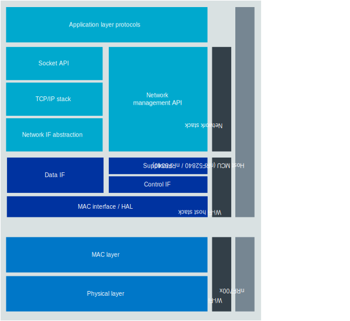

.. _ug_nrf70_stack partitioning:

Networking stack partitioning
#############################

.. contents::
   :local:
   :depth: 2

The nRF70 Series of wireless companion ICs implement the Physical (PHY) and Medium Access Control (MAC) layers of the IEEE 802.11 protocol stack.
The higher layers of the networking stack, namely, the Wi-Fi driver and supplicant, the TCP/IP stack, and the networking application layers, run on the host device.
Data transfer between the host and the nRF70 companion device can occur through either SPI or QSPI interfaces.

The following figure illustrates the partitioning of the Wi-Fi stack between the nRF70 Series device and the host device:

   Overview of nRF70 application architecture
