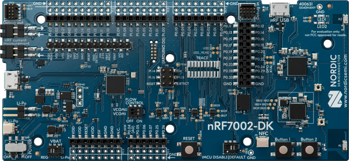
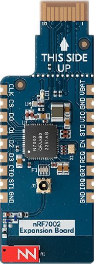
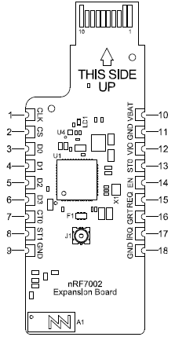

.. _nrf7002dk_nrf5340:

Getting started with nRF70 Series
#################################

.. contents::
   :local:
   :depth: 4

This page gets you started with your nRF70 Series devices using the |NCS|.

Supported development boards
****************************

nRF7002 DK
==========

The nRF7002 DK (PCA10143) is a single-board development kit for evaluation and development on the nRF7002, a Wi-Fi® companion :term:`Integrated Circuit (IC)` to Nordic Semiconductor's nRF5340 System-on-Chip (SoC) host processor.

Overview
--------

The nRF7002 is an IEEE 802.11ax (Wi-Fi 6) compliant solution that implements the Wi-Fi physical layer and Medium Access Control (MAC) layer protocols.
It implements the Wi-Fi driver software on the nRF5340 host processor communicating over the QSPI bus.

The nRF5340 host is a dual-core SoC based on the Arm® Cortex®-M33 architecture.
It has the following features:

* A full-featured Arm Cortex-M33F core with DSP instructions, FPU, and Armv8-M Security Extension, running at up to 128 MHz, referred to as the *application core*.
* A secondary Arm Cortex-M33 core, with a reduced feature set, running at a fixed 64 MHz, referred to as the *network core*.

The ``nrf7002dk_nrf5340_cpuapp`` build target provides support for the application core on the nRF5340 SoC.
The ``nrf7002dk_nrf5340_cpunet`` build target provides support for the network core on the nRF5340 SoC.

   nRF7002 DK

Hardware
--------

The nRF7002 DK has two external oscillators:

   * The frequency of the slow clock is 32.768 kHz.
   * The frequency of the main clock is 32 MHz.

Supported features
^^^^^^^^^^^^^^^^^^

The ``nrf7002dk_nrf5340_cpuapp`` board configuration supports the following hardware features:

+-----------+------------+----------------------+
| Interface | Controller | Driver/Component     |
+===========+============+======================+
| ADC       | on-chip    | adc                  |
+-----------+------------+----------------------+
| CLOCK     | on-chip    | clock_control        |
+-----------+------------+----------------------+
| FLASH     | on-chip    | flash                |
+-----------+------------+----------------------+
| GPIO      | on-chip    | gpio                 |
+-----------+------------+----------------------+
| I2C(M)    | on-chip    | i2c                  |
+-----------+------------+----------------------+
| MPU       | on-chip    | arch/arm             |
+-----------+------------+----------------------+
| NVIC      | on-chip    | arch/arm             |
+-----------+------------+----------------------+
| PWM       | on-chip    | pwm                  |
+-----------+------------+----------------------+
| RTC       | on-chip    | system clock         |
+-----------+------------+----------------------+
| RTT       | Segger     | console              |
+-----------+------------+----------------------+
| RADIO     | nrf7002    | Wi-Fi 6 (802.11ax)   |
+-----------+------------+----------------------+
| QSPI      | on-chip    | qspi                 |
+-----------+------------+----------------------+
| SPI(M/S)  | on-chip    | spi                  |
+-----------+------------+----------------------+
| SPU       | on-chip    | system protection    |
+-----------+------------+----------------------+
| UARTE     | on-chip    | serial               |
+-----------+------------+----------------------+
| USB       | on-chip    | usb                  |
+-----------+------------+----------------------+
| WDT       | on-chip    | watchdog             |
+-----------+------------+----------------------+

The ``nrf7002dk_nrf5340_cpunet`` board configuration supports the following hardware features:

+-----------+------------+----------------------+
| Interface | Controller | Driver/Component     |
+===========+============+======================+
| CLOCK     | on-chip    | clock_control        |
+-----------+------------+----------------------+
| FLASH     | on-chip    | flash                |
+-----------+------------+----------------------+
| GPIO      | on-chip    | gpio                 |
+-----------+------------+----------------------+
| I2C(M)    | on-chip    | i2c                  |
+-----------+------------+----------------------+
| MPU       | on-chip    | arch/arm             |
+-----------+------------+----------------------+
| NVIC      | on-chip    | arch/arm             |
+-----------+------------+----------------------+
| RADIO     | on-chip    | Bluetooth,           |
|           |            | ieee802154           |
+-----------+------------+----------------------+
| RTC       | on-chip    | system clock         |
+-----------+------------+----------------------+
| RTT       | Segger     | console              |
+-----------+------------+----------------------+
| QSPI      | on-chip    | qspi                 |
+-----------+------------+----------------------+
| SPI(M/S)  | on-chip    | spi                  |
+-----------+------------+----------------------+
| UARTE     | on-chip    | serial               |
+-----------+------------+----------------------+
| WDT       | on-chip    | watchdog             |
+-----------+------------+----------------------+

Other hardware features are not supported by the |NCS| kernel.

Connections and IOs
^^^^^^^^^^^^^^^^^^^

The connections and IOs supported by the development kit are listed in this section.

LED
"""

* LED1 (green) = P1.06
* LED2 (green) = P1.07

Push buttons
""""""""""""

* BUTTON1 = SW1 = P1.08
* BUTTON2 = SW2 = P1.09
* BOOT = SW5 = boot/reset

Wi-Fi control
"""""""""""""

* BUCKEN = P0.12
* IOVDD CONTROL = P0.31
* HOST IRQ = P0.23
* COEX_REQ = P0.28
* COEX_STATUS0 = P0.30
* COEX_STATUS1 = P0.29
* COEX_GRANT = P0.24

Security components
^^^^^^^^^^^^^^^^^^^

The following security components are available:

* Implementation Defined Attribution Unit (`IDAU`_) on the application core.

  The IDAU is implemented with the System Protection Unit and is used to define secure and non-secure memory maps.
  By default, the entire memory space (Flash, SRAM, and peripheral address space) is defined to be secure-accessible only.

* Secure boot.

Programming and debugging
-------------------------

The nRF5340 application core supports the Armv8-M Security Extension.
Applications built for the ``nrf7002dk_nrf5340_cpuapp`` board boot by default in the secure state.

The nRF5340 network core does not support the Armv8-M Security Extension.
nRF5340 IDAU can configure bus accesses by the nRF5340 network core to have the secure attribute set.
This allows to build and run secure-only applications on the nRF5340 SoC.

Building |NCS| applications with Arm TrustZone
^^^^^^^^^^^^^^^^^^^^^^^^^^^^^^^^^^^^^^^^^^^^^^

Applications on nRF5340 can use Cortex-M Security Extensions (CMSE) and separate firmware for the application core between Secure Processing Environment (SPE) and Non-Secure Processing Environment (NSPE).
You can build SPE using either |NCS| or `Trusted Firmware M`_ (TF-M).
You must always build NSPE using |NCS|.

For information about Cortex-M Security Extensions (CMSE) and the difference between the two environments, see :ref:`app_boards_spe_nspe`.

.. note::
   By default, SPE for the nRF5340 application core is built using TF-M.

Building the firmware with TF-M
"""""""""""""""""""""""""""""""

If you want to use |NCS| to build the firmware image separated in SPE with TF-M and NSPE, complete the following steps:

1. Build the |NCS| application for the application core using the ``nrf7002dk_nrf5340_cpuapp_ns`` build target.

   To invoke the building of TF-M, the |NCS| build system requires the Kconfig option :kconfig:option:`CONFIG_BUILD_WITH_TFM` to be enabled, which is set by default when building |NCS| as an application that supports both NSPE and SPE.

   The |NCS| build system performs the following steps automatically:

      a. Build the NSPE firmware image as a regular |NCS| application.
      #. Build an SPE firmware image (with TF-M).
      #. Merge the output image binaries.
      #. Optionally, build a bootloader image (MCUboot).

   .. note::
      Depending on the TF-M configuration, an application DTS overlay can be required to adjust the NSPE image flash memory partition and SRAM starting address and sizes.

#. Build the application firmware for the network core using the ``nrf7002dk_nrf5340_cpunet`` build target.

Building the secure firmware using |NCS|
""""""""""""""""""""""""""""""""""""""""

If you want to use |NCS| to build the firmware images with CMSE enabled, but without TF-M, complete the following steps:

1. Build the |NCS| application binary for SPE for the application core using the ``nrf7002dk_nrf5340_cpuapp`` build target.

   Also set :kconfig:option:`CONFIG_TRUSTED_EXECUTION_SECURE` to ``y`` and :kconfig:option:`CONFIG_BUILD_WITH_TFM` to ``n`` in the application project configuration file.
#. Build the |NCS| application binary for NSPE for the application core using the ``nrf7002dk_nrf5340_cpuapp_ns`` build target.
#. Merge the two binaries.
#. Build the application firmware for the network core using the ``nrf7002dk_nrf5340_cpunet`` build target.

When building application with SPE and NSPE for the nRF5340 application core, the SPE image must set the IDAU (SPU) configuration to allow non-secure access to all CPU resources used by the application firmware in NSPE.
SPU configuration must be applied before jumping to the application in NSPE.

Building application without CMSE
^^^^^^^^^^^^^^^^^^^^^^^^^^^^^^^^^

Build the |NCS| application as described in :ref:`gs_programming`, using the ``nrf7002dk_nrf5340_cpuapp`` build target for the firmware running on the nRF5340 application core and the ``nrf7002dk_nrf5340_cpunet`` build target for the firmware running on the nRF5340 network core.

Programming the firmware to the DK
^^^^^^^^^^^^^^^^^^^^^^^^^^^^^^^^^^

Follow the instructions in the :ref:`gs_programming` page to build and flash applications.

.. note::
   To flash and debug applications on the nRF7002 DK, you must use the `nRF Command Line Tools`_ version 10.12.0 or above.

Debugging
^^^^^^^^^

See the :ref:`testing` page for information about debugging.

Testing the LEDs and buttons in the nRF7002 DK
----------------------------------------------

The following samples allow you to test if the buttons (or switches) and LEDs on the development kit are working properly with |NCS|:

* :ref:`blinky-sample`
* :ref:`button-sample`

Build and flash the samples to make sure |NCS| is running correctly on your development kit.
For the button and LED definitions, see the :file:`boards/arm/nrf7002dk_nrf5340/nrf5340_cpuapp_common.dts` file.

.. _nrf70_gs_shields_expansion_boards:

Shields and expansion boards
****************************

Shields and expansion boards are add-on hardware that can be attached to a development kit or prototyping platform to extend their features and functionalities.

nRF7002 EK
==========

The nRF7002 :term:`Evaluation Kit (EK)` is a versatile evaluation kit in the form of an Arduino shield.
The kit can be used to provide Wi-Fi connectivity and Wi-Fi-based locationing to compatible development or evaluation boards through the nRF7002 Wi-Fi 6 companion IC.

The nRF7002 EK features the nRF7002 companion IC.
In addition, the shield may be used to emulate the nRF7001 and nRF7000 companion IC variants.

Overview
--------

The nRF7002 EK (PCA63556) is designed to provide Wi-Fi connectivity and Wi-Fi (SSID) scanning capabilities via the nRF7002 companion IC to a compatible host development board.

The nRF7002 EK features an Arduino shield form factor and interface connector that allows it to be used with Arduino compatible boards, such as the `nRF52840 DK <nRF52840 DK product page_>`_, `nRF5340 DK <nRF5340 DK product page_>`_, or `nRF9160 DK <nRF9160 DK product page_>`_.
This interface is used to connect the nRF7002 companion device to a host :term:`System on Chip (SoC)`, Microprocessor Unit (MPU), or :term:`Microcontroller Unit (MCU)`.

.. figure:: images/nRF7002ek.png
   :alt: nRF7002 EK

   nRF7002 EK

Pin assignment for Arduino interface connector
----------------------------------------------

The Arduino interface of the nRF7002 EK is compatible with the Nordic nRF52840 DK, nRF5340 DK, and nRF9160 DK.
The interface connectors are described in the following table:

+------------------+-----------------------+----------------------------------+
| Arduino pin name | nRF7002 Signal        | Function                         |
+==================+=======================+==================================+
| D0               | IOVDD_EN              | Enable power to I/O interface    |
+------------------+-----------------------+----------------------------------+
| D1               | BUCK_EN               | Enable power to nRF7002          |
+------------------+-----------------------+----------------------------------+
| D2               | COEX_STATUS0          | Coexistence status 0             |
+------------------+-----------------------+----------------------------------+
| D3               | COEX_REQ              | Coexistence request from host    |
+------------------+-----------------------+----------------------------------+
| D4               | COEX_GRANT            | Coexistence grant to host        |
+------------------+-----------------------+----------------------------------+
| D5               | SW_CTRL0              | Switch control 0                 |
+------------------+-----------------------+----------------------------------+
| D6               | COEX_STATUS1          | Coexistence status 1             |
+------------------+-----------------------+----------------------------------+
| D7               | HOST_IRQ              | Interrupt request to host        |
+------------------+-----------------------+----------------------------------+
| D8               | DATA2                 | QSPI data line 2                 |
+------------------+-----------------------+----------------------------------+
| D9               | DATA3                 | QSPI data line 3                 |
+------------------+-----------------------+----------------------------------+
| D10              | SS                    | Slave select                     |
+------------------+-----------------------+----------------------------------+
| D11              | MISO/DATA1            | QSPI/SPI Data line 1/ Slave Out  |
+------------------+-----------------------+----------------------------------+
| D12              | MOSI/DATA0            | QSPI/SPI Data line 0/ Slave In   |
+------------------+-----------------------+----------------------------------+
| D13              | CLK                   | QSPI/SPI Clock                   |
+------------------+-----------------------+----------------------------------+
| GND              | GND                   | Ground                           |
+------------------+-----------------------+----------------------------------+
| AREF             | N.C.                  | Not used                         |
+------------------+-----------------------+----------------------------------+
| SDA              | N.C.                  | Not used                         |
+------------------+-----------------------+----------------------------------+
| SCL              | N.C.                  | Not used                         |
+------------------+-----------------------+----------------------------------+

Programming
-----------

To add support for the nRF7002 EK on an application running on a compatible host development board, the ``SHIELD`` setting must be specified.

To add support for the nRF7002 EK and the nRF7002 IC, set ``-DSHIELD=nrf7002ek`` when you invoke ``west build`` or ``cmake`` in your |NCS| application.
To emulate support for the nRF7001 or nRF7000 ICs, specify ``-DSHIELD=nrf7002ek_nrf7001`` or ``-DSHIELD=nrf7002ek_nrf7000``, respectively.

Alternatively, add the shield in the project's :file:`CMakeLists.txt` file, specifying the below settings, depending on which IC is to be used:

.. code-block:: console

   set(SHIELD nrf7002ek)

.. code-block:: console

   set(SHIELD nrf7002ek_nrf7001)

.. code-block:: console

   set(SHIELD nrf7002ek_nrf7000)

To build with the |nRFVSC|, specify ``-DSHIELD=nrf7002ek`` in the **Extra CMake arguments** field.
See :ref:`cmake_options` for instructions on how to provide CMake options.

To build for the nRF7002 EK and the nRF7002 IC with nRF5340 DK, use the ``nrf5340dk_nrf5340_cpuapp`` build target with the CMake ``SHIELD`` variable set to ``nrf7002ek``.
For example, you can use the following command when building on the command line:

.. code-block:: console

   west build -b nrf5340dk_nrf5340_cpuapp -- -DSHIELD=nrf7002ek

To build for the nRF7002 EK and the nRF7001 or nRF7000 ICs, you can use the corresponding shield name in the above command.

nRF7002 EB
==========

The nRF7002 :term:`Expansion Board (EB)` can be used to provide Wi-Fi connectivity to compatible development or evaluation boards through the nRF7002 Wi-Fi 6 companion IC.

The nRF7002 EB has a :term:`Printed Circuit Board (PCB)` edge connector that can be used with a compatible development board such as the Nordic Thingy:53, an IoT prototyping platform from Nordic Semiconductor.
There are also castellated holes on the side of the board that allow the EB to be used as a breakout board that can be soldered to other PCB assemblies.

Overview
--------

The nRF7002 EB (PCA63561) features a PCB edge connector and castellated holes to provide Wi-Fi connectivity through the nRF7002 companion IC.

The PCB edge connector is used to provide Wi-Fi connectivity to a development board with a compatible connector such as the Nordic Thingy:53, where it connects nRF7002 to nRF5340, which acts as a host.
The EB can also be used to provide Wi-Fi capabilities to develop Wi-Fi applications with another System on Chip (SoC), MPU, or MCU host by using the castellated edge holes on the sides of the board.

   nRF7002 EB

Pin assignment for PCB edge connector
-------------------------------------

The pinout of the PCB edge connector is shown in the following table.

+------------------+-----------------------+-------------------------------------------+
| Pin number       | Signal                | Function                                  |
+==================+=======================+===========================================+
| 1                | N.C.                  | Not used                                  |
+------------------+-----------------------+-------------------------------------------+
| 2                | N.C.                  | Not used                                  |
+------------------+-----------------------+-------------------------------------------+
| 3                | VIO                   | IO Supply voltage                         |
+------------------+-----------------------+-------------------------------------------+
| 4                | N.C.                  | Not used                                  |
+------------------+-----------------------+-------------------------------------------+
| 5                | GRT                   | Coexistence Interface Grant signal        |
+------------------+-----------------------+-------------------------------------------+
| 6                | REQ                   | Coexistence Interface Request signal      |
+------------------+-----------------------+-------------------------------------------+
| 7                | N.C.                  | Not used                                  |
+------------------+-----------------------+-------------------------------------------+
| 8                | CLK                   | SPI Clock signal                          |
+------------------+-----------------------+-------------------------------------------+
| 9                | EN                    | Power Enable signal                       |
+------------------+-----------------------+-------------------------------------------+
| 10               | N.C.                  | Not used                                  |
+------------------+-----------------------+-------------------------------------------+
| 11               | N.C.                  | Not used                                  |
+------------------+-----------------------+-------------------------------------------+
| 12               | N.C.                  | Not used                                  |
+------------------+-----------------------+-------------------------------------------+
| 13               | N.C.                  | Not used                                  |
+------------------+-----------------------+-------------------------------------------+
| 14               | VBAT                  | Supply voltage                            |
+------------------+-----------------------+-------------------------------------------+
| 15               | ST0                   | Coexistence Interface Status signal       |
+------------------+-----------------------+-------------------------------------------+
| 16               | D0                    | SPI MOSI signal                           |
+------------------+-----------------------+-------------------------------------------+
| 17               | D1                    | SPI MISO signal                           |
+------------------+-----------------------+-------------------------------------------+
| 18               | CS                    | SPI Chip Select signal                    |
+------------------+-----------------------+-------------------------------------------+
| 19               | IRQ                   | Host Interrupt signal                     |
+------------------+-----------------------+-------------------------------------------+
| 20               | GND                   | Ground                                    |
+------------------+-----------------------+-------------------------------------------+

Castellated edge holes
--------------------------

Castellated edge holes on the sides of the board connects the nRF7002 EB to the nRF7002 companion IC.
The following figure and table show the pinout for the nRF7002 EB.

   Castellated edge hole numbering

+------------------+-----------------------+-------------------------------------------+
| Pin number       | Signal                | Function                                  |
+==================+=======================+===========================================+
| 1                | CLK                   | QSPI Clock/SPI Clock                      |
+------------------+-----------------------+-------------------------------------------+
| 2                | SS                    | QSPI Slave select/SPI Slave select        |
+------------------+-----------------------+-------------------------------------------+
| 3                | D0                    | QSPI DATA0/SPI_MOSI                       |
+------------------+-----------------------+-------------------------------------------+
| 4                | D1                    | QSPI DATA1/ SPI_MISO                      |
+------------------+-----------------------+-------------------------------------------+
| 5                | D2                    | QSPI DATA2                                |
+------------------+-----------------------+-------------------------------------------+
| 6                | D3                    | QSPI DATA3                                |
+------------------+-----------------------+-------------------------------------------+
| 7                | CTO                   | SW_CTRL0 (not supported on the nRF7002 EB)|
+------------------+-----------------------+-------------------------------------------+
| 8                | ST1                   | SW_CTRL1                                  |
+------------------+-----------------------+-------------------------------------------+
| 9                | GND                   | Ground                                    |
+------------------+-----------------------+-------------------------------------------+
| 10               | VBAT                  | Supply voltage                            |
+------------------+-----------------------+-------------------------------------------+
| 11               | GND                   | Ground                                    |
+------------------+-----------------------+-------------------------------------------+
| 12               | VIO                   | IO Supply voltage                         |
+------------------+-----------------------+-------------------------------------------+
| 13               | STO                   | Coexistence Interface Status signal       |
+------------------+-----------------------+-------------------------------------------+
| 14               | EN                    | Power Enable signal                       |
+------------------+-----------------------+-------------------------------------------+
| 15               | REQ                   | Coexistence Interface Request signal      |
+------------------+-----------------------+-------------------------------------------+
| 16               | GRT                   | Coexistence Interface Grant signal        |
+------------------+-----------------------+-------------------------------------------+
| 17               | IRQ                   | Host Interrupt signal                     |
+------------------+-----------------------+-------------------------------------------+
| 18               | GND                   | Ground                                    |
+------------------+-----------------------+-------------------------------------------+

Building
--------

To build for the nRF7002 EB with Thingy:53, use the ``thingy53_nrf5340_cpuapp`` build target with the CMake ``SHIELD`` variable set to ``nrf7002eb``.
For example, you can use the following command when building on the command line:

.. code-block:: console

   west build -b thingy53_nrf5340_cpuapp -- -DSHIELD=nrf7002eb

To build for a custom target, set ``-DSHIELD=nrf7002eb`` when you invoke ``west build`` or ``cmake`` in your |NCS| application.

Alternatively, add the shield in the project's :file:`CMakeLists.txt` file by using the following command:

.. code-block:: console

   set(SHIELD nrf7002eb)

To build with the |nRFVSC|, specify ``-DSHIELD=nrf7002eb`` in the **Extra Cmake arguments** field.
See :ref:`cmake_options` for instructions on how to provide CMake options.

References
==========

* `nRF70 Series product page`_
* `nRF70 Series hardware documentation`_
* `nRF7002 Product Specification`_
* `nRF7001 Product Specification`_
