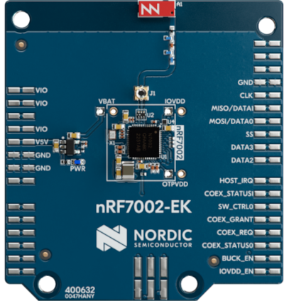

.. _ug_nrf7002ek_gs:

Getting started with nRF7002 EK
###############################

.. contents::
   :local:
   :depth: 4

This section gets you started with your nRF7002 :term:`Evaluation Kit (EK)` using the |NCS|.

The nRF7002 EK is a versatile evaluation kit in the form of an Arduino shield.
The kit can be used to provide Wi-Fi connectivity and Wi-Fi-based locationing to compatible development or evaluation boards through the nRF7002 Wi-Fi 6 companion IC.

The nRF7002 EK features the nRF7002 companion IC.
In addition, the shield may be used to emulate the nRF7001 and nRF7000 companion IC variants.

If this is your first time developing with a Nordic DK, read the appropriate getting started tutorial first:

* :ref:`ug_nrf7002_gs`
* :ref:`ug_nrf52_gs`
* :ref:`ug_nrf5340_gs`
* :ref:`ug_nrf9160_gs`

Overview
********

The nRF7002 EK (PCA63556) is designed to provide Wi-Fi connectivity and Wi-Fi (SSID) scanning capabilities through the nRF7002 companion IC to a compatible host development board.

The nRF7002 EK features an Arduino shield form factor and interface connector that allows it to be used with Arduino compatible boards, such as the `nRF52840 DK <nRF52840 DK product page_>`_, `nRF5340 DK <nRF5340 DK product page_>`_, `nRF9160 DK <nRF9160 DK product page_>`_, or `nRF9161 DK <Nordic nRF9161 DK_>`_.
This interface is used to connect the nRF7002 companion device to a host :term:`System on Chip (SoC)`, Microprocessor Unit (MPU), or :term:`Microcontroller Unit (MCU)`.

   nRF7002 EK

Pin assignment for Arduino interface connector
==============================================

The Arduino interface of the nRF7002 EK is compatible with the nRF52840 DK, the nRF5340 DK, and an nRF91 Series DK.
The interface connectors are described in the following table:

+------------------+-----------------------+----------------------------------+
| Arduino pin name | nRF7002 Signal        | Function                         |
+==================+=======================+==================================+
| D0               | IOVDD_EN              | Enable power to I/O interface    |
+------------------+-----------------------+----------------------------------+
| D1               | BUCK_EN               | Enable power to nRF7002          |
+------------------+-----------------------+----------------------------------+
| D2               | COEX_STATUS0          | Coexistence status 0             |
+------------------+-----------------------+----------------------------------+
| D3               | COEX_REQ              | Coexistence request from host    |
+------------------+-----------------------+----------------------------------+
| D4               | COEX_GRANT            | Coexistence grant to host        |
+------------------+-----------------------+----------------------------------+
| D5               | SW_CTRL0              | Switch control 0                 |
+------------------+-----------------------+----------------------------------+
| D6               | COEX_STATUS1          | Coexistence status 1             |
+------------------+-----------------------+----------------------------------+
| D7               | HOST_IRQ              | Interrupt request to host        |
+------------------+-----------------------+----------------------------------+
| D8               | DATA2                 | QSPI data line 2                 |
+------------------+-----------------------+----------------------------------+
| D9               | DATA3                 | QSPI data line 3                 |
+------------------+-----------------------+----------------------------------+
| D10              | SS                    | Slave select                     |
+------------------+-----------------------+----------------------------------+
| D11              | MISO/DATA1            | QSPI/SPI Data line 1/ Slave Out  |
+------------------+-----------------------+----------------------------------+
| D12              | MOSI/DATA0            | QSPI/SPI Data line 0/ Slave In   |
+------------------+-----------------------+----------------------------------+
| D13              | CLK                   | QSPI/SPI Clock                   |
+------------------+-----------------------+----------------------------------+
| GND              | GND                   | Ground                           |
+------------------+-----------------------+----------------------------------+
| AREF             | N.C.                  | Not used                         |
+------------------+-----------------------+----------------------------------+
| SDA              | N.C.                  | Not used                         |
+------------------+-----------------------+----------------------------------+
| SCL              | N.C.                  | Not used                         |
+------------------+-----------------------+----------------------------------+

Minimum requirements
********************

Make sure you have all the required hardware and that your computer and mobile device both have one of the supported operating systems.

Hardware
========

* One of the following development kits:

  * nRF52840 DK
  * nRF5340 DK
  * nRF9160 DK
  * nRF9161 DK

* nRF7002 EK
* A suitable battery
* Micro-USB 2.0 cable
* USB-C charger
* Jumper wires

Software
========

On your computer, one of the following operating systems:

* Microsoft Windows
* macOS
* Ubuntu Linux

|Supported OS|

.. _nrf7002ek_gs_installing_software:

Installing the required software
********************************

Install `nRF Connect for Desktop`_.
After installing and starting the application, install the Programmer app.

.. _nrf7002ek_gs_building_programming:

Building and programming
************************

To add support for the nRF7002 EK on an application running on a compatible host development board, the ``SHIELD`` setting must be specified.

To add support for the nRF7002 EK and the nRF7002 IC, set ``-DSHIELD=nrf7002ek`` when you invoke ``west build`` or ``cmake`` in your |NCS| application.
To emulate support for the nRF7001 or nRF7000 ICs, specify ``-DSHIELD=nrf7002ek_nrf7001`` or ``-DSHIELD=nrf7002ek_nrf7000``, respectively.

Alternatively, add the shield in the project's :file:`CMakeLists.txt` file, specifying the below settings, depending on which IC is to be used:

.. code-block:: console

   set(SHIELD nrf7002ek)

.. code-block:: console

   set(SHIELD nrf7002ek_nrf7001)

.. code-block:: console

   set(SHIELD nrf7002ek_nrf7000)

To build with the |nRFVSC|, specify ``-DSHIELD=nrf7002ek`` in the **Extra CMake arguments** field.
See :ref:`cmake_options` for instructions on how to provide CMake options.

To build for the nRF7002 EK and the nRF7002 IC with nRF5340 DK, use the ``nrf5340dk_nrf5340_cpuapp`` build target with the CMake ``SHIELD`` variable set to ``nrf7002ek``.
For example, you can use the following command when building on the command line:

.. code-block:: console

   west build -b nrf5340dk_nrf5340_cpuapp -- -DSHIELD=nrf7002ek

To build for the nRF7002 EK and the nRF7001 or nRF7000 ICs, you can use the corresponding shield name in the above command.

Next steps
**********

You have now completed getting started with the nRF7002 EK.
See the following links for where to go next:

* :ref:`installation` and :ref:`configuration_and_build` documentation to install the |NCS| and learn more about its development environment.
* The EK `User Guide <nRF7002 EK User Guide_>`_ for detailed information related to the nRF7002 EK.
* `nRF70 Series product page`_
* `nRF70 Series hardware documentation`_
