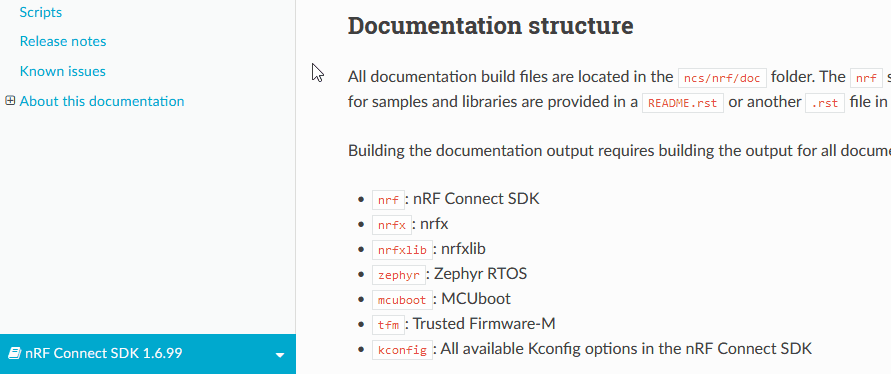
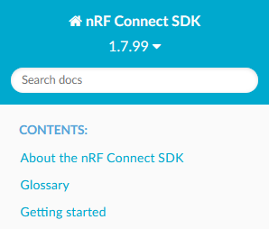
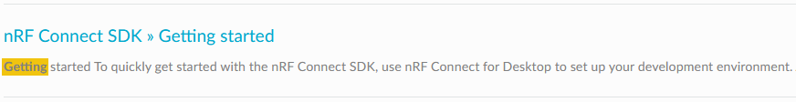
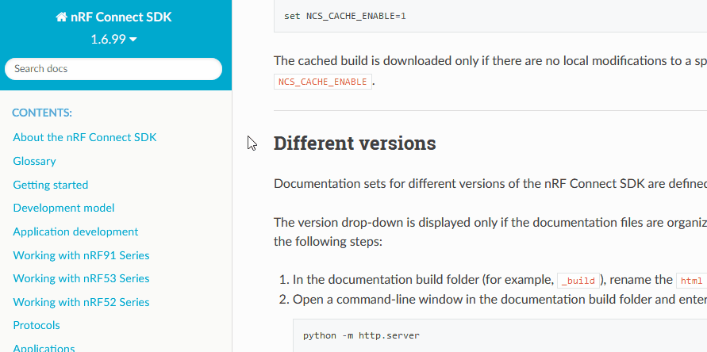

.. _doc_structure:
.. _documentation_sets:

Documentation structure
#######################

.. contents::
   :local:
   :depth: 2

.. doc_structure_start

The documentation consists of several inter-linked documentation sets, one for each repository.

The entry point is the |NCS| documentation that you are currently reading.
The local :doc:`Zephyr documentation <zephyr:index>` is a slightly extended version of the official `Zephyr Project documentation`_, containing some additions specific to Nordic Semiconductor.
The local :doc:`MCUboot documentation <mcuboot:index-ncs>` is a slightly extended version of the official `MCUboot`_ documentation, containing some additions specific to Nordic Semiconductor.

You can switch between these documentation sets by using the selector in the *bottom-left corner of each documentation page*.

   |NCS| documentation set selector

.. doc_structure_end

Following are the available documentation sets:

- ``nrf``: |NCS|
- ``nrfx``: nrfx
- ``nrfxlib``: nrfxlib
- ``zephyr``: Zephyr RTOS
- ``mcuboot``: MCUboot
- ``tfm``: Trusted Firmware-M
- ``matter``: Matter
- ``kconfig``: All available Kconfig options in the |NCS|

Since there are links from the |NCS| documentation set into other documentation sets, the documentation is built in a predefined order, also when you :ref:`build it manually <doc_build_steps>`.

.. _doc_structure_search:

Documentation search
********************

Use the :guilabel:`Search docs` field in the *top-left corner of each documentation page* to search for a given word or phrase in all the documentation sets.
The search engine only looks up the perfect matches for each word or phrase.

   |NCS| documentation search field

The results are displayed for all documentation sets, with each search result entry prefixed with the name of the documentation set in which the result is found.
For example, the search result "nRF Connect SDK » Getting started" refers to the Getting Started page from the "nRF Connect SDK" documentation set.
The search match is highlighted.

   |NCS| documentation search result entry

.. _doc_structure_versions:

Different set versions
**********************

Some documentation sets are available in different versions.
Use the version drop-down in the *top-left corner of each documentation page* to change the documentation version.

   |NCS| documentation version drop-down

The version drop-down is displayed only if the documentation files are organized in the required folder structure and the documentation is hosted on a web server.
You can :ref:`test the different versions locally <testing_versions>` when you build the documentation.
