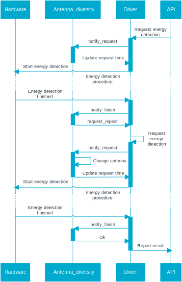

.. _ant_diversity:

Antenna diversity
#################

.. contents::
   :local:
   :depth: 2

The antenna diversity module allows an 802.15.4 radio device, equipped with two antennas, to select, during transmission or reception, the best antenna for improving the radio communication parameters in complex radio environments.

.. _ant_diversity_introduction:

Introduction
************

The antenna diversity module interfaces with a Front-End Module (FEM), which controls both antennas through a single ``ANT_SEL`` pin.
This pin is used to define which antenna is used for communication.

The FEM must provide, at least, the capability to switch between antennas.
This allows, for example, a simple binary analog switch to act as a FEM for antenna diversity.

Switching the antenna might help in minimizing the negative effects that certain phenomena (like multiple reflections on radio path, multipath fading, or antenna cross-polarization) have on the quality of radio communications.

The driver provides several options to switch between the antennas.
For reception-related operations, there are two options:

* The :ref:`approach implemented within this module <ant_diversity_algorithm>`, based on RSSI measurements during the preamble of the received frame.
* An interface provided to the higher layer for implementing a custom antenna selection algorithm.

For transmission-related operations, the driver provides this same interface to the higher layer for implementing a custom antenna selection algorithm.

See :ref:`Supported modes <ant_diversity_modes>` for details.

.. _ant_diversity_hw_setup:

Hardware setup
**************

The antenna diversity module controls only the ``ANT_SEL`` pin of the device.
Any other pin provided by the front-end module is not handled by this module.

In the hardware setup required for using the antenna diversity module, the ``ANT_SEL`` pin of the device must be connected to the RF interface of the front-end module.

   Multiple antennas setup for the antenna diversity module

.. _ant_diversity_modes:

Supported modes
***************

The antenna diversity module supports both reception-related (RX) and transmission-related (TX) radio operations.
The transmission-related operations are the following:

* Frame transmission
* Standalone CCA
* ACK reception
* Continuous carrier mode
* Modulated carrier mode

The reception-related operations are the following:

* Frame reception
* Energy detection
* ACK transmission

This division identifies the different approaches used to determine the operation types:

* The best antenna for RX operations can be determined on an operation-to-operation basis (for example by measuring the RSSI).
* The best antenna for TX operations can be selected only based on additional information (for example, the results of previous operations).

.. note::
   Awareness of the results of any previous operation is not in the scope of the radio driver.
   This capability should instead be implemented by a higher-level module.

Because of these different approaches, the following modes of operation are available for both TX and RX operations:

* Disabled - The antenna is not changed for the given operation, and an unspecified antenna is used.
* Manual - The user chooses a specific antenna for the given operation.

The following mode is instead available only for RX operations:

* Automatic - The :ref:`antenna diversity algorithm <ant_diversity_algorithm>` chooses the optimal antenna for each RX operation.

   Antenna selection with RX and TX both in manual mode

When the antenna selection is set in manual mode for both TX and RX, ``rx_ant`` and ``tx_ant`` can be either antenna 1 or antenna 2.
In this mode, you can only use one specific antenna for the given operation, independently of the antenna selected for any other operation.

.. _ant_diversity_algorithm:

RX automatic mode algorithms
============================

This section describes the algorithms executed during each of the operations that occurs in RX automatic mode.

.. _ant_diversity_frame_reception:

Frame reception
---------------

When the RX mode is set to automatic and the receiver is turned on, the module, using the ``ANT_SEL`` pin, switches the antennas either every 40 us or until a preamble is detected.
GPIOTE and PPI channels are used for this switching.

When the radio driver reports a preamble detection, it measures the RSSI for the antenna related to the ``ANT_SEL`` value for at least 15 us.
The driver then switches to the other antenna to measure its RSSI.
Both measurements end before the start of the reception of the payload of the frame.

The ``ANT_SEL`` value indicates the antenna with the highest RSSI in the last measurement.
The indicated antenna is selected for the reception of the remaining part of the frame.
The ``ANT_SEL`` value does not change its value during the subsequent reception of the remaining part of the frame.

If the detected preamble is a false positive (for example, a time-out, which is longer than 180 us), the radio driver notifies the antenna diversity module.
If either the time-out or the end of the received frame occurs, the antenna diversity module starts the antenna switching process again.

The algorithm for the automatic selection of the best antenna for reception is based on a state machine.
The state transitions are triggered either internally or by the radio driver in response to the following events:

* Enabling the antenna diversity automatic mode
* Disabling the antenna diversity automatic mode
* Enabling the radio receiver
* Disabling the radio receiver
* Detecting the preamble
* Detecting the start of PSDU
* Detecting the end of PSDU
* Timing out the detected preamble

   Simplified state machine used for the automatic selection of the best antenna for reception.

.. note::
   It is theoretically possible that both RSSI values could not be measured before the PHR field of the frame is received (for example, due to a late preamble detection).
   For the sake of simplicity, this case is not represented in the state diagram.
   However, in this case, the following steps take place:

   1. The best antenna for reception is not specified.
   #. The module notifies the radio driver that the algorithm did not have enough time to finish.
   #. The frame reception proceeds as normal.

.. _ant_diversity_notification:

Notification
------------

In automatic mode, the antenna diversity module either selects the best antenna for the reception operation or leaves it unspecified (as stated in the note above).
After each reception, the antenna diversity module saves information about the best antenna.

The driver can retrieve this information by calling the :c:func:`nrf_802154_antenna_diversity_last_rx_best_antenna_get` function.
However, in the following cases, a call to this function might retrieve the ``ANTENNA_NONE`` value instead of the information about the best antenna:

* No frame has been received yet.
* The last frame has been received with the automatic mode disabled.
* There was not enough time between the detected preamble and the start of the detected frame to finish the RSSI measurements.
  In this case, it is also not specified which antenna was used.

.. _doc_ant_diversity_ack_transmission:

ACK transmission
----------------

The antenna used for the ACK transmission is the same one used for the reception of the frame being acknowledged, even when it is not specified which antenna was selected.

.. _ant_diversity_energy_detection:

Energy detection
----------------

When receiving a request for an energy detection procedure in automatic RX mode, the antenna diversity module splits the duration of the procedure in half: 

* The first half of the duration requested done by the :c:func:`nrf_802154_energy_detection` API call is scheduled immediately.
* The second half is requested automatically by the Radio Driver after the first half is completed.

The driver switches the antennas before requesting the second half.

The highest detected energy across both antennas is reported to the driver.

.. note::
   In manual mode, the module performs energy detection on a single antenna.
   The application specifies the antenna on which the energy detection will be performed by calling the :c:func:`nrf_802154_antenna_diversity_rx_antenna_set` function.

The energy detection procedure consists of several iterations lasting 128 us each.
For this reason, the duration of the scheduled energy detection procedure cannot be shorter than 128 us.

Also, any procedure shorter than 256 us is performed only using a single antenna, even in automatic RX mode.
In this case, it is not specified which antenna is used for energy detection.

   Energy detection procedure with antenna diversity enabled

Timing
------

You can configure the following timings for the automatic antenna selection:

* Toggle time.
  The time that elapses before switching the antenna while waiting for the preamble detection.
  It can be configured calling the :c:func:`nrf_802154_antenna_diversity_config_set` function.
  Its default value is 40 us, and it is stored in the ``NRF_802154_ANT_DIVERSITY_TOGGLE_TIME_DEFAULT`` macro.

* Preamble time-out.
  The time interval during which the radio driver waits for the arrival of the start of the frame.
  It occurs after the preamble detection.
  If no frame start arrives during this interval, the radio driver considers the preamble a false positive.
  Its default value is 180 us.

.. note::
   The radio driver manages the preamble time-out, and it notifies the antenna diversity module about its expiration.
   You can configure the time out value using the ``PRESTARTED_TIMER_TIMEOUT_US`` macro.

The following timings are constant when the antenna diversity module operates in RX automatic mode:

* RSSI settle time - 15 us.
  This is the time after the antenna switch, during which the RSSI measurement may not be valid.
  The RSSI settle time is hardware-dependent.

* RSSI measurement time - 200 ns.
* Software lag during the time-out configuration - 40-50 us.
* Antenna selection time - 15 - 160 us.
  This is the time after the SYNC event when the driver selects the antenna with the best RSSI.

.. note::
   Since the antenna does not change during the software lag, there is no need to wait for the RSSI to settle for another 15 us.

.. figure:: images/ant_diversity_rx_timing.svg
   :alt: Timings while operating in RX automatic mode

   Timings while operating in RX automatic mode

   A false positive on preamble detection scenario during the automatic antenna selection
