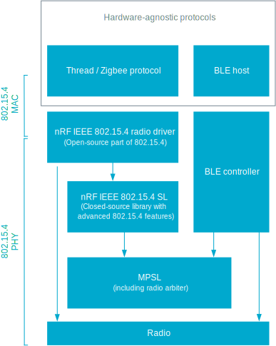

.. _rd_architecture:

Driver architecture
###################

The architecture of the nRF IEEE 802.15.4 radio driver is independent of the operating system and the IEEE 802.15.4 MAC layer.
It allows using the driver in any stack that is based on IEEE 802.15.4 and implements protocols such as Thread, Zigbee, or RF4CE.

Also, the driver is designed to work with multiprotocol applications.
The driver allows sharing the RADIO peripheral with other PHY protocol drivers, for example, Bluetooth LE.

Radio drivers request access to the peripheral from an arbiter.
The arbiter grants or denies access.

The nRF IEEE 802.15.4 radio driver cooperates with the radio arbiter included  in `MPSL`_ (Multiprotocol Service Layer).

.. _MPSL: https://developer.nordicsemi.com/nRF_Connect_SDK/doc/latest/nrfxlib/mpsl/README.html
