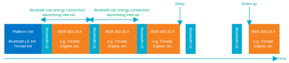
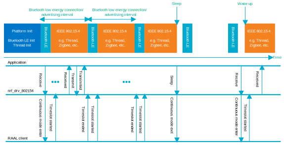

.. _rd_multiprotocol_support:

Multiprotocol support
#####################

.. contents::
   :local:
   :depth: 2

The dynamic multiprotocol feature allows the sharing of the RADIO peripheral between the 802.15.4 driver and other PHY protocol drivers.
It can be used to run several radio protocols simultaneously without the time-expensive phases of uninitialization and initialization that happen during the switching.
Switching between protocols requires only a reinitialization of the radio peripheral, since protocols may operate on different frequencies and/or modulations.
Therefore, the time required for the switching is much shorter than in the switched multiprotocol method, where you need to completely shut down one protocol before enabling another.

The driver can use the basic version of the Radio Arbiter through the open-source Service Layer, and the fully-featured one through the closed-source Service Layer.

.. _rd_multiprotocol_support_implemented:

Available arbiters
******************

Currently, the following arbiters are implemented:

* :ref:`rd_multiprotocol_support_implemented_single_phy` - This implementation is used only when the 802.15.4 protocol is using the RADIO peripheral.
* :ref:`rd_multiprotocol_support_implemented_mpsl_arbiter` - This implementation uses MPSL clients (like the SoftDevice Controller) and the 802.15.4 driver.

.. _rd_multiprotocol_support_implemented_single_phy:

Single PHY arbiter
==================

The single PHY arbiter should be used when the IEEE 802.15.4 protocol is the only one that uses the RADIO peripheral, and the usage of the closed-source MPSL is not possible.
When using this arbiter, you can create, for example, Thread-only or Zigbee-only applications.

This arbiter always grants access to the RADIO peripheral, and it does not revoke timeslots.

.. _rd_multiprotocol_support_implemented_mpsl_arbiter:

MPSL arbiter
============

In the dynamic multiprotocol solution, the radio hardware is time-sliced between all protocols.
Each radio protocol, like Bluetooth Low Energy or 802.15.4, requests a timeslot before any radio operation.
This solution allows the keeping of established connections in a few protocols at the same time.
Transmitting and receiving data does not break connections from any of the radio protocols used, and therefore connections on both 802.15.4 based protocols and Bluetooth Low Energy may be maintained without disconnecting the other one.
This method requires concurrent (time-multiplex) radio access.

The figure below shows how IEEE 802.15.4 based protocols and Bluetooth Low Energy protocols operate in dynamic multiprotocol mode.

.. _rd_multiprotocol_support_implemented_mpsl_arbiter_1:

Time-multiplexed radio access
=============================

The nRF IEEE 802.15.4 radio driver manages its radio transactions through a radio arbiter and requests timeslots before any radio activity.

The figure below presents the internal interactions between radio arbiter, radio driver, and application.

The MPSL includes a Radio Event Manager (REM) that manages radio arbitration and exposes the Timeslot API for any other radio driver.

Switching between Bluetooth Low Energy and protocols based on IEEE 802.15.4 is done automatically in the background of the currently running application and therefore is transparent for the user.
The user can write the Bluetooth part of a multiprotocol application as if it was a Bluetooth-only application, and the IEEE 802.15.4 part of the multiprotocol application as if it was an IEEE 802.15.4 based-only application.

In this solution, Bluetooth Low Energy has always priority over 802.15.4 protocols.
Because of the nature of the Bluetooth Low Energy protocol (TDMA), the Bluetooth packet error rate should be 0% in absence of any external interference.

.. note::
   In receiving mode, some radio packets may be lost due to the Bluetooth Low Energy activity.
   Dropped packets are common in wireless networks, and IEEE 802.15.4 based protocols are usually resilient to that.
   To mitigate the number of packets lost on IEEE 802.15.4 based protocol, prolong the timing parameters for Bluetooth Low Energy, such as the advertising interval or the connection interval.

.. _rd_multiprotocol_support_hf_clock:

Handling high-frequency clock
*****************************

When the RADIO peripheral is used, the Radio Scheduler module makes sure that the high-frequency clock (HFCLK) is running before starting the radio procedures.

Note that the 802.15.4 driver uses the appropriate platform to manage the high-frequency clock.
In the case of single-phy bare-metal implementations, it is up to the user to ensure that HFCLK is not accidentally stopped within the radio activity of the nRF IEEE 802.15.4 radio driver.
