.. _rd_coex:

Wi-Fi Coexistence module (PTA support)
######################################

.. contents::
   :local:
   :depth: 2

The Wi-Fi Coexistence (CX) module enables cooperative coexistence between 802.15.4 and Wi-Fi.
Usually, the protocols' drivers use separate radio hardware, but they need to coordinate their access to the radio-frequency medium (RF medium) to avoid corrupted transmission (TX) and reception (RX) operations.

The use of Packet Traffic Arbitration achieves this coordination.
Each time any protocol intends to perform some operation (such as a transmission), it sends a request to the Packet Traffic Arbiter (PTA).
The request can contain multiple pieces of information, such as the operation the protocol intends to perform or the priority level of that operation.
The PTA then grants or denies access to the RF medium for that request.

The nRF 802.15.4 Radio Driver uses the abstract :ref:`mpsl_cx` provided by :ref:`mpsl` with the following limitations:

* It does not use radio operation priorities, as each operation is requested with a priority value of ``1``.
* When a PTA denies an operations, only the TX operation is aborted.
  The denial of an RX operation or of *idle listening* has no effect.
* Aborting a TX operation takes a few dozens of microseconds.

.. _rd_cx_implementations:

General behavior
****************

This section describes how the 802.15.4 Radio Driver behaves while requesting RF-medium access to the PTA for executing different operations.

Transmission
============

When the driver starts the transmission of a frame, it requests TX access from the PTA.
If the PTA grants RF-medium access throughout the entire procedure, the radio driver performs the transmission immediately and releases the request immediately after the transmission ends.

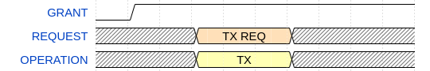

If after the radio driver requests TX access the PTA does not grant RF-medium access, the radio driver waits and keeps the request until the PTA grants RF-medium access.
Then, the driver transmits the frame.
If the PTA does not grant RF-medium access, the radio driver waits indefinitely as the request does not time out.

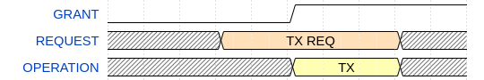

If the PTA denies access to the RF medium after the transmission starts, the driver aborts the transmission.

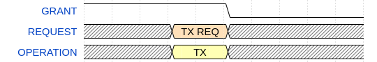

Transmission with Clear Channel Assessment (CCA)
------------------------------------------------

If the radio driver performs the transmission with a preceding Clear Channel Assessment (CCA) procedure, it issues the TX request to the PTA before the CCA procedure starts.
If the PTA grants access to the RF medium during the entire procedure, the driver performs CCA.
After that, the driver transmits the frame if the channel is free.

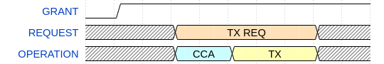

If after the radio driver requests TX access, the PTA does not grant access to the RF medium, the radio driver waits and keeps the request until the PTA finally grants access to the RF medium.
The driver then starts performing CCA, followed by the transmission.
If the PTA does not grant access to the RF medium, the radio driver waits indefinitely as the request does not time out.

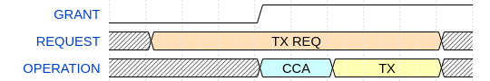

If the PTA denies access to the RF medium after the CCA starts, the radio driver aborts the transmission.

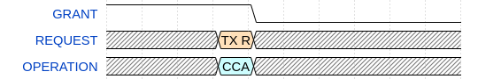

Transmission with acknowledgment (ACK) reception
------------------------------------------------

If the transmission requires an acknowledgment (ACK), the driver issues an RX request to the PTA while waiting for the ACK.
However, regardless of the PTA granting or denying access to the RF medium, the radio driver stays in receive mode and attempts to receive the ACK.

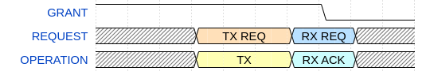

Reception
=========

When performing idle listening, the radio driver waits before requesting access to the RF medium until it starts receiving a frame.
The driver then requests, to the PTA, access to the RF medium for an RX operation.
During the reception phase, PTA activities are irrelevant because reception operations do not interfere with Wi-Fi operations.

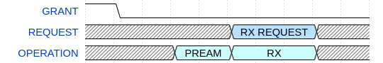

Reception with ACK sending
--------------------------

When the driver fully receives a frame that should be acknowledged, it changes the RX request issued previously to the PTA into a TX request.
If the PTA grants access to the RF medium immediately, the driver transmits the ACK.

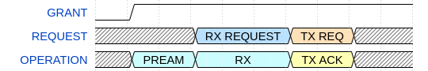

If the PTA does not grant access to the RF medium immediately after the frame reception ends, the driver does not transmit the ACK.

.. note::
   This is still interpreted as a successful reception.
   However, as the device sending the frame does not receive the ACK, this device fails its transmission operation.

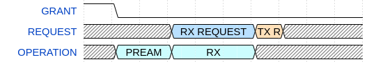

Standalone CCA and Energy Detection
===================================

During standalone CCA, or energy detection, the driver issues an RX request to the PTA.
However, the radio driver ignores this RX request if the PTA neither grants nor denies access to the RF medium, and it performs CCA regardless.

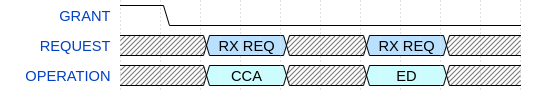

CSMA-CA
=======

During the Carrier Sense Multiple Access with Collision Avoidance (CSMA-CA) procedure, the coexistence module behaves as if the driver performs multiple attempts to transmit with CCA.
Before every CCA procedure, the driver issues a TX request.
The driver releases this request either after CCA, if the channel is busy, or after the transmission if the channel is idle.

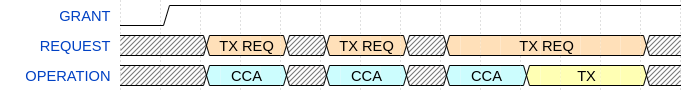

.. note::
   If the radio driver starts a delayed transmission (DTX) during a backoff period of the CSMA-CA procedure, but it aborts this DTX because of the denial of the RF-medium access request, the driver also aborts the entire CSMA-CA procedure.
