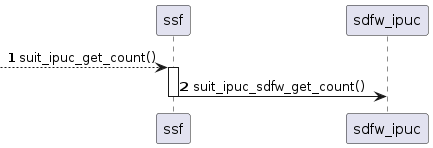
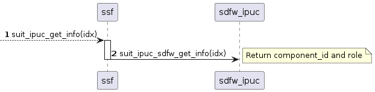
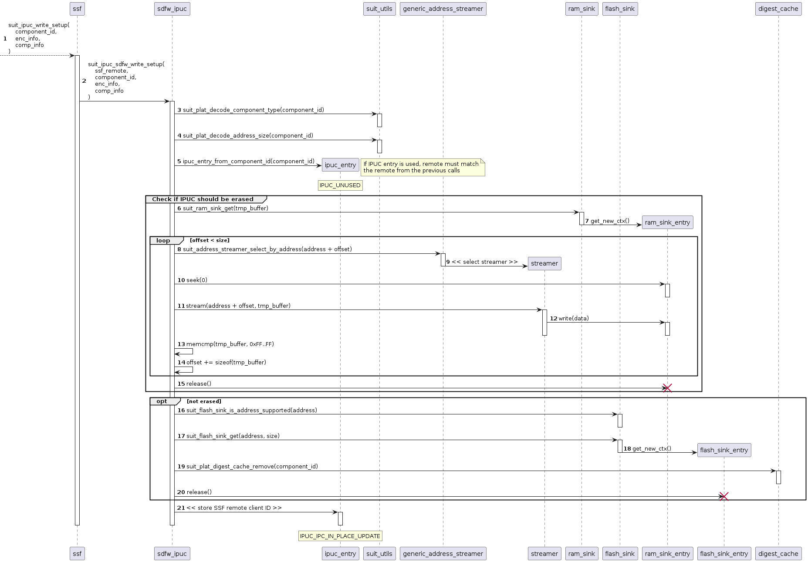
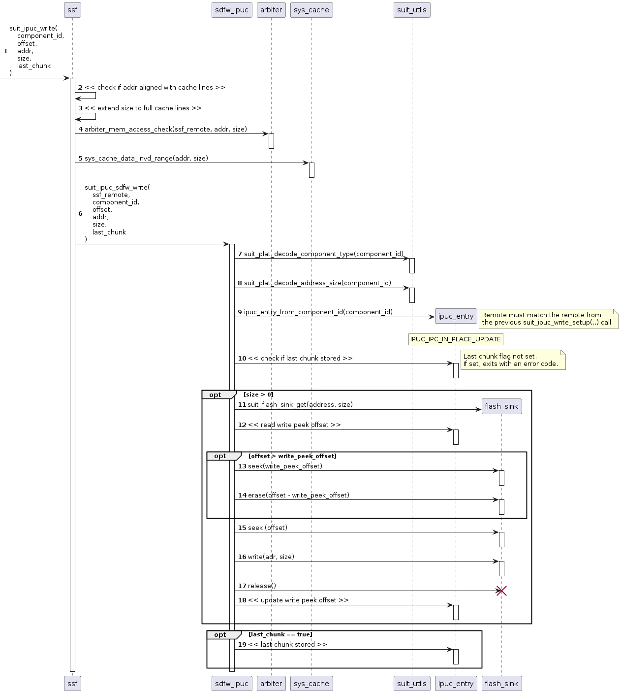
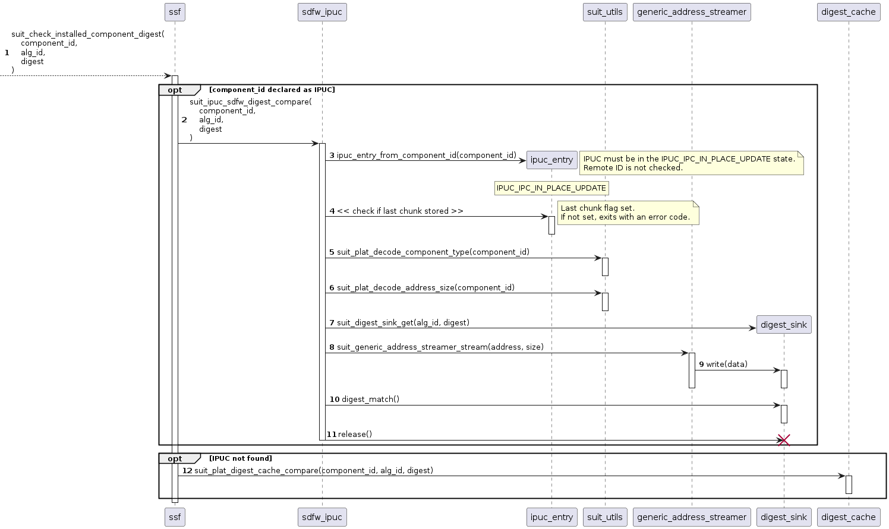

.. _flash_ipuc:

SUIT flash IPUC driver
######################

.. contents::
   :local:
   :depth: 2

The SUIT flash IPUC driver is a pseudo flash driver allowing to write content into memory areas, declared as In-Place Updateable Components (IPUCs).
The driver functionality is based on the dedicated set of SUIT SSF services, designed to enable the usage of IPUCs.
Using this driver simplifies the usage of IPUCs, effectively replacing the raw SSF IPUC API.

The SDFW services (SSF) used by the driver
******************************************

The first service is the :c:func:`suit_get_ipuc_count`. It simply returns the number of currently declared IPUCs.

   SUIT SSF: :c:func:`suit_get_ipuc_count` service

In order to read the metadata associated with the IPUC, the :c:func:`suit_get_ipuc_info` service should be used.
This service not only provides the full component ID, but also the role of a manifest, that declared IPUC.
This way the application knows, which IPUCs are guaranteed to be readable.

   SUIT SSF: :c:func:`suit_get_ipuc_info` service

Each IPUC must be initialized before writing data into it. This is done through the :c:func:`suit_setup_write_ipuc` service.
Apart from initializing internal structures, this binds IPUC with the SSF client remote ID (usually the application domain).

   SUIT SSF: :c:func:`suit_setup_write_ipuc` service

Data can be written into IPUC using the :c:func:`suit_write_ipuc` service.
There are no restrictions on the offset value inside the write request, as long as it remains within the IPUC memory region.
This API can be called only if the IPUC was initialized with the :c:func:`suit_setup_write_ipuc` service.
The last parameter (``last_chunk``) indicates, that there will be no more write requests and the digest checks can be performed on the IPUC.

   SUIT SSF: :c:func:`suit_write_ipuc` service

The last service: the :c:func:`suit_check_installed_component_digest` allows to verify the digest of the new contents written into the IPUC.
This API can be called only after the :c:func:`suit_write_ipuc` service with ``last_chunk`` parameter set to ``true`` was made.

   SUIT SSF: :c:func:`suit_check_installed_component_digest` service

Configuration
*************

The flash IPUC driver is not configured through the devicetree.
Its instances are created dynamically.

The following configuration options are available for this driver:

   * :kconfig:option:`CONFIG_FLASH_IPUC_COUNT` - sets the number of allocatable flash IPUC drivers.

Usage
*****

There are several ways to create the flash IPUC driver instance, depending on the expected use case:

* :c:func:`flash_component_ipuc_create`: creates a flash IPUC driver, based on the component ID.
  This API is designed to be used by SUIT platform implementation.
  It can create both read-write and read-only driver instances.

  .. figure:: images/flash_ipuc/flash_component_ipuc_create.png
     :alt: Flash IPUC: :c:func:`flash_component_ipuc_create` constructor

     Flash IPUC: :c:func:`flash_component_ipuc_create` constructor

  These drivers can be released using the :c:func:`flash_ipuc_release` API.

* :c:func:`flash_component_ipuc_check`: checks if it is possible to create a flash IPUC driver,
  based on the component ID.
  This API requires a spare flash IPUC driver instance.

  .. figure:: images/flash_ipuc/flash_component_ipuc_check.png
     :alt: Flash IPUC: :c:func:`flash_component_ipuc_check` API.

     Flash IPUC: :c:func:`flash_component_ipuc_check` API.

* :c:func:`flash_cache_ipuc_create`: creates a flash IPUC driver, based on the minimum (absolute) address.
  This API is designed to create DFU cache partitions, allocated on top of IPUC memory.
  It can create only read-write driver instances.
  The minimum address requirement is used to make sure that firmware updates, that have
  limitations on the update candidate address (i.e. the Nordic SDFW update) can be safely triggered
  from any address within the cache partition.

  .. figure:: images/flash_ipuc/flash_cache_ipuc_create.png
     :alt: Flash IPUC: :c:func:`flash_cache_ipuc_create` constructor

     Flash IPUC: :c:func:`flash_cache_ipuc_create` constructor

  These drivers can be released using the :c:func:`flash_ipuc_release` API.

* :c:func:`flash_cache_ipuc_check`: checks if it is possible to create a flash IPUC driver,
  based on the minimum (absolute) address.
  This API requires a spare flash IPUC driver instance.

  .. figure:: images/flash_ipuc/flash_cache_ipuc_check.png
     :alt: Flash IPUC: :c:func:`flash_cache_ipuc_check` API.

     Flash IPUC: :c:func:`flash_cache_ipuc_check` API.

* :c:func:`flash_image_ipuc_create`: creates a flash IPUC driver, based on the device tree partition number.
  This API is designed to allow the usage of IPUCs in protocols, that bind IDs with memory purposes.
  It searches for the DTS partition ``dfu_taget_img_<n>``, where ``<n>`` is the ID, passed as input parameter.
  It can create both read-write and read-only driver instances.

  .. figure:: images/flash_ipuc/flash_image_ipuc_create.png
     :alt: Flash IPUC: :c:func:`flash_image_ipuc_create` constructor

     Flash IPUC: :c:func:`flash_image_ipuc_create` constructor

  These drivers can be released using the :c:func:`flash_image_ipuc_release` API.

Once IPUC device is created, it can be found using the :c:func:`flash_ipuc_find` API.

You can control the flash IPUC using the :ref:`zephyr:flash_api` API.

* :c:func:`flash_read`: to read the IPUC contents.

  .. figure:: images/flash_ipuc/flash_ipuc_read.png
     :alt: Flash IPUC: read API

     Flash IPUC: read API

* :c:func:`flash_write`: to write data into the IPUC.

  .. figure:: images/flash_ipuc/flash_ipuc_write.png
     :alt: Flash IPUC: write API

     Flash IPUC: write API

* :c:func:`flash_erase`: to erase a part, or the whole IPUC.

  .. figure:: images/flash_ipuc/flash_ipuc_erase.png
     :alt: Flash IPUC: erase API

     Flash IPUC: erase API

API documentation
*****************

| Header file: :file:`include/drivers/flash/flash_ipuc.h`
| Source files: :file:`/drivers/flash/flash_ipuc/flash_ipuc.c`

The flash IPUC driver implements the Zephyr :ref:`zephyr:flash_api` API.
