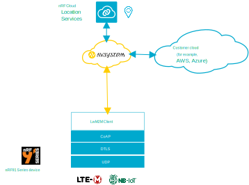

.. _ug_avsystem:

AVSystem integration
####################

.. contents::
   :local:
   :depth: 2

AVSystem is a software solution provider that provides a device management platform.
This platform is based on the LwM2M protocol with |NCS| compatibility for Nordic Semiconductor's cellular IoT products.
It handles the entire process from onboarding till decommissioning of devices.

The AVSystem integration with |NCS| ensures secure and power efficient device management solutions using Nordic Semiconductor's cellular devices.
The integration of `nRF Cloud Location Services <nRF Cloud Location Services documentation_>`_ with AVSystem enables the use of positioning services.

Product overview
****************

As part of the integration, |NCS| uses AVSystem's `Coiote IoT Device Management <Coiote Device Management_>`_ platform for the management of Nordic Semiconductor's cellular devices.
AVSystem's Coiote IoT Device Management provides the following features:

* Optimal device provisioning and device monitoring mechanisms
* OTA updates
* Reliable device-to-cloud communication
* Remote diagnostics

Additionally, since LwM2M protocol is used, the integration also has additional benefits like optimization of resource usage and power saving in devices.
It uses standardized LwM2M objects and allows the use of custom objects also.

Integration prerequisites
*************************

Before you start the |NCS| integration with AVSystem's Coiote IoT Device Management, make sure that the following prerequisites are completed:

* :ref:`Installation of the nRF Connect SDK <installation>`.
* :ref:`Setup of nRF9160 DK <ug_nrf9160_gs>`.
* Creation of an account in `AVSystem's Coiote Device Management <Coiote Device Management_>`_.
* :ref:`Creation of an nRF Cloud account <creating_cloud_account>` (if you are utilizing nRF Cloud Location Services).

Solution architecture
*********************

As a prototyping solution, AVSystem supports a pre-integrated LwM2M Client stack on the nRF9160-based development kit, provides a free version of the Coiote device management platform, and acts as a bridge to nRF Cloud.
This results in full LwM2M integration of nRF9160 with AVSystem Coiote IoT for data, device management, and nRF Cloud Location services.

   AVSystem integration

Following are the components that are required for the integration with |NCS|:

* :ref:`Zephyr's LwM2M stack <lwm2m_interface>` - Included in |NCS|. Has Coiote IoT support.

 .. note::

    Instead of Zephyr stack, you can also use AVSystem's LwM2M Client SDK Anjay that can be ported to the nRF9160-based device.
    To use Anjay, follow the procedures described in the AVSystem documentation for `nRF9160 integration <nRF9160 Anjay integration_>`_ and `Thingy:91 integration`_.

* `Coiote IoT Device Management <Coiote Device Management_>`_ - Component that accepts communication from devices, performs management functionalities, and acts as a communication hub for third-party cloud solutions.

* `nRF Cloud`_ - Optional component if location services need to be used.

Integration steps
*****************

To integrate AVSystem into |NCS|, after completing the prerequisites, complete the following steps:

1. Adding your device to Coiote Device Management server.
#. Configuring your application to use AVSystem's Coiote Device Management platform.

.. _add_device_coiote:

.. rst-class:: numbered-step

Adding your device to Coiote Device Management server
=====================================================

To add your device to AVSystem's Coiote Device Management Server, complete the following steps:

.. include:: /includes/lwm2m_common_server_setup.txt
   :start-after: coiote_start
   :end-before: coiote_end

.. rst-class:: numbered-step

Configuring your application to use Coiote Device Management platform
=====================================================================

For the device-server integration, you must select an appropriate sample or application that supports LwM2M-based interaction with AVSystem.
It is then built and flashed onto the device with the appropriate configurations.
See :ref:`avsystem_supported_applications` for a list of supported samples and applications.
To integrate your device with AVSystem's device management platform, complete the following steps.

a. |connect_kit|
#. |connect_terminal|
#. `Configure, build, and flash the supported sample or application using nRF Connect for VS Code <How to build an application_>`_.

   .. note::

      While building, make sure to select the appropriate overlay file for AVSystem integration.
      This can vary for each sample or application.
      For example, for :ref:`lwm2m_client` sample, you need to select the overlay file :file:`overlay-avsystem.conf` as the Kconfig fragment while configuring the sample.
      Refer to the **Configuration files** section in the respective sample or application documentation for more information.

After flashing the sample, reboot your device for reconnection.
From the terminal, you can see that the registration is complete.
You can also check the status on the Coiote Device Management UI.
On the `Coiote Device Management UI <Coiote Device Management server_>`_, after adding your device, you can see a ``Device connected successfully`` message if the device was added successfully.
Click :guilabel:`Next`, :guilabel:`Finish` and :guilabel:`Go to device`.
You can see that the device is shown as registered under :guilabel:`Registration status` in **Device Center**.

nRF Cloud integration with AVSystem
***********************************

You can optionally integrate nRF Cloud with AVSystem and make use of nRF Cloud Location services for device positioning.
The advantage of this integration is that it removes the need to establish a separate DTLS session into nRF Cloud.
See `nRF Cloud integration with Coiote Device Management`_ for more information on how the integration can be done.

The integration supports the following location services:

* Cell-based location assistance
* A-GPS location assistance
* :ref:`P-GPS location assistance <location_assistance_pgps_lwm2m>`
* :ref:`Wi-Fi based location assistance <location_assistance_agps_lwm2m>`

Cell-based location
===================

You can use a supported sample to determine the cell-based location of the device if you have nRF Cloud integration with AVSystem.
Both single-cell and multicell location services can be used.
See :ref:`location_assistance_cell` for more information on the API usage.

After you flash the sample, the device starts searching for neighboring cell towers.
After the completion of registration in Coiote Device Management server, the sample passes the information onto `Coiote Device Management server`_ which then forwards it as a cell-location query to nRF Cloud.
The result of the query is passed back to the Coiote Device Management server, which displays the device location on a map.

   Cell location assistance

For cell-based location assistance, each supported sample might use a different overlay file.
See the sample or application documentation for more information.

After flashing the sample, the cell-based location of the device will be visible in Coiote Device Management as explained in `Viewing device location in Coiote Device Management`_.

A-GPS location assistance
=========================

A-GPS location assistance has the advantages of faster :term:`Time to First Fix (TTFF)` and lesser power consumption compared to GNSS usage without assistance.
See :ref:`location_assistance_agps_lwm2m` for more information on the API usage.

After you flash the supported sample or application on to your device, the device requests A-GPS data.
`Coiote Device Management server`_ obtains the data from nRF Cloud and sends the A-GPS data blob to the GNSS module of the device.
This data is used in combination with the data broadcast by the GNSS satellites to acquire a fix.

.. figure:: images/avsystem_integration_agps_location.svg
   :alt: A-GPS location assistance

   A-GPS location assistance

For cell-based location assistance, each supported sample might use a different overlay file.
See the sample or application documentation for more information.

After building the sample, complete the steps in `Setting observations for an object`_ to enable observations for the Location object.

After you flash the sample, Location object under **Data model** in the Coiote Device Management UI will be updated with values after the fix is obtained.

.. _avsystem_supported_applications:

Applications and samples
************************

The following application uses the AVSystem integration in |NCS|:

* :ref:`asset_tracker_v2` - The :ref:`asset_tracker_v2_cloud_module` is set to communicate with AVSystem's Coiote Device Management, with a runtime provisioned Pre-shared key (PSK) set by the ``CONFIG_LWM2M_INTEGRATION_PSK`` Kconfig option.
  For more information, see :ref:`assettracker_v2_cloudmodule_lwm2m`.

The following samples use the AVSystem integration in |NCS|:

* :ref:`lwm2m_client`
* :ref:`lwm2m_carrier`
* :ref:`modem_shell_application`

All these samples offer LwM2M support and can be used to fetch location assistance data from nRF Cloud by proxying it through AVSystem's Coiote LwM2M server.

Library support
***************

The following |NCS| library supports the AVSystem integration:

* :ref:`lib_lwm2m_location_assistance`

Dependencies
************

It uses the following |NCS| libraries:

* :ref:`lte_lc_readme`
* :ref:`lib_lwm2m_client_utils`

It uses the following library from Zephyr:

* :ref:`lwm2m_interface`
