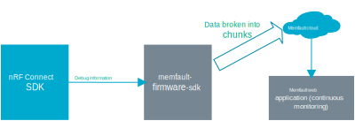

.. _ug_memfault:

Memfault integration
####################

.. contents::
   :local:
   :depth: 2

`Memfault`_ is a cloud-based web application with |NCS| compatibility that monitors devices and allows you to debug issues remotely.
Memfault integration provides the following features to |NCS|:

* `Remote debugging <Memfault debugging_>`_ - Memfault issues can be efficiently resolved with automatic detection, alerts, deduplication, and actionable insights sent through the cloud.
* `Continuous monitoring <Memfault monitoring_>`_ - Monitors device and fleet-level metrics like connectivity and low power state in real-time dashboards and displays prepopulated metrics for your devices.
  You can access device level data to resolve bugs faster.

See the `Memfault documentation <Memfault introduction_>`_ for more details.

.. note::
   Memfault has been integrated in |NCS| since the v1.6.0 release.

Prerequisites
*************

Before you start the |NCS| integration with Memfault, make sure that the following prerequisites are completed:

* :ref:`Installation of the nRF Connect SDK <installation>`.
* :ref:`Setup of nRF9160 DK <ug_nrf9160_gs>`.
* Sign up in the `Memfault registration page`_ and `create a new project in Memfault`_.
  You will be directed to the Integration guide for Memfault.
  You receive the ``project key`` here to set in the :kconfig:option:`CONFIG_MEMFAULT_NCS_PROJECT_KEY` Kconfig option.
  After registration, you can connect up to 100 devices for free.

Solution architecture
*********************

The SDK provides functionality to collect debug information from your devices in the form of coredumps, error traces, metrics, logs, and more.
Memfault saves the data to a configurable storage, after which it is broken into chunks.
These chunks are then forwarded at an interval that is set through the application's configuration (:kconfig:option:`CONFIG_MEMFAULT_HTTP_PERIODIC_UPLOAD_INTERVAL_SECS`) to Memfault's cloud solution for further analysis.
If the :kconfig:option:`CONFIG_MEMFAULT_HTTP_PERIODIC_UPLOAD` Kconfig option is disabled, the application calls the appropriate APIs to send the data chunks.
Communication with the Memfault Cloud is handled by APIs available in `Memfault-SDK`_, while the integration code of the SDK in |NCS| provides some additional functionality.
The Memfault cloud reassembles the data before analyzing and deduplicates the data.
The overall fleet health of the issues can be examined through the dashboard of the Memfault web application.
See the `Memfault MCU Guide`_ for more information.

   Memfault Solution architecture

.. _using_memfault:

Integration overview
********************

The SDK version is included in the `west manifest file`_ in |NCS| and is automatically downloaded when running ``west update``.
By default, it is downloaded to ``ncs/modules/lib/memfault-firmware-sdk/``.

Complete the following steps to integrate Memfault into |NCS|:

1. :ref:`Configure Memfault <ug_memfault_config>`
#. :ref:`Track errors <ug_memfault_error>`
#. :ref:`Collect metrices <ug_memfault_metrics>`

.. _ug_memfault_config:

Configuring Memfault
====================

To include Memfault in your build, add the following Kconfig option in your :file:`prj.conf` file:

.. code-block:: console

   CONFIG_MEMFAULT=y
   CONFIG_MEMFAULT_NCS_PROJECT_KEY=""

The APIs in the Memfault SDK can then be linked into your application.
You can get your project key after signing up with Memfault.

.. note::
   In the :ref:`memfault_sample` sample folder, the aforementioned Memfault configurations are already included.
   Make sure to add your project key in the :kconfig:option:`CONFIG_MEMFAULT_NCS_PROJECT_KEY` Kconfig option.

You can also add the configurations using a Kconfig configuration fragment file.
See the following example on how to set an overlay configuration for Memfault integration:

.. code-block:: console

   west build -b nrf9160dk_nrf9160_ns -- -DOVERLAY_CONFIG=overlay-memfault.conf

Configuration files
-------------------

Memfault SDK requires the three files in the include path during the build process.
You can avoid adding these user configuration files by disabling the :kconfig:option:`CONFIG_MEMFAULT_USER_CONFIG_ENABLE` option.
You can also skip these steps by enabling the :kconfig:option:`CONFIG_MEMFAULT_USER_CONFIG_SILENT_FAIL` option, even if the :kconfig:option:`CONFIG_MEMFAULT_USER_CONFIG_ENABLE` option is enabled.

To add the user configuration files, create a new folder in your project called :file:`config` and add the following three files:

* :file:`memfault_platform_config.h` - Sets Memfault SDK configurations that are not covered by Kconfig options.
* :file:`memfault_metrics_heartbeat_config.def` - Defines application-specific metrics.
* :file:`memfault_trace_reason_user_config.def` - Defines application-specific trace reasons.

Add the following code in the :file:`CMakeLists.txt` file to have these configuration files in the include path:

.. code-block:: console

   zephyr_include_directories(config)

See the `Memfault nRF Connect SDK integration guide`_ for more details.

.. _ug_memfault_error:

Error Tracking
==============

Memfault captures all faults that happen at any time.
The crash data is sent to the Memfault cloud for further inspection and analysis.
The faults are tracked using the following methods.

Reboot reason tracking
----------------------

The device might reboot due to a crash, a brownout, or a firmware update.
The reboot events for each device are captured and displayed in the Memfault UI along with the recorded reboot reason.

See `Memfault: Reboot tracking`_ for detailed documentation.

Error tracking with trace events
--------------------------------

You can use the trace event method if you want to track errors without capturing full coredump traces (that use less storage) and keep the device up and running.
The following samples implement a user-defined trace reason for demonstration purposes.

* :ref:`memfault_sample`
* :ref:`peripheral_mds`

Read the **Error Tracking with trace events** section of these sample documents for more information.

See `Memfault: Error Tracking with Trace Events`_ for detailed documentation.
Faults are captured and displayed on the **Issues** page of Memfault UI.

RAM-backed stack dump collection (Coredumps)
--------------------------------------------

The coredumps can be triggered to track the fault.
The **Coredumps** section of the following sample documents provides more information:

* :ref:`memfault_sample`
* :ref:`peripheral_mds`

See `Memfault: Coredumps`_ for detailed documentation.
Faults are captured and displayed on the **Issues** page of the Memfault UI.

.. _ug_memfault_metrics:

Collecting Metrics
==================

Memfault collects data from each device and visualizes it in a graph.
The Memfault SDK integration layer in |NCS| adds the system property metrics.
There are also some metrics specific to |NCS|.
See **Metrics** section of the following sample documents for more information:

* :ref:`memfault_sample`
* :ref:`peripheral_mds`

See `Memfault: Collecting Device Metrics`_ for detailed documentation.

Configuration options
=====================

There are different configuration options defined for the Memfault SDK in |NCS|.
The configuration options are defined both in `Memfault-SDK`_ and in the integration layer, which integrates the SDK into |NCS|.
The configuration options of the integration layer are in :file:`modules/memfault/Kconfig`.
See the Configuration section of the following library documents for different Memfault SDK configuration options defined in |NCS|:

* :ref:`mod_memfault`
* :ref:`peripheral_mds`

Applications and samples
************************

The following applications use the Memfault integration in |NCS|:

* :ref:`asset_tracker_v2` - The debug module of :ref:`asset_tracker_v2` uses `Memfault SDK`_ to track |NCS| specific metrics such as LTE and stack metrics.
  See the :ref:`asset_tracker_v2_debug_module` documentation for more details.
  The :ref:`asset_tracker_v2` application also uses Memfault on a custom transport, without using Memfault's own HTTPS transport.
  See the :ref:`asset_tracker_v2_ext_transport` section for more details.

* `nRF Asset Tracker project`_ - The `nRF Asset Tracker Memfault integration for AWS IoT`_ or the `nRF Asset Tracker Memfault integration for Azure IoT Hub`_ provide the necessary cloud resources to send Memfault data using the established MQTT cloud connection.
  See the `nRF Asset Tracker Memfault integration`_ documentation for more details.

The following samples demonstrate the Memfault integration in |NCS|:

* :ref:`peripheral_mds` - This sample has an implementation of the Memfault Diagnostic Service (MDS).
  It sends data to the Memfault cloud through a Bluetooth gateway.
* :ref:`memfault_sample` - This sample connects to the LTE network and sends data using HTTPS.
  It supports nRF9160-based build targets.

Library support
***************

The following |NCS| libraries support the Memfault integration:

* :ref:`mod_memfault`
* :ref:`mds_readme`

Dependencies
************

It uses the following secure firmware component:

* :ref:`Trusted Firmware-M <ug_tfm>`
