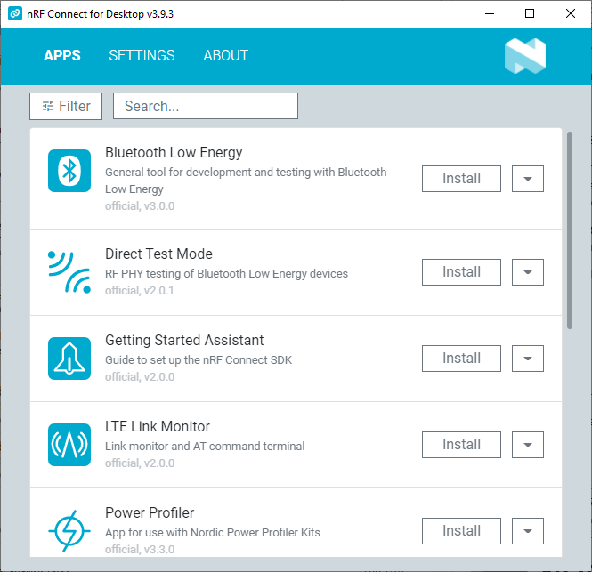
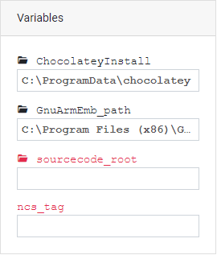
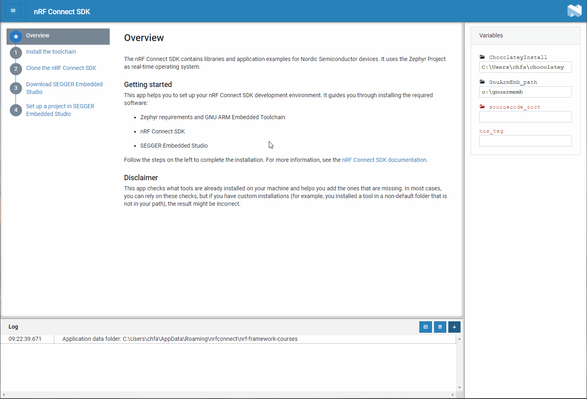
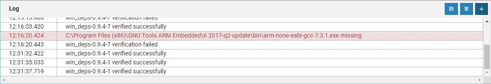

.. _gs_assistant:

Installing the |NCS| with the |GSA|
###################################

The |GSA| application provides you with step-by-step instructions for installing the toolchain for |NCS|.

The application allows you to check which of the required tools are already installed on your computer and verify the installation.
It also guides you through installing the parts of the toolchain that you are missing.
In addition, it will help you clone the |NCS| repositories and set up your first project in |SES|.

See :ref:`gs_installing_os` for information on the supported operating systems and Zephyr features.

.. _gs_assistant_installing-gsa:

Installing the |GSA|
********************

The |GSA| app is available in `nRF Connect for Desktop`_, a cross-platform tool available for Windows, Linux, and macOS.

To install the Assistant app, complete the following steps:

.. _assistant_setup:

1. `Download nRF Connect for Desktop`_ for your operating system.
#. Install and run the tool on your machine.
#. In the APPS section, click :guilabel:`Install` next to |GSA|.

   The nRF Connect for Desktop main window

The app is installed on your machine, and the :guilabel:`Install` button changes to :guilabel:`Open`.

.. _gs_assistant_installing-ncs:

Installing the |NCS|
********************

Once you have installed |GSA|, open it in nRF Connect for Desktop.
The |GSA| app opens with the Overview section displayed in the main window.

You can now go through each of the sections and complete the listed installation steps.

To provide installation variables, use the Variables section.
If you need to edit any of the fields, click on it.

   The Variables section

.. _gs_assistant_installing-ncs_verify:

Verification options
====================

Next to each step, you can use one or both of the following buttons:

- :guilabel:`Mark done` -- marks a step as completed.
- :guilabel:`Verify` -- checks if the installation is correct.

The verification process is reflected in the vertical progress bar animation.
Once the verification is successful, the vertical progress bar changes color to green and the Log section is updated.
At the same time, the :guilabel:`Mark done` button changes to :guilabel:`Mark not done`.

   Verifying the |NCS| toolchain installation

If there is an issue, the Log section is updated with the related error.

   The Log section with an error highlighted in red
