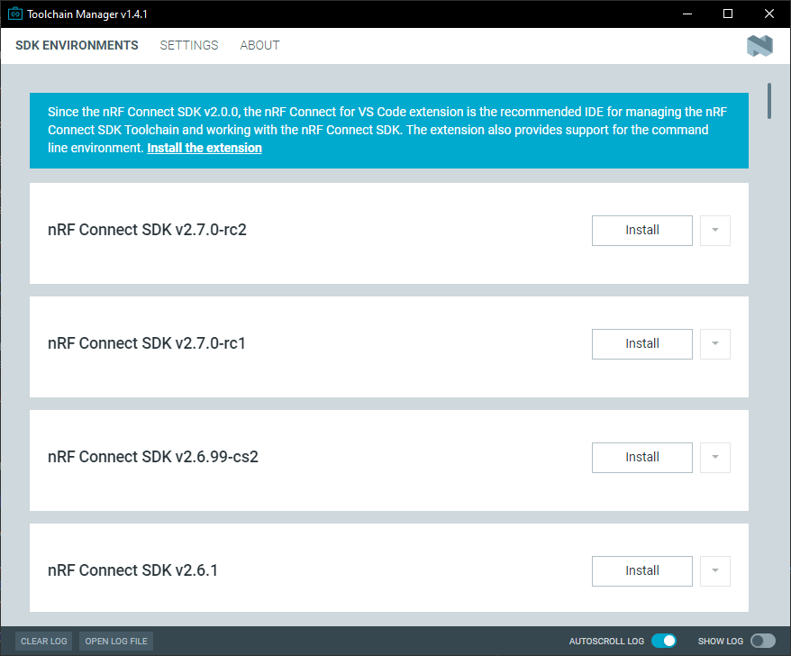
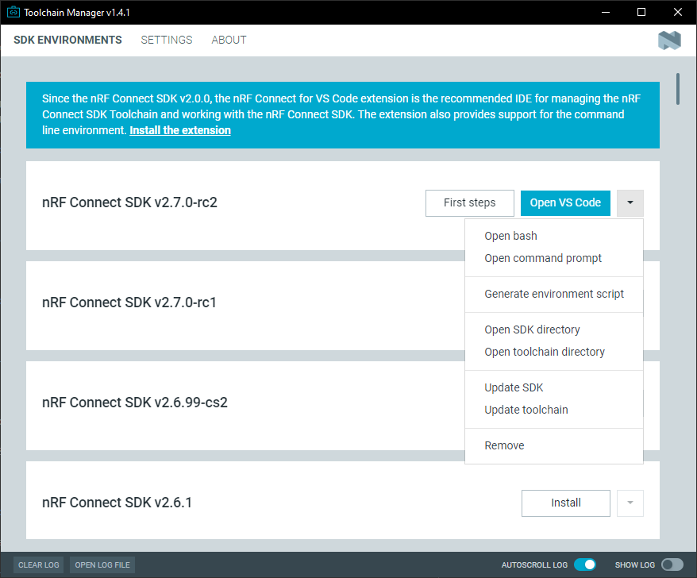

.. _gs_assistant:

Installing automatically
########################

.. contents::
   :local:
   :depth: 2

`nRF Connect for Desktop`_, a cross-platform tool available for Windows, Linux, and macOS, provides different apps that simplify installing the |NCS|.

.. note::
   When installing the |NCS| through the |GSA| app, you will not be able to build on the command line using west.

On Windows or macOS, use the :ref:`gs_app_tcm`.
On Linux, use the :ref:`gs_app_gsa` or follow the steps found on the :ref:`gs_installing` page.

Before you start setting up the toolchain, install available updates for your operating system.
See :ref:`gs_recommended_versions` for information on the supported operating systems and Zephyr features.

.. _gs_app_tcm:

Toolchain Manager
*****************

The Toolchain manager app is available for Windows and macOS.
It installs the full toolchain that you need to work with the |NCS|, including the |VSC| extension, |SES|, and the |NCS| source code.

.. _tcm_setup:

Installing the Toolchain Manager
================================

To install the Toolchain Manager app, complete the following steps:

1. `Download nRF Connect for Desktop`_ for your operating system.
#. Install and run the tool on your machine.
#. In the APPS section, click :guilabel:`Install` next to Toolchain Manager.

The app is installed on your machine, and the :guilabel:`Install` button changes to :guilabel:`Open`.

.. _gs_app_installing-ncs-tcm:

Installing the |NCS|
====================

Once you have installed the Toolchain Manager, open it in nRF Connect for Desktop.

   The Toolchain Manager window

Click :guilabel:`Settings` in the navigation bar to specify where you want to install the |NCS|.
Then, in :guilabel:`SDK Environments`, click the :guilabel:`Install` button next to the |NCS| version that you want to install.
The |NCS| version of your choice is installed on your machine.

There are several ways you can build an application:

* To build with |VSC|, click on the :guilabel:`Open VS Code` button.

* To build with |SES|, click on the :guilabel:`Open Segger Embedded Studio` button.

* To build on the command line, use the following steps:

   1. With admin permissions enabled, download and install the `nRF Command Line Tools`_.

      .. include:: gs_installing.rst
         :start-after: macos_x86_note_start
         :end-before: macos_x86_note_end

   #. Restart the Toolchain Manager application.
   #. Follow the instructions in :ref:`gs_programming_cmd`.

   The Toolchain Manager dropdown menu options

.. _gs_app_gsa:

Getting Started Assistant
*************************

The |GSA| app is the automatic installation option for Linux.
It provides you with step-by-step instructions for installing the toolchain for |NCS|.

The app allows you to check which of the required tools are already installed on your computer and verify the installation.
It also guides you through installing the parts of the toolchain that you are missing.
In addition, it will help you clone the |NCS| repositories and set up your first project in |SES|.

.. note::
   When installing the |NCS| through the |GSA| app, you must build with |SES|.
   You will not be able to build on the command line using west.

Installing the |GSA|
====================

To install the Assistant app, complete the following steps:

.. _assistant_setup:

1. `Download nRF Connect for Desktop`_ for your operating system.
#. Install and run the tool on your machine.
#. In the APPS section, click :guilabel:`Install` next to |GSA|.

.. figure:: images/gs-assistant_installation.PNG
   :alt: The nRF Connect for Desktop main window

   The nRF Connect for Desktop main window

The app is installed on your machine, and the :guilabel:`Install` button changes to :guilabel:`Open`.

.. _gs_app_installing_gsa:

Installing the |NCS|
====================

Once you have installed |GSA|, open it in nRF Connect for Desktop.
The |GSA| app opens with the Overview section displayed in the main window.

You can now go through each of the sections and complete the listed installation steps.

To provide installation variables, use the Variables section.
If you need to edit any of the fields, click on it.

.. figure:: images/gs-assistant_variables.PNG
   :alt: The Variables section of the |GSA| app main window, cropped

   The Variables section

.. _gs_app_installing_gsa_verify:

Verification options
--------------------

Next to each step, you can use one or both of the following buttons:

* :guilabel:`Mark done` -- marks a step as completed.
* :guilabel:`Verify` -- checks if the installation is correct.

The verification process is reflected in the vertical progress bar animation.
Once the verification is successful, the vertical progress bar changes color to green and the Log section is updated.
At the same time, the :guilabel:`Mark done` button changes to :guilabel:`Mark not done`.

.. figure:: images/gs-assistant_UI.gif
   :alt: Example of how to verify |NCS| toolchain installation in the |GSA| app

   Example of how to verify the |NCS| toolchain installation

If there is an issue, the Log section is updated with the related error.

.. figure:: images/gs-assistant_log.PNG
   :alt: The Log section of the |GSA| app main window with an error highlighted in red, cropped

   The Log section with an error highlighted in red
