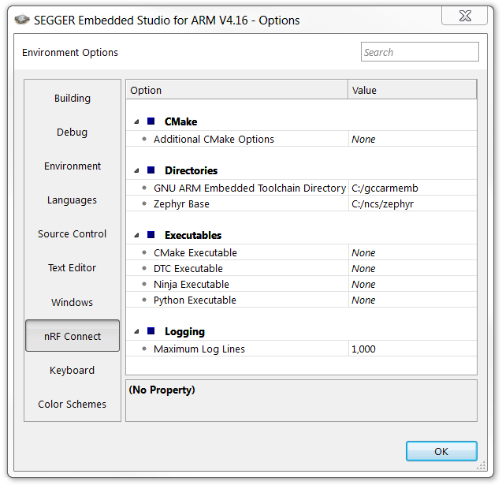

.. _gs_installing_linux:

.. |os| replace:: Linux
.. |installextract| replace:: Extract
.. |system_vars| replace:: \
.. |install_user| replace:: install --user
.. |tcfolder| replace:: "~/gnuarmemb"
.. |tcfolder_cc| replace:: ``~/gnuarmemb``
.. |bash| replace:: terminal window
.. |envfile| replace:: ``source zephyr/zephyr-env.sh``
.. |rcfile| replace:: ``~/.zephyrrc``
.. |setexport| replace:: export

.. include:: gs_ins_windows.rst
   :start-after: intro_start
   :end-before: intro_end

.. _gs_installing_tools_linux:

Installing the required tools
*****************************

To install the required tools, follow the :ref:`zephyr:linux_requirements` section of Zephyr's Getting Started Guide.

In addition, make sure that you have dtc v1.4.6 or later installed.
Depending on the Linux distribution that you use, you might need to install it manually because the current official package version might be older than v1.4.6.
If you use Ubuntu, install v1.4.7 from Cosmic by entering the following commands::

   wget http://mirrors.kernel.org/ubuntu/pool/main/d/device-tree-compiler/device-tree-compiler_1.4.7-1_amd64.deb
   sudo dpkg -i device-tree-compiler_1.4.7-1_amd64.deb

.. note::
   You do not need to install the Zephyr SDK.
   We recommend to install the compiler toolchain separately, as detailed in `Installing the toolchain`_.

.. _gs_installing_toolchain_linux:

.. include:: gs_ins_windows.rst
   :start-after: toolchain_start
   :end-before: toolchain_end

.. _cloning_the_repositories_linux:

.. include:: gs_ins_windows.rst
   :start-after: cloning_start
   :end-before: cloning_end

.. _additional_deps_linux:

.. include:: gs_ins_windows.rst
   :start-after: add_deps_start
   :end-before: add_deps_end

.. _installing_ses_linux:

.. include:: gs_ins_windows.rst
   :start-after: installing_ses_start
   :end-before: installing_ses_end

.. _build_environment_linux:

.. include:: gs_ins_windows.rst
   :start-after: buildenv_start
   :end-before: buildenv_end

.. include:: gs_ins_windows.rst
   :start-after: buildenv_path_start
   :end-before: buildenv_path_end

.. _build_environment_settings_changes_linux:

.. include:: gs_ins_windows.rst
   :start-after: buildenv_settings_changes_intro_start
   :end-before: buildenv_settings_changes_intro_end

.. _ses_options_figure_reuse:

     nRF Connect SDK options in SES (Windows)

.. include:: gs_ins_windows.rst
   :start-after: buildenv_settings_changes_ctd_start
   :end-before: buildenv_settings_changes_ctd_end

.. _build_environment_cli_linux:

.. include:: gs_ins_windows.rst
   :start-after: buildenv_cli_start
   :end-before: buildenv_cli_end

