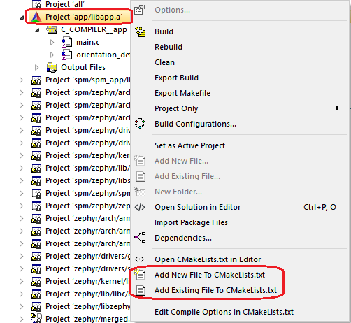
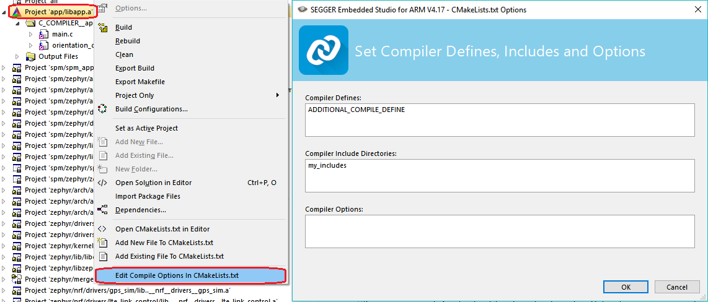

.. _gs_modifying:

Modifying a sample application
##############################

After programming and testing a sample application, you probably want to make some modifications to the application, for example, add your own files with additional functionality, change compilation options, or update the default configuration.

Adding files and changing compiler settings
*******************************************

All files that your application uses must be specified in the :file:`CMakeList.txt` file.
By default, most samples include only the main application file :file:`src/main.c`.
This means that you must add all other files that you are using.

You can also configure compiler options, application defines, or include directories in :file:`CMakeList.txt`.

To update the :file:`CMakeList.txt` file, either edit it directly or use |SES| (SES) to maintain it.

Editing :file:`CMakeList.txt` directly
======================================

Add all files that your application uses to the ``target_sources`` function in :file:`CMakeList.txt`.
To include several files, it can be useful to specify them with a wildcard.
For example, to include all ``.c`` files from the ``src`` folder, add the following lines to your :file:`CMakeList.txt`::

   FILE(GLOB app_sources src/*.c)
   target_sources(app PRIVATE ${app_sources})

Instead of specifying each file (explicitly or with a wildcard), you can include all files from a folder by adding that folder as include folder::

   target_include_directories(app PRIVATE src)

See the `CMake documentation`_ and :ref:`zephyr:cmake-details` in the Zephyr documentation for more information about how to edit :file:`CMakeList.txt`.

Maintaining :file:`CMakeList.txt` in SES
========================================

To add a file in SES, right-click :guilabel:`Project 'app/libapp.a'` in the Project Explorer.
Select either :guilabel:`Add new file to CMakeLists.txt` to create a file and add it or :guilabel:`Add existing file to CMakeLists.txt` to add a file that already exists.

   Adding files in SES

To edit compilation options in SES, right-click :guilabel:`Project 'app/libapp.a'` in the Project Explorer and select :guilabel:`Edit Compile Options in CMakeLists.txt`.

In the window that is displayed, you can define compilation options for the project.

   Setting compiler defines, includes, and options in SES

.. note::
   These compilation options apply to the application project only.
   To manage Zephyr and other subsystems, go to :guilabel:`Project` > :guilabel:`Configure nRF Connect SDK Project`.

SES tags in :file:`CMakeLists.txt`
----------------------------------

To be able to manage :file:`CMakeLists.txt` with SES, the CMake commands that are specific to the |NCS| application must be marked so SES can identify them.
Therefore, they must be surrounded by ``# NORDIC SDK APP START`` and ``# NORDIC SDK APP END`` tags.

The following CMake commands can be managed by SES, if they target the ``app`` library:

    - ``target_sources``
    - ``target_compile_definitions``
    - ``target_include_directories``
    - ``target_compile_options``

The :file:`CMakeLists.txt` files for the sample applications in the |NCS| are tagged as required.
Therefore, if you always use SES to maintain them, you do not need to worry about tagging.
Typically, the :file:`CMakeLists.txt` files include at least the :file:`main.c` file as source::

   # NORDIC SDK APP START
   target_sources(app PRIVATE src/main.c)
   # NORDIC SDK APP END

Configuring your application
****************************

If your application uses a provided library or targets a specific board, you might want to change the default configuration of the library or board.
There are different ways of doing this, but not all will store your configuration permanently.

The default configuration for a library is specified in its :file:`Kconfig` file.
Similarly, the default configuration for a board is specified in its :file:`*_defconfig` file (and its :file:`Kconfig.defconfig` file, see :ref:`zephyr:default_board_configuration` in the Zephyr documentation for more information).
The configuration for your application, which might override some default options of the libraries or the board, is specified in a :file:`prj.conf` file in the application directory.

For detailed information about configuration options, see :ref:`zephyr:application_kconfig` in the Zephyr documentation.

Changing the configuration permanently
======================================

To configure your application and maintain the configuration when you clean the build directory, add your changes to the :file:`prj.conf` file in your application directory.
In this file, you can specify different values for configuration options that are defined by a library or board, and you can add configuration options that are specific to your application.

See :ref:`zephyr:application_set_conf` in the Zephyr documentation for information on how to edit the :file:`prj.conf` file.

If you work with SES, the :file:`prj.conf` file is read when you open a project.
This means that after you edit this file, you must re-open your project.

.. note::
   It is possible to change the default configuration for a library by changing the :file:`Kconfig` file of the library.
   However, best practice is to override the configuration in the application configuration file :file:`prj.conf`.

Changing the configuration temporarily
======================================

When building your application, the different :file:`Kconfig` and :file:`*_defconfig` files and the :file:`prj.conf` file are merged together.
The combined configuration is saved in a :file:`zephyr/.config` file in your build directory.
This means that this file is available when building the application, but it is deleted when you clean the build directory.

To quickly test different configuration options, or to build your application in different variants, you can update the :file:`.config` file in the build directory.
Changes are picked up immediately, and you do not need to re-open the project in SES.

While it is possible to edit the :file:`.config` file directly, you should use SES or a tool like menuconfig or guiconfig to update it.
These tools present all available options and allow you to select the ones that you need.

To edit the file in SES, select :guilabel:`Project` > :guilabel:`Configure nRF Connect SDK Project`.
If your application contains more than one image (see :ref:`ug_multi_image`), you must select the correct target.
To configure the parent image (the main application), select :guilabel:`menuconfig`.
The other options allow you to configure the child images.

See :ref:`zephyr:override_kernel_conf` in the Zephyr documentation for instructions on how to run menuconfig or guiconfig.

To locate a specific configuration option, use the filter (:guilabel:`Jump to` in menuconfig and guiconfig).
The documentation for each :ref:`configuration option <configuration_options>` also lists the menu path where the option can be found.

.. important::
   All changes to the :file:`.config` file are lost when you clean your build directory.
   You can save it to another location, but you must then manually copy it back to your build directory.
